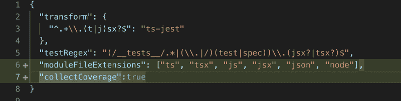
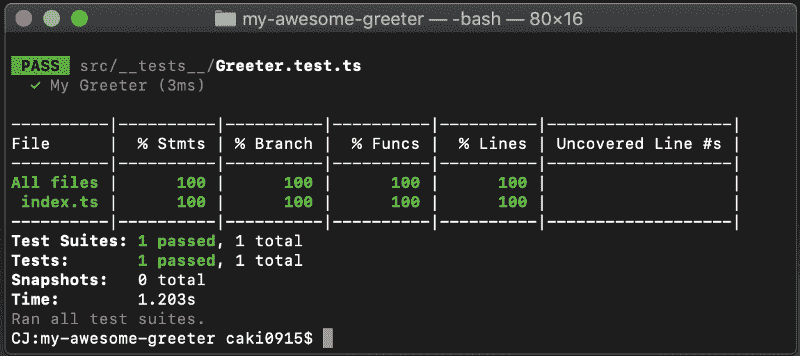
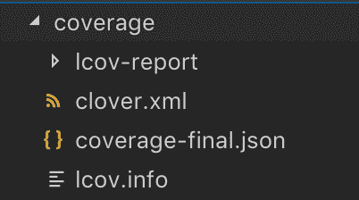
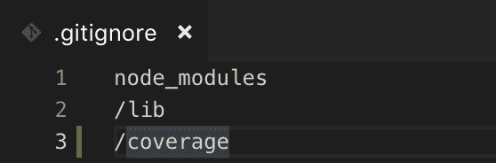
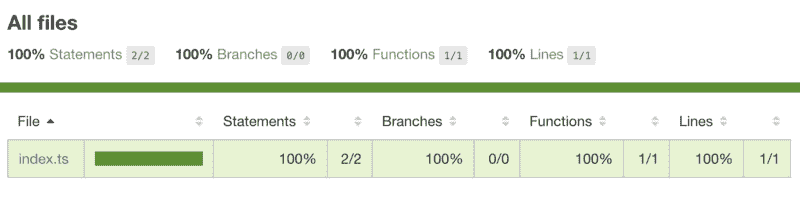
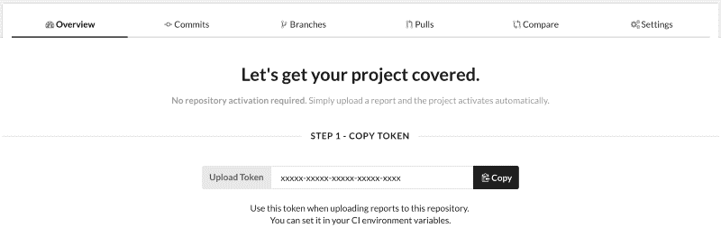
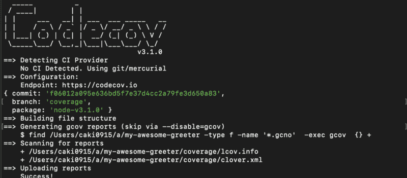
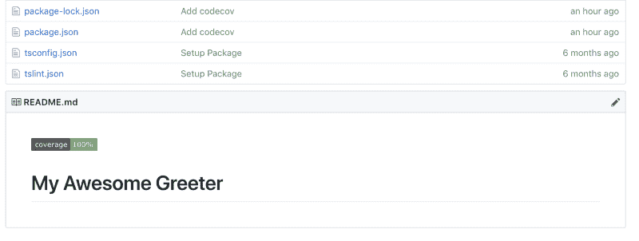

# 让你的 NPM 包覆盖 Jest 和 Codecov ☂️

> 原文：<https://www.freecodecamp.org/news/get-your-npm-package-covered-with-jest-and-codecov-9a4cb22b93f4/>

作者:卡尔-约翰·基尔

# 让你的 NPM 包覆盖 Jest 和 Codecov ☂️


Code coverage for NPM-packages with Jest and Codecov

### 介绍

让我们来谈谈代码覆盖率，以及如何在 [Jest](https://jestjs.io/) 和 [Codecov](https://codecov.io/) 中做覆盖率报告。

### 什么是代码覆盖率？

如果你熟悉测试。你知道它的主要目的:

> 测试让开发人员可以自由地进行修改和重构代码，只要所有的自动化测试都通过，一切都会很好。

然而，如果单元测试没有覆盖所有场景，您的更改仍然有可能破坏某些东西。这就是为什么我们有代码覆盖率:自动化测试覆盖了多少代码库的度量。

没有代码覆盖分析，你的测试就失去了它们的主要目的。

当您的项目增长并且涉及许多开发人员时，这一点非常重要。

✅:当新代码加入时，我们可以保持测试的质量。
✅我们对现有的测试有了更深入的了解。
✅让开发人员有信心重构代码，而不用担心破坏东西。
✅我们可以在未测试的流量造成麻烦之前**捕捉它们。**

好了，现在我们知道了什么是代码覆盖率，让我们来实现它吧！？

### 先决条件

为了使这篇文章简洁明了，我将从这里开始:[逐步构建和发布和 NPM 打字稿包](http://bit.ly/2zAC2nK)。

到目前为止已经做了什么:

✅设置一个基本的[NPM-package](https://github.com/caki0915/my-awesome-greeter/tree/basic-package)✅添加测试用[jest](https://jestjs.io/)t5】✅编写一个基本测试

如果你已经用 Jest 设置了你的项目，你就可以开始了。？如果没有，我建议您从 b [asic NPM 包基础:](https://github.com/caki0915/my-awesome-greeter)开始克隆或派生本文的存储库

```
git clone git@github.com:caki0915/my-awesome-greeter.git && cd my-awesome-greeter &&git checkout basic-package && npm install
```

如果你对如何构建 NPM 包感兴趣，我推荐[我以前的文章](http://bit.ly/2zAC2nK)。

好了，现在一切都准备好了，我们走吧！

### 在 Jest 中创建覆盖报告

在 Jest 中创建覆盖报告很容易。只需在 jest 配置文件中添加这一行:

```
"collectCoverage":true
```



This is how my jest config file *(jestconfig.json)* looks like

如果您希望 jest 在运行您的测试时收集覆盖率信息，collectCoverage: 应该设置为 true。*(测试运行会慢一点，所以默认为假。)*

确保你的 **package.json** 文件中的脚本命令`test`将与你的配置文件一起运行 Jest。

```
“test”: “jest --config jestconfig.json”
```

好吧！在你的终端上运行`npm test` ，瞧！您将拥有一个新文件夹，其中包含为您生成的代码覆盖率文件。



Run npm test in the terminal



Code coverage data generated for you!

不要忘记将 coverage 文件夹添加到`.gitignore`。我们不希望构建文件在我们的存储库中。？



### 让你的报告变得有用

好的，这很酷，我们生成了一个包含一些文件的文件夹，但是我们应该如何处理这些信息呢？？

首先，您可以在一个生成的 HTML 页面上手动检查覆盖率报告。在浏览器中打开`/coverage/lcov-report/index.html`:



coverage/lcov-report/index.html

好的，这很好，但是我们真的需要手工检查每个构建的报告吗？？

不，你不应该。你应该在网上发布这些报告，让它们变得有用。在本文中，我们将使用一个叫做 [codecov.io](http://codecov.io) 的覆盖报告工具。

Codecov 对开源项目是免费的。它将代码覆盖率报告带到了下一个层次。使用 Codecov，我们还可以自动生成徽章，并在持续集成构建中运行它。*(稍后详述。)*


A coverage badge with a link to a coverage report on **codecov.io in** apackage README.md

在[https://codecov.io/](https://codecov.io/)注册，按照指南连接到 Github 和你的库。之后，您应该会看到这样的屏幕:



不错！现在，这个页面将是空的，因为您还没有上传任何报告，所以让我们来解决这个问题。在终端中，运行:

```
npm install --save-dev codecov
```

通常，您希望在持续集成构建结束时上传报告，但是对于本文，我们将从本地机器上传报告。在终端运行:
*(将<您的令牌>替换为您在编解码器* ov.io 中找到的存储库令牌)

```
./node_modules/.bin/codecov --token="<Your token>"
```



成功！现在你可以在 codecov.io 中在线查看你的报告了？？

```
https://codecov.io/gh/<Github Username>/<Repository Name>/
```

### 将徽章添加到您的自述文件中。md

徽章很重要，尤其是 NPM 包裹。当你在 [npmjs](https://www.npmjs.com/) 和 [Github](https://github.com/) 中看到漂亮的代码覆盖徽章时，它给人的第一印象是高质量。

在您的 **README.md** 中添加下面一行:
*(用*您的信息替换< Github 用户名>、<库名>和<分支名>)

```
[](https://codecov.io/gh/<Github Username>/<Repository Name>/)
```

在我的例子中，它看起来像这样:

```
[](https://codecov.io/gh/caki0915/my-awesome-greeter/)
```

厉害！现在你可以向世界展示你正在使用单元测试和代码覆盖报告！？？



A coverage badge with a link to your coverage analysis report.

### 摘要

如果您正在使用测试，代码覆盖报告是必须的，并且它应该在您每次进行拉取请求或者在您的分支上进行变更时运行。

你可以在 Github 上找到我的 NPM 启动包。
这是一个最佳实践 NPM 包开发的教育基地。评论，叉子和公关的欢迎。？

### 下一步是什么？

如果您还没有使用持续集成(CI ),那么是时候设置它了。在我的下一篇文章中，我将讨论 NPM 包的代码覆盖的持续集成。

如果你觉得这篇文章有用，请给它一些掌声，并关注我更多关于开发的文章。

#### 祝你好运建立你的可怕的包！？？