# 使用 Griddy:构建自己的 CSS 网格，放弃框架

> 原文：<https://www.freecodecamp.org/news/gettin-griddy-with-it-build-your-own-css-grid-and-drop-the-frameworks-7d8c498c8b1b/>

作者:Theran Brigowatz

# 使用 Griddy:构建自己的 CSS 网格，放弃框架

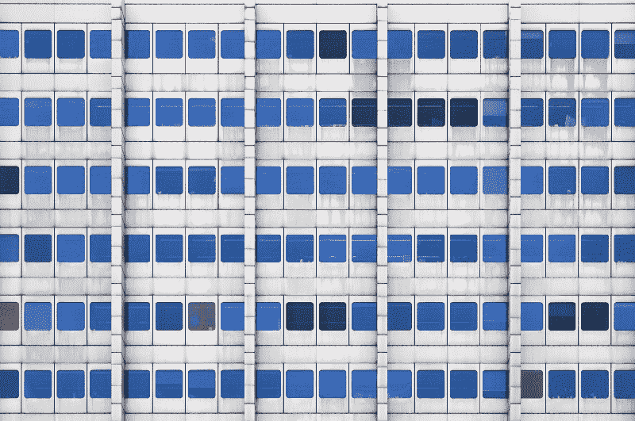

Photo by [Dmitri Popov](https://unsplash.com/@dmpop?utm_source=medium&utm_medium=referral) on [Unsplash](https://unsplash.com?utm_source=medium&utm_medium=referral)

几乎每个前端开发人员的旅程都是从基本的 HTML、CSS、JavaScript 路径开始的。你从结构入手，让它看起来体面，然后让它做点什么。然而，在旅程的某个地方，很容易陷入 CSS 框架的世界，掩盖一些更好的细节。

Bootstrap 附带了一个漂亮的网格，只使用几个类和一个 CDN 就可以创建一个漂亮的移动响应网格。不知不觉中，每当您构建一个需要网格布局的项目时，您就开始接触这个框架。我也经常这样做，直到我开始用它“烤东西”。"

让我走上学习 CSS Grid 之路的是当我试图使用语义 UI React(更漂亮、更清晰的引导程序)建立一个站点的时候。)然而，当构建一个网格时，我无法让两列彼此齐平，最终打乱了所有的边距和填充规则，以覆盖框架内置的样式。这是一次令人沮丧的经历，我花在搞乱特殊性规则上的时间比实际编码的时间还多。

这就是 CSS 网格的用武之地。CSS Grid 是 CSS3 的一个相对较新的补充，好家伙，它太棒了。必须使用导入的网格框架会导致一些问题:

1.  文件大小增加。您导入的内容越多，您的应用就越大。在速度是关键的时候，减少你的应用文件大小是一个非常重要的想法。你可以构建自己的框架，而不是进口一个框架，或者依赖一个缓慢的 CDN。
2.  可读性较差的代码。那些使用过框架的人都知道随之而来的越来越复杂和模糊的类名。谁不会马上认出`class="col-6 col-md-4 col-sm-12"`代表什么？或者谁想在他们的 CSS 中写下`div.ui.segment.inverted.stackable.desktop.twelve.mobile.sixteen`？
3.  少定制。框架的内置规则可能很难被覆盖。您可能会使用长类名来获得正确的特性，或者使用一行又一行的`!important`标记来创建覆盖框架的定制样式。CSS Grid 的神奇之处在于，你可以创建自己的网格，并根据自己的需要进行定制，而不是依赖那些不了解你的项目细节的人。

### 响应式 CSS 网格

CSS 网格本质上是一组可以放在页面上的盒子。您可以使用数字单位来增加盒子的大小，也可以使用相对大小来使其更具响应性。随着屏幕尺寸的巨大变化，这是一个很大的优势。假设您想要创建一个包含六个 div 的布局，并希望它们能够响应不同屏幕尺寸的更多列。

这是容器中六个`divs`未格式化时的样子。

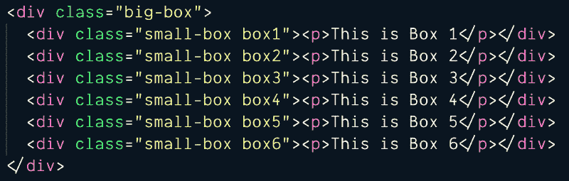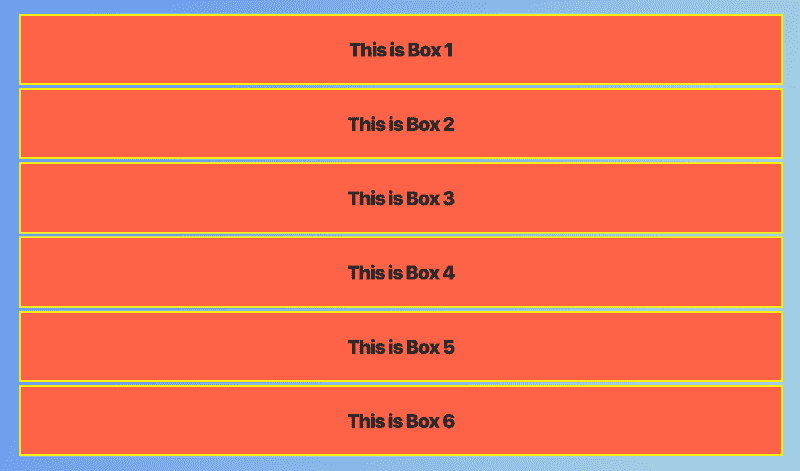

Six divs in a container.

不必为每个断点添加类，您可以设置网格中 div 的最小大小，然后使用`fr` sizing 属性用更大的响应框自动填充。您只需要为父元素添加 CSS 网格属性，然后`small-box`div 就会自动填充。

容器的 CSS 如下所示:

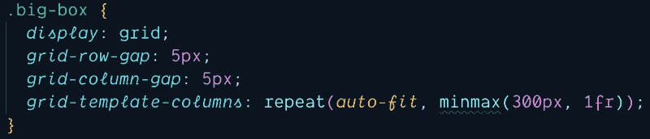

Parent container CSS Grid — “minmax” was not recognized in VSCode’s spellcheck.

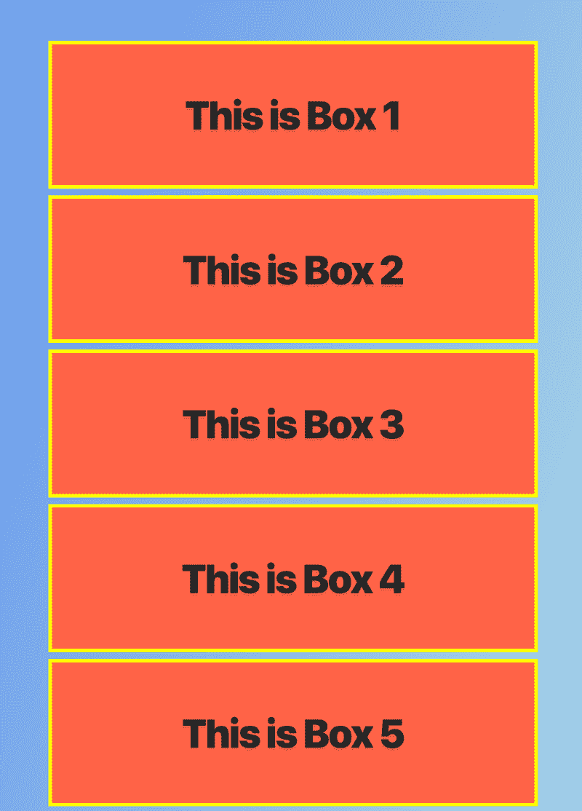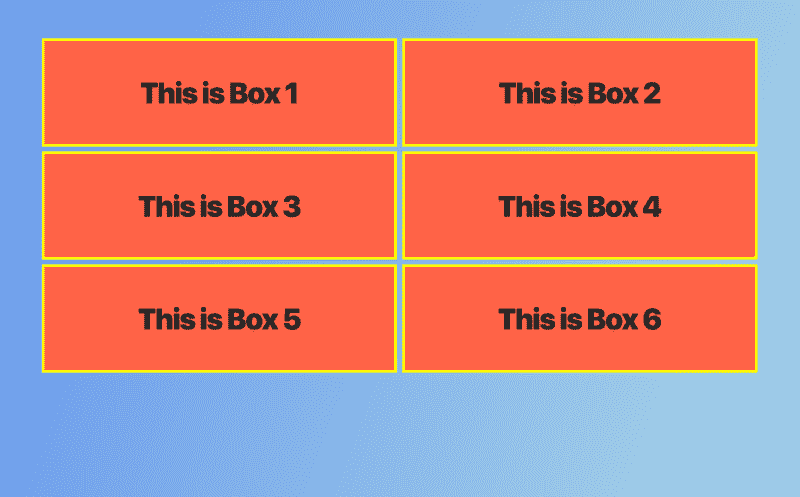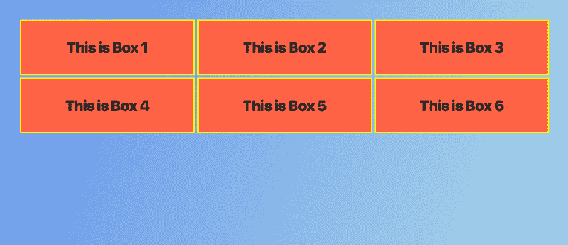

Mobile, Tablet, and Desktop views of the CSS Grid divs.

如您所见，您可以只用四行代码创建一个简单的响应式网格。再简单不过了，您的所有内容都可以根据需要自由移动和移动。在这种情况下，甚至不需要媒体询问。在这里，您可以自由定制网格中的各个框。它非常灵活的响应布局和大小。玩它，看着盒子神奇地移动。

### 网格区域

我倾向于使用框架网格的另一个原因是为了在不同的设备上使用不同的布局。您可能希望组件四处移动，这取决于您所在的屏幕大小。

下面是一个你可能希望在桌面和平板电脑上使用的网站布局的例子。改变这一点很简单。尽管有些人不喜欢这种结构，但是你可以为网格区域使用类似 ASCII 的模板结构。

假设您有一个基本的页面布局，包括页眉、侧边栏、内容和页脚。

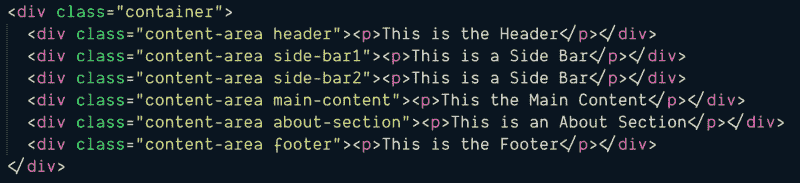

Basic HTML for page layout.

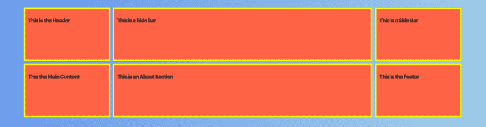

Unformatted Grid with three columns as — grid-template-columns: 1fr 4fr 1fr;

没有格式化的页面布局看起来像这样，基本的三列网格设置为`1fr 4fr 1fr`。这些框将被填充以适应网格中分配给它们的空间。然而，如果你想让你的页面布局更加流畅和动态，你可以使用`template-areas`。

为了得到这个想要的布局，你需要创建模板区域。你可以把它想象成一个微型的 ASCII 地图，它显示了你希望这些框在页面上的位置。

为了得到桌面布局，你可以制作一个类似于`grid-template-areas`属性中的小地图。每行包含一行和布局中相应列的名称。您可以看到页眉和页脚部分将沿着它们所在的整个列伸展。此外，侧栏和内容横跨多行，正如您在“地图”区域看到的那样。然后，通过将`grid-area`属性添加到相应的 div 中，可以将它制作成您需要的任何布局，就像最右边的图片一样。您可以将这些命名为与您的项目相对应的任何名称。

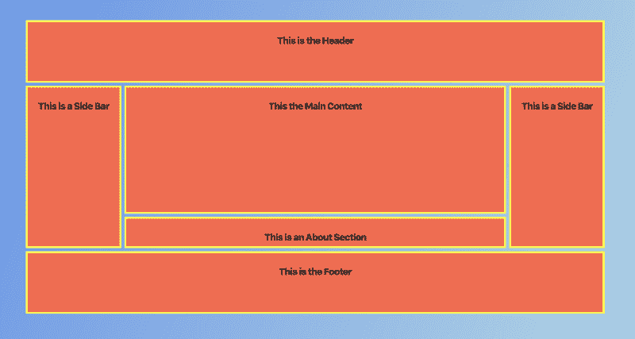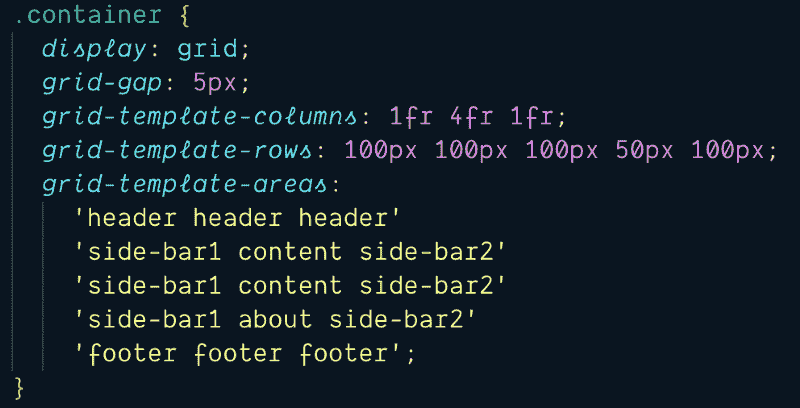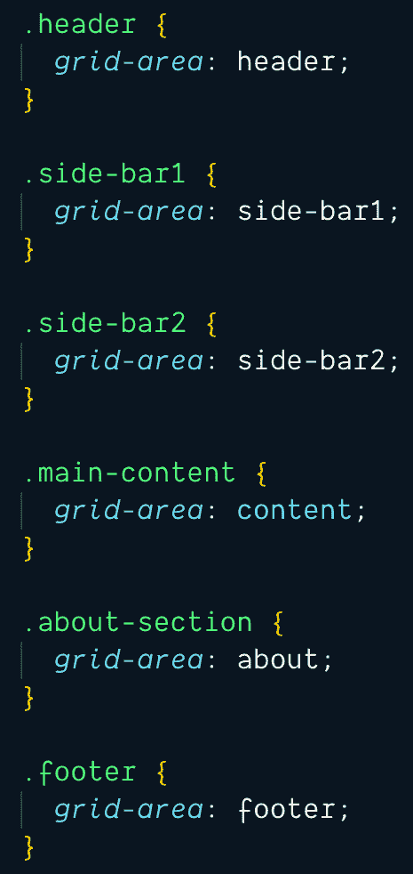

为了让它在平板电脑视图上工作，您只需进行媒体查询，并在模板区域中切换顺序。轻松移动内容以获得您想要的视图。(请注意，如果您的内容顺序混乱，这可能会导致屏幕阅读器出现问题，因此请确保您的内容仍然可以正常阅读。)

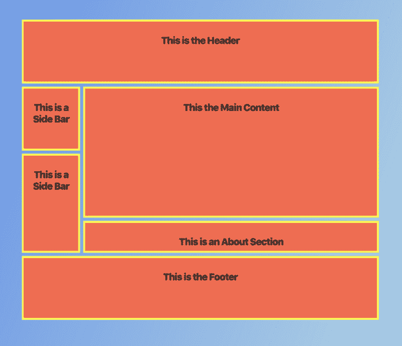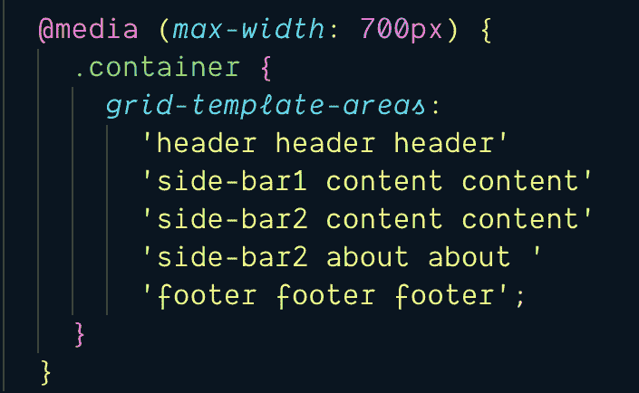

Desktop and Tablet Views

### 结论

这篇简单的文章绝对只是触及了 CSS Grid 的皮毛。但我认为，从这里学到的主要东西是，你不应该害怕使用 CSS 网格。一旦你习惯了新的语法，它真的非常简单、强大和轻量级。继续享受“用它来烤东西”。"

要了解更多关于 CSS Grid 的信息，我强烈推荐查看 Wes Bos 教授的 [http://cssgrid.io](http://cssgrid.io.) 。这是一个很棒的 CSS 网格教程。

同样，如果你有问题，请务必访问位于[https://css-tricks.com/snippets/css/complete-guide-grid/](https://css-tricks.com/snippets/css/complete-guide-grid/)的 CSS 窍门网站，了解更多关于网格的知识。

要查看更多我的作品，请访问 https://theran.co，了解更多关于我的信息。