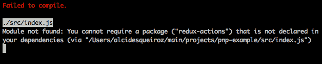
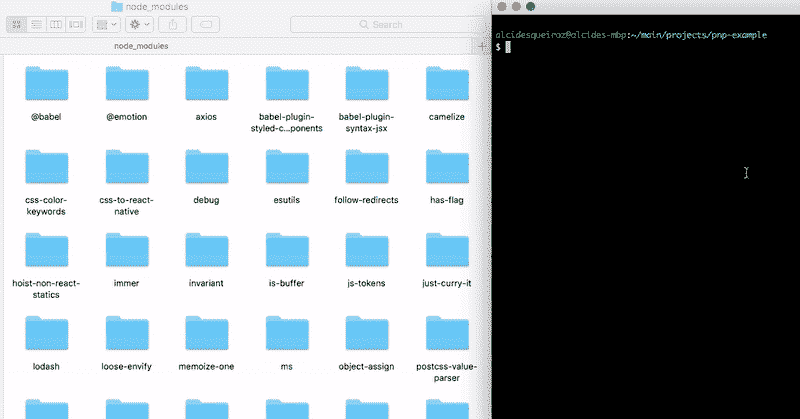

# 用纱线即插即用去除节点模块

> 原文：<https://www.freecodecamp.org/news/getting-rid-of-node-modules-with-yarn-plugn-play-a490e5e747d7/>

作者阿尔西德斯·奎罗斯

# 如何用纱线即插即用摆脱节点模块

#### 减少高达 70%的安装时间。问我怎么了！？


任何认识我的人都可以证实，我是 JavaScript 及其整个生态系统的长期爱好者。作为一名前端工程师，自 2013 年以来，基于节点的包管理器一直是我的工具集的重要组成部分。

首先，我使用了 Bower，它主要专注于前端世界。然后，在 2015 年，我悲哀地(好吧，*不是真的*)意识到鲍尔已经不行了，Node 的默认包经理 NPM 也是前端的不二人选。起初，对我来说，将 NPM 用于节点模块之外的其他东西很奇怪，但我习惯了这个想法，并无缝地进行了迁移。

最后，仅仅一年后，脸书给了我们纱，一个现代和闪电般的替代 NPM。第一眼就喜欢上了！**但是有些事情仍然存在问题……**

### 纱线中的遗传问题

除了速度之外，Yarn 与当时的 NPM 版本相比还有很多优势，比如锁定文件、离线模式、网络弹性、校验和等等。尽管如此，纱借用了 NPM 的一些已知问题:

#### 这里、那里、任何地方的节点模块

对于机器上使用 NPM 或纱线的每个项目，都会创建一个`node_modules`文件夹。如果 10 个项目使用给定模块的完全相同的版本也没关系，它将被一遍又一遍地复制到这些项目的每个`node_modules`文件夹中。

#### 生成新的 node_modules 文件夹需要很长时间

即使在安装速度方面有了很大的进步，Yarn 仍然受到 node_modules 限制的约束。仅仅创建 node_modules 文件夹就要花费运行`yarn install`所需时间的 70%(使用热缓存)。**每次安装都要创建大量的文件。**所以，不要怪纱。

#### 未添加到 package.json 的依赖项

这是给你的一个场景:你的应用在开发中运行良好，但是在生产中崩溃了。经过几个小时的调查，你终于意识到你忘记了给你的`package.json`添加一个依赖项。**是的，有可能发生。**

#### 运行时模块解析缓慢

节点解析依赖关系的方式会严重影响应用的启动时间。查询文件系统来发现给定的依赖关系将从哪里解决是浪费时间的。

### 纱塞' n '播放救援！

去年 9 月，Yarn 团队发布了即插即用功能，解决了上述所有问题。

当您启用 PnP 时，不是将每个需要的文件从缓存复制到`node_modules`文件夹，而是 Yarn 做以下事情:

1.  它创建一个包含静态分辨率表的文件。这些表将包含一系列重要的信息，例如:依赖关系树中可用的包，它们之间的关系以及它们在磁盘上的位置。
2.  使用一个特殊的解析器来帮助节点发现每个依赖项安装在哪里(在 Yarn cache 文件夹下)。它仅依赖于先前创建的分辨率表。由于这些表包含关于整个依赖关系树的信息，node_modules 解析过程将不再需要在运行时进行大量的`stat`和`readdir`调用，从而显著减少您的应用程序启动时间。由于 Yarn 知道你所有的依赖关系，如果你试图导入一个不在你的`package.json`中的模块，它会抱怨:



### 使用纱线即插即用

转换项目以利用 PnP 就像 1–2–3 一样简单。你只需要给你的`package.json`添加一个`installConfig`段，把`pnp`键设置为`true`，就像这样:

```
{    "installConfig": {     "pnp": true   }}
```

> **注意:**你需要 Yarn v1.12+才能使用即插即用。

之后，只要运行`yarn install`，你的`node_modules`文件夹里的所有东西都会被删除。从现在开始，每一个依赖都将直接从 Yarn 的热缓存中解析。



“yarn install” clears your node_modules folder when PnP is enable

#### 通过 create-react-app 在新的 React 项目中使用 PnP

如果你使用 create-react-app 2+，好消息是它可以很好地处理 Yarn Plug'n'Play！只需在`create-react-app`命令后面加上`--use-pnp`选项，就可以开始了:

```
npx create-react-app your-app-name --use-pnp
```


#### 可能的问题

因为世界上没有十全十美的东西，PnP 在依赖定制安装逻辑的项目中使用时可能会引发新的问题。如果您需要更多关于这些潜在新问题的信息，[您可以在本文](https://github.com/yarnpkg/rfcs/files/2378943/Plugnplay.pdf)中找到详细的解释。

### 结论

即插即用解决了纱线中一些令人烦恼的问题。此外，它极大地改进了 CIs 上的依赖缓存，节省了安装时间，并允许我们的构建直接进入要点:**运行测试！**

就是这样！享受纱线 PnP 的乐趣。