# 如何开始使用 CentOS

> 原文：<https://www.freecodecamp.org/news/getting-started-with-centos-15eac7215c99/>

作者:krasimir gatchinsky

# 如何开始使用 CentOS

[CentOS-Logo.svg. (2018, March 2). *Wikimedia Commons, the free media repository*. Retrieved 16:11, January 5, 2019](https://commons.wikimedia.org/w/index.php?title=File:CentOS-Logo.svg&oldid=290142359)

你可以在这里 *下载 CentOS 版本 [*。*](https://wiki.centos.org/Download)*

CentOS 或 Community Enterprise OS 是基于 RHEL 或 Red Hat Enterprise Linux 的开源发行版。仅当您购买了支持包时，此功能才可用。此外，所有 RHEL 软件包都与 CentOS 完全兼容，提供了一个强大、稳定且易于管理的平台，确保了最高级别的免费操作安全性。

CentOS 开箱即可与 RHEL 二进制兼容，是服务器安装的首选平台。CentOS 最有价值的部分之一是长支持周期。例如，Fedora 的发布支持周期长达 13 个月，而 CentOS 的发布支持周期长达 7 年。这使得它非常可靠和可靠。

此外，CentOS 社区项目正在扩展其在大量平台上的可用性，如 Google、Amazon AWS 等。它也可以在通用的启用云初始化的映像中使用。

要了解更多有关 CentOS 的信息，请访问此处的 CentOS 项目。

#### 版本

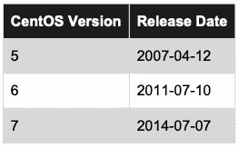

#### 例子

让我们来看一些关于 CentOS 7 安装和基本设置的详细说明。

1.  下载最新的 [CentOS。ISO](https://www.centos.org/download/)
2.  使用上述链接或使用 CentOS 官方下载页面下载 CentOS 的最新版本后，将其刻录到 DVD 或使用名为 [Unetbootin](https://unetbootin.github.io/) 的 LiveUSB Creator 创建一个可启动的 u 盘。
3.  创建安装程序可引导介质后，将 DVD/USB 放入系统相应的驱动器中，启动计算机，选择可引导单元，应会出现第一个 CentOS 7 提示符。在提示符下，选择 Install CentOS 7 并按[Enter]键。

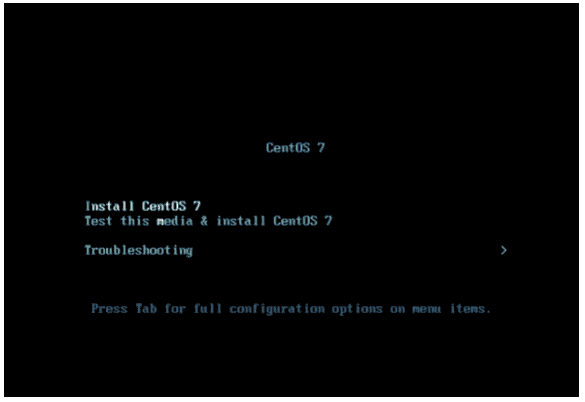

4.系统将开始加载媒体安装程序，并出现一个欢迎屏幕。选择您的安装过程语言，这将帮助您完成整个安装过程，然后单击继续。

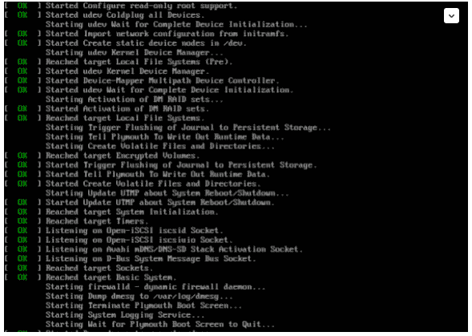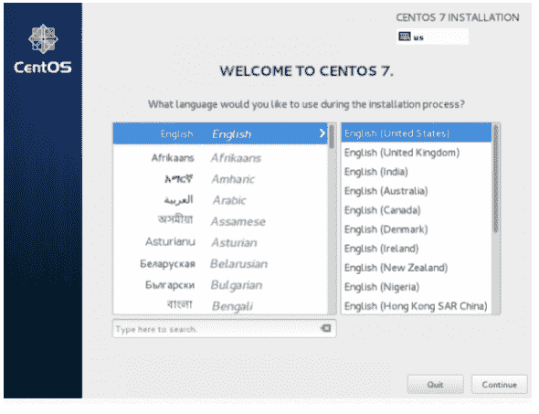

5.在下一步中，当前屏幕提示是安装摘要。它包含许多选项来完全定制您的系统。你首先要设置的是你的时间设置。单击日期和时间，从提供的地图中选择您的服务器的物理位置，并点击上方的完成按钮以应用该配置。

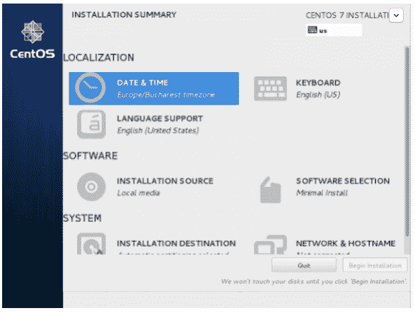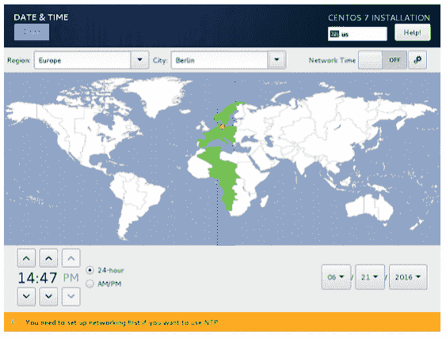

6.接下来，选择您的语言支持和键盘设置。为你的系统选择你的主要和额外的语言，当你完成的时候，点击 Done。

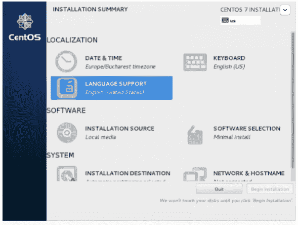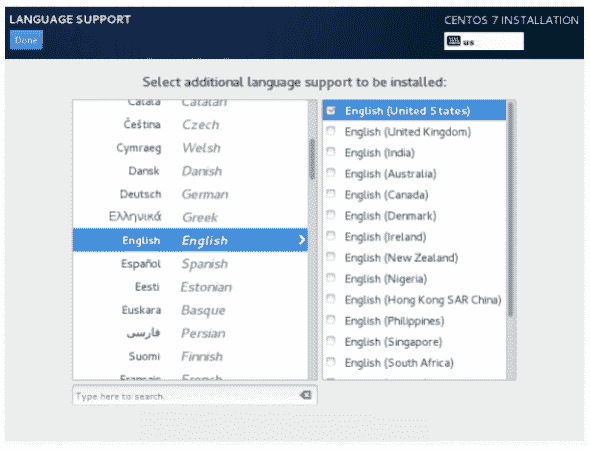

7.同样，点击加号按钮选择键盘布局，并使用正确的输入字段测试键盘配置。完成键盘设置后，您可以使用任何组合键在键盘之间切换。在我的例子中，我使用 Alt+Ctrl。选择所需的组合键后，再次按 Done 以应用更改并返回到安装摘要的主屏幕。

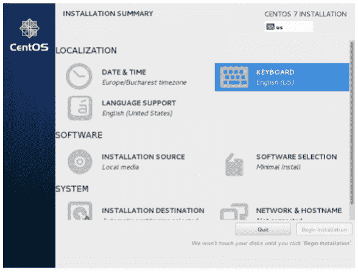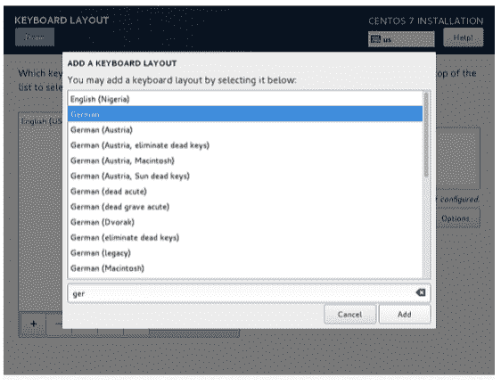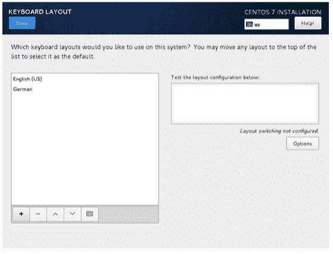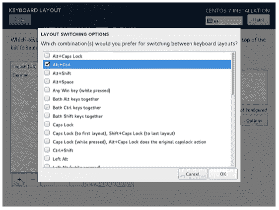

8.现在，如果你不想使用英语，我们可以添加语言支持。点击“语言支持”打开对话框。

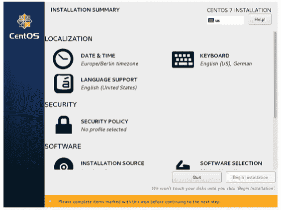

9.默认情况下，CentOS 预装了英语，但我们可以轻松添加更多语言。在我的例子中，我添加了德语作为附加语言。选择后按 Done。

10.在下一步中，您可以使用本地 DVD/USB 介质以外的其他安装源来自定义您的安装，例如使用 HTTP、HTTPS、FTP 或 NFS 协议的网络位置。您甚至可以添加一些额外的存储库，但是只有在您知道自己在做什么的情况下才使用这种方法。因此，保留默认的自动检测安装介质，并点击完成继续。

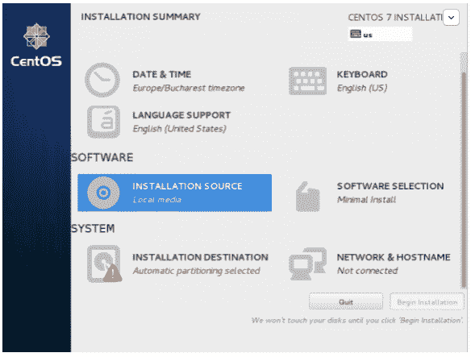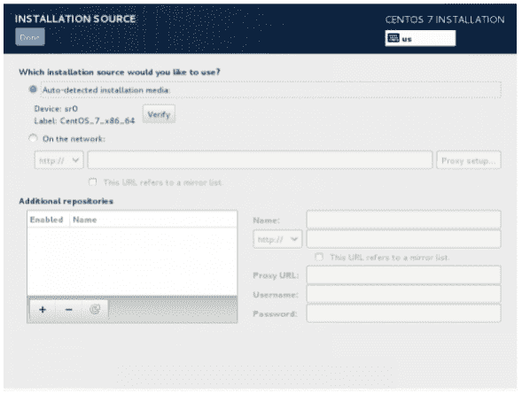

11.接下来，您可以选择您的系统安装软件。在这一步中，CentOS 提供了许多服务器和桌面平台环境供您选择。但是如果你想要高度定制，特别是如果你打算使用 CentOS 7 作为服务器平台运行，那么我建议最小化安装，将兼容性库作为插件。这将安装一个最小的基本系统软件，以后您可以根据需要使用以下命令添加其他软件包:

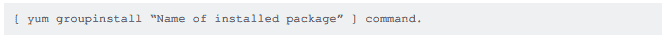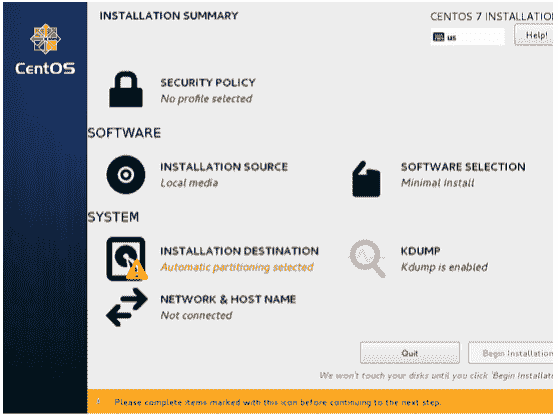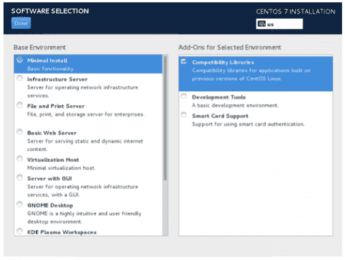

12.现在是时候给你的硬盘分区了。点击安装目的地菜单，选择您的磁盘，并选择一个你想要的。我将配置分区。点击阅读更多关于选择哪个分区的信息[。](https://www.centos.org/docs/5/html/Installation_Guide-en-US/s1-diskpartitioning-x86.html)

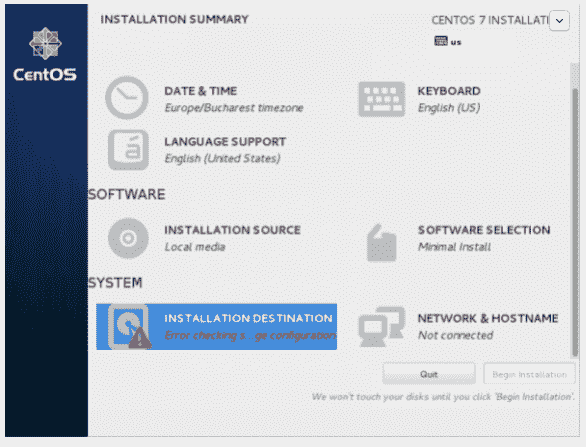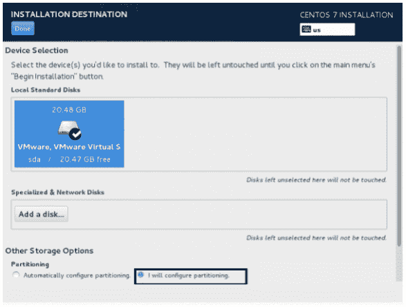

13.在下一个屏幕上，选择 LVM(逻辑卷管理器)作为分区布局，然后单击单击此处自动创建它们。该选项将使用 XFS 文件系统创建三个系统分区，自动重新分配您的硬盘空间，并将所有 LVS 收集到一个名为“centos”的大卷组中。11.

*   /boot —非 LVM
*   /(根)— LVM
*   互换——LVM

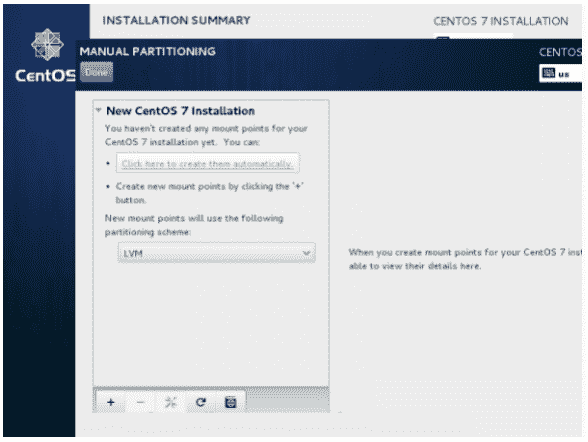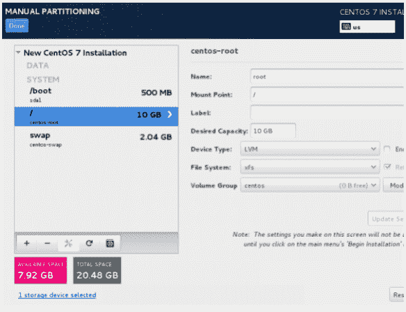

14.如果您对安装程序自动创建的默认分区布局不满意，您可以完全添加、修改或调整您的分区方案。完成后，点击“完成”按钮，并在“更改摘要”提示上接受更改。

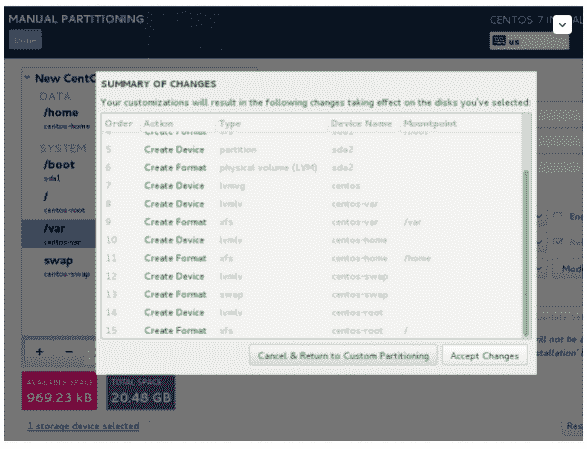

注意:对于那些硬盘容量超过 2TB 的用户，安装程序会自动将分区表转换为 GPT。但是如果您希望在小于 2TB 的磁盘上使用 GPT 表，那么您应该在安装程序引导命令行中使用参数 inst.gpt 来更改默认行为。

15.下一步是设置您的系统主机名并启用网络。单击网络和主机名标签，在主机名字段中键入您的系统 FQDN(完全合格的域名)，然后启用您的网络接口，将顶部的以太网按钮切换到 on。如果您的网络上有一个正常工作的 DHCP 服务器，那么它会自动为已启用的 NIC 配置所有网络设置，这应该会出现在您的活动接口下。

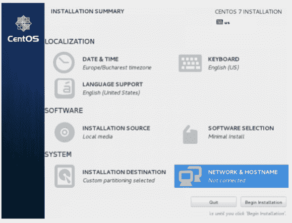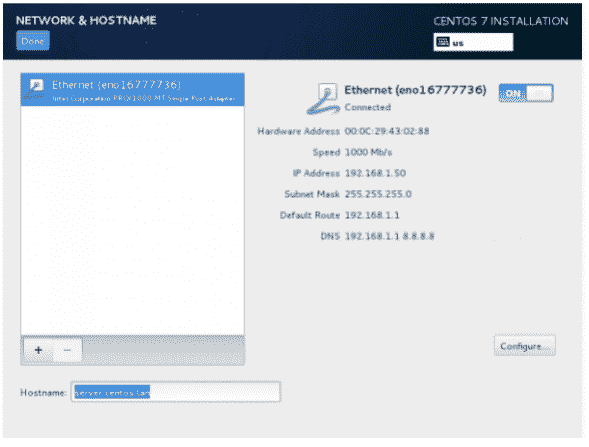

16.如果您的系统是服务器，最好在以太网卡上设置静态网络配置，方法是单击 Configure 按钮，然后添加所有静态接口设置，如下图所示。完成后，点击保存，通过开关按钮禁用和启用以太网卡，然后点击完成应用设置并返回主菜单。

否则:

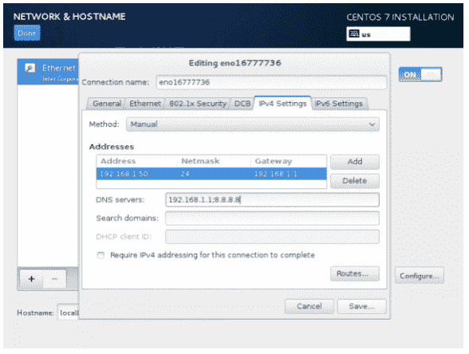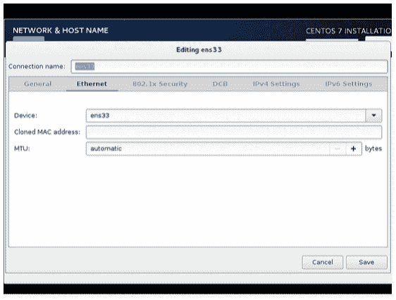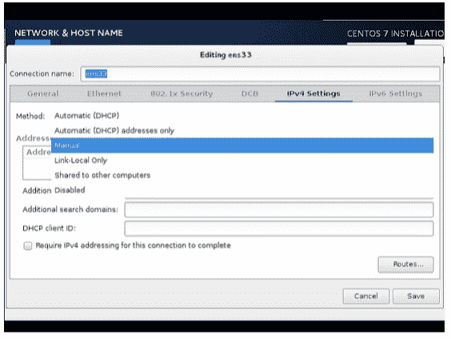

17.根据您的静态 IP 环境添加地址、网络掩码和网关条目。在我的情况下，我使用地址 192.168.1.100，网络掩码 255.255.255.0，网关 192.168.1.1 和 DNS 服务器 8.8.8.8 8.8.4.4。这些值可能会因您的网络环境而异。按下保存键后。

重要提示:如果您没有 IPv6 internet 连接，请在 IPv6 选项卡上将 IPv6 从自动设置为忽略。否则，您将无法通过 IPv4 从该服务器访问互联网，因为 CentOS 似乎忽略了正确的 IPv4 设置，而是使用 IPv6，这将失败。

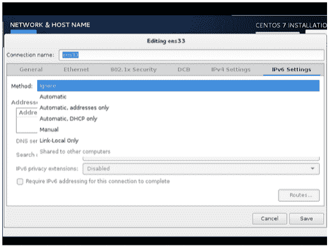

18.接下来，我们必须打开连接，如下图所示。之后，按完成。

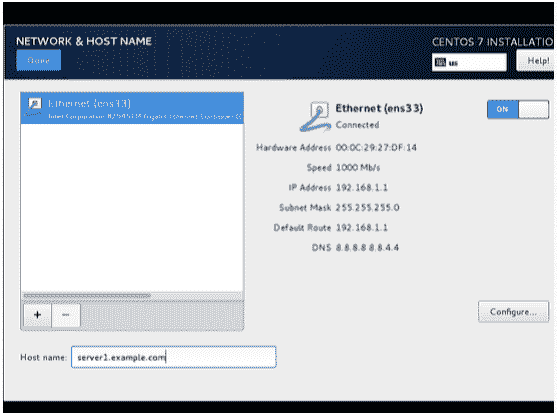

19.现在是时候开始安装过程了，选择 Begin Installation 并为 root 帐户设置一个强密码。

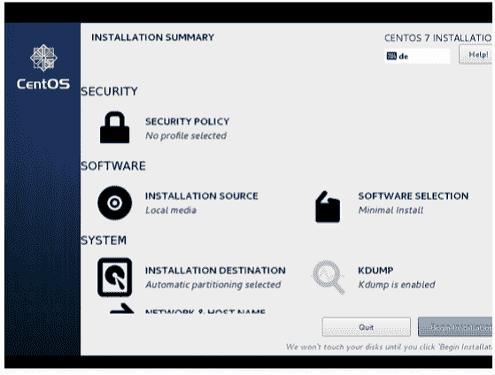

20.安装过程现在将开始，您将在下一个窗口中看到一个蓝色的小进度条。现在，我们必须设置 root 密码，并在用户创建选项中添加一个新的非 ROOT 用户。我将首先选择 root 密码。

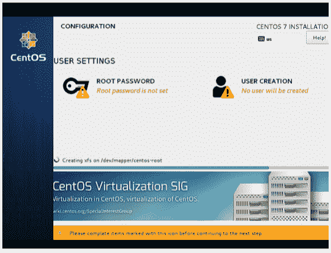

21.输入您选择的安全密码，然后按 Done。

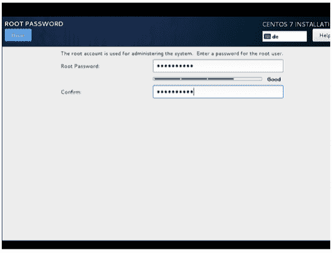

22.接下来，我们将进行用户创建。

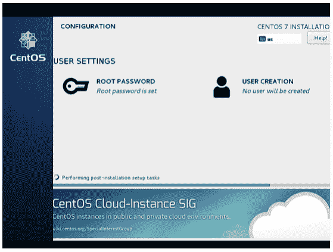

23.接下来，我将创建一个用户。在我的例子中，我使用了全名“管理员”和用户名“管理员”。选中使用此帐户需要密码选项，然后按完成。当然，您可以根据自己的选择使用任何值。

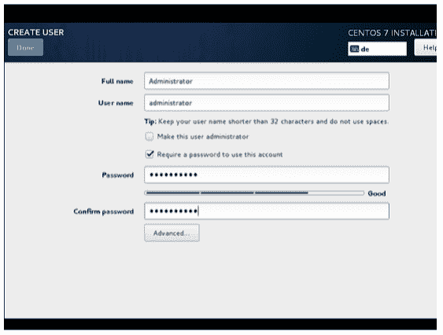

24.按完成。请耐心等待安装完成。

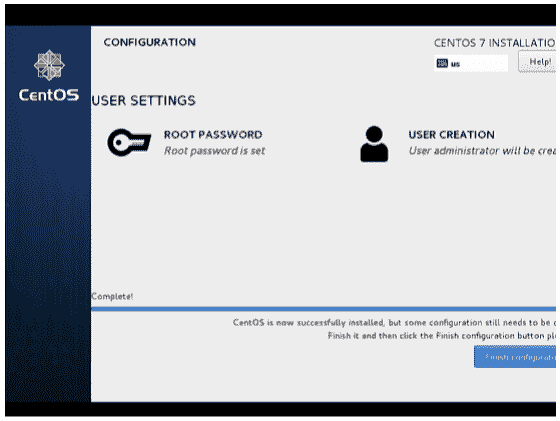

25.安装完成后，它会要求重新启动服务器，只需按下完成配置。

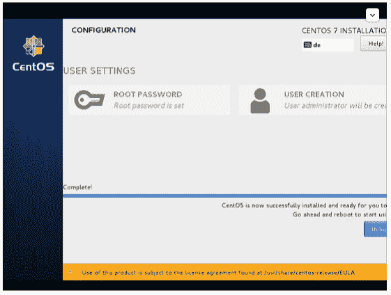

26.服务器将重新启动，随后会要求您输入用户名和密码。

恭喜你！您现在已经在全新的机器上安装了最新版本的 CentOS。移除所有安装介质并重新启动计算机，以便您可以登录到新的 minimal CentOS 7 环境并执行其他系统任务，例如更新您的系统并安装运行日常任务所需的其他有用软件。

现在，我们已经准备好使用上面刚刚创建的用户进行登录，或者我们可以使用 root 凭据。

首次登录 CentOS。以 root 用户身份登录到服务器，这样我们就可以执行一些最后的安装步骤。

第一个是用 yum 安装所有可用的更新。

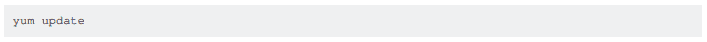

用“y”确认继续安装更新。我将安装两个命令行编辑器，以便能够在 shell 上编辑配置文件:

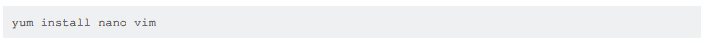

#### 网络结构

CentOS 7.2 minimal 没有预装 ifconfig 命令，因此我们将按如下方式安装它:

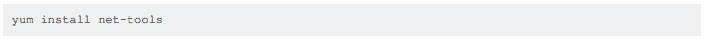

如果您想更改或查看网络配置文件，只需编辑该文件:

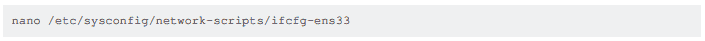

当您配置一个静态 IP 地址时，它将是这样的:

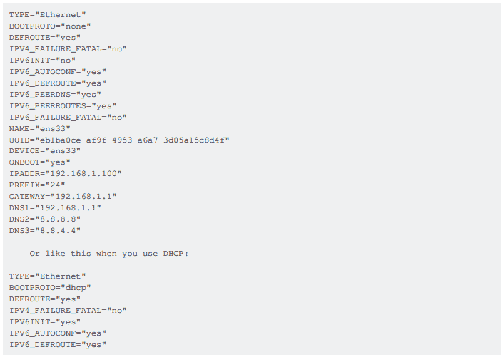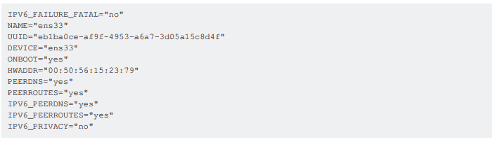

如果需要，更改这些值。

注意:上述设备名称可能会有所不同，因此请检查/etc/sysconfig/network-scripts 目录中的等效文件。

#### 调整/etc/hosts

按如下方式调整文件/etc/hosts:

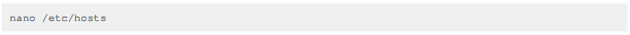

使值如下所示:

恭喜你！现在我们有了基本的 CentOS 7 服务器设置。

现在您可能更喜欢使用 GUI，这里有多种风格可供您选择:

#### 安装 GNOME-Desktop:

通过输入以下内容安装 GNOME 桌面环境:

要启动 GUI，请在安装完成后输入:

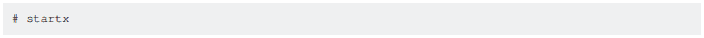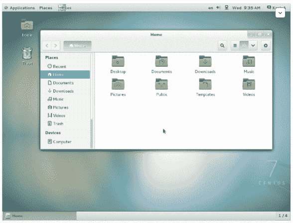

#### 如何使用 GNOME Shell

CentOS 7 的默认 GNOME 桌面以经典模式启动，但是如果你想使用 GNOME Shell，可以这样设置:

选项 A:如果你用 **startx** 启动 GNOME，就这样设置:

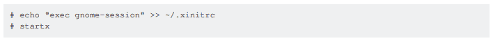

选项 B:设置系统图形登录 system CTL set-default graphical . target 并重新引导系统。系统启动后:

1.  单击位于“登录”按钮旁边的按钮。
2.  在列表中选择“GNOME”。(默认为 GNOME Classic)
3.  点击“登录”并用 GNOME Shell 登录。

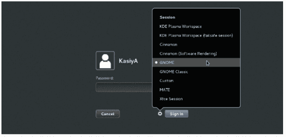

GNOME shell 是这样开始的:

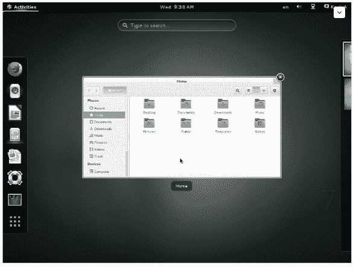

#### 安装 KDE 桌面:

通过输入以下命令安装 KDE 桌面环境

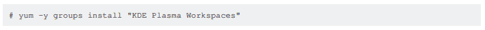

安装完成后，输入如下命令:

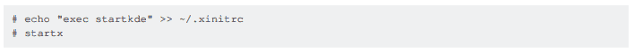

KDE 桌面环境是这样开始的:

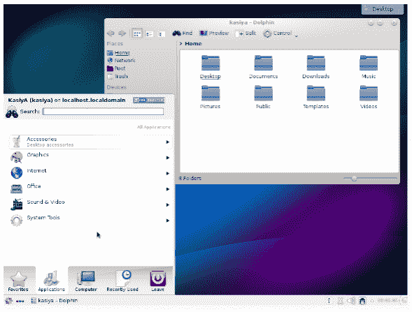

#### 安装 MATE 桌面环境:

通过输入以下命令安装 MATE 桌面环境:

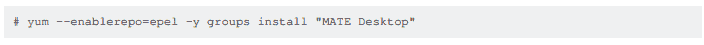

安装完成后，输入如下命令:

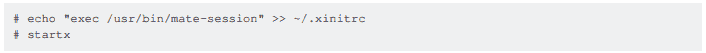

MATE 桌面环境启动:

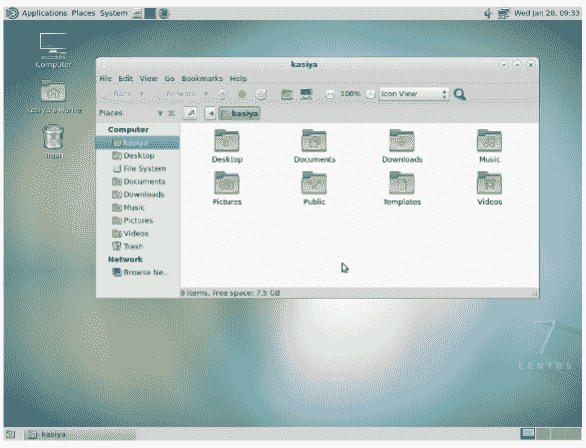

#### 安装 Xfce 桌面环境:

通过输入以下命令安装 Xfce 桌面环境:

安装完成后，输入如下命令:

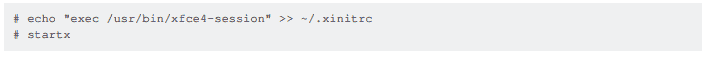

Xfce 桌面环境是这样启动的:

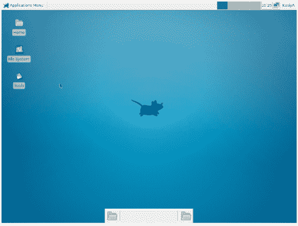

#### 另一种方法是:

与其利用将 startx 命令插入到. xinitrc 文件中，不如告诉 Systemd 您希望引导到图形 GUI 而不是终端。

要做到这一点，只需执行以下操作:

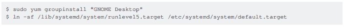

然后简单地重启。

最后一位将把 runlevel 5 目标作为 Systemd 的默认目标。

#### 用系统来做

您也可以使用 Systemd 来实现这一点。这可能是更好的方法，因为您是通过 Systemd 及其 CLI 直接管理系统状态的。

您可以看到您当前的默认目标是什么:

然后将其更改为图形:

#### 目标

在 Systemd 中，目标 runlevel5.target 和 graphical.target 是相同的。runlevel2.target 和 multi-user.target 也是如此。

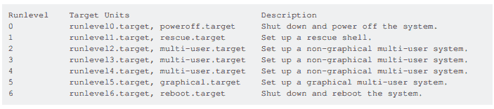

#### RHEL / CentOS Linux 安装核心开发工具 Automake、Gcc (C/C++)、Perl、Python 和调试器

问:在 shell 提示符下安装 CentOS 或 RHEL 或 Fedora Linux 之后，如何安装所有开发人员工具，如 GNU GCC C/C++编译器、make 等？

您需要在 RHEL/CentOS/Fedora/Scientific/Red Hat Enterprise Linux 上安装“开发工具”组。这些工具包括核心开发工具，如 automake、gcc、perl、python 和调试器，它们是编译软件和构建新 rpm 所必需的:

1.  弯曲
2.  gcc c/c++编译器
3.  red hat-rpm-配置
4.  失去了
5.  rpm-构建
6.  制造
7.  pkgconfig
8.  gettext
9.  自动制造
10.  史具特 64
11.  基因组数据库
12.  野牛
13.  libtool
14.  autoconf
15.  gcc-c++编译器
16.  binutils 和所有依赖项。

#### 安装:

打开终端或通过 ssh 会话登录，并以 root 用户身份键入以下命令:

以下输出示例:

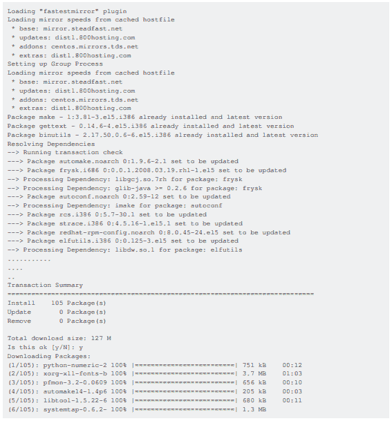

现在，您可以在您的系统上编译和使用任何应用程序。

#### **安装验证**

要显示 Gnu gcc/c/c++编译器版本类型:

样本输出:

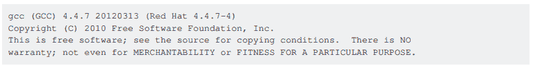

#### 如何列出 Fedora / RHEL / CentOS Linux 服务器中当前运行的所有服务？

有各种方法和工具可以找到并列出 Fedora / RHEL / CentOS Linux 系统下所有正在运行的服务。

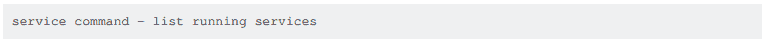

对于 CentOS/RHEL 6.x 及更早版本(systemd 之前),语法如下:

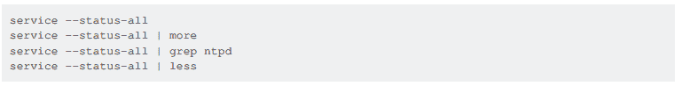

打印任何服务的状态。要打印 apache (httpd)服务的状态:

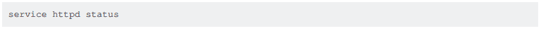

列出所有已知服务(通过 SysV 配置):

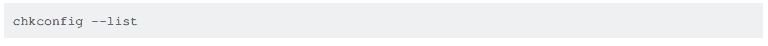

列出服务及其开放的端口:

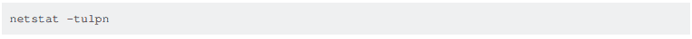

打开/关闭服务:

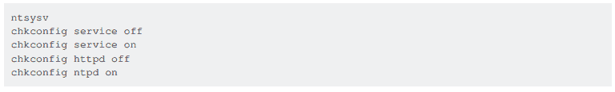

**ntsysv** 是配置运行级服务的简单接口，也可以通过 **chkconfig** 进行配置。默认情况下，它配置当前运行级别。只需输入 **ntsysv** 并选择你想要运行的服务。

#### 关于使用 systemd 的 RHEL/CentOS 7.x 的说明

如果您使用的是基于 systemd 的发行版，如 Fedora Linux v22/23/24 或 RHEL/CentOS Linux 7.x+,请尝试使用以下命令列出使用 systemctl 命令运行的服务。它控制 systemd 系统和服务管理器。

要在 CentOS/RHEL 7.x+上列出 systemd 服务，请使用以下命令。

语法是:

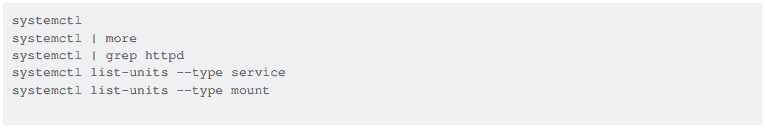

要列出所有服务:

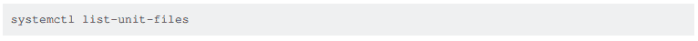

样本输出:

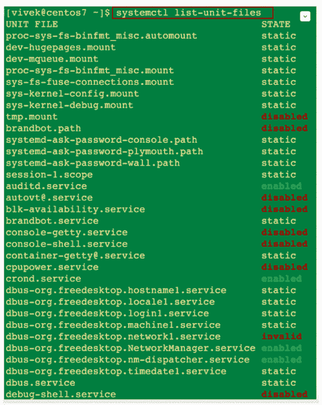

上图显示了安装在基于 CentOS /RHEL 7 systemd 的系统上的所有设备及其当前状态。

要查看与特定服务(cgroup)相关联的进程，可以使用 systemd-cgtop 命令。与 top 命令一样，systemd-cgtop 根据服务列出正在运行的进程:

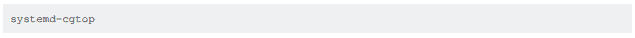

样本输出:

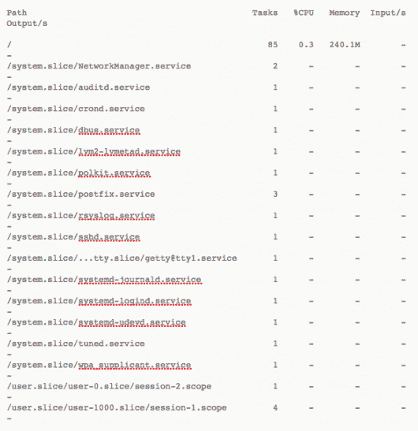

要仅在 CentOS/RHEL 7.x+上列出 SysV 服务，请使用(不包括本机 systd 服务):

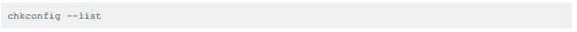

样本输出:

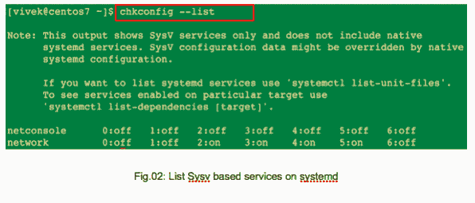

#### 防火墙如何:

点击了解如何设置防火墙[。](https://www.digitalocean.com/community/tutorials/how-to-set-up-a-firewall-using-firewalld-oncentos-7)

**参考文献**

*   [CentOS 文档](https://wiki.centos.org/Documentation)
*   [CentOS 发行说明](https://wiki.centos.org/Manuals/ReleaseNotes/CentOS7)
*   [在 CentOS 7 / RHEL 7 上安装 Gnome GUI](https://linuxconfig.org/how-to-install-gui-gnome-on-centos-7-linux-system)
*   [使用 SYSTEMD 目标](https://access.redhat.com/documentation/en-us/red_hat_enterprise_linux/7/html/system_administrators_guide/sect-managing_services_with_systemd-targets)

**文档如何指导 CentOS**

[CentOS 第 7 版](https://docs.centos.org/en-US/docs/)

CentOS 7 完全基于 RedHat 的详细文档。示例和系统管理指南位于此处: [CentOS 7 完整文档](https://access.redhat.com/documentation/en-us/red_hat_enterprise_linux/7/)

[*最初由 Krasimir Vatchinsky 发表于存档的堆栈溢出文档— RIP 教程*](https://riptutorial.com/centos/topic/7640/getting-started-with-centos)