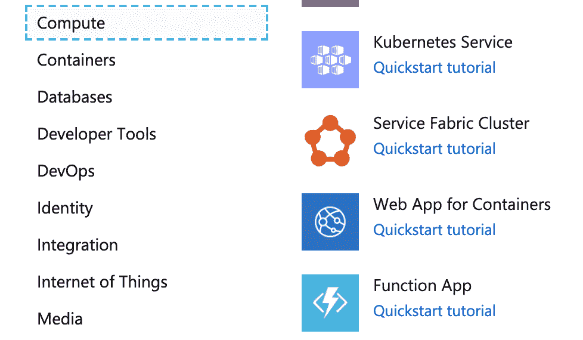
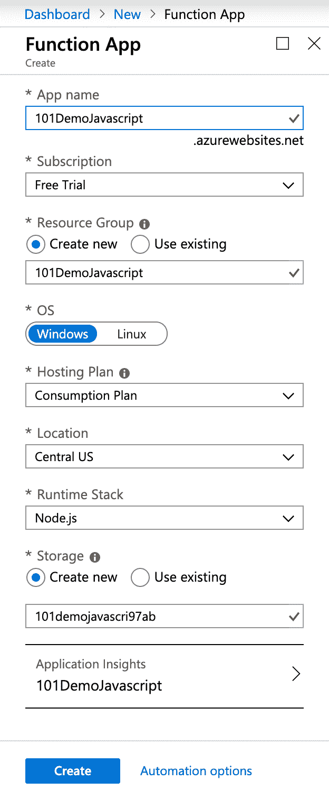
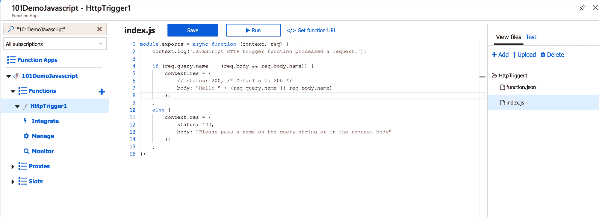
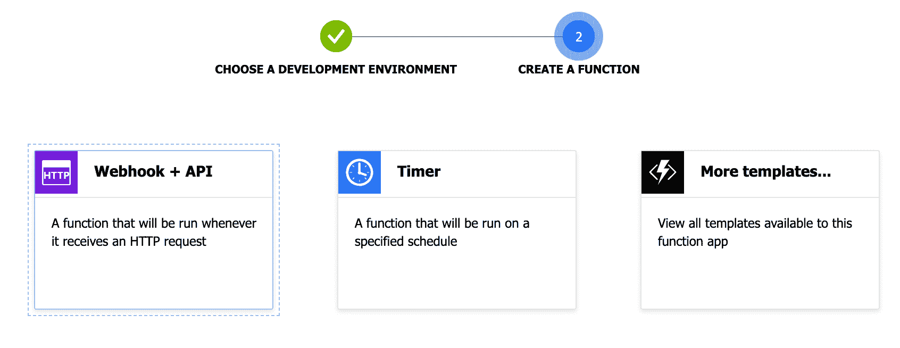
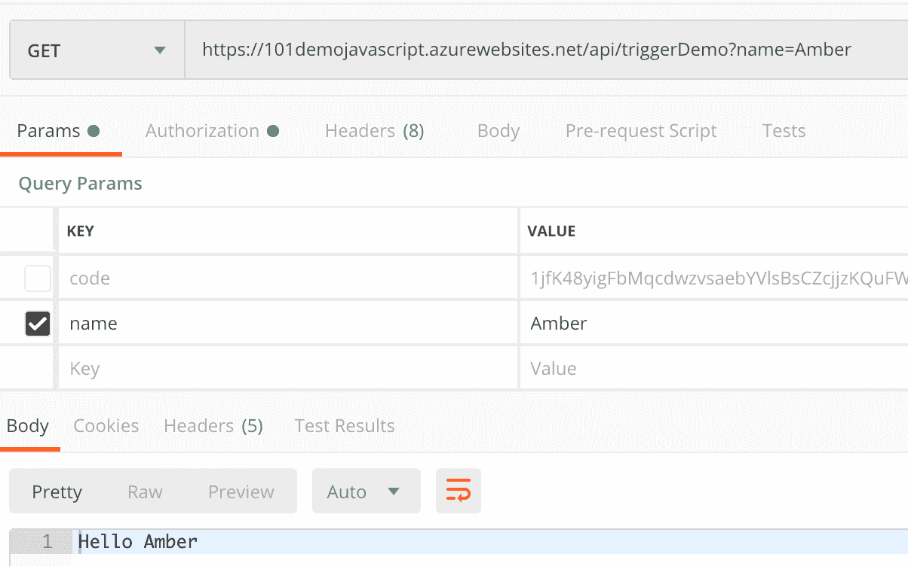
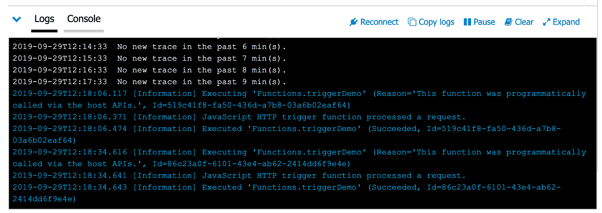
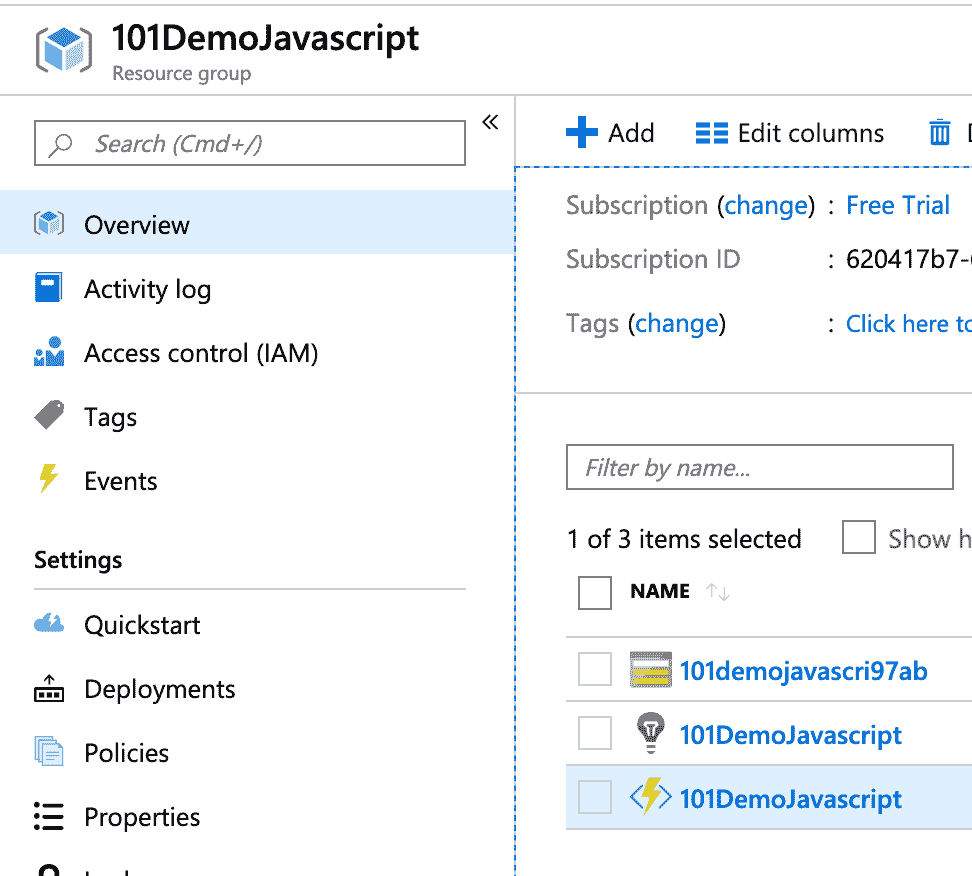
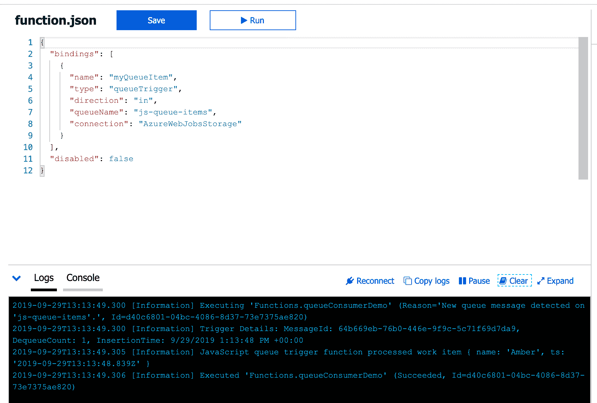

# 如何开始使用 Microsoft Azure -功能应用、HTTP 触发器和事件队列

> 原文：<https://www.freecodecamp.org/news/getting-started-with-microsoft-azure/>

“无服务器”架构目前在技术领域非常流行，包括在我的新工作场所大量使用。

不久前，微软凭借 Azure 进入了这个领域。在他们的门户网站上，所有的服务都被分组和“组织”，提供了如此多的服务，以至于成为专家几乎是不可能的。

我将介绍**函数应用程序、触发器、绑定和事件队列**，足以让 web 开发人员开始在云中做一些伟大的事情。


两个月前，我从未使用过这些技术，但我喜欢这些工具的简洁、清晰和异步。Azure 服务有一些缺陷(门户速度、UI 问题，以及当你扩展时，很难理解是什么拖累了系统),但总的来说，这项技术易于使用并且非常强大。

# 功能应用

你要做的第一件事就是创建一个功能应用。在 Azure 的世界里，这是相关功能的分组。您将在*功能应用*中创建离散的*功能*。每个功能应用程序都可以访问存储容器。





从门户网站(在帐户设置和支付之后)，您将点击最顶部的“创建资源”，并选择功能应用程序。给你的应用取一个名字，选择一种语言来编写你的代码(我选择了 Node for Javascript)，其余的设置保持原样。

部署一个新的功能应用需要一分钟——你可以点击右上角的通知来观看进度，并在准备就绪时获得一个简单的链接。

## 添加功能

功能应用程序准备就绪后，单击功能旁边的加号。选择“在门户编辑器中”和“Webhook / API”。我们将尽可能做最基本的设置。CI/CD 部署等超出了本教程的范围，但是当然您可以使用 git 工具对您的工作进行版本控制，并通过管道进行部署。





# 粘合剂

创建函数后，您将获得一个`index.js`和一个`function.json`。您可以在门户内编辑器右侧的“查看文件”下访问这些文件。

让我们先看一下`function.json`——这是您的函数的配置文件。下面是门户网站将显示的文件:

```
{
  "bindings": [
    {
      "authLevel": "function",
      "type": "httpTrigger",
      "direction": "in",
      "name": "req",
      "methods": [
        "get",
        "post"
      ]
    },
    {
      "type": "http",
      "direction": "out",
      "name": "res"
    }
  ],
  "disabled": false
} 
```

绑定是 Azure 连接各种服务和资源的便捷方式，无需进行大量设置。

### httpTrigger

*   把`authLevel`改成`"anonymous"`，我们就不需要按键来调用我们的函数了。
*   `type`是`httpTrigger`——这意味着我们将生成
    ，一个我们可以用来调用这个函数的端点(更多内容见下文)。
*   `direction`可以是`in`或`out`——表示我们函数的输入或输出。
*   触发器将使用提供的参数调用函数。我们可以随心所欲地调用绑定，但是按照惯例，我们将请求的输入命名为`req`,响应的输出命名为`res`。
*   我们如何调用这个函数。我将删除`post`，因为我们不需要它。

下一个绑定也是类型`http`，方向`out`，因为这是我们发送响应的方式。如果您想禁用该功能，您可以在`function.json`或门户的 UI 中进行操作。

## 在函数代码中使用绑定

我们可以使用 Azure 提供的示例代码来展示绑定是如何工作的。我已经简化了 Azure 的代码，但是如果你继续学习的话，在你的`index.js`中应该有一些非常相似的东西:

```
module.exports = async function (context, req) {
    context.log('JavaScript HTTP trigger function processed a request.');

    if (req.query.name) {
        context.res = {
            // status: 200, /* Defaults to 200 */
            body: "Hello " + req.query.name
        };
    }
    else {
        context.res = {
            status: 400,
            body: "Please pass a name on the query string or in the request body"
        };
    }
}; 
```



这里你可以看到我们有一个简单的网络挂钩。我们可以通过点击“获取函数 URL”和用 cURL 或 Postman 发送请求来快速观看它的工作。这是怎么回事？



通过 Azure magic，我们的函数被调用了`context`和我们发送的`req`。`context`允许我们访问在`function.json`中看到的绑定，`req`成为我们函数的输入。

更多 Azure magic 处理响应。我们简单地根据我们的需求设置`status`，并适当地设置`body`。Azure 处理其余的。(注意，如果您正在发送 JSON 或其他非字符串响应对象，您必须设置头。)

我们可以在日志中看到所有这些工作。你会在页面底部的`index.js`代码下找到它们。注意`console.log`在这里帮不了你——你需要使用`context.log`。

就是这样！我们有一个运行在“云端”的网络钩子。

## 环境变量

如果没有一些用于连接数据库、外部 API 和其他服务的秘密，我们可能走不远。当你点击你的函数应用的名字时，你可以将这些变量保存在“配置”下(相对于函数)。Azure 会自动在里面放一堆来处理你的功能 App 存储和应用洞察(监控)。

## 其他绑定

有几十种绑定可以使用。Azure 可以连接到几种不同类型的数据库，并且您可以为正在创建的新文档创建一个触发器。同样，该方法可以接收一个有效负载，该有效负载将创建一个带有外部绑定的记录。

另一个有趣的绑定是一个`event`，我将在下面介绍它。

# 事件队列

请求和响应很好，但是如果我们想从 HTTP 绑定创建一个异步事件呢？

假设我们正在创建一个用户。创建用户后，我们希望发送一封电子邮件来欢迎他们使用我们的服务。

但是，如果我们的发送电子邮件代码有问题，我们绝不会希望它妨碍创建用户或对客户的响应。我们可以通过[事件队列](https://docs.microsoft.com/en-us/azure/azure-functions/functions-bindings-storage-queue)创建异步消息传递。

我不会深入研究队列是如何工作的，但是这个想法非常简单:一个方法将消息放入一行，另一个方法将它们剥离并对它们做一些事情(后进先出)。当队列为空时，任何监听它的东西都是安静的。

Azure 具有不同类型队列的功能，包括更复杂的服务总线。

## 创建队列

我们要做的第一件事是创建一个我们的函数可以推送和读取的队列。如果你点击面包屑中的“主页”，你应该会在最近的资源中看到你的功能应用程序名称。

这里的链接实际上是指向“资源组”——你用 Function App 创建的所有项目的集合。单击，然后选择您的存储器(它看起来像一个数据库表)。

现在找到 Queues 标签，点击“+Queue”，然后为你的函数 app 创建一个队列。请注意，您可以拥有任意多的队列。您还可以在队列中手动创建项目，以便独立测试您的功能。



## 队列绑定

添加一个新函数(点击`+`图标)，选择“Azure 队列存储触发器”。这将提示您安装一个事件中心扩展，然后为您的函数命名——您现在可以忽略其他设置。下面是我们新绑定的`function.json`代码:

```
{
  "bindings": [
    {
      "name": "myQueueItem",
      "type": "queueTrigger",
      "direction": "in",
      "queueName": "js-queue-items",
      "connection": "AzureWebJobsStorage"
    }
  ],
  "disabled": false
} 
```

我们将使用我们为此函数应用程序创建的存储来保存事件队列。`index.js`从队列中获取项目并执行。我们不需要对我们的函数做太多，所以我们可以保留来自 Azure 的演示代码:

```
module.exports = async function (context, myQueueItem) {
    context.log('JavaScript queue trigger function processed work item', myQueueItem);
}; 
```



## 向队列中添加项目

您的队列触发器函数正在运行，但是在我们向队列中添加一个项目之前，它不会做任何事情。我们可以通过调整我们的第一个函数来做到这一点，在调用 web 钩子时将一个项目放入队列中。

```
{ bindings: [...],
    {
      "name": "myQueueItem",
      "type": "queue",
      "direction": "out",
      "queueName": "js-queue-items",
      "connection": "AzureWebJobsStorage"
    }
} 
```

现在，我们可以更新代码，向队列中添加一个项目:

```
[...]
    if (req.query.name) {
        context.bindings.myQueueItem = {
            name: req.query.name,
            ts: new Date()
        }
[...] 
```

如果你在不同的窗口中打开你的函数，你可以在每个函数的日志中看到所有发生的事情。发送您的请求，观察它在 http 触发器中的消耗，然后队列触发器将获取第一个函数放置的消息。很酷，对吧？

对于创建异步作业来说，这是一些非常强大的东西，可以防止函数之间相互干扰。在“整体”模型中，如果一个函数行为不当，它会阻止其他函数的执行。在这个模型中，如果队列触发器有问题，它不会阻止服务器做出适当的响应。自然地，这增加了一层复杂性和考虑，这在整体结构中是不存在的——总是有权衡的。

但是如果我们回到我们的理论用例，我们用 http 触发器创建一个新用户，image 有 10 个队列来做各种事情。我们的 http 触发器可能会在数据库中创建一个文档，并在请求中返回成功。

同样的工作可能会添加到发送电子邮件的队列中，触发一小时后发送优惠券短信，向营销团队发送 Slack 消息
,或者创建新用户时可能需要发生的一百万件其他事情中的任何一件。如果其中任何一个出现故障(Slack 宕机？)，其他人愉快地继续他们的路。

这篇文章只是触及了可用内容的皮毛。我期待着探索更多 Azure 可以做的事情。如果你对下一步的构建有什么建议，请告诉我！

你可以在 [wilkie.tech](https://wilkie.tech) 的博客上阅读更多我的文章。