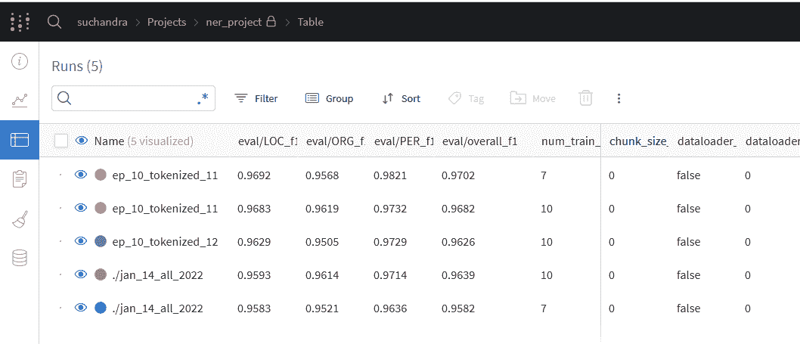
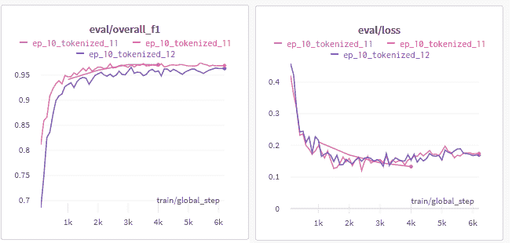
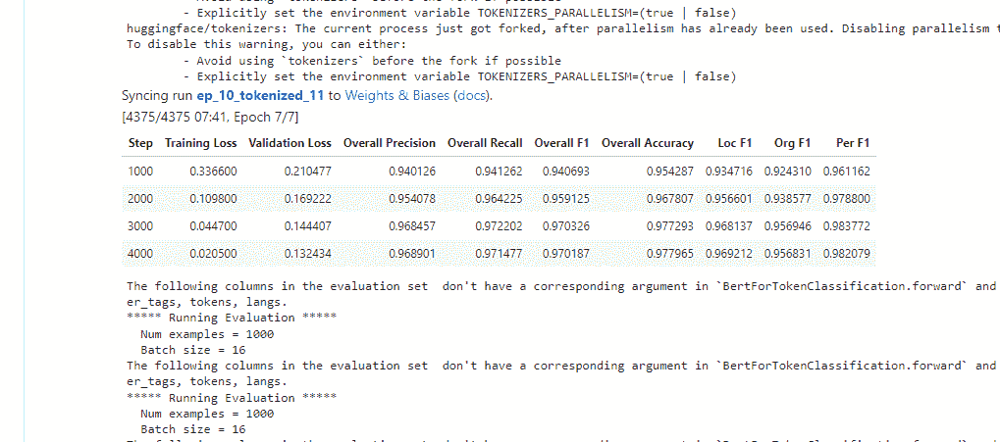
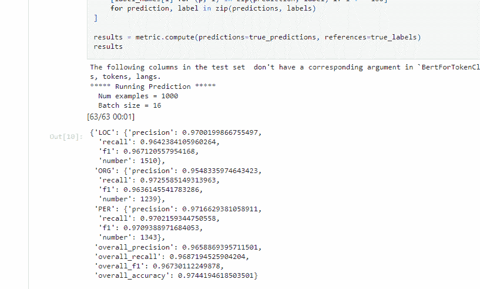
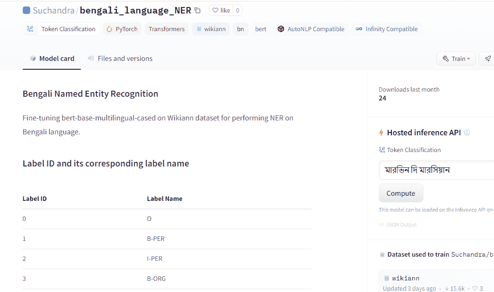

# 如何微调伯特 NER 使用拥抱脸

> 原文：<https://www.freecodecamp.org/news/getting-started-with-ner-models-using-huggingface/>

我一直对语言和文字的内在美着迷。但是我曾经认为语言理解是人类独有的特征。

因此，当机器开始使用变形金刚生成、理解、分类和总结文本时，我很兴奋地想了解更多。我想学习如何实现并看到它的实际应用。

在本文中，我将带您了解以下主题:

*   如何使用 HuggingFace 为 NER 任务微调 BERT
*   如何为 MLOps 设置权重和偏差
*   如何编写模型卡并在 Huggingface 模型中心分享您的模型

我能够创建这个模型作为一个附带项目，并在[https://huggingface.co/Suchandra/bengali_language_NER](https://huggingface.co/Suchandra/bengali_language_NER)分享它，这要感谢我在下面链接的精彩资源:

*   [图示变压器](https://jalammar.github.io/illustrated-transformer/)
*   [插图中的伯特·埃尔莫公司](https://jalammar.github.io/illustrated-bert/)
*   [拥抱面部文档](https://huggingface.co/)
*   [模型中枢文档](https://huggingface.co/docs/hub/main)
*   [权重和偏差文档](https://wandb.ai/site)

我们走吧！

## 变压器、令牌化器和 BERT 概述

### 令牌设备

标记化是将一个较大的实体分解成其组成单元的过程。大块文本首先被标记化，以便它们被分解成机器更容易表示、学习和理解的格式。

我们可以用不同的方法来标记文本，比如:

*   字符标记化
*   单词标记化
*   子词标记化

例如，考虑下面的文本

```
The moon shone over laketown
```

*   对于字符标记化，我们将其表示为一系列组成字符，如[ 'T '，' h '，' e '，' m '，' o '，' o '，' n '，' s '，' h '，' o '，' e '，' o '，' v '，' e '，' r '，' l '，' a '，' k '，' e '，' T '，' o '，' w '，' n' ]
*   对于单词标记化，应该是[ 'The '，' moon '，' shone '，' over '，' laketown']
*   对于子词标记化，频繁的词将保持不变，不太频繁的词被分成更频繁的词，如['The '，' moon '，' shone '，' over '，' lake '，' ##town']，这里较罕见的词“laketown”被分成更频繁出现的词-“lake”和“town”。town 前面的两个散列是必要的，用来表示“town”本身不是一个词，而是一个更大的词的一部分。

变形金刚中最常用的子词标记化算法是 BPE 和单词块。这里有一个关于[文字片](https://arxiv.org/pdf/1609.08144v2.pdf)和 [BPE](https://arxiv.org/abs/1508.07909v5) 的论文链接，以获得更多信息。很好，现在我们的输入文本看起来像这样:

```
['The','moon','shone','over','lake','##town']
```

现在怎么办？这对机器来说有什么意义？输入变压器。

### 变形金刚和伯特

变压器是深度学习模型的一种特殊架构，它彻底改变了自然语言处理。

变压器的定义特征是自我关注机制。使用它，每个单词都知道它与序列中的其他单词有多相关。

例如，在上一节的文本示例中，单词“the”指的是单词“moon ”,因此“the”和“moon”的注意力得分会很高，而像“the”和“over”这样的单词对的注意力得分会较低。

关于计算注意力分数和输出所需公式的完整描述，你可以在这里阅读论文。

这里有一个简单的例子来说明它们是如何协同工作的。我们有我们的意见:

```
['The','moon','shone','over','lake','##town']
```

每个令牌被表示为一个向量。因此，假设‘the’表示为[0.1，0.2，1.3，-2.4，0.05]，任意大小为 5。这个模型还不知道向量的值应该是多少，所以它用一些随机值初始化。

然后，它开始使用 Transformer 架构学习单词之间的关系，并不断更新向量值，直到它能够以我们期望的精度执行分类。

现在，我们转到 BERT，这是一个基于变压器的模型架构。它使用大型文本语料库来学习如何最好地表示标记，并执行下游任务，如文本分类、标记分类等。

## 项目的数据集

NER，或命名实体识别，包括识别句子中每个单词所属的标签。

例如，在句子“上周甘道夫访问了夏尔”中，我们可以认为实体是带有标签“人”的“甘道夫”和带有标签“位置”的“夏尔”。

为了建立一个执行这个任务的模型，首先我们需要一个数据集。我们将使用孟加拉语的 WikiANN 数据集，可以通过 HuggingFace 的 datasets 模块轻松获得。

它包括多种语言，其中的单词被标注了位置(LOC)、组织(ORG)和人员(PER)等标签。这里有一个到数据集卡的[链接，以了解更多信息。](https://huggingface.co/datasets/wikiann)

## 微调的模型

我们将使用 BERT base 多语言模型，特别是 cased 版本。我从无大写版本开始，后来我意识到这是一个错误。

我很快发现，如果我对一个单词进行编码，然后解码，我确实得到了原来的单词，但解码后的单词的拼写发生了变化。

事实证明，无外壳版本面临着可以解释这种行为的规范化问题。这样的问题在 cased 版本中被清除了，正如官方 GitHub repo [这里](https://github.com/google-research/bert/blob/master/multilingual.md)所描述的。

## 如何加载数据集

首先，让我们从 HuggingFace 安装我们需要的所有主要模块。以下是如何在 Jupyter 上实现的:

```
!pip install datasets
!pip install tokenizers
!pip install transformers
```

然后我们像这样加载数据集:

```
from datasets import load_dataset

dataset = load_dataset("wikiann", "bn")
```

最后检查标签名称:

```
label_names = dataset["train"].features["ner_tags"].feature.names 
```

## 如何预处理数据集

对于每个样本，我们需要获得`input_ids`、`token_type_ids`和`attention_mask`的值，并调整标签。

为什么需要调整标签？嗯，BERT 模型使用子词标记化，其中频繁出现的标记被组合成一个标记，而罕见的标记被分解成频繁出现的标记。

例如，假设我们有一个名字“Johnpeter”。它会被分解成更频繁的单词，比如“约翰”和“#彼得”。但是“Johnpeter”在数据集中只有 1 个标签是“B-PER”。因此，在标记化之后，调整后的标签将是“John”的“B-PER”和“##peter”的“B-PER”。

下面的代码首先对每个训练、测试、验证分割的所有样本进行编码。然后它使用 word_ids，这是一个包含每个单词的重复索引的列表，每个单词都像 word_ids = [0，0，0，1，2，3，3]一样被拆分。这意味着索引 0 处的单词被分成 3 个记号，索引 3 处的单词被分成 2 个记号。因此，我们重复 adjusted_label_ids 中的标签，直到索引发生变化。

```
from transformers import AutoTokenizer
tokenizer = AutoTokenizer.from_pretrained("bert-base-multilingual-cased")

#Get the values for input_ids, token_type_ids, attention_mask
def tokenize_adjust_labels(all_samples_per_split):
  tokenized_samples = tokenizer.batch_encode_plus(all_samples_per_split["tokens"], is_split_into_words=True)
  #tokenized_samples is not a datasets object so this alone won't work with Trainer API, hence map is used 
  #so the new keys [input_ids, labels (after adjustment)]
  #can be added to the datasets dict for each train test validation split
  total_adjusted_labels = []
  print(len(tokenized_samples["input_ids"]))
  for k in range(0, len(tokenized_samples["input_ids"])):
    prev_wid = -1
    word_ids_list = tokenized_samples.word_ids(batch_index=k)
    existing_label_ids = all_samples_per_split["ner_tags"][k]
    i = -1
    adjusted_label_ids = []

    for wid in word_ids_list:
      if(wid is None):
        adjusted_label_ids.append(-100)
      elif(wid!=prev_wid):
        i = i + 1
        adjusted_label_ids.append(existing_label_ids[i])
        prev_wid = wid
      else:
        label_name = label_names[existing_label_ids[i]]
        adjusted_label_ids.append(existing_label_ids[i])

    total_adjusted_labels.append(adjusted_label_ids)
  tokenized_samples["labels"] = total_adjusted_labels
  return tokenized_samples

tokenized_dataset = dataset.map(tokenize_adjust_labels, batched=True)
```

下面是一个示例在标记化后的样子:

```
{'attention_mask': [1, 1, 1, 1, 1, 1, 1, 1, 1, 1, 1, 1, 1, 1, 1, 1, 1],
 'input_ids': [101,
  978,
  12235,
  38044,
  40349,
  52245,
  950,
  21790,
  12079,
  89362,
  77045,
  117,
  978,
  12235,
  38044,
  40349,
  102],
 'labels': [-100, 5, 5, 5, 5, 6, 6, 6, 6, 6, 6, 0, 5, 5, 5, 5, -100],
 'langs': ['bn', 'bn', 'bn', 'bn', 'bn'],
 'ner_tags': [5, 6, 6, 0, 5],
 'spans': ['LOC: সিডনি ক্রিকেট গ্রাউন্ড', 'LOC: সিডনি'],
 'token_type_ids': [0, 0, 0, 0, 0, 0, 0, 0, 0, 0, 0, 0, 0, 0, 0, 0, 0],
 'tokens': ['সিডনি', 'ক্রিকেট', 'গ্রাউন্ড', ',', 'সিডনি']}
```

## 如何填充样品

另一个问题是，不同的样本可能被标记为不同的长度，因此我们需要添加填充标记，以便所有样本都具有相同的长度。

```
from transformers import DataCollatorForTokenClassification

data_collator = DataCollatorForTokenClassification(tokenizer)
```

## 如何设置权重和偏差的积分

Weights and Biases 是一个超级强大的平台，有助于简化跟踪模型训练、数据集版本化、超参数优化和可视化。它集成了 HuggingFace、Keras 和 PyTorch。

更容易跟踪每个实验的所有参数，每次运行的损耗是如何变化的，等等，这使得调试更快。

点击链接[这里](https://docs.wandb.ai/)查看他们的网站，获取完整的功能列表、使用计划以及如何开始使用。

```
!pip install wandb 
```

```
import os
import wandb
os.environ["WANDB_API_KEY"]="API KEY GOES HERE"
os.environ["WANDB_ENTITY"]="Suchandra"
os.environ["WANDB_PROJECT"]="finetune_bert_ner"
```

权重和偏差的优势是自动记录和图表，我们可以使用它们来比较多次运行的模型性能，并找出哪些值运行良好。像这样:



我一眼就能看出 F1 的得分和损失是如何随着不同的纪元值而变化的:



## 如何使用训练器 API 训练模型

拥抱脸训练器 API 非常直观，提供了一个通用的训练循环，这是 PyTorch 目前所没有的。

为了在训练过程中获得验证集的指标，我们需要定义一个函数来为我们计算指标。这在他们的官方文件中有很好的记录。

```
from transformers import AutoModelForTokenClassification, TrainingArguments, Trainer
import numpy as np
from datasets import load_metric
metric = load_metric("seqeval")
def compute_metrics(p):
    predictions, labels = p
    predictions = np.argmax(predictions, axis=2)

    # Remove ignored index (special tokens)
    true_predictions = [
        [label_names[p] for (p, l) in zip(prediction, label) if l != -100]
        for prediction, label in zip(predictions, labels)
    ]
    true_labels = [
        [label_names[l] for (p, l) in zip(prediction, label) if l != -100]
        for prediction, label in zip(predictions, labels)
    ]

    results = metric.compute(predictions=true_predictions, references=true_labels)
    flattened_results = {
        "overall_precision": results["overall_precision"],
        "overall_recall": results["overall_recall"],
        "overall_f1": results["overall_f1"],
        "overall_accuracy": results["overall_accuracy"],
    }
    for k in results.keys():
      if(k not in flattened_results.keys()):
        flattened_results[k+"_f1"]=results[k]["f1"]

    return flattened_results 
```

我也想看到实体级别的指标，所以我添加了下面的代码片段:

```
flattened_results = {"overall_precision": results["overall_precision"],"overall_recall": results["overall_recall"],"overall_f1": results["overall_f1"],"overall_accuracy": results["overall_accuracy"],}

for k in results.keys():
	if(k not in flattened_results.keys()):
    	flattened_results[k+"_f1"]=results[k]["f1"]
```

接下来，我们加载模型检查点进行微调，并将所有参数传递给 Trainer 和 train。

```
model = AutoModelForTokenClassification.from_pretrained("bert-base-multilingual-cased", num_labels=len(label_names))
training_args = TrainingArguments(
    output_dir="./fine_tune_bert_output",
    evaluation_strategy="steps",
    learning_rate=2e-5,
    per_device_train_batch_size=16,
    per_device_eval_batch_size=16,
    num_train_epochs=7,
    weight_decay=0.01,
    logging_steps = 1000,
    report_to="wandb",
    run_name = "ep_10_tokenized_11",
    save_strategy='no'
)
trainer = Trainer(
    model=model,
    args=training_args,
    train_dataset=tokenized_dataset["train"],
    eval_dataset=tokenized_dataset["validation"],
    data_collator=data_collator,
    tokenizer=tokenizer,
    compute_metrics=compute_metrics
)

trainer.train()
wandb.finish()
```

我在 Google Colab 上训练这个，达到了 Colab 的使用极限。我不确定为什么会这样，因为我没有训练 12 个小时或者类似的时间。

从 Colab 的官方常见问题解答[这里](https://research.google.com/colaboratory/faq.html)，它概述了这个问题和可能的原因。我改乘 Kaggle，完成了火车。

以下是一些训练、验证和测试集结果:



Train and validation results



Test results

## 如何将模型保存到 HuggingFace 模型中心

我发现克隆 repo、添加文件和使用 Git 提交是将模型保存到 hub 的最简单的方法。

```
!transformers-cli login
!git config --global user.email "youremail"
!git config --global user.name "yourname"
!sudo apt-get install git-lfs 
%cd your_model_output_dir
!git add .
!git commit -m "Adding the files"
!git push
```

## 如何创建模型卡

现在让我们通过在 HuggingFace 上创建一个模型卡来添加关于我们的模型的有用信息。它充当存储库的 README.md。

虽然大部分都很简单，但有些事情我花了一段时间才弄明白:

*   如何改变推理 API 的默认语言？我的 NER 模型在孟加拉语上进行了微调，但示例输入是英语的。为了改变这一点，我必须在模型卡的元数据中给出语言信息，它是用 YAML 语写的。您可以在此处参考回购文件范本
*   像这样定制输入示例:

```
widget:
- text: "মারভিন দি মারসিয়ান" 
```

*   您还可以为每个示例命名，如下所示:

```
- text: "সাউথ ইস্ট ইউনিভার্সিটি"
  example_title: "Sentence_4" 
```

这是我添加到模型卡中的所有元数据

```
---
language: bn
datasets:
- wikiann
examples:
widget:
- text: "মারভিন দি মারসিয়ান"
  example_title: "Sentence_1"
- text: "লিওনার্দো দা ভিঞ্চি"
  example_title: "Sentence_2"
- text: "বসনিয়া ও হার্জেগোভিনা"
  example_title: "Sentence_3"
- text: "সাউথ ইস্ট ইউনিভার্সিটি"
  example_title: "Sentence_4"
- text: "মানিক বন্দ্যোপাধ্যায় লেখক"
  example_title: "Sentence_5"
---
```

这是我的模型卡的样子



## 让我们总结一下

在本文中，我们介绍了如何使用强大的 HuggingFace 库来微调 NER 任务的模型。

我们还看到了如何整合权重和偏差，如何在 HuggingFace model hub 上分享我们完成的模型，以及编写一张记录我们工作的漂亮模型卡。

这是我这边这篇文章的结尾。不断学习编码员，不断提升技能，永远保持好奇心。保重，编码愉快！