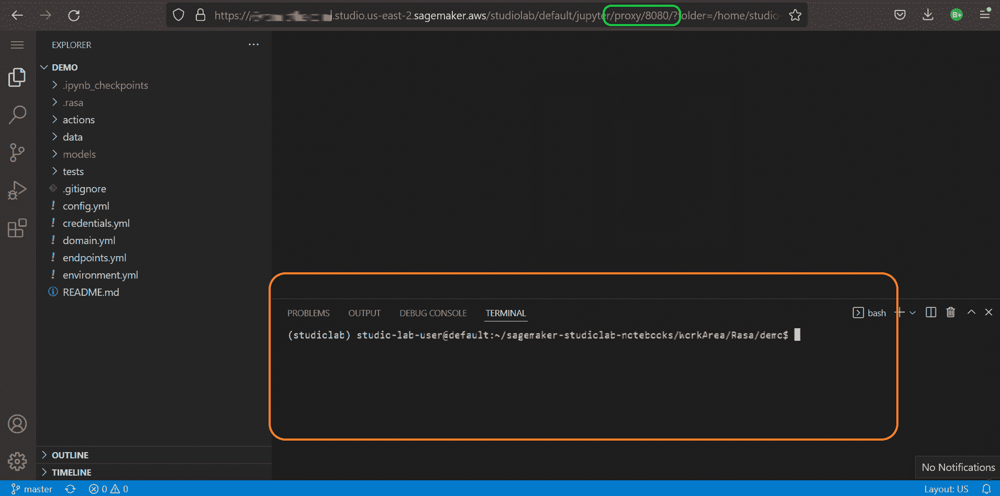
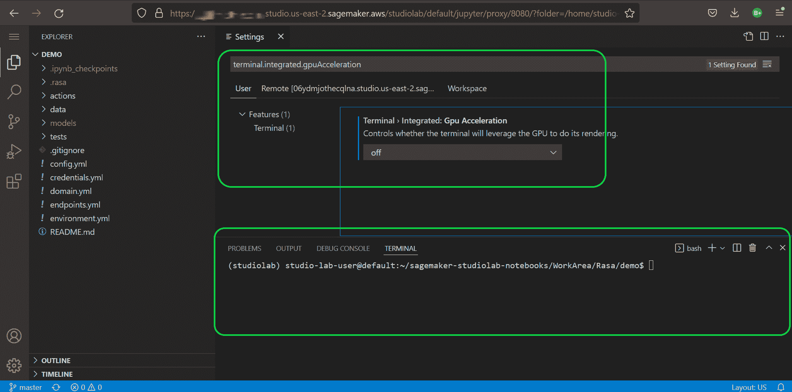

# 如何用 VS 代码在 Sagemaker Studiolab 中搭建 Rasa 开发环境

> 原文：<https://www.freecodecamp.org/news/getting-started-with-rasa-with-studiolab-and-vscode/>

上周，我很兴奋地投入到开源框架 Rasa T1 的聊天机器人开发中。借助 Rasa，您可以获得极大的灵活性，从设计对话到开发 NLU 逻辑再到部署。

但是“耶”很快就变成了用我的头去撞砖墙。最初的 Rasa bot 本身在我的 4 核 16GB RAM 的不算太差的笔记本电脑上开始崩溃。

我必须找到一些其他的平台来进行我的开发，但是我不想花任何钱去摆弄开源框架。准确地说，我真正需要的是一个有 VS 代码支持的免费机器学习实验平台。

我将带您了解我是如何利用完全免费的基于云的平台解决这些挑战的。

我发现 [AWS Sagemaker Studiolab](https://aws.amazon.com/sagemaker/studio-lab/) 是运行我的 Rasa 机器学习工作负载的可靠选择。它是免费的，有 15 GB 的持久存储，并有 12 小时的复杂算法 CPU 会话或 4 小时的深度学习算法 GPU 会话。

Sagemaker 还提供了一个 Jupyterlab 服务器，而不是一个开发 IDE 平台。我迫切需要我最喜欢的 VS 代码接口，这也是我偶然发现 Github 代码空间的原因。

Codespaces 提供了一个基于云的 VS 代码环境，但是它不能运行像 ML training 这样的计算密集型工作。所以我需要一个“两全其美”的方法。我需要 Studiolab 中的 VScode。

代码服务器来救援了！Code-server 是一个 python 库，它可以帮助你在一台机器上设置一个 VS 代码服务器。

## 我们将使用的工具

*   aws pagemaker 工作室
*   康达
*   罗砂
*   VScode 的代码服务器

## Conda 环境设置

让我们看看如何把这些联系起来。我们首先在 Studiolab 中创建一个空文件夹，并在该文件夹中运行以下命令:

```
conda create --name rasa-env python==3.8  
conda activate rasa-env  

python -m pip uninstall pip  
python -m ensurepip  
python -m pip install -U pip  

python -m pip install --upgrade setuptools  
python -m pip install rasa 
```

这些命令将在 Studiolab 中创建一个名为 rasa-env 的新 Conda 环境，并在其中安装 rasa。如果希望 SSH 访问 Git，也可以运行`conda install openssh`。

要在这个 Conda 环境中安装 VS 代码服务器，请执行命令`conda install -y -c conda-forge code-server`。现在，您有了自己的 Conda 环境，安装了 Rasa、code-server 和 OpenSSH。

当然，我们将在 Git 存储库中维护 Rasa 代码。如果有人希望取消回购，我们不希望那个人经历同样的麻烦来创造环境，对吗？。

为了使他们的生活更容易，我们将使用命令`conda env export --file environment.yml`生成一个 environment.yml 文件，它是 requirements.txt 的 Conda 等价物。使用这个文件，您可以通过运行`conda env create -n rasa-env -f environment.yml`来重新创建环境。

## VScode 设置

现在我们已经完成了环境设置，我们可以在一个新的选项卡中启动 VS 代码服务器，并开始我们的 Rasa 开发。

要启动 VS 代码服务器，在 Studiolab 中打开一个新的终端并执行`code-server --auth none`。


上图显示了运行代码服务器命令后生成的日志。您也可以启动带身份验证的代码服务器，这将只允许那些有密码的人访问 VS 代码服务器。

复制您的 Studiolab 环境的 URL，它看起来类似于*https://xxxxxxxxxxxxxxxxxxxxx . studio . us-east-2 . sagemaker . AWS/studio lab/default/jupyter/lab*并将最后的 */lab* 替换为 */proxy/8080/* 以创建 VS 代码服务器 URL。

在单独的选项卡中输入这个新的 URL，导航到 Studiolab 中运行的 VS 代码。等待 3-5 分钟，让服务器启动。一旦服务器启动，我们会看到 VS 代码的终端中的文本是模糊的。



为了纠正这种情况，使用 VS 代码设置`terminal.integrated.gpuAcceleration`关闭 VS 代码终端的 gpu 加速。



## Rasa 开发

最后，通过运行`conda activate rasa-env`激活我们的 rasa 开发环境来激活 rasa-env Conda 环境。

现在让我们用 Rasa 弄脏我们的手。要初始化一个示例 Rasa 项目，运行文件夹中的`rasa init`。一旦初始化完成，我们将在文件夹中有一个基本机器人的代码。

接下来，我们必须为机器人生成 NLU 模型。`rasa train`将生成模型，并以. tar.gz 格式转储到 models 子文件夹中。

现在，关键时刻到了——快跑`rasa shell`。如果一切顺利，我们应该让我们的 bot 在 VS 代码服务器中启动并运行，而 VS 代码服务器又在 Studiolab 运行时中运行。

完成后，不要忘记通过停止 Studiolab 运行时中的 VS 代码服务器并最终停止运行时本身来清理所有东西。

## 包扎

就是这样！您拥有自己的、完全免费的、基于云的聊天机器人开发环境，您可以在其中通过 VS 代码接口运行计算密集型工作负载。

如果你学到了新的东西或者喜欢阅读这篇文章，请分享给其他人看。在那之前，下期帖子再见！

你也可以在 Twitter[@ Live _ by _ Code](https://twitter.com/Live_ByThe_Code)上找到我。

而且你可以在这里阅读更多类似这样的文章[。](https://livebythecode.ml)