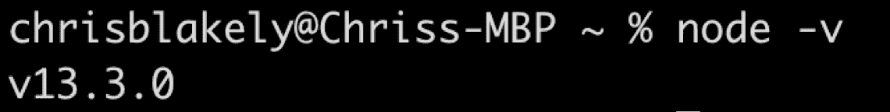
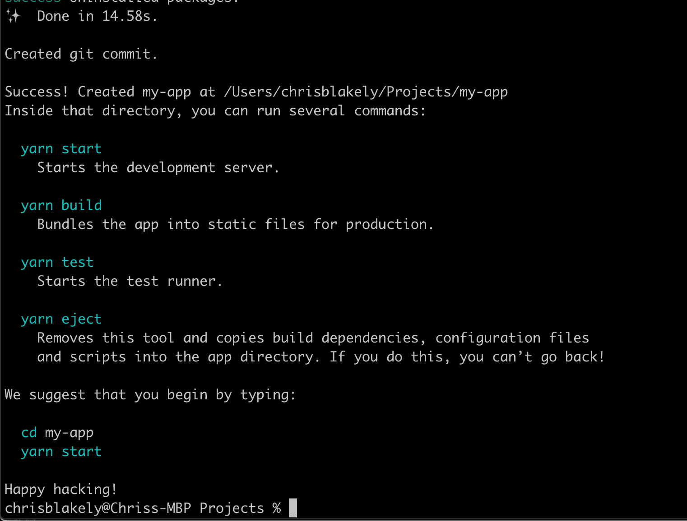
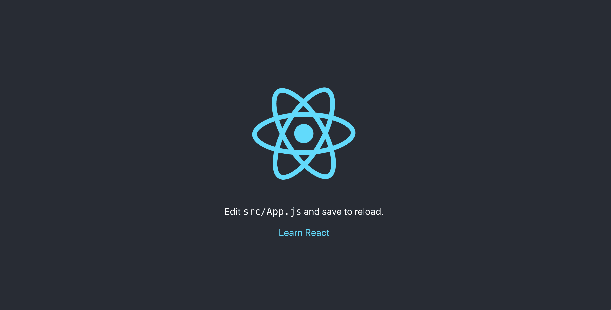
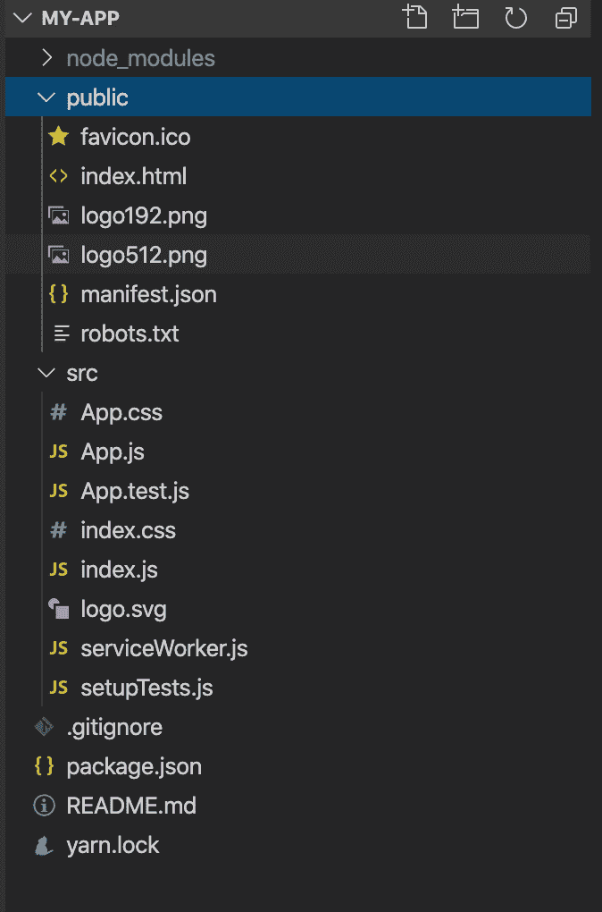
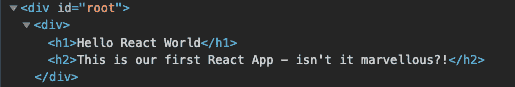
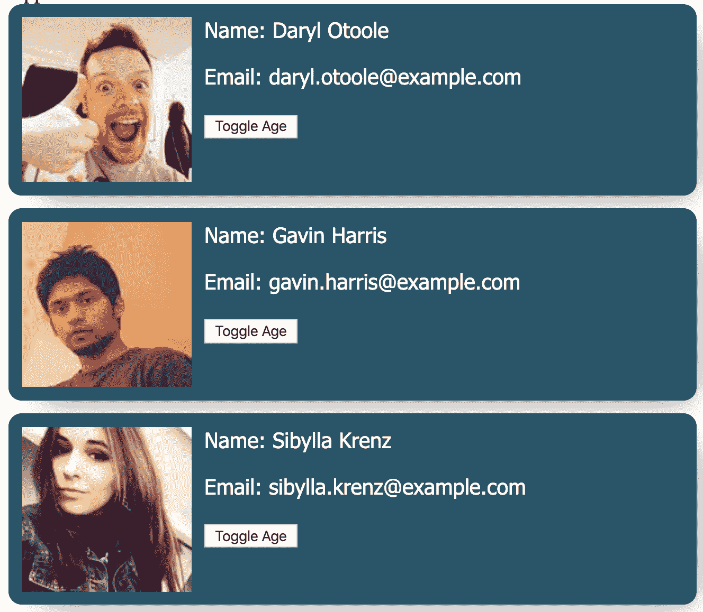
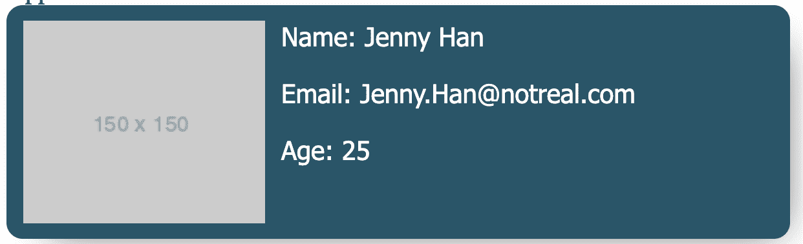
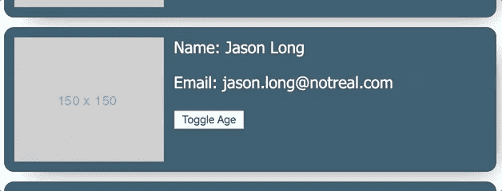
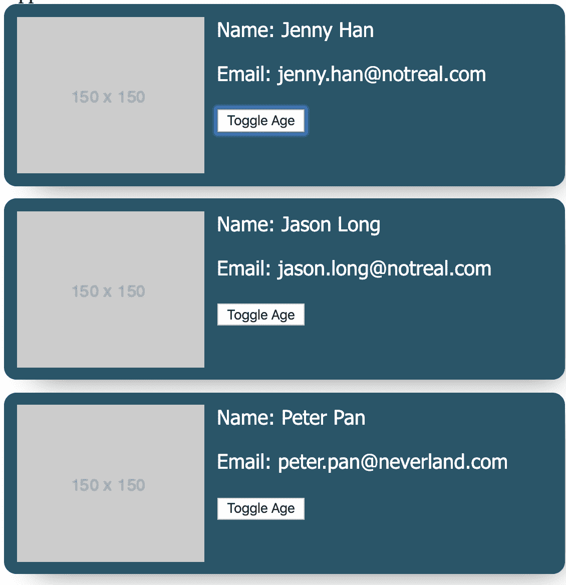
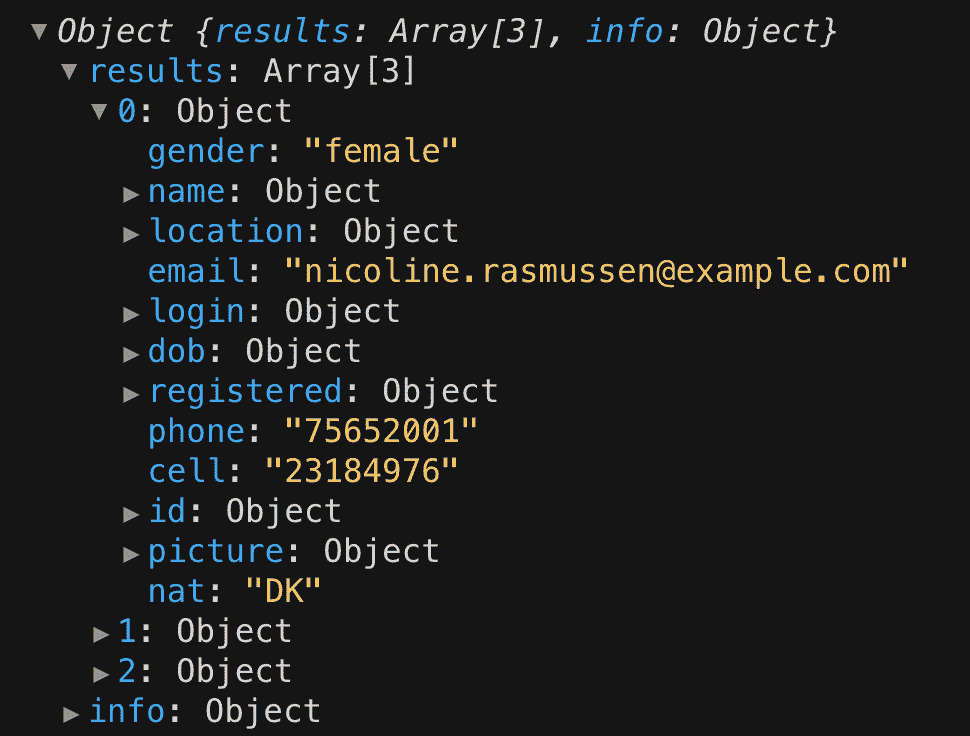

# React 入门——面向初学者的基于项目的现代指南(包括 Hooks)

> 原文：<https://www.freecodecamp.org/news/getting-started-with-react-a-modern-project-based-guide-for-beginners-including-hooks-2/>

所以你想开始学习反应，嗯？那你来对地方了。本指南将带您了解开始使用 React 时需要了解的一切。

我们将进行设置，解释基本概念背后的“方法和原因”,并构建一个从 API 提取数据的小项目，这样我们就可以看到所有正在进行的事情。

这将是一个很长的问题，所以使用下面的“跳转到章节”链接，根据需要跳过/重读章节。解决了这个问题，喝一杯，系好安全带，让我们开始吧。

#### 更喜欢视频教程？

你可以在这里查看这篇文章的 YouTube 教程。

## 跳转到章节

*   [先决条件](#prerequisites)
    *   [基础 JavaScript](#basicjavascript)
    *   [基本 HTML](#basichtml)
*   [开发环境](#developmentenvironment)
    *   [Node.js](#nodejs)
    *   [VS 代码](#visualstudiocode)
*   [创建 React 应用](#creatingareactapp)
*   [探索创建 React 应用](#exploringcreatereactapp)
    *   [节点模块](#nodemodules)
    *   [公共文件夹](#publicfolder)
    *   [Index.html](#indexhtml)
*   [我们的第一个组件](#ourfirstcomponent)
*   [JSX](#jsx)
    *   [让事情充满活力](#makingthingsdynamic)
    *   [处理事件](#handlingevents)
    *   [调用函数](#callingfunctions)
*   [组件如何渲染](#howacomponentgetsrendered)
*   让我们建立一个联系人列表！
    *   [获取样式](#getthestyles)
    *   [创建联系人卡片](#creatingthecontactcard)
    *   [让我们的联系卡可重复使用](#makingourcontact-card-reusable)
    *   [我们来谈谈状态](#letstalkaboutstatetheusestatehook)
    *   [更新状态](#updatingstate)
    *   [介绍道具](#introducingprops)
    *   [在组件内使用道具](#usingpropswithinacomponent)
    *   [呈现列表中的组件](#renderingcomponentsfromalist)
    *   [从一个 API 中提取数据](#pullingdatafromanapi)
    *   [介绍使用效果](#introducinguseeffect)
*   [结论](#conclusion)

## 先决条件

在阅读本指南之前，您不需要了解任何反应。但是，如果您想从 React 指南中获得最大收益，您需要熟悉一些东西:

### 基本 JavaScript

React 是一个 JavaScript 库，所以在学习 React 之前先了解 JavaScript 是有意义的吧？不要担心，您不需要对 JavaScript 了如指掌——您只需要知道一些基础知识:

*   变量、函数、数据类型
*   数组和对象
*   ES6 语法(使用 let & const、箭头函数、析构赋值、类、导入/导出等)
*   如何使用 JavaScript 来操作 DOM

### 基本 HTML

在 React 中，我们使用所谓的 **JSX** 为我们的网页创建 HTML。我们稍后将深入解释 JSX，但现在要确保你对 HTML 有一个良好的基础:

*   如何构造 HTML(如何嵌套元素等等)
*   HTML 属性(比如“id”、“class”、“onclick”等等)

> [需要一些 JavaScript 复习？订阅我的新书《React-Ready JavaScript 》,它将帮助你在开始使用 React 之前掌握你需要的 JavaScript。](https://subscribe.jschris.com)

## 发展环境

我们要做的第一件事是建立一个开发环境。如果你已经设置了 **Node.js** 并安装了 **Visual Studio 代码**(或者你喜欢的 IDE)，你可以继续跳到下一节。

### 节点. js

[到这里下载](https://nodejs.org/en/download/)适合您的操作系统(Mac/windows 等)的软件包

安装完成后，打开终端并键入以下命令:

```
node -v 
```

这应该显示您刚刚安装的节点版本的输出:



这意味着`node`命令起作用了，节点已经成功安装——万岁！如果您看到任何错误，请尝试从您下载的包中重新安装 Node，然后重试该命令。

### Visual Studio 代码

Visual Studio 代码是一种流行的开源 IDE，非常适合前端开发。你可以试试其他的——看看你最喜欢的是什么，如果你喜欢的话，可以下载下来。现在，我们将使用 VS 代码运行。

[点击此处，下载](https://code.visualstudio.com/download)适合您平台的版本:

按照安装步骤，你应该准备好了。继续运行 Visual Studio 代码。

这是目前足够的开发设置。你还可以安装其他好的东西(相对于代码扩展等),但是我们现在不需要这些——我们是来学习 React 的！

## 创建 React 应用程序

下一步是创建一个 React 项目。幸运的是，脸书的优秀人才让这一切变得非常简单。我们所要做的就是在我们的终端中运行一个命令:

```
npx create-react-app my-app 
```

这为我们创建了一个名为“我的应用程序”的项目，并自动设置一切。相当酷。

继续，在您想要创建应用程序的目录中打开一个终端，例如“项目”文件夹，然后运行命令。让终端完成它的工作，过一会儿，它将完成并向您显示一些命令:



注意, **create-react-app** 输出告诉我们需要做什么来启动应用程序。继续在您的终端中运行命令:

```
cd my-app
yarn start 
```

这将启动一个开发服务器，并为您打开一个 web 浏览器:



您刚刚设置了您的第一个 React 应用程序！如果你想了解更多正在发生的事情，(查看“创建-反应-应用”GitHub:)[[https://github.com/facebook/create-react-app](https://github.com/facebook/create-react-app)]

## 探索创建 React 应用程序

打开 Visual Studio 代码(或你安装的任何 IDE)并选择**文件>打开…** 并选择刚刚使用*创建-反应-应用*为我们创建的 **my-app** 文件夹。这将在 IDE 中打开我们闪亮的新 react 应用程序，因此我们可以编写一些代码！

您应该会在右侧看到项目结构:



看看那些东西！不要太担心它，它主要是样板代码和配置，我们不会在本教程中接触太多——唷！然而，既然你是一个好奇的开发者，让我们看看**项目树**，看看我们有什么:

### 节点模块

这是我们通过 NPM(节点包管理器)安装的包的位置。如果你不熟悉 NPM，这是一个很棒的地方，我们可以共享代码(通常是开源的)，其他开发人员可以使用，而不是编写他们自己的代码。

我们不像在传统 HTML 中那样使用**脚本标签**，而是将这些模块作为应用程序的一部分安装。然后，我们使用一个**导入语句**从该模块中访问代码。稍后我们将看到这一点。

### 公共文件夹

这就是我们的捆绑代码的位置。当我们准备好部署我们的应用时，我们运行**构建脚本* *，最终文件放在这里。这通常是我们的 HTML、JavaScript 和 CSS 文件。这是我们转储到某个 web 服务器上的文件夹，这样我们就可以让用户通过 URL 看到我们的应用程序

### Index.html

**index.html**是入口点，或者当用户导航到托管我们应用的 URL 时，网络浏览器加载的第一个东西。

如果我们看一下这个文件，它只是一个普通的 HTML 文件，包含了你希望熟悉的普通 HTML 内容。如果我们观察身体，它是空的。React 会动态地将我们的 React 代码转换成 HTML，并加载到“root”div 中。

说完这些，让我们看看有趣的部分——代码。

## 我们的第一个组件

从项目树中打开 **App.js** 。这是我们应用程序中的主要组件。这是第一个要渲染的组件。它是组件的“大奶酪”。

在我们的大奶酪组件中，我们要做的第一件事是删除所有内容，从头开始构建我们自己的组件，以便更好地了解正在发生的事情。

现在我们有了一个很好的白板，我们将从导入 **react** 开始。这将 React 库带入了*范围*，并让我们可以访问所有可爱的特性:

```
import React from "react"; 
```

接下来我们将声明一个函数。这里我们将使用 ES6 箭头函数。这或多或少就是“组件”的含义——带有一些逻辑和标记的功能。我们还将导出该函数，以便在其他地方使用:

```
const App = () => {

}

export default App; 
```

在我们的函数中，我们想写`return()`。这是 get 的*从这个组件返回的*，包含我们的标记，它被转换并呈现为 HTML。

最后，让我们添加一个带有`<h1>`标题标签的`<div>`。我们完成的组件看起来像这样:

```
import React from "react";

const App = () => {
  return (
    <div>
       <h1>Hello React World</h1>
       <h2>
             This is our first React App - isn't it marvellous?!
       </h2>
    </div>
  );
}

export default App; 
```

现在你可能在想，“哇！函数中的 HTML？这是什么疯狂？”尽管它看起来像 HTML，但它实际上是一种叫做 **JSX (JavaScript XML)** 的东西。这基本上允许我们将 JavaScript 和 HTML 混合在一起。

这可能有点奇怪。我们最初通过分离 HTML 和 JavaScript(甚至 CSS)来学习前端开发。然而，JavaScript 和我们设计应用程序的方式已经发生了变化，将所有的东西都放在同一个“组件”中可以更容易地维护和重用我们的代码。

让我们来看看实际情况。打开您的终端并运行

```
npm start 
```

这应该会打开浏览器，您应该会看到应用程序正在运行。

恭喜你。您刚刚创建了您的第一个组件！

## JSX

当你思考 JSX 的事情时，你可能会有一些疑问浮在你的头上。让我们更深入地了解一下这个问题。

```
 return (
    <div>
      <h1>Hello React World</h1>
      <h2>
          This is our first React App - isn't it marvellous?!
      </h2>
    </div>
  ); 
```

这看起来像 HTML，但不是。这是 **JSX** ！尽管它看起来像普通的 HTML，但在幕后发生的是 React 是**使用以下语法创建元素树**:

```
React.createElement(component, props, ...children) 
```

*   组件:您希望创建的 **HTML 元素**，即`h1`、`div`等
*   props:您希望传递给该组件的任何东西(我们稍后将讨论 props)
*   children:嵌套在该元素中的 HTML 元素的**数组**

因此，我们刚刚创建的相同组件可以写成这样:

```
const App = () => {
  return (
    React.createElement(
      "div",
      null,
      React.createElement("h1", null, "Hello React World"),
      React.createElement(
        "h2",
        null,
        "This is our first React App - isn't it marvellous?!"
      )
    )
  );
} 
```

这看起来有点恶心(试图把它打出来更恶心)。如果仔细查看，可以看到我们正在创建一个没有任何属性的`div`元素(通过将`null`作为第二个参数传递来表示)。最后，我们使用`createElement`语法创建了另外两个元素——我们的`H1`和`H2`元素。

如果你玩 JavaScript 已经有一段时间了，你可能已经注意到这和`document.createElement`很相似。的确如此。这毕竟是一个 JavaScript 库！

这就是 JSX 在 React 中的优势——它让我们可以编写类似 HTML 的语法，而不用那些杂乱的`React.createElement()`东西。

在现实世界中，React 开发人员几乎只使用 JSX 来编写他们的代码。不，这一部分不是浪费时间—了解幕后发生的事情总是好的。知识就是力量(还有我收件箱里的问题少)！

### 让事情充满活力

所以我们看到了 JSX，克服了我们对它的恐惧(希望如此)。但是这有什么意义呢？当我们可以使用 HTML 时，为什么要使用 JSX 呢？他们看起来一样吗？对吗？

好问题我的朋友！如果我们记得 JSX 代表的是什么——JavaScript XML。这意味着我们可以使用 JavaScript 让事情变得动态。我们前面的例子看起来是这样的:

```
const App = () => {
  return (
    <div>
      <h1>Hello React World</h1>
      <h2>This is our first React App - isn't it marvellous?!</h2>
    </div>
  );
} 
```

现在，假设我们想让我们的文本更加动态。首先，让我们添加一个变量来保存我们的消息:

`cont message = "This is my first variable rendered in JSX!"`

现在，为了添加 JavaScript，我们使用**花括号**:

```
const App = () => {
  const message = "This is my first variable rendered in JSX!";

  return (
    <div>
      <h1>Hello React World</h1>
      <h2>{message}</h2>
    </div>
  );
} 
```

如果在浏览器中运行，您会注意到消息变量的文本出现了。继续将消息变量文本更改为其他内容，看看会发生什么神奇的事情。

我们用**花括号**告诉编译器“ ***执行这段代码为 JavaScript*** ”。如果我们没有花括号， **message** 变量就不会作为 JavaScript 执行，相反，文本“message”会出现在屏幕上。试试这个看看！

### 处理事件

处理事件时也可以采用同样的方法。当使用 JSX 时，React 让我们可以访问**事件监听器**你可能已经熟悉了: **onClick** 、 **onPress** 、 **onSubmit** 等等。

假设我们想在消息被点击时显示一个警告。首先，我们将 **onClick** 属性添加到我们的 **h2** 标签中。

属性接受一个函数(换句话说，我们传递一个函数作为参数。这个函数将像这样调用警报:

```
const App = () => {
  const message = "This is my first variable rendered in JSX!";  

  return (
    <div>
      <h1>Hello React World</h1>
      <h2 onClick={()=> alert("you clicked the message!")}>{message}</h2>
    </div>
  );
} 
```

注意我们在这里如何使用一个**箭头**函数来创建一个漂亮、简洁的内联函数。如果你不熟悉这种语法，一定要去[看看我的书，我会在这里讲述这一点和更多内容](https://subscribe.jschris.com)。

同样，请注意我们是如何将这段代码放在**花括号**中的，以确保函数作为 JavaScript 执行。

### 调用函数

所以我们在上一个例子中看到了内联函数。由于 JSX 是 JavaScript，我们可以在返回块之外创建和引用函数**。我们的最后一个例子可能是这样的:**

```
const App = () => {
  const message = "This is my first variable rendered in JSX!";  

  const handleClick = () =>{
	alert("you clicked the message!");
  }

  return (
    <div>
      <h1>Hello React World</h1>
      <h2 onClick={handleClick}>{message}</h2>
    </div>
  );
} 
```

注意我们是如何创建一个名为 **handleClick** 的函数来提醒消息的。我们没有使用内嵌函数，而是在我们的 **onClick** 属性中引用了这个函数。试试这个，看看会发生什么。

这些只是我们如何使用 JavaScript 来使事情变得动态的一些例子，希望能向你展示 JSX 的力量。当我们构建一个示例时，我们将加深我们的理解，所以如果有些事情还没有意义，请不要担心！

## 组件是如何呈现的

希望我已经澄清了你对 JSX 的一些疑问。下一件你可能想知道的事情是——组件是如何渲染的？在哪里？什么时候？

让我们从头开始。如果你回头看看我们的文件结构，我们有一个 **index.js** 文件。这是运行的第一个文件(我们通常称之为“入口点”)。这通常是约定俗成的——如果您愿意，可以更改入口点，但是现在我们不去管它。

如果我们深入研究该文件，您会注意到我们有这样一行:

```
ReactDOM.render(<App />, document.getElementById("root")); 
```

注意我们有了`document.getElementById(“root”)`——终于有了一些看起来正常的 JavaScript！这使用普通的 ol' JavaScript 从 DOM 中获取了**根**元素，并在其中呈现我们的应用程序组件。我们的应用程序组件是这样导入的:

```
import App from "./App" 
```

还记得我们*在 app.js 中导出了*我们的 App 组件。这让其他文件/组件可以导入并使用我们的 App 组件。

那么**根**元素从何而来呢？嗯，还记得我们在公共文件夹里的【index.html】的*文件吗？这个 index.html 文件是网站加载时加载的第一个 HTML 文件*

其中有一个 ID 为`root`的`div`，它是空的。这是 React 装载组件的地方。让我们在开发工具中看看这一点。

打开 Chrome(或任何你使用的浏览器)并检查开发工具。你会在树的某个地方看到一个 id="root" 的 **div，以及从我们的应用组件**呈现的 **HTML。相当酷！**



## 快速小结

在继续之前，让我们快速总结一下到目前为止我们所学到的内容:

*   我们有一个*index.html*文件，这是我们 web 应用程序的框架
*   当应用程序启动时，*index.html*加载并导入我们的应用程序组件
*   应用组件中的 JSX 被转换成 HTML，然后在根 div 的**index.html 文件中呈现**

## 让我们建立一个联系人列表！

现在我们已经熟悉了 React，并且对事物如何组合有了更好的理解，让我们使用目前所学的知识来构建一个示例应用程序。我们还将了解一些常见的 React 特性，这些特性将帮助您顺利地开始使用 React。我们走吧！

我们的联系人列表将显示一系列联系人，包括他们的姓名、电子邮件、年龄和头像(或个人资料图片)。我们将逐步构建，最终从 API 中提取数据。多刺激啊！



## 获取样式

由于这是一个 React 教程，我们将把重点放在 React 的内部工作上，而不是担心如何创建漂亮的样式。在您的源文件夹中，创建一个新文件`styles.css`，并粘贴以下代码:

```
.contact-card {
  display: flex;
  padding: 10px;
  color: #ffffff;
  background-color: rgb(42, 84, 104);
  font-family: "Segoe UI", Tahoma, Geneva, Verdana, sans-serif;
  box-shadow: 10px 10px 25px -16px rgba(0, 0, 0, 0.75);
  border-radius: 10px;
  max-width: 500px;
  max-height: 125px;
  margin-bottom: 10px;
}

.contact-card p {
  margin-left: 10px;
  margin-top: 0;
}

button {
  margin-left: 10px;
  margin-bottom: 10px;
} 
```

接下来，进入 **App.js** 并导入样式表，如下所示:

```
import "./styles.css"; 
```

## 创建联系人卡片

当我们还在 **App.js** 的时候，让我们添加基本的 JSX，让我们的联系人卡片布局就位。删除**返回**语句中的所有内容，并添加以下内容:

```
<div className="contact-card">
	
	<div className="user-details">
		<p>Name: Jenny Han</p>
		<p>Email: Jenny.Han@notreal.com</p>
		<p>Age: 25</p>
	</div>
</div> 
```

我们在这里所做的就是创建一个 **div** 来“包装”联系人卡片的详细信息，添加一个图像(该图像将暂时使用从 web 上获取的占位符)，并添加几个 **p** 标签来保存我们在联系人卡片中需要的详细信息。最后，我们添加了一些取自`styles.css`的 **CSS 类**；

> 注意:为了引用 CSS 类，我们需要使用 **className** 关键字。这是因为我们正在编写 JSX，而“类”是 JavaScript 中的保留字。

以下是我们目前在 **App.js** 文件中的内容:

```
import React from "react";
import "./styles.css";

const App = () => {
  return (
    <div className="contact-card">
      
      <div className="user-details">
        <p>Name: Jenny Han</p>
        <p>Email: Jenny.Han@notreal.com</p>
        <p>Age: 25</p>
      </div>
    </div>
  );
} 
```

如果您在浏览器中运行此程序，您应该会看到类似如下的内容:



## 使我们的联系卡可重复使用

好了，我们有联系卡了！然而，它不是非常可重用的。我们知道，如果我们想要渲染多张卡，我们将需要**重用这个代码**，所以将这个**分解成它自己的组件**是有意义的

> 注意——为了更容易理解，我将把我们制作的所有组件放到 **App.js** 中。在现实世界中，最好将这些不同的组件拆分到它们自己的文件中，并在适当的地方导入/导出它们。

就在 **App** 函数下面，新建一个名为 **ContactCard** 的函数，将 **App** 的 JSX 复制到 **ContactCard** 中，如下所示:

```
const ContactCard = () => {
  return (
    <div className="contact-card">
      
      <div className="user-details">
        <p>Name: Jenny Han</p>
        <p>Email: Jenny.Han@notreal.com</p>
        <p>Age: 25</p>
      </div>
    </div>
  );
}; 
```

同样，React 中的组件只是一个返回一些 JSX 的函数。现在我们已经将 JSX 移动到了**联系人卡片**中，我们可以在主**应用组件**中使用这个组件:

```
const App = () => {
  return (
    <>
      <ContactCard />
    </>
  );
} 
```

我们使用自己的组件，就像任何旧的 HTML/JSX 标签一样。我们只是将组件的**名放在尖括号中。**我们的 **App.js** 文件应该是这样的:

```
// App.js
import React from "react";
import "./styles.css";

const App = () => {
  return (
    <>
      <ContactCard />
    </>
  );
};

const ContactCard = () => {
  return (
    <div className="contact-card">
      
      <div className="user-details">
        <p>Name: Jenny Han</p>
        <p>Email: Jenny.Han@notreal.com</p>
        <p>Age: 25</p>
      </div>
    </div>
  );
}; 
```

现在，如果您在浏览器中运行它，事情看起来会和以前一样——这正是我们想要的。我们现在有了一个 **ContactCard** 组件，我们可以随心所欲地多次使用它:

```
const App = () => {
  return (
    <>
      <ContactCard />
      <ContactCard />
      <ContactCard />
    </>
  );
}; 
```

更新 **App** 组件，以包括另外 2 个 **ContactCard** 组件。上面的例子将在浏览器中呈现 3 张名片。去看看吧！

> 把这个想象成页面上的“邮票”。我们添加的每个 **ContactCard** 组件都是另一个“图章”,并在页面上呈现相同的标记

## 让我们来谈谈状态——使用状态挂钩

如果你已经开始使用 React，你可能听说过术语**状态**。状态在反应中是相当重要的。那是什么呢？

> 状态基本上是一个对象，它代表了应用程序中可以改变的部分，UI 对其做出“反应”。状态可以是任何东西；对象、布尔值、数组、字符串或整数

我们举个例子。

出现在我们联系人列表中的一些人很害羞，不希望在点击按钮之前显示他们的年龄。我们可以通过使用组件中的 **useState 钩子来存储**状态中是否应该显示**年龄。看起来像这样:**

```
const [showAge, setShowAge] = useState(false); 
```

“这到底是怎么回事？”让我解释一下。

**useState 对象**给了我们一个带有**当前值**的变量，以及一个函数**让我们改变那个值**。当我们调用 **useState** 时，我们可以定义一个**初始**值(在本例中， **false** )。

我们使用**使用状态钩子**上的**析构赋值**来获得这些。你现在不必担心赋值的析构，只要记住第一个变量让我们访问状态值，第二个变量让我们改变它。

继续将上述代码片段添加到 **ContactCard** 组件中，如下所示:

```
const ContactCard = () => {
  const [showAge, setShowAge] = useState(false);

  return (
    <div className="contact-card">
      
      <div className="user-details">
        <p>Name: Jenny Han</p>
        <p>Email: Jenny.Han@notreal.com</p>
        <p>Age: 25</p>
      </div>
    </div>
  );
}; 
```

现在我们有了一个状态对象，我们如何使用它呢？嗯，我们可以像引用任何其他变量一样引用`showAge`变量。在这种情况下，如果变量`showAge`是`true`，我们只想显示年龄。

我们可以使用*三元运算符*来做到这一点:

```
{showAge === true ? <p>Age: 25</p> : null} 
```

这个例子读为*如果 showAge 变量为真，渲染年龄，否则不渲染*。

继续将它添加到 **ContactCard** 组件中，就像这样:

```
const ContactCard = () => {
  const [showAge, setShowAge] = useState(false);

  return (
    <div className="contact-card">
      
      <div className="user-details">
        <p>Name: Jenny Han</p>
        <p>Email: Jenny.Han@notreal.com</p>
        {showAge === true ? <p>Age: 25</p> : null}
      </div>
    </div>
  );
}; 
```

现在，如果你在浏览器中运行应用程序，你会看到**年龄**消失了——这是因为我们的`showAge`变量已经用`false`初始化了。如果我们用`true`初始化我们的`showAge`变量:

```
const [showAge, setShowAge] = useState(true); 
```

年龄会出现在联系卡上。不错！虽然，这不是很好——我们不想在任何时候当我们想在联系卡上显示年龄的时候改变代码！

在我们看如何动态改变我们的`showAge`变量之前，让我们整理一下代码。继续替换这一行:

```
{showAge === true ? <p>Age: 25</p> : null} 
```

使用:

```
{showAge && <p>Age: 25</p> } 
```

这给出了相同的结果，只是以更简洁的方式。

> 提示:在有意义的地方缩短代码，不要觉得你必须缩短你写的每一行代码！可读性应该放在第一位。

## 更新状态

好的，回到更新状态。如果我们回想一下，`useState()`钩子给了我们一个**函数来更新状态**。让我们把它连接到一个按钮上，当点击这个按钮时，就会切换显示联系人卡片上的年龄。

我们可以通过以下方式做到这一点:

```
<button onClick={() => setShowAge(!showAge)}>
	Toggle Age 
</button> 
```

它所做的是调用 **setShowAge 函数**(从 useState 钩子中获得)来改变 ShowAge 的**值，使其与当前的**相反。

> 注意:我在这里使用了**箭头函数**语法来传递一个函数给`onClick`属性。如果你不熟悉我们这一点，快速提醒一下，你可以得到我的[在这里我讨论了 JavaScript 的重要知识]。

当状态更新时，React 将**重新渲染组件**，由于`showAge`的值为真，将显示年龄。

如果用户再次点击按钮，这将把`showAge`设置为`false`，React 将重新呈现组件，并且年龄将被隐藏:



看看我们的花式切换动作！

> 提示:每当组件状态改变时，React 将使用新状态重新渲染组件

注意即使我们有 3 个**联系人卡片**组件被渲染，当我们点击按钮时，年龄只显示给**其中一张**卡片，而不是所有的卡片。这是因为**状态属于个体成分**。换句话说，每个呈现的 **ContactCard** 组件都是一个**副本**，并且有自己的状态/数据。

## 介绍道具

所以现在我们有了一个可爱的新的 **ContactCard** 组件，我们可以重复使用几次。虽然它不是真正可重用的，因为我们的每个组件的名称，电子邮件，年龄和头像都是一样的。哦亲爱的！我们可以用所谓的**道具**让这些数据更加动态。

因为您刚刚开始使用 React，所以您可以将 **Props** 视为传递给组件的数据，然后组件可以使用这些数据。例如，我们可以将我们的**头像**、**邮箱**、**姓名**和**年龄**作为道具传递给我们的**联系人卡片**组件，如下所示:

```
<ContactCard
  avatar="https://via.placeholder.com/150"
  name="Jenny Han"
  email="jenny.han@notreal.com"
  age={25}
/> 
```

正如你所看到的，我们通过给它一个名字来定义一个道具。例如*命名*并使用**等于**来给道具赋值，例如**珍妮汉**。

我们想要多少道具就有多少道具，我们可以给这些道具起任何名字，所以它们非常灵活。

Props 可以保存不同类型的数据，例如字符串、数字、布尔值、对象、数组等等。

> 注意:必须使用带引号的文本(如 name="Jenny Han ")或在大括号内(如`age={25}`)定义道具。如果我们把除了字符串之外的任何东西的括号都去掉，事情就开始变坏了。

继续用以下内容替换我们的 **App** 组件中当前的 **ContactCard** 组件:

```
<ContactCard
  avatar="https://via.placeholder.com/150"
  name="Jenny Han"
  email="jenny.han@notreal.com"
  age={25}
/>

<ContactCard
  avatar="https://via.placeholder.com/150"
  name="Jason Long"
  email="jason.long@notreal.com"
  age={45}
/>

<ContactCard
  avatar="https://via.placeholder.com/150"
  name="Peter Pan"
  email="peter.pan@neverland.com"
  age={100}
/> 
```

我们在这里所做的就是将组件需要的数据作为道具传递给每个组件。注意每个组件的数据是如何不同的。

## 在组件中使用道具

我们已经向 **ContactCard** 组件发送了一堆道具，所以让我们告诉** ContactCard**如何使用它们。

到目前为止，我们的** ContactCard**函数不接受任何*参数*。React 是一个神奇的东西，它会自动将我们所有的道具放入一个可爱的**道具对象**，该对象会被传递到组件:

```
const ContactCard = props => {
	//...other code
}; 
```

请注意 **props** 变量。这是一个包含我们之前定义的道具的对象。我们可以通过像这样使用*点符号*来*访问我们定义的道具*:

```
const ContactCard = props => {
	console.log(props.avatar); 
	console.log(props.name);
	console.log(props.email);
	console.log(props.age);

	//...other code
}; 
```

最后，我们希望用从 props 接收的值替换 JSX 中的硬编码值:

```
return (
  <div className="contact-card">
    
    <div className="user-details">
      <p>Name: {props.name}</p>
      <p>Email: {props.email}</p>
      <button onClick={() => setShowAge(!showAge)}>Toggle Age </button>
      {showAge && <p>Age: {props.age}</p>}
    </div>
  </div>
); 
```

注意我们是如何使用从 props 收到的任何值来设置**图像源**的。我们对**的名字**、**的电子邮件**和**的年龄**做了类似的处理。还要注意我们是如何将这段代码放在**花括号**中的，所以它是作为 JavaScript 执行的。

我们最终的 **App.js** 文件如下所示:

```
// App.js
const App = () => {
  return (
    <>
      <ContactCard
        avatar="https://via.placeholder.com/150"
        name="Jenny Han"
        email="jenny.han@notreal.com"
        age={25}
      />
      <ContactCard
        avatar="https://via.placeholder.com/150"
        name="Jason Long"
        email="jason.long@notreal.com"
        age={45}
      />
      <ContactCard
        avatar="https://via.placeholder.com/150"
        name="Peter Pan"
        email="peter.pan@neverland.com"
        age={100}
      />
    </>
  );
};

const ContactCard = props => {
  const [showAge, setShowAge] = useState(false);

  return (
    <div className="contact-card">
      
      <div className="user-details">
        <p>Name: {props.name}</p>
        <p>Email: {props.email}</p>
        <button onClick={() => setShowAge(!showAge)}>
			Toggle Age 
		</button>
        {showAge && <p>Age: {props.age}</p>}
      </div>
    </div>
  );
}; 
```

如果您在浏览器中运行此程序，您应该会看到类似如下的内容:



万岁！我们的组件和以前一样工作，但是它现在更动态了。我们可以重用同一个 **ContactCard** ，但是传入不同的数据——同时保持布局、样式和状态对象不变。

## 呈现列表中的组件

我们的联系人列表进行得很好，我们有一些精心制作的，可重复使用的代码，所以是时候不去管它了，对吗？不对！让我们更进一步。

在实际应用中，数据通常以数据数组的形式出现，例如在 API 调用之后。让我们假设我们进行了一个 API 调用来从数据库中检索一些用户，并收到了以下数据:

```
const contacts = [
    { name: "Jenny Han", email: "jenny.han@notreal.com", age: 25 },
    { name: "Jason Long", email: "jason.long@notreal.com", age: 45 },
    { name: "Peter Pan", email: "peter.pan@neverland.com", age: 100 }
]; 
```

将此粘贴到函数顶部的 **App()** 组件中。你们当中有眼力的人会注意到这些数据与我们已有的数据是多么相似。但是我们如何将这些数据转化为**联系卡**组件呢？好吧，还记得你花了那么多时间学习如何使用**循环访问一个数组吗？map()** ？现在是我们付诸行动的时候了！

为了显示组件列表，我们:

1.  使用**对数组进行循环。map()**
2.  对于数组中的每一项，创建一个新的 **ContactCard 组件**
3.  将数组中每个对象的数据作为道具传递给 **ContactCard 组件**

让我们看看这是如何工作的。在我们的 app **App()** 组件中，将 **return** 语句替换为:

```
return (
  <>
    {contacts.map(contact => (
      <ContactCard
        avatar="https://via.placeholder.com/150"
        name={contact.name}
        email={contact.email}
        age={contact.age}
      />
    ))}
  </>
); 
```

如您所见，我们**映射到数组**上。对于数组中的每个对象，我们想要创建一个新的 **ContactCard** 组件。对于道具，我们想从**当前对象中获取**姓名**、**邮箱**、**年龄**地图功能在**上。换句话说，从**接触**变量。

> 注意:我已经离开了“化身”道具，因为这是现在相同的——它将在本教程稍后更改

就是这样！我们的 **App.js** 文件如下所示:

```
//App.js
const App = () => {
  const contacts = [
    { name: "Jenny Han", email: "jenny.han@notreal.com", age: 25 },
    { name: "Jason Long", email: "jason.long@notreal.com", age: 45 },
    { name: "Peter Pan", email: "peter.pan@neverland.com", age: 100 },
    { name: "Amy McDonald", email: "amy@email.com", age: 33 }
  ];

  return (
    <>
      {contacts.map(contact => (
        <ContactCard
          avatar="https://via.placeholder.com/150"
          name={contact.name}
          email={contact.email}
          age={contact.age}
        />
      ))}
    </>
  );
}; 
```

在浏览器中运行这个程序，结果应该是一样的。我们没有改变我们的**联系卡**，只是改变了我们从哪里获得数据。最酷的是，如果你在 **contacts** 数组中添加另一行，额外的组件将自动呈现——你不需要做任何其他事情！你自己试试看。

## 从 API 中提取数据

我们现在有了一个好看的 React 应用程序。它是动态的，一切都运转良好。这是一个好地方，因为我们刚刚开始使用 React！但是我们需要整理一下。在实际应用中，**数据将从 API** 中提取。

在教程的下一部分，我们将从一个真实的 API:[https://randomuser.me/](https://randomuser.me/)获得真实的联系(当我说真实的联系时，我指的是虚假的联系——你知道我的意思)。请随意浏览网站并查看我们将得到的回复——这是我们获取数据以填充组件的地方。

首先，让我们创建一个**状态变量**来保存我们从 API 返回的数据。请记住，状态是好的，因为它可以改变。我们的联系人列表肯定可以更改！

在 **App.js** 中，删除**触点**数组添加以下内容:

```
const [contacts, setContacts] = useState([]); 
```

这里，我们要做的是创建一个状态对象，并将其初始化为一个空数组。当我们进行 API 调用时，我们将更新状态以包含联系人列表。由于我们将这个状态对象命名为 **contacts** ，我们在 JSX 中的渲染逻辑将寻找这个数组(与我们刚刚删除的旧的 **contacts** 数组相反)。

接下来，让我们从 API 中获取数据。我们将使用标准的**获取 API** 。现在，我们将把数据记录到控制台。在我们刚刚创建的状态对象下添加以下内容:

```
fetch("https://randomuser.me/api/?results=3")
  .then(response => response.json())
  .then(data => {
    console.log(data);
  }); 
```

我们在这里做的是:

*   向 **randomuser** API 发出 GET 请求，请求**三个**结果
*   将响应转换成 **JSON**
*   将 **JSON** 记录到控制台。

如果您在浏览器中运行这个，您会注意到 **ContactCard** 组件不再呈现——这很好，我们还没有保存任何新数据到 state，并且我们的 state 变量当前是空的。如果您查看控制台(在您的浏览器开发工具中),您会注意到记录了响应对象。大概是这样的:



您将看到我们有一个**结果**数组，其中有 3 个对象。这些对象中的每一个都包含一个用户的详细信息(在我们的例子中是一个“联系人”)。这类似于我们在上一节中手工创建的**联系人**数组——只是一个充满对象的数组。

让我们更新我们的**应用**组件 JSX，从这个对象中选择数据。更新 JSX 喜欢这样:

```
return (
  <>
    {contacts.map(contact => (
      <ContactCard
        avatar={contact.picture.large}
        name={contact.name.first + " " + contact.name.last}
        email={contact.email}
        age={contact.dob.age}
      />
    ))}
  </>
); 
```

这与我们之前的工作类似:

*   我们正在循环访问 **contacts** 变量(目前它是一个空数组)
*   当我们最终保存对 state 的响应时(下一步),我们查看数组中的每个对象，寻找我们需要的适当的东西:在本例中是**图片、姓名、电子邮件和 dob** 对象。

接下来，我们希望将**结果**数组存储在 state 中，这样我们的 JSX 就可以循环遍历它(使用我们之前看到的 **map()** 函数)并呈现一些可爱的**联系人卡片**。在我们的 **fetch** 函数中，添加对**set contacts(data . results)**的调用，如下所示:

```
fetch("https://randomuser.me/api/?results=3")
  .then(response => response.json())
  .then(data => {
    console.log(data);
    setContacts(data.results);
  }); 
```

我们的**应用**组件现在看起来像这样:

```
//App.js
const App = () => {
  const [contacts, setContacts] = useState([]);

fetch("https://randomuser.me/api/?results=3")
  .then(response => response.json())
  .then(data => {
    console.log(data);
    setContacts(data.results);
  });

  return (
    <>
      {contacts.map(contact => (
        <ContactCard
          avatar={contact.picture.large}
          name={contact.name.first + " " + contact.name.last}
          email={contact.email}
          age={contact.dob.age}
        />
      ))}
    </>
  );
}; 
```

如果您保存它，并在浏览器中运行它，您将看到如下内容:


你可能会想，“WTF 是怎么回事？什么都坏了！”

先别慌。(如果你在一台较慢的机器上或者只是有点害怕，你可以暂时注释掉 **fetch** 函数中的**set contacts(data . results)**行)。

这里发生的事情是我们陷入了一个小循环:

1.  我们调用**获取**并取回一些数据
2.  然后我们**将该数据保存到状态**
3.  记住，当状态改变时，React 会重新渲染
4.  当组件重新呈现时， **fetch** api 调用再次发生，并设置状态
5.  由于状态更新，组件再次重新呈现
6.  组件重新呈现后，再次调用 fetch
7.  你明白了吗

那么我们如何阻止这一切？我们必须删除一切，重新开始。开个玩笑，先别跑。我们可以用另一个内置的 React Hook - **useEffect** 来解决这个问题。

## 介绍使用效果

**useEffect** 钩子是一个运行函数的特殊钩子。默认情况下，useEffect 挂钩在每次重新渲染时运行。但是，我们可以将其配置为仅在特定条件下运行**，例如当**组件安装**时，或者当变量发生变化**时**。useEffect 挂钩如下所示:**

```
useEffect(() => {
	// code to run 
}); 
```

这将每次运行。如果我们想指定**“只运行一次”**，我们就像这样传入一个**空数组**作为第二个参数。

```
useEffect(() => {
	// code to run 
},[]); //<-- notice the empty array 
```

这被称为**依赖数组**。当依赖数组为空时，这意味着 useEffect 函数仅在组件首次加载时运行。对于额外的重新渲染，将跳过 useEffect 函数。

这是放置 API 调用的最佳位置，因为我们只想在组件加载时获取一次数据。继续将* * useEffect()* *函数放入我们的 **App** 组件，并将 **fetch** API 调用移入 use effect 函数。我们的**应用**组件现在看起来像这样:

```
//App.js
const App = () => {
  const [contacts, setContacts] = useState([]);

  useEffect(() => {
    fetch("https://randomuser.me/api/?results=3")
      .then(response => response.json())
      .then(data => {
        setContacts(data.results);
      });
  }, []);

  return (
    <>
      {contacts.map(contact => (
        <ContactCard
          avatar={contact.picture.large}
          name={contact.name.first + " " + contact.name.last}
          email={contact.email}
          age={contact.dob.age}
        />
      ))}
    </>
  );
}; 
```

现在，如果您在浏览器中运行代码，您应该会看到 3 个联系人卡片出现！刷新页面以查看另一个随机联系人列表:


## 结论

恭喜你。您刚刚完成了您的第一个真实应用程序，并为继续学习更高级的主题打下了基础。

请务必在此订阅，了解我最新的 React 内容、课程折扣和提前访问，以及一些免费内容！

另外，别忘了看看我的新博客——www.jschris.com——我会在这里发布 JavaScript/React 相关的文章和教程！