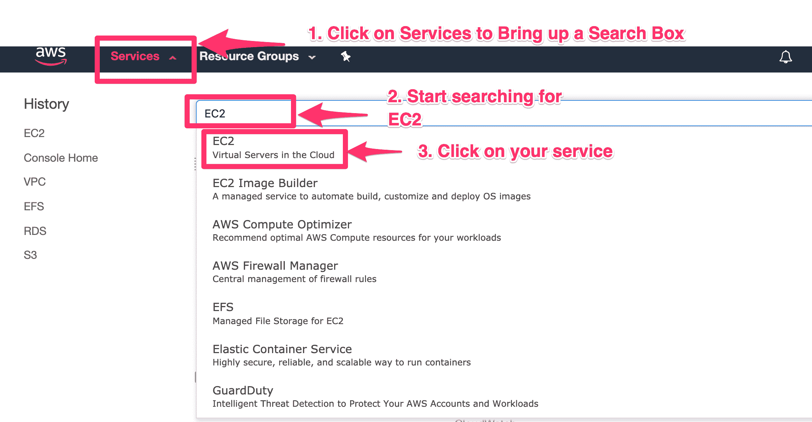
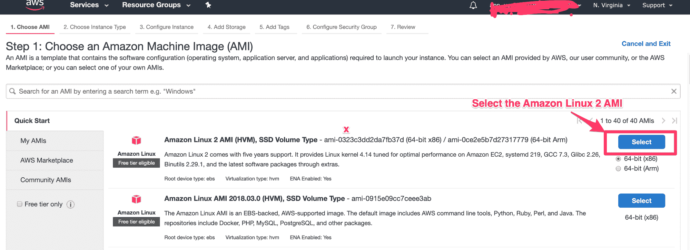
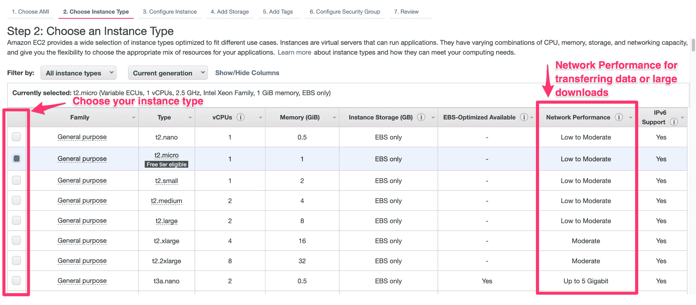
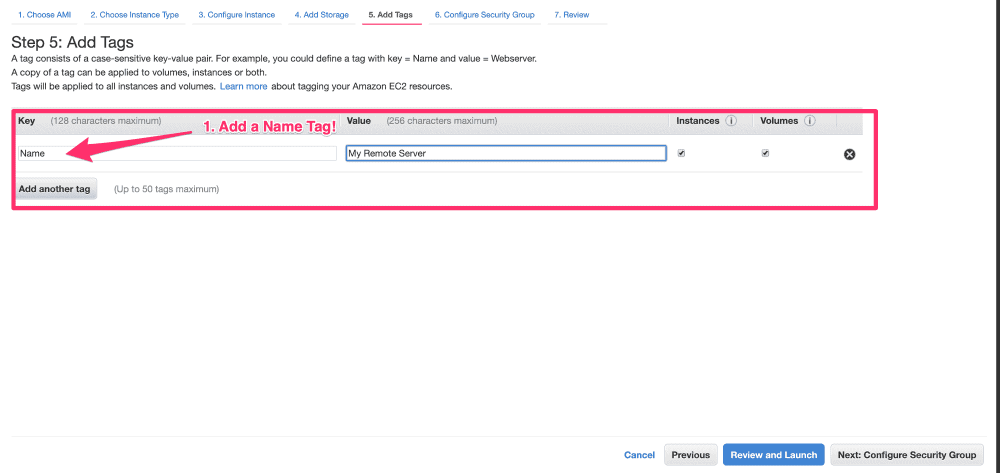
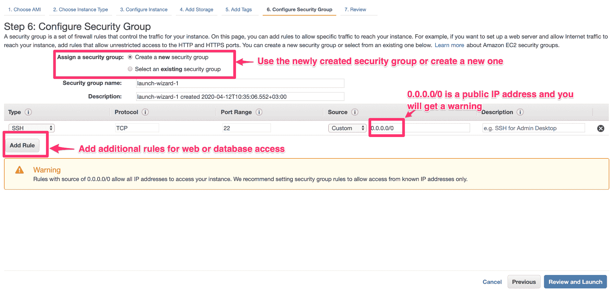
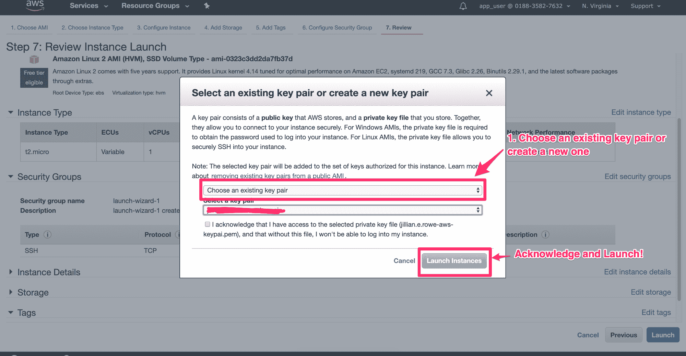
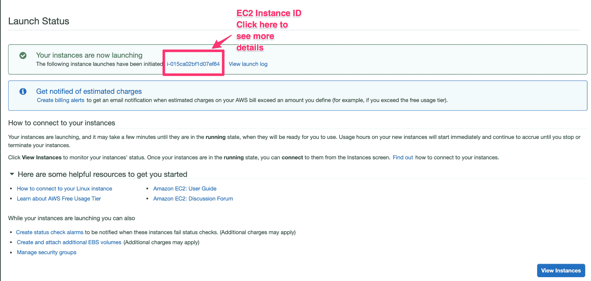
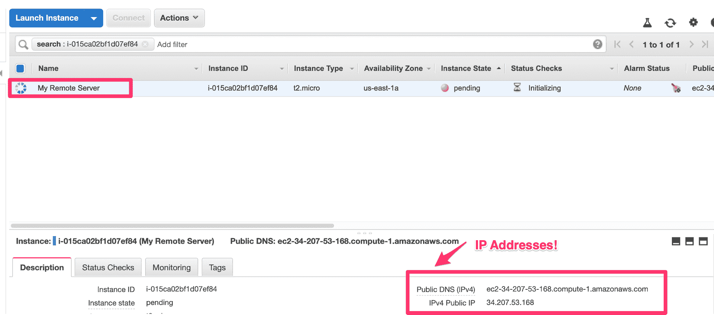

# 如何在 AWS 上启动远程服务器

> 原文：<https://www.freecodecamp.org/news/getting-started-with-server-administration-on-aws/>

AWS 非常酷，因为它是由谨慎的构建块组成的，您可以使用它来构建一些相当复杂的基础设施。一旦你掌握了事物，这是令人敬畏的。但是当你刚刚开始的时候，你需要知道诸如“我如何获得我的服务器的 IP 地址”和“等待哪个 SSH 密钥”之类的事情。

让我们回顾一些关键概念，然后在云上运行我们自己的服务器！

## 在 AWS 上管理远程服务器需要知道什么

有很多原因可以让你开始使用 AWS。也许您的公司正在将基础架构迁移到云上。也许你想开始自由职业，不想投资前期服务器成本。或者你只是想学习一项新技能。

为了在 AWS 上运行远程服务器，您需要了解一些基本的 AWS 术语和概念。我将介绍一些直接适用于启动远程服务器的术语，但是这些概念也用于更复杂的基础设施服务，比如 ElasticBeanstalk、Docker Swarm 和 Kubernetes。

### 弹性计算云(EC2)

AWS EC2 实例是计算功率寿命的地方。这些是你的远程服务器。知道如何处理 EC2 实例非常重要，因为它们几乎无处不在。

### 安全组

[安全组](https://docs.aws.amazon.com/vpc/latest/userguide/VPC_SecurityGroups.html)允许访问各种 AWS 服务，在本例中是 EC2 实例。这些定义了哪些端口对入站和出站流量开放。

### 密钥对

[密钥对](https://docs.aws.amazon.com/AWSEC2/latest/UserGuide/ec2-key-pairs.html)是你的 SSH 密钥。请确保您跟踪这些并把它们放在安全的地方！此外，如果您经常使用 AWS，您将开始收集密钥对，所以确保您给它们起了描述性的名字，而不仅仅是`ssh`。；-)

### 虚拟专用云(VPC)

一个 [VPC](https://aws.amazon.com/vpc/) 是你的计算基础设施所在的一个孤立的资源。继续我的一切都是乐高哲学，VPC 是乐高盒子，而 EC2、安全组和钥匙对是真正的乐高积木。

VPCs 负责你所有的网络。当您注册 AWS 帐户时，您将获得一个默认的 VPC，这就是我们今天将使用的。

## 如何启动 EC2 实例

启动 EC2 实例的方式非常多。你想要哪一个将取决于你的需要。今天，我们将复习如何使用 AWS web 控制台和 python `boto3`库。

顺便提一下，因为 AWS 有如此多的服务，你必须单独进入每个服务来管理它。如果您迷路了，只需从“服务”菜单中搜索您的服务。

## 使用向导启动 EC2 实例

首先，您需要登录到您的 [AWS 控制台。](https://console.aws.amazon.com/)

### 导航至 EC2 控制板



Bring up the EC2 services page by searching for it in 'Services'

1.  点击服务，打开搜索框。
2.  键入您想要的服务名——在本例中是 EC2。
3.  从菜单中单击您的服务名称，进入服务控制面板。

### 选择“启动实例”

进入 EC2 仪表板后，您需要单击屏幕中间的“启动实例”按钮。这将启动 AWS EC2 启动向导，它将引导我们完成启动 EC2 实例的过程。

如果你想浏览第 2 部分，我们将使用 Python 编程启动 EC2 服务器，这是一个写下你的默认 VPC id 的绝好机会！


### EC2 向导概述

选择“启动实例”后，您将看到一个向导。向导菜单有 7 个步骤，您可以在它们之间随意切换，以您想要的方式配置您的实例。


### EC2 向导-选择您的 AMI 类型

这就是奇迹发生的地方！



这是您选择 AMI 类型的地方，它通常是您想要的操作系统。对于许多常见用例，包括 ML 应用程序、web 服务器和数据库，有任意数量的预配置 ami。查看 AWS 市场,看看那里所有酷的 ami！

我喜欢亚马逊 Linux 2 图像，但你可以搜索任何图像类型，包括 Ubuntu、Centos 或任何数量的 [Bitnami](https://bitnami.com/partners/aws) 图像。

这里有个简短的说明。我喜欢比特纳米图像。它们都很棒，如果你正在考虑部署任何类型的 web 应用程序，比如 Ghost、Wordpress、Nginx，或者更复杂的应用程序，比如 Redash 或 Airflow，我真的推荐它们。

### EC2 向导-选择您的实例类型

我用免费的，因为我打算杀死它，但如果你真的使用这个 EC2 实例做任何重要的事情，你会想增加更多的能力。如果你需要任何涉及互联网的东西，比如传输数据，确保你关注互联网能力，选择适中范围内的东西。



向下滚动并选择“启动”以默认设置启动，或者选择“配置您的实例”以添加其他配置，如更改根文件系统大小、选择 VPC 或添加用户数据。

### EC2 向导-添加标签

当你刚开始使用 AWS 时，这并没有太大关系，但是当你开始使用 AWS 时，你会希望确保你的所有实例至少都有`Name`标签。这将允许您更容易地搜索您的实例，并做一些好的事情，如创建资源组来将您的 AWS 服务组合在一起。

在向导菜单中选择“添加标签”。不要担心，您可以根据需要在向导的各个步骤之间切换。



### EC2 向导-配置安全组

在结束之前，我们将配置安全组，它定义了访问规则。AWS 将为您创建一个安全组，或者您已经选择了一个安全组。默认情况下为 SSH 打开端口 22，但是如果您将这个端口用于任何 web 或数据库应用程序，那么您也需要打开这些端口。



### EC2 向导-启动

现在我们已经告诉了 AWS 我们想要什么，让我们启动我们的实例！点选检视并启动。您将看到一个弹出窗口，询问您想要哪个 SSH 密钥。您还可以在这里创建一个新的 SSH 密钥对。



### EC2 向导-确认页面

启动后，您将进入一个带有 EC2 实例 ID 的确认页面。



### EC2 仪表板-获取您的 IP 地址

我们走吧！现在剩下的就是等待我们的实例准备好，SSH 结束。



好吧！现在我们只需要 SSH 到我们的实例。根据您选择的实例类型，详细信息会略有不同。

这里假设您下载了名为`my-remote-server.pem`的密钥对，并将其移动到`~/.ssh`

```
chmod 400 ~/.ssh/my-remote-server.pem

# Amazon linux 2 ami
ssh -i ~/.ssh/my-remote-server.pem ec2-user@PUBLIC_DNS

# Ubuntu or Bitnami
ssh -i ~/.ssh/my-remote-server.pem ubuntu@PUBLIC_DNS
```

就是这样！现在，您在云上拥有了一个远程服务器！

## 使用 Boto3 Python 库创建 EC2 实例

完整的免责声明在这里。这远远超出了我通常对 boto3 库所做的事情。对于启动 EC2 实例之外的任何事情，我建议使用控制台或使用基础设施作为代码工具，如 [Cloudformation](https://aws.amazon.com/cloudformation/) 或 [Terraform](https://www.freecodecamp.org/news/p/91bf3938-5e24-4f7a-99b0-090255995d6c/terraform.io) 。但是当你开始的时候，理解基础是非常重要的。

我也有一种强迫性的需求，要为几乎所有的事情写报告。如果你不疑神疑鬼的话，可以随意移除。；-)

```
import boto3
import time
import json
from pprint import pprint
from select import select
import logging
from logging import Logger
from paramiko import SSHClient
import paramiko
from typing import Any
import os

logger = logging.getLogger('launch_ec2')
logger.setLevel(logging.DEBUG)

PROJECT = "my-remote-server"
KEY_PAIR = "my-remote-server"
SECURITY_GROUP="sg-some-number"
# Amazon Linux 2 AMI
AMI_ID="ami-062f7200baf2fa504"
INSTANCE_TYPE="t3a.medium"

report_data = {
    'name': PROJECT,
    'computer_name': KEY_PAIR,
}

def initialize_dir():
	"""
    Initialize a directory to write out our keypair and reports
    """
    if not os.path.exists(KEY_PAIR):
        os.mkdir(KEY_PAIR)

def create_key_pair():
    ec2_client = boto3.client('ec2')
    key_pair_response = ec2_client.create_key_pair(KeyName=KEY_PAIR)
    report_data['ssh_key'] = {}
    report_data['ssh_key']['id'] = key_pair_response['KeyPairId']
    report_data['ssh_key']['name'] = key_pair_response['KeyName']
    report_data['ssh_key']['key'] = key_pair_response['KeyMaterial']
    report_data['ssh_key']['key_file'] = os.path.abspath(os.path.join(KEY_PAIR, 'keypair.pem'))
    logger.info('Successfully created ssh key')

def write_key_file():
    """
    Write out the .pem ssh key file
    :return:
    """
    f = open(os.path.join(KEY_PAIR, 'keypair.pem'), 'w+')
    f.write(report_data['ssh_key']['key'])
    f.close()
    os.chmod(os.path.join(KEY_PAIR, 'keypair.pem'), 0o400)
    logger.info(
        'Wrote out ssh key file to {keypair}'.format(
            keypair=
            os.path.abspath(os.path.join(KEY_PAIR, 'keypair.pem'))
        )
    )

def create_instance():
    ec2 = boto3.resource('ec2')
    instance = ec2.create_instances(
        SecurityGroupIds=[SECURITY_GROUP],
        ImageId=AMI_ID,
        MinCount=1,
        MaxCount=1,
        InstanceType=INSTANCE_TYPE,
        KeyName=KEY_PAIR,
        TagSpecifications=[
            {
                'ResourceType': 'instance',
                'Tags': [
                    {
                        'Key': 'Name',
                        'Value': PROJECT
                    },
                ]
            },
        ],
    )
    report_data['ec2'] = {}
    report_data['ec2']['id'] = instance[0].id
    report_data['ec2']['PublicIP'] = None

def get_public_ip():
    print('Waiting for instance to initialize with public IP address...')
    print('This may take some time...')
    time.sleep(10)
    ec2 = boto3.resource('ec2')
    running_instances = ec2.instances.filter(Filters=[
        {
            'Name': 'instance-state-name',
            'Values': ['running']
        },
        {
            'Name': 'instance-id',
            'Values': [report_data['ec2']['id']]
        }
    ])
    for instance in running_instances:
        # Add instance info to a dictionary
        report_data['ec2'] = {
            'instance_id': report_data['ec2']['id'],
            'Type': instance.instance_type,
            'State': instance.state['Name'],
            'PrivateIP': instance.private_ip_address,
            'PublicIP': instance.public_ip_address,
            'LaunchTime': str(instance.launch_time)
        }

def write_report():
	"""
    Write out a JSON file with all of the IDs and things we need
    """
    logger.info('Writing report to {}'.format(
        os.path.abspath(os.path.join(KEY_PAIR, 'report.json'))
    ))
    f = open(os.path.abspath(os.path.join(KEY_PAIR, 'report.json'))
             , 'w+')
    json.dump(report_data, f, ensure_ascii=False, indent=4)
    f.close()

def print_helper_commands():
    """
    Print some helper commands for ssh and rsync to the screen
    """
    rsync_command = "rsync -av --progress -e 'ssh -i {key_file}' HOST_DIR ec2-user@{public_id}:/home/ec2-user/efs".format(
        key_file=report_data['ssh_key']['key_file'],
        public_id=report_data['ec2']['PublicIP']
    )
    ssh_command = "ssh -i {key_file} ec2-user@{public_ip}".format(
        key_file=report_data['ssh_key']['key_file'],
        public_ip=report_data['ec2']['PublicIP']
    )
    report_data['ssh_command'] = ssh_command
    report_data['rsync_command'] = rsync_command
    print('Some helpful commands!')
    print('###################################')
    print('# SSH to the instance with: ')
    print(ssh_command)
    print('###################################')

    print('###################################')
    print('# Rsync data to the instance with: ')
    print(rsync_command)
    print('###################################')

def print_end_message():
    print('##################################')
    print('Finished!')
    print('See {dir}/report.json for details'.format(dir=KEY_PAIR))

initialize_dir()
create_key_pair()
write_key_file()
create_instance()
while report_data['ec2']['PublicIP'] is None:
    get_public_ip()
print_helper_commands()
write_report()
print_end_message() 
```

## 包裹

这就是开始在云中运行远程服务器所需要知道的全部内容！您希望将什么类型的项目部署到云中？