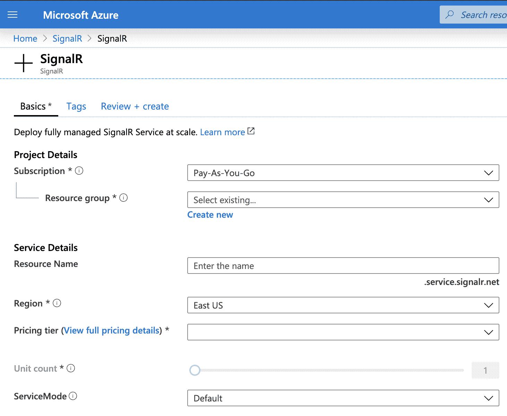
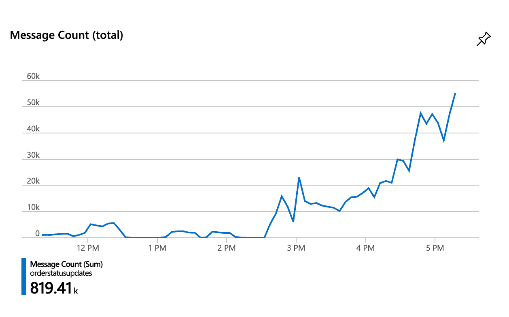

# 如何使用 JavaScript 在 Azure 上开始使用 SignalR

> 原文：<https://www.freecodecamp.org/news/getting-started-with-signalr-in-azure-using-javascript/>

前几天，我公司的一些优秀开发人员准备推出一个状态更新页面。我们已经对它进行了广泛的测试，但现在我们要把它大规模推广。

我担心它对最近出问题的 API 服务器的依赖性。我们还没有确定 API 端问题的根本原因，这个应用程序使用轮询——也就是说，它不断地向 API 请求新数据。如果那个 API 宕机，它会带走我们的应用，而我们应用增加的负载可能会加剧我们看到的问题。


一种摆脱轮询的方法是集成 [SignalR](https://dotnet.microsoft.com/apps/aspnet/signalr) ，这是一种持久连接工具，使用 websockets 和相关技术允许服务器*向客户端推送*更新。

这项技术是写在。NET，你在网上找到的大部分文档都是用 C#编写的。本教程将介绍一个基本的 JavaScript 实现。

# 它是做什么的？

开源的 SignalR 在客户端和服务器之间创建一个持久的连接。它首先使用 websockets，然后在 websockets 不可用时使用 longpolling 等技术。

一旦客户机和服务器建立了连接，就可以使用 SignalR 向客户机“广播”消息。当客户端接收到这些消息时，它可以执行更新存储等功能。

websockets 最常见的例子是一个聊天应用程序——新数据必须显示给用户，而不需要她刷新页面。但是，如果您的服务器获得任何关于需要向客户端显示的更改数据的更新，这可能是适合您的服务。

# Azure 平台上的 SignalR

或许因为是微软开发的，SignalR 在 Azure 云平台上有着非常干净的集成。像其他功能应用程序一样，您将为广播消息创建一个“入”触发器和一个“出”绑定。

## 费用

因为我是公司里第一个大规模研究这项技术的人，所以我不得不深入了解这项服务的成本。Azure 对一个“单位”的 SignalR 服务收费约 50 美元/月——每天 1000 个同时连接和 100 万条消息。还有一个免费的服务，为那些周围玩耍或小企业。

我深入研究了这些数字，这真的很好，你会在下面看到一点。

## 创建一个信号中心

让我们开始吧。我们需要一个 SignalR hub、两个功能应用程序和客户端代码来添加到我们的 web 应用程序中。

进入 SignalR ->添加并填写您的详细信息。工人只需一秒钟就可以构建您的服务。请确保为该服务提供一个合适的资源名称，因为您将在其他应用程序中使用它。还可以在我们的绑定中使用 key-> Connection String。



# 创建用于发送信号消息的功能应用程序

因为我们与 Azure 合作，我们将创建功能应用程序来与 SignalR 接口。不久前，我写了一篇关于 Azure 功能应用的入门博文。

本教程假设你已经知道如何使用功能应用程序。自然，您可以在没有绑定魔法的情况下使用这些库，但是您必须自己翻译。网码！

## 连接应用程序

我们需要的第一件事是让客户请求允许连接到我们的 SignalR 服务。这个函数的代码再简单不过了:

```
module.exports = function (context, _req, connectionInfo) {
  context.res = { body: connectionInfo }
  context.done()
} 
```

神奇的事情都发生在绑定中，在绑定中我们引入了我们的信号服务。触发器是我们的客户端可以调用的 HTTP 请求。

```
{
  "bindings": [
      {
          "authLevel": "function",
          "type": "httpTrigger",
          "direction": "in",
          "name": "req",
          "methods": ["get"]
      },
      {
          "type": "signalRConnectionInfo",
          "name": "connectionInfo",
          "hubName": "your-signalr-service-name",
          "connectionStringSetting": "connection-string",
          "direction": "in"
      }
  ]
} 
```

## 客户代码

要访问此方法，我们的客户将调用:

```
import * as signalR from '@microsoft/signalr'

const { url: connectionUrl, accessToken } = await axios
  .get(url-to-your-connection-app)
  .then(({ data }) => data)
  .catch(console.error) 
```

我们的函数应用程序将返回一个`url`和`accessToken`，然后我们可以使用它们来连接我们的 SignalR 服务。注意，我们创建了与 SignalR 服务的`hubName`的绑定——这意味着您可以在一个客户端中拥有到不同集线器的多个连接。

# 广播服务

现在我们准备开始发送消息。同样，我们将从功能应用程序开始。它接收一个触发器并发出一个信号信息。

触发器可以是另一个使用发布消息、来自事件中心的事件或 Azure 支持的任何其他触发器。我需要触发数据库变更。

```
{
  "bindings": [
      {
          "type": "cosmosDBTrigger",
          "name": "documents",
          "direction": "in",
          [...]
      },
      {
        "type": "signalR",
        "name": "signalRMessages",
        "hubName": "your-signalr-service-name",
        "connectionStringSetting": "connection-string",
        "direction": "out"
      }
  ]
} 
```

还有密码。同样，非常简单。

```
module.exports = async function (context, documents) {
  const messages = documents.map(update => {
    return {
      target: 'statusUpdates',
      arguments: [update]
    }
  })
  context.bindings.signalRMessages = messages
} 
```

SignalR 消息带有一个`target`和`arguments`对象。一旦您的触发器开始触发，这就是您在服务器上开始使用 SignalR 所需要的一切！微软让这一切变得非常容易。

## 客户代码

在客户端，事情稍微复杂一点，但不是不可管理的。下面是客户端代码的其余部分:

```
const connection = new signalR.HubConnectionBuilder()
  .withUrl(connectionUrl, { accessTokenFactory: () => accessToken })
  // .configureLogging(signalR.LogLevel.Trace)
  .withAutomaticReconnect()
  .build()

connection.on('statusUpdates', data => {
  // do something with the data you get from SignalR
})
connection.onclose(function() {
  console.log('signalr disconnected')
})
connection.onreconnecting(err =>
  console.log('err reconnecting  ', err)
)

connection
  .start()
  .then(res => // Potential to do something on initial load)
  .catch(console.error) 
```

我们使用之前从 connect 函数接收到的`connectionUrl`和`accessToken`，然后使用这些值构建我们的连接。

然后我们用共享密钥(对我来说是`statusUpdates`)监听消息，并为关闭和重新连接函数提供处理程序。

最后，我们开始连接。这里我们可以提供一个初始的加载函数。我需要一个来获取初始数据以显示当前状态。如果您正在构建一个聊天应用程序，您可能需要在这里获取初始消息。

这(几乎，也许)是你在 Azure 上使用 SignalR 开始使用 JavaScript 所需要的一切！

# 按用户划分范围

但是也许你和我一样，需要给很多用户发送很多信息。

当我第一次将它投入生产时，在用户的一个子集上，我用每一次更新摧毁了每一个连接。因为客户机代码可以确定它所监听的消息的范围，所以我使用了类似于`statusUpdates-${userId}`的东西，这样客户机只能看到自己的更新。

如果你的音量很小，这种方法就可以了，如果你系统中的每个人都需要同样的信息，这种更通用的方法就更好了。但是我工作的状态是个人特有的。



还记得 Azure 如何按“单位”收费，每个单位有一百万条消息吗？我在一个不忙的时候测试了几个小时。

Azure 将 SignalR 必须发送的每条消息都计为一条消息。也就是说，如果你的集线器连接了 5 个连接，你发送了 10 条消息，那就算作 50 条，而不是 10 条。这对我来说是一个惊喜，也需要几个小时的研究。

我们可以将我们的 SignalR 功能代码限定为只发送给某些用户。首先，我们更新连接应用程序以接受`userId`作为查询参数:

```
 {
          "type": "signalRConnectionInfo",
          "name": "connectionInfo",
          "userId": "{userId}",
          "hubName": "your-signalr-service-name",
          "connectionStringSetting": "connection-string",
          "direction": "in"
      } 
```

然后，我们更新广播功能，仅发送给该用户:

```
const messages = documents.map(update => {
  return {
    target: 'statusUpdates',
    userId: update.user.id,
    arguments: [update]
  }
}) 
```

广播服务不知道是谁连接的，所以您需要用可以访问客户机也可以访问的唯一 ID 的东西来触发它。

客户端代码只是将 userId 作为查询参数传入:

```
const { url: connectionUrl, accessToken } = await axios
  .get(`${url-to-your-connection-app}&userId=${userId}`)
  .then(({ data }) => data)
  .catch(console.error) 
```

我向你发誓，我在整个互联网上找到的唯一一个让我知道如何使用`userId`请求连接的地方是[这个堆栈溢出问题](https://stackoverflow.com/questions/29509396/signalr-client-how-to-set-user-when-start-connection)上的一个答案。

互联网很神奇，JavaScript Azure docs 很难得到。

# 资源

*   [微软的 SignalR Javascript 客户端文档](https://docs.microsoft.com/en-us/aspnet/core/signalr/javascript-client?view=aspnetcore-3.0)
*   [发送 SignalR 消息时配置用户和组](https://docs.microsoft.com/en-us/aspnet/signalr/overview/guide-to-the-api/mapping-users-to-connections#IUserIdProvider)-
    C #中的例子但是你也许可以弄清楚 JavaScript 客户端将如何运行并做出一些有根据的猜测。
*   【Azure 功能的 SignalR 服务绑定
*   [客户端 API](https://github.com/SignalR/SignalR/wiki/SignalR-JS-Client)
*   [在 SignalR 中与组一起工作](https://github.com/aspnet/AspNetDocs/blob/master/aspnet/signalr/overview/guide-to-the-api/working-with-groups.md)
*   [教程:使用 Azure 函数的 Azure SignalR 服务认证](https://docs.microsoft.com/en-us/azure/azure-signalr/signalr-tutorial-authenticate-azure-functions)

*这篇文章最初出现在 [wilkie.tech](https://wilkie.tech/tech/getting-started-with-signal-r-in-azure/) 上。*