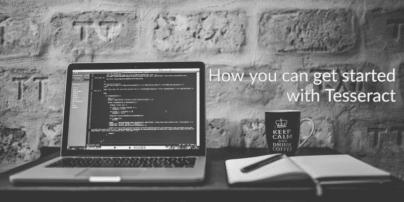

# 如何开始使用宇宙魔方

> 原文：<https://www.freecodecamp.org/news/getting-started-with-tesseract-part-i-2a6a6b1cf75e/>

伯克·坎·库古奥卢

# 如何开始使用宇宙魔方

众所周知，Tesseract 不是一个可以识别所有文本和图形的一体化 OCR 工具。事实上，这与事实相去甚远。如果这是一个秘密，我已经破坏了它，无论如何已经太晚了。所以，为什么不深入研究宇宙魔方，分享一些可以改善你的结果的技巧和诀窍呢？

### 我喜欢免费的东西！