# 了解 Truffle 和 Ganache——如何创建和部署智能合同

> 原文：<https://www.freecodecamp.org/news/getting-started-with-truffle/>

学习一项新技术通常意味着学习一种新的框架、编程语言、IDE 或部署方法。区块链也不例外。

在本教程中，我将向您展示如何用 Visual Studio 代码开始使用 Node.js 区块链框架 [Truffle](https://trufflesuite.com/docs/vscode-ext/installation-guide/) 。

# 如何安装松露

要安装 Truffle，你需要在你的机器上安装[节点和 NPM](https://nodejs.org/en/download/) 以及 [Python](https://www.python.org/downloads/) 。

如果你还没有，你可以从他们的官方网站( [Node](https://nodejs.org/en/) 和 [Python](https://www.python.org/) )安装。一旦你完成了，你就可以安装松露了。

我们将使用 npm 来安装松露。在命令提示符下输入以下命令:

`npm install -g truffle`

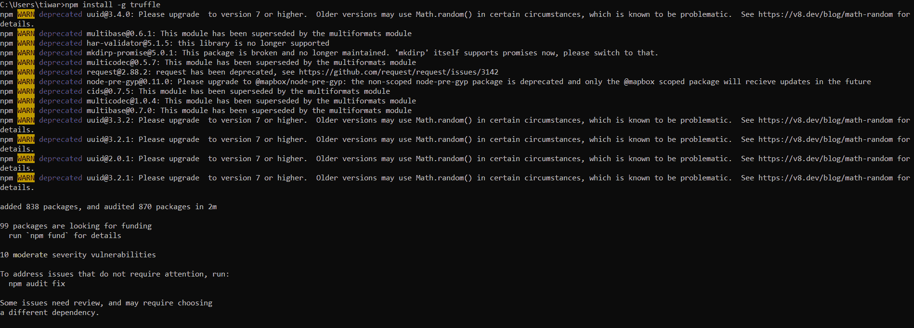

安装运行时，如果您遇到以下错误，我会帮您解决:

`gyp ERR! stack Error: Could not find any Visual Studio installation to use`

谷歌展示了一堆针对上述错误的解决方案。对我来说，真正有用的是安装 [Visual Studio](https://visualstudio.microsoft.com/downloads/) 以及“用 C++进行桌面开发”。

下载 Visual Studio 并运行安装程序后，您将看到以下屏幕:

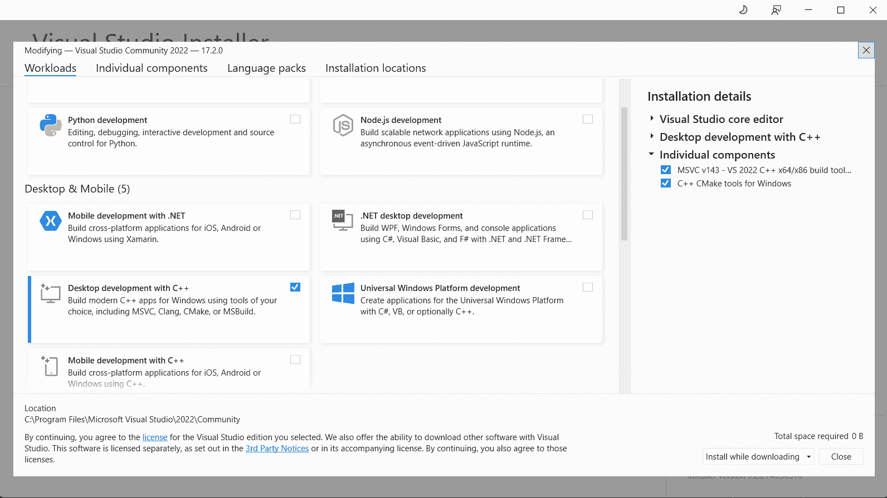

在“桌面和移动”部分，选择“使用 C++进行桌面开发”并继续安装过程。

完成后，您可以再次运行 Truffle 安装命令。

要验证 Truffle 是否安装成功，请运行:

`truffle version`

在您的命令提示符下。您应该会看到如下图所示的输出:

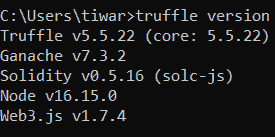

恭喜你！你装了松露。

# 如何在 Visual Studio 代码中使用 Truffle

Visual Studio 代码自带对 Truffle 的扩展。我们将安装它以使我们的工作更容易。

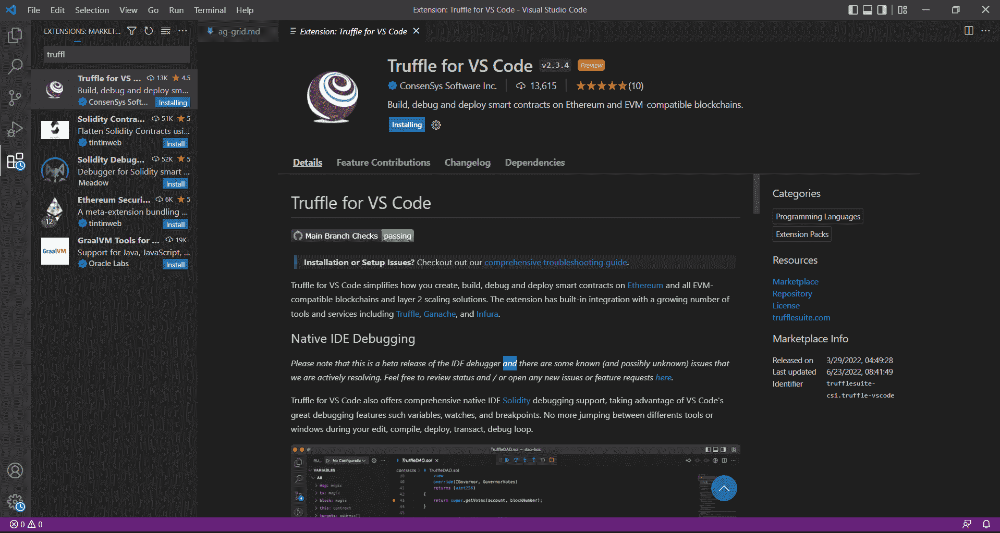

在市场搜索栏中，输入“Truffle for VS Code”并点击 install(类似下图)。

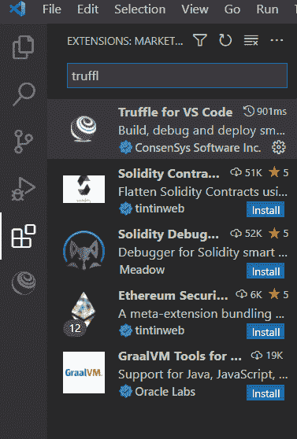

VS 代码需要你有其他的扩展才能工作，所以只需要检查你还没有安装的，然后继续设置:
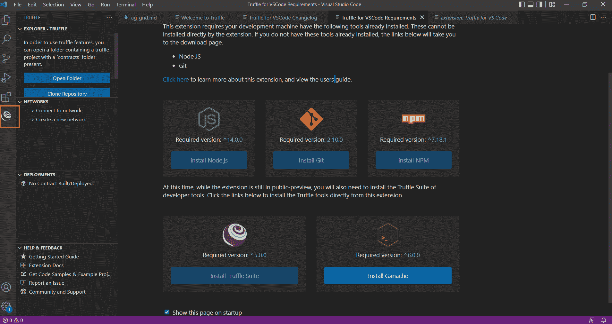

如果你在左边栏没有看到松露标志，你可能需要重启 VS 代码。

# 如何在 VS 代码中设置 Ganache

Ganache 附带了 Truffle 套件来部署 DApps。

点击 Truffle explorer 中的“网络”>“创建新网络”。

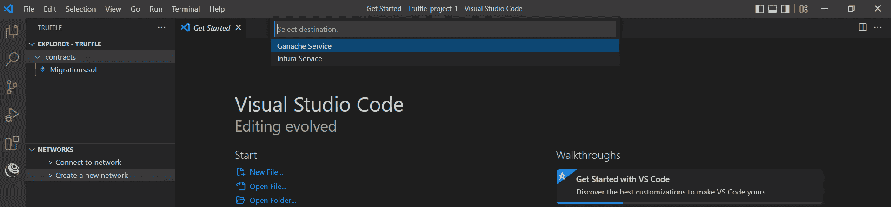

从下拉框中选择“Ganache 服务”。

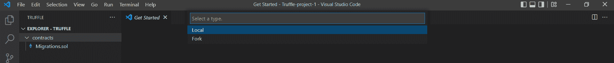

选择“本地”或“分叉”类型。由于这是本地设置，我将选择“本地”。

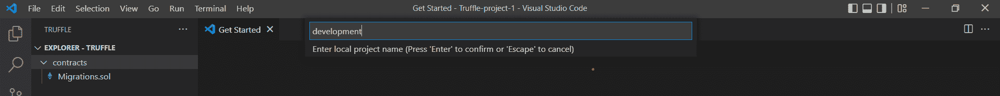

接下来，将要求您输入“本地项目的名称”。输入您选择的任何名称，然后按回车键。

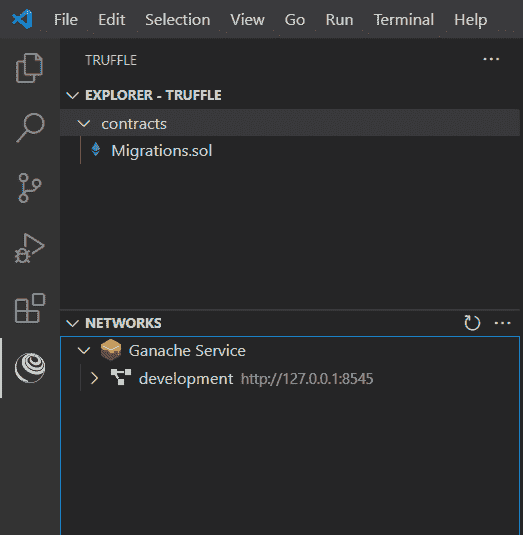

您的网络设置已完成。

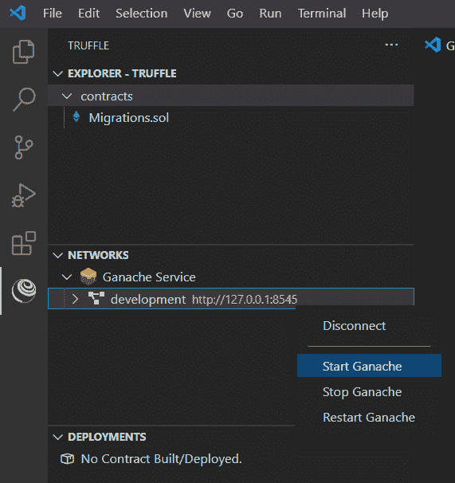

要启动网络，右键单击网络名称，然后单击“启动 Ganache”。

当您启动 Ganache 服务时，您将看到如下命令行输出:
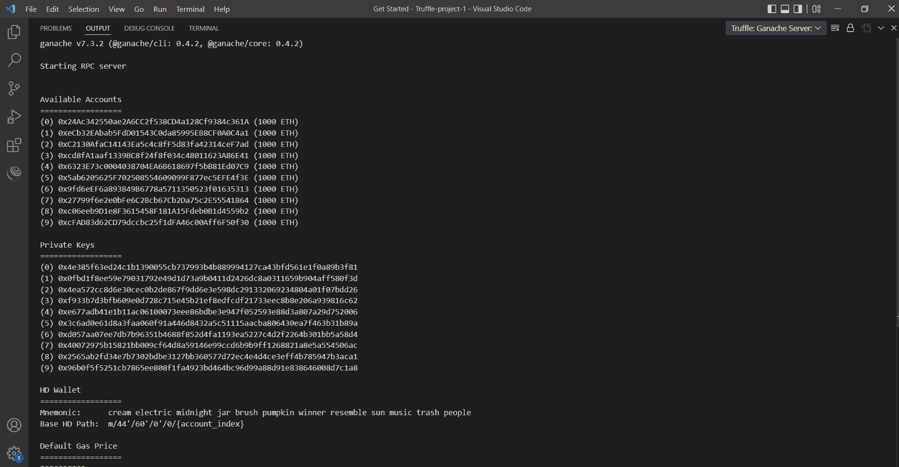

输出显示了一组要加速的东西。我们现在还不需要担心他们。

# 如何启动 Tuffle 项目

要在 Truffle 中启动一个项目，进入一个目录并键入 init 命令。

`truffle init`

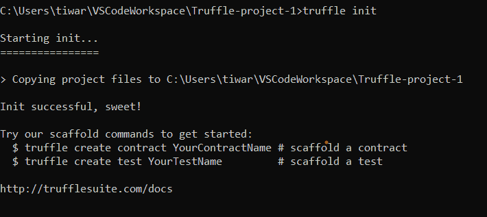

这将创造一个新的松露项目。

# 如何在松露创建合同

以下命令在 Truffle 中创建一个合同:

`truffle create contract <contract name>`

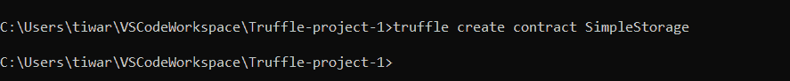

在这里，我们创建了一个名为“简单存储”的契约。

# 如何在松露中运行测试

要在 Truffle 中运行测试，只需输入以下命令:

`truffle test`

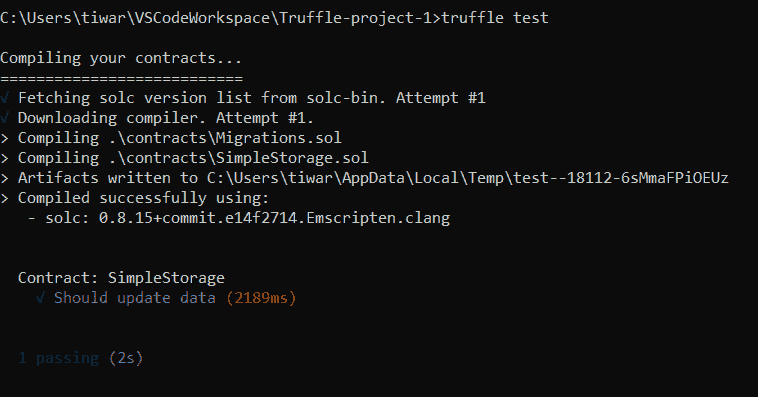

所有的测试将一个接一个地进行。

# 如何在松露部署

我们将使用 Ganache 部署在松露。

`truffle develop`

您使用上面的命令来启动部署过程。

Ganache 为此准备了一些帐户和私钥。

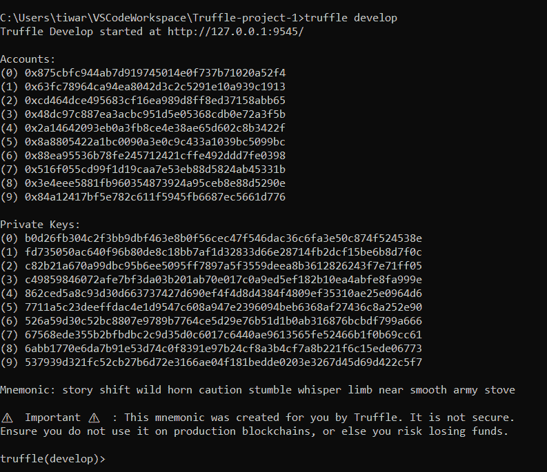

在上图的底部，你会看到`truffle (develop)>`控制台。

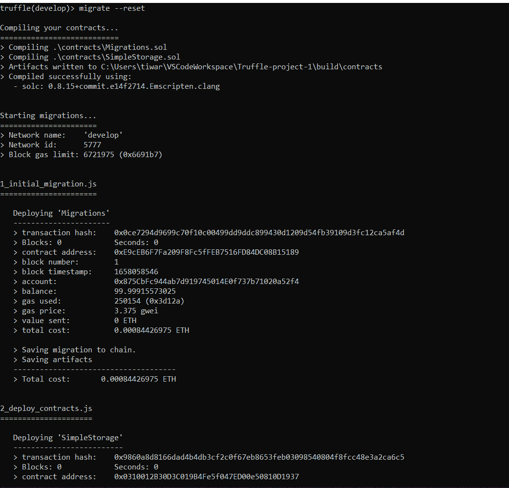

在控制台中键入`migrate --reset`。

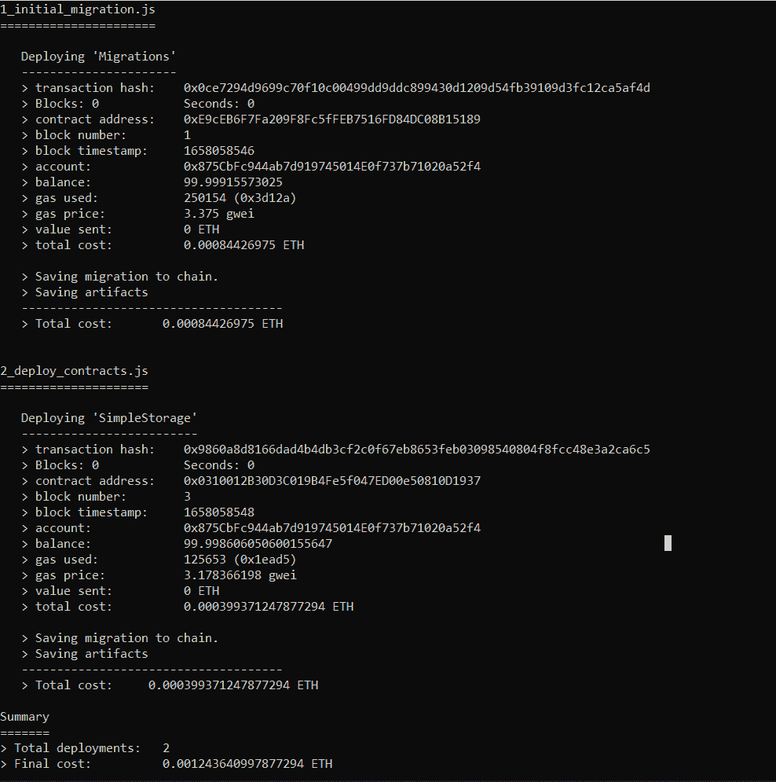

您将看到初始迁移已经完成，部署过程开始。最后，您将获得部署摘要(部署的成本和数量)。

# 结论

当我们能从彼此的错误中吸取教训时，我们进步得更快。我刚刚开始学习区块链，我花了一段时间来运行设置。所以我在这里分享我的发现。快乐学习！