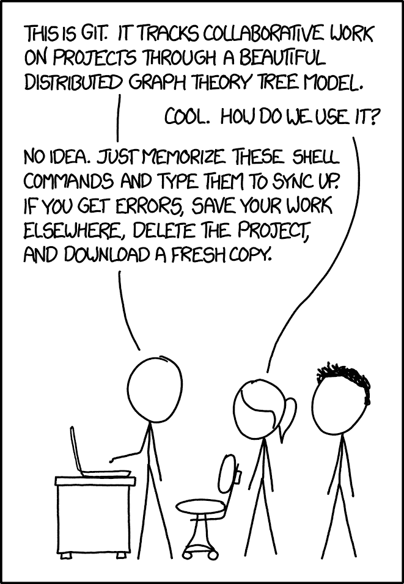

# Git 和 GitHub 速成班

> 原文：<https://www.freecodecamp.org/news/git-and-github-crash-course/>

Git 和 GitHub 是各地开发者经常使用的。大多数软件公司都使用这些工具，所以如果你想在软件行业工作，了解这些工具是很重要的。

我们发布了格温·法拉第的速成视频，教你 Git 和 GitHub 的基础知识。

Git 是一个软件，它使得在软件仓库中管理你自己软件的不同版本变得更加简单。GitHub 是一个共享软件仓库和与其他开发者合作的地方。这些工具使得多人在同一个软件项目上工作变得更加容易。

在本课程中，您将了解:

*   常用术语
*   安装 Git
*   创建 Git 存储库
*   克隆 Git 存储库
*   在 Git 存储库中添加和删除
*   使用 GitHub
*   创建拉式请求
*   分支储存库
*   合并存储库
*   更多

课程结束时，你会比这部网络漫画中的人更了解 Git。:)

Source: [https://xkcd.com/1597/](https://xkcd.com/1597/)

观看以下课程或 freeCodeCamp.org YouTube 频道上的[。](https://www.youtube.com/watch?v=RGOj5yH7evk)

[https://www.youtube.com/embed/RGOj5yH7evk?feature=oembed](https://www.youtube.com/embed/RGOj5yH7evk?feature=oembed)