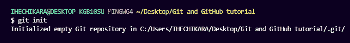
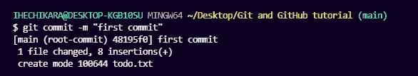
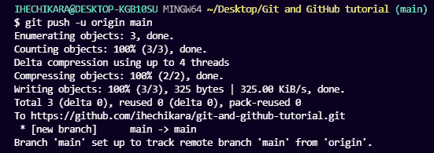
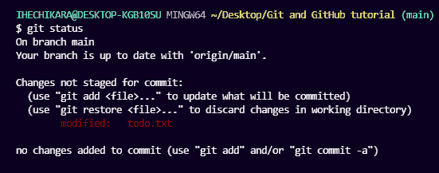
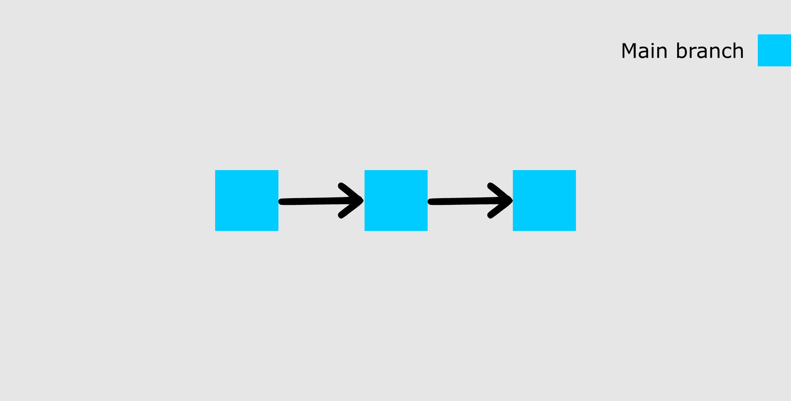
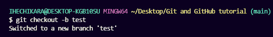
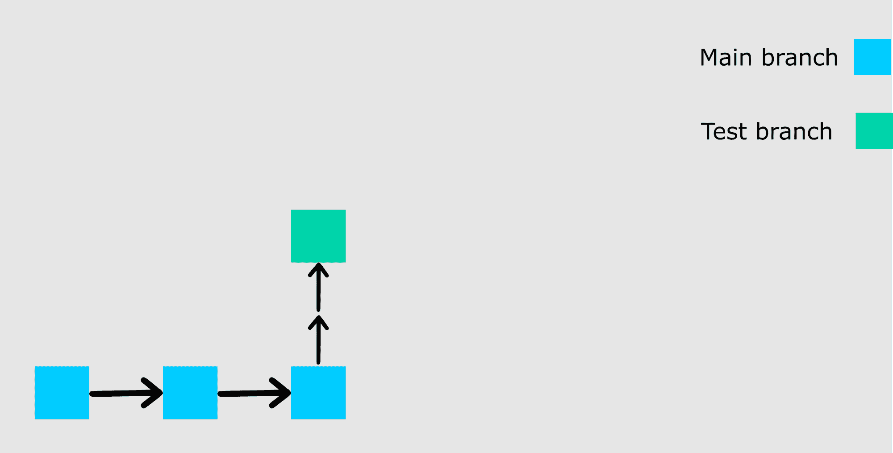
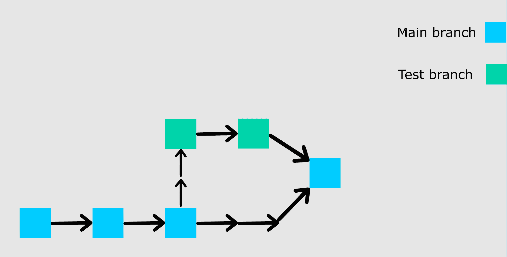
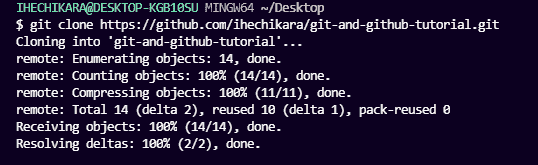

# Git 和 GitHub 教程——面向初学者的版本控制

> 原文：<https://www.freecodecamp.org/news/git-and-github-for-beginners/>

Git 和 GitHub 是每个开发人员都应该学习的两项技术，不管他们从事什么领域。

如果你是一个初级开发人员，你可能会认为这两个术语意思相同——但它们是不同的。

本教程将帮助您了解什么是 Git 和版本控制，您需要知道的基本 Git 命令，如何使用其功能来提高工作效率，以及如何使用 GitHub 扩展这些功能。

这个指南是初学者友好的，因为例子将非常容易理解。这也将是一个通用的教程，所以无论你最喜欢的编程语言是什么，任何人都可以跟随。

对于我们的项目，我们将在文本(txt)文件中编写一个待办事项列表。您将看到我们如何使用 Git 的特性来处理和创建列表的最终版本。

### 先决条件

为了完成本教程，您需要以下内容:

*   命令行界面。
*   您选择的文本编辑器(我将使用 VS 代码)。
*   GitHub 账户。

## Git 是什么？

Git 是一个版本控制系统，它可以让你跟踪你对文件的修改。使用 Git，您可以恢复到文件的各种状态(就像一台时间旅行机器)。您也可以制作文件的副本，对该副本进行更改，然后将这些更改合并到原始副本中。

例如，您可能正在处理一个网站的登录页面，并发现您不喜欢导航栏。但与此同时，你可能不想开始改变它的组件，因为它可能会变得更糟。

使用 Git，您可以创建该文件的一个完全相同的副本，并使用导航条。然后，当您对更改感到满意时，可以将副本合并到原始文件中。

您不仅仅局限于将 Git 用于源代码文件——您还可以使用它来跟踪文本文件甚至图像。这意味着 Git 不仅仅是为开发人员准备的——任何人都会发现它很有帮助。

### 如何安装 Git

为了使用 Git，你必须在你的电脑上安装它。为此，可以在[官网](https://git-scm.com/downloads)下载最新版本。您可以从给出的选项中为您的操作系统下载。

您也可以使用命令行安装 Git，但是由于命令随操作系统的不同而不同，所以我们将重点讨论更通用的方法。

### 如何配置 Git

我将假设此时您已经安装了 Git。要验证这一点，您可以在命令行上运行这个命令:`git --version`。这将显示您电脑上安装的最新版本。

接下来你需要做的是设置你的用户名和电子邮件地址。Git 将使用这些信息来识别谁对文件进行了特定的更改。

要设置您的用户名，请键入并执行这些命令:`git config --global user.name "YOUR_USERNAME"`和`git config --global user.email "YOUR_EMAIL"`。只要确保用您选择的值替换`"YOUR_USERNAME"`和`"YOUR_EMAIL"`即可。

## 如何在 Git 中创建和初始化项目

我们终于完成了 Git 的安装和设置。现在是时候创建我们的项目了。

我在桌面上创建了一个名为`Git and GitHub tutorial`的文件夹。使用命令行，导航到新项目的位置。对我来说，我会运行以下命令:

`cd desktop`

`cd Git and GitHub tutorial`

如果你不熟悉命令行，还在学习如何使用它在你的电脑上导航，那么我建议你使用微软的 Visual Studio 代码。这是一个代码编辑器，内置了执行命令的终端。你可以在这里下载[。](https://code.visualstudio.com/download)

安装 VS 代码后，在编辑器中打开您的项目，并为您的项目打开一个新的终端。这会自动将终端/命令行指向您的项目路径。

现在要初始化您的项目，只需运行`git init`。这将告诉 Git 准备好开始观察文件中发生的每一个变化。看起来是这样的:



git init

第一行包含关于我的电脑和文件夹所在路径的信息。第二行是命令`git init`，第三行是返回的响应，告诉我我的存储库(repo)已经初始化。它被认为是空的，因为我们没有告诉 Git 要跟踪什么文件。

存储库只是定义由 Git 监视/跟踪的项目的另一种方式。

### Git 项目文件

我只创建了一个名为`todo.txt`的文件。该文件如下所示:

```
MY TO-DO LIST

1\. Write an article.
2\. Code.
3\. Study books.
4\. Attend classes on time.
5\. Visit aunt.
6\. Apply for remote jobs. 
```

在我们继续学习其他 Git 命令之前，我们先来谈谈 GitHub。

## 什么是 GitHub？

GitHub 是一个 Git 仓库的在线托管服务。想象一下，在家里做一个项目，而你不在的时候，可能在朋友家，你突然想起了一个让你几天不得安宁的代码错误的解决方案。

您无法进行这些更改，因为您的电脑不在身边。但是如果你的项目托管在 GitHub 上，你可以在任何一台你可以访问的电脑上用一个命令访问和下载这个项目。然后你就可以进行修改，把最新版本推回 GitHub。

总之，GitHub 允许你在他们的平台上存储你的回购。GitHub 的另一个令人惊叹的特性是能够在任何地方与其他开发人员协作。

现在我们已经在本地创建并初始化了我们的项目，让我们把它推送到 GitHub。

如果你是初学者，你会遇到一些新的术语，比如 push、commit、add 等等——但是不要被它们弄得不知所措。通过一些练习，你将能够记住这些术语和它们的作用。

## 如何将存储库推送到 GitHub

我将把这一部分分成几个步骤来帮助你更清楚地理解这个过程。

### 步骤 1–创建 GitHub 帐户

要使用 GitHub，你必须先创建一个帐户。你可以在他们的网站上这样做。

### 步骤 2–创建存储库

您可以点击页面右上角的`+`符号，然后选择“新建存储库”。为您的回购命名，然后向下滚动并单击“创建存储库”。

### 步骤 3–添加并提交文件

在我们“添加”和“提交”文件之前，您需要理解 Git 正在跟踪的文件的阶段。

#### 承诺状态

当对文件所做的所有更改都保存在本地存储库中时，文件处于**已提交**状态。处于提交阶段的文件是准备推送到远程 repo(在 GitHub 上)的文件。

#### 修改状态

处于**已修改**状态的文件已被修改，但尚未保存。这意味着文件的状态已经从提交状态中的先前状态改变。

#### 阶段状态

处于**阶段**状态的文件意味着它准备好提交。在这种状态下，所有必要的更改都已完成，因此下一步是将文件转移到提交状态。

你可以把 Git 想象成一个摄像头来更好地理解这一点。只有当文件达到提交状态时，摄像机才会拍摄快照。在此状态之后，相机开始将对同一文件所做的更改与上一次快照进行比较(这是修改后的状态)。当所需的更改完成后，文件将被转移并进入提交状态，用于新的快照。

这可能是目前需要接受的大量信息，但不要气馁——通过练习会变得更容易。

### 如何在 Git 中添加文件

当我们第一次初始化我们的项目时，文件没有被 Git 跟踪。为此，我们使用这个命令`git add .`，`add`后面的句点或点表示存储库中存在的所有文件。如果你想添加一个特定的文件，可能是一个名为`about.txt`的文件，你可以使用`git add about.txt`。

现在我们的文件处于暂存状态。在这个命令之后，您将不会得到响应，但是要知道您的文件处于什么状态，您可以运行`git status`命令。

### 如何在 Git 中提交文件

文件在暂存状态之后的下一个状态是提交状态。为了提交我们的文件，我们使用`git commit -m "first commit"`命令。

命令的第一部分`git commit`告诉 Git 所有暂存的文件都已准备好提交，所以是时候拍摄快照了。第二部分`-m "first commit"`是提交消息。`-m`是消息的简写，而括号内的文本是提交消息。

执行此命令后，您应该会得到类似如下的响应:



git commit

现在我们的文件处于提交状态。

### 步骤 4–将存储库推送到 GitHub

创建回购协议后，您应该被重定向到一个页面，该页面告诉您如何在本地创建回购协议或推送现有的回购协议。

在我们的例子中，项目已经在本地存在，所以我们将使用“…或者从命令行推送现有的存储库”一节中的命令。这些是命令:

```
git remote add origin https://github.com/ihechikara/git-and-github-tutorial.git
git branch -M main
git push -u origin main
```

第一个命令`git remote add origin [https://github.com/ihechikara/git-and-github-tutorial.git](https://github.com/ihechikara/git-and-github-tutorial.git)`在本地 repo 和 Github 上的远程 repo 之间创建一个连接。

远程项目的 URL 应该与上面的完全不同。因此，要跟进，请确保您遵循这些步骤并使用您自己的远程回购。执行此命令后，您通常不会得到响应，但请确保您有互联网连接。

第二个命令`git branch -M main`将主分支的名称改为“main”。默认分支可能被创建为“master”，但是“main”现在是这个回购的标准名称。这里通常没有回应。

最后一个命令`git push -u origin main`将您的 repo 从本地设备推送到 GitHub。您应该会得到类似如下的响应:



git push

为了帮助您加深对文件阶段的理解，我将对文件进行更改，然后将新版本推送到 GitHub。

回想一下，我们的文件现在处于提交状态。让我们对文件进行更改，并记录状态。

我将在待办事项列表中添加一项新任务:

```
MY TO-DO LIST

1\. Write an article.
2\. Code.
3\. Study books.
4\. Attend classes on time.
5\. Visit aunt.
6\. Apply for remote jobs. 
7\. Practice code
```

添加新任务后，运行`git status`命令。这是你应该看到的:



git status

在对文件进行修改之后，它进入了修改状态——但是它还没有准备好提交，所以您还不能将它推送到 GitHub。Git 没有对当前状态进行最终快照，因为它只是将我们现在所做的更改与最后一次快照进行比较。

现在，我们将添加(转移)此文件，然后提交并推送它。这与上一节相同。

我们首先使用`git add .`添加文件，它添加了文件夹中的所有文件(在我们的例子中是一个文件)。然后我们通过运行`git commit -m "added new task"`然后运行`git push -u origin main`来提交文件。

这是将修改后的文件推送到 GitHub 的三个步骤。你添加，提交，然后推。我希望您现在已经理解了文件阶段以及与它们相关的命令。

## 如何在 Git 中使用分支

使用分支，您可以创建您想要处理的文件的副本，而不会弄乱原始副本。您可以将这些更改合并到原始副本中，或者让分支保持独立。

在我们开始使用分支之前，我想向您展示我们回购的可视化表示，如下所示:



main banch

上图显示了我们的主分支，最后两次提交(第一次提交和添加的新任务提交)。

此时，我想在列表中添加更多的任务，但我还不确定是否要将它们放在我的主列表中。所以我将创建一个名为`test`的新分支，看看我的列表在包含更多任务后会是什么样子。

要创建一个新的分支，运行这个命令:`git checkout -b test`。我会打破它。

告诉 Git 它应该切换到一个新的分支。`-b`告诉 Git 创建一个新的分支。`test`是要创建并切换到的分支的名称。以下是您应该得到的回应:



git checkout -b

现在我们已经创建了一个新的分支，这就是我们的回购看起来的样子:



git branch

我们从上次提交的状态中创建了新的分支。现在让我们向这个新分支添加更多的任务。

```
MY TO-DO LIST

1\. Write an article.
2\. Code.
3\. Study books.
4\. Attend classes on time.
5\. Visit aunt.
6\. Apply for remote jobs. 
7\. Practice code
8\. Complete internship task.
9\. Practice chess openings.
10\. Solve chess puzzles.
11\. Check exam schedule. 
```

我添加了四个新任务。要将新的状态合并到主分支，您必须首先准备并提交这个分支。我不会详细讨论如何做到这一点，因为在上一节中我们已经做了两次。

你应该试着自己做，这样你就能理解它是如何工作的。作为一个提示，添加文件，然后用一条消息提交(参考上一节，了解如何做的细节)。

提交您的测试分支之后，通过运行这个命令切换回主分支:`git checkout main`。

你是否注意到我们没有添加`-b`？这是因为我们不是创建一个新的分支，而是切换到一个现有的分支。您可以通过运行`git branch`命令来检查 repo 中存在的所有分支。

现在我们可以通过运行`git merge test`将我们在测试分支中所做的更改合并到主分支中。在这一点上，您将会看到在测试分支中所做的所有变更都反映在主分支上。您还应该收到类似以下内容的响应:


git merge

这是我们回购的直观展示:



git merge

如果你继续把你的回购推给 GitHub，你会看到测试分支不会被推。它只会留在你的本地回购。如果您想要推送您的测试分支，使用`git checkout test`切换到分支，然后运行`git push -u origin test`。

## 如何在 Git 中提取存储库

拉入 Git 意味着将远程存储库的当前状态克隆到您的计算机/存储库中。当你想在不同的计算机上处理你的回购协议时，或者当你在线参与一个开源项目时，这就很方便了。

为了测试这一点，不要担心换一台新电脑。只需运行`cd ..`离开当前目录，返回一步。在我自己的例子中，我已经导航回到我的桌面。

转到 GitHub，在你的库的主页上你应该会看到一个绿色的按钮，上面写着“Code”。当你点击按钮时，你应该在下拉菜单中看到一些选项。继续复制 HTTPS 的网址。

之后运行`git clone YOUR_HTTPS_URL`。这个命令将远程存储库放入本地计算机的 git-and-git-tutorial 文件夹中。那就是:



git clone

## 结论

本文介绍了帮助您开始使用 Git 的基本命令。我们也开始学习如何使用 GitHub。

如果你已经跟进了这一点，那么恭喜你，你可以走了。现在，无论您使用什么编程语言，都可以在项目中使用 Git。

您应该知道这些并不是 Git 中存在的所有命令——所以请随意做更多的研究来了解更多的命令及其用法。[这篇文章](https://www.freecodecamp.org/news/what-is-git-learn-git-version-control/)和[这份备忘单](https://www.freecodecamp.org/news/git-cheat-sheet/)都是很好的起点。[这个](https://gist.github.com/brandon1024/14b5f9fcfd982658d01811ee3045ff1e)是查看更多 Git 命令的详细列表的好地方。

在推特上找我 [@ihechikara2](https://twitter.com/Ihechikara2) 。编码快乐！