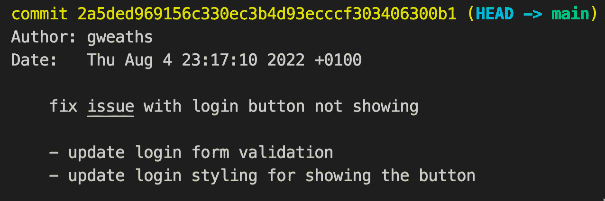
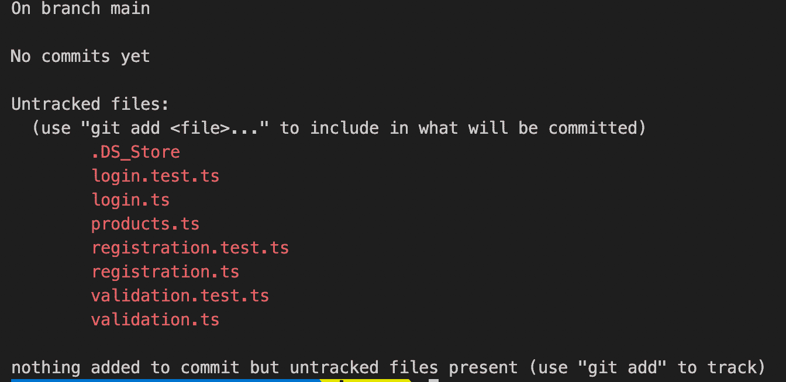
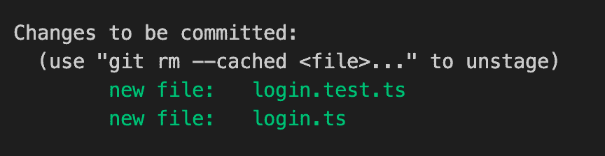
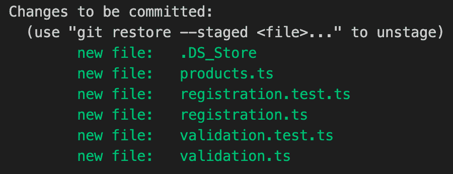
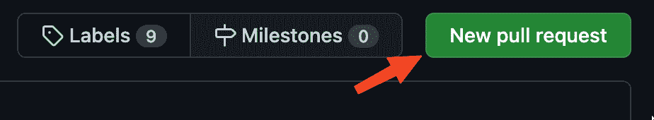
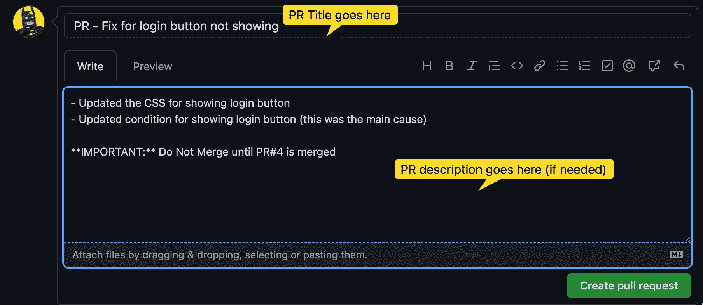
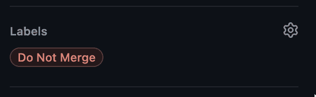
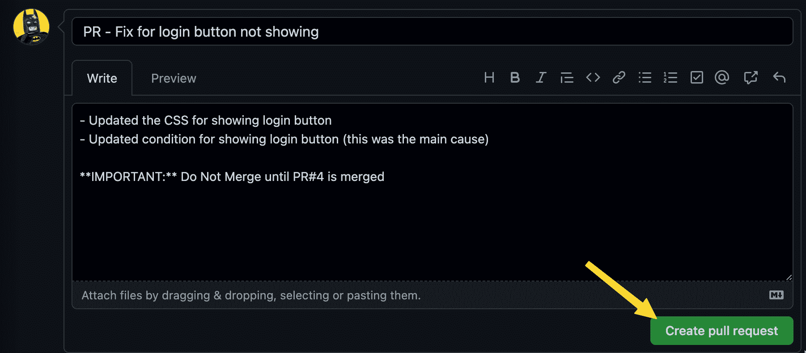

# Git 最佳实践——如何编写有意义的提交、有效的拉请求和代码审查

> 原文：<https://www.freecodecamp.org/news/git-best-practices-commits-and-code-reviews/>

作为开发人员，我们推动常规的代码提交——过一段时间后，这几乎成了我们的第二天性。

但这是否意味着我们在做正确的事情？熟悉往往会导致草率和忽略基础。

在这篇文章中，我们将探索

*   如何编写有意义的 Git 提交消息
*   如何创建高效的拉式请求(PR)
*   如何真正擅长代码评审过程以及一些可以遵循的最佳实践

### 先决条件:

我更喜欢用 VS 代码作为我的代码编辑器。我也在我的 Git 编辑器中使用它。我发现在我编码的地方写提交消息更容易。这也给了我更多的空间来编写提交消息和描述。

如果您还没有这样做，请按照以下步骤将 VS 代码作为您的默认 git 编辑器。

1.  打开 VS 代码，在命令面板中搜索

> Shell 命令:将“code”命令安装到路径

2.然后在终端中运行以下命令:

`git config --global core.editor "code --wait"`

现在，当您运行`git commit`或`git -config --global -e`时，它将在 VS 代码的一个文件中打开 Git 编辑器。

**注意:**所有给定的命令都将在终端中运行(无论是您选择的终端，还是 VS 代码中的集成终端)。

## 如何编写有意义的提交消息

提交代码时，编写有用的提交消息会很有帮助。这里有一些提示和最佳实践来帮助您做到这一点。

### 使用命令式命令

用[命令](https://www.grammar-monster.com/glossary/imperative_mood.htm)作为提交消息的前缀，例如:`fix`、`refactor`、`add`和`remove`

这是因为您应该能够在短语后面添加提交消息

> “如果应用，此代码将……”

并告知其他开发商它将为 example:‌做些什么

> 如果应用，此代码将修复登录按钮不显示的问题

### 保持简短

你不是在写独白，所以尽量简短。作为一般规则，提交消息不应超过 50 个字符。

站在开发者或评审者的角度考虑问题。试着想想，如果您正在查看这个回购的 Git 日志，您会想知道什么。

*   你完成了什么工作？
*   你为什么这么做？
*   对代码库有什么影响？

下面是一个简洁但信息丰富的提交消息示例:

```
fix issue with login button not showing
```

### 如何保持提交消息简短但有帮助

在您的提交中，您可以包括提交描述，允许我们添加更多关于您所做的事情的详细信息/上下文。

在提交消息下面添加一个空行，并在第 3 行开始编写描述。看起来是这样的:

```
fix issue with login buttton not showing

- update login form validation
- update login styling for showing the button
```

现在，当其他开发人员审查 Git 日志、提交或需要恢复代码时，他们可以更好地了解会发生什么影响，以及是否会导致任何重大变化。



### 无用提交消息的例子

另一方面，下面是一些无效提交消息的示例:

*   `fixed bug`–没有提到到底修复了什么错误，所以它没有给 git 历史/日志增加任何价值。这将使回顾以前的提交变得极其困难和艰苦。作为开发人员，您必须像这样打开每个提交，才能理解它实际上在做什么。
*   这条消息没有告诉我们发生了什么变化。我们将不得不追踪 pull 请求，以收集有关所做更改的任何上下文，或者再次打开 commit。
*   `fixing previous commit`–再次缺乏上下文
*   `made tests pass`–更新了哪个测试文件？您至少应该给出已经修复的测试的名称或区域。

所有这些都不是提交消息的好例子，因为它们不明确，缺少信息，也缺少上下文。他们强迫团队成员做更多的工作，以便理解正在发生的事情，这在任何团队中都是不可接受的。

## 如何制定提交策略

您可能认为提交代码就像提交和推送代码一样简单。但是事情远不止如此。

让我们来谈谈如何开发一个有用的提交策略来保持一致性并进行有用的提交。

### 进行小的、具体的提交

如果出现问题，更小的提交使代码更容易恢复到以前的状态。如果您的提交影响了太多的区域，返回可能意味着丢失大量代码。

如果代码与一个目的相关，评审者也更容易理解代码在做什么。

让我们看一个现实生活中的例子。首先，我们需要添加相关的文件更改。我们可以通过运行`git status`来查看我们的分支中哪些文件已经被更改



Example of output from git status

如您所见，有各种文件已经被更改/添加到项目中。然而，它们都是针对项目的不同领域。遵循保持提交小且可关联的黄金法则，让我们看看如何将它付诸实践。

使用后跟文件名的`git add`,我们可以只提交相关的文件。我们通过使用`git add`命令，加上我们希望一个接一个添加的文件名来完成，如下所示:

```
git add login.test.ts login.ts
```

如果我们现在检查`git status`，我们将看到两个暂存文件:



Example of Git status output after staging files

我们有了文件，现在创建我们的提交。和往常一样，我们将利用`git commit`在 VS 代码中打开 git 编辑器(就像我们之前设置的那样)。如果您跳过了这一步，提交将在您首选的编辑器中打开。

我们将添加更改的提交消息:

```
Fix issue with login buttton not showing
```

这就是了，一个小的相关文件提交。提交消息告诉我们到底做了什么，问题出在哪里，以及问题是什么的一些小背景。

### 提交的坏例子

既然我们已经成功地做到了，让我们来看一个糟糕的例子:

所以想象一下，我们已经完成了所有这些工作，开发人员使用命令`git add -A`将所有**更改/添加的文件转移到了所有的文件中。**



Example of multiple unrelated files staged for commit

他们现在利用一个 liner Git 命令创建一个提交消息:

```
git commit -m 'Updated various areas such as validation, registration and products pages'
```

#### 为什么这么糟糕？

1.  首先，在这个提交中发生了太多的事情。太多的文件意味着如果我们需要恢复验证更改，只有我们不能。我们将不得不恢复丢失产品和注册变更的整个提交。
2.  提交消息很长。我们可以删除不必要的词，如“各种领域，如”。它没有给提交消息添加任何值，并且占用了可以用于更多上下文的字符。
3.  我们没有像前面提到的那样使用祈使语气。我们应该把“更新”改成“更新”。

> 如果应用，该代码将修复提交按钮在登录时不显示的问题

### 中途回顾

至此，我们已经了解到:

*   如何制定有用的提交消息
*   如何制定有效的提交策略，使我们能够轻松地跟踪相关的变更，以及更易于维护的代码库。
*   什么是糟糕的承诺

## 如何创建高效的拉式请求

### 决定何时推动

推送是将您的提交发送到服务器/远程源以准备创建拉取请求(PR)的行为。我建议在当前功能或 bug 完成后立即推送。

此外，保持你的公关小，只包含相关的承诺是一个好主意。例如，如果您有以下提交:

*   `Add new product search component`
*   `Add unit tests for product search component`
*   `Add documentation for product search component`

因为所有这些提交都与同一个组件相关，所以建议将它们放在一个 PR 中。

反之，类似于:

*   `Fix bug within login screen`
*   `Refactor registration page for performance`
*   `Update validation tests for login form`
*   `Update login tests for forgotten password`
*   `Update unit tests for product search component`

**不应该**去同一个公关，因为有太多的事情发生。这些提交应该已经被分组到包含相关提交的几个 PR 中。

如果这是一个分支的 Git 日志，由于提交的创建顺序，您将不能创建一个只包含相关文件的 pull 请求，因为您不能简单地通知 Git 您希望提交 1、3 和 4 进入这个 PR。

### 保持小规模

记住——和你的承诺一样，保持你的公关规模小。没有人想费力地处理一个 50 多个文件的请求。接下来会发生的是，你的评论将会受到常见的“我看起来不错”的影响。

当你创建一个大的公关时，它会被翻译成“我 c *不会费心去浏览所有这些文件，但是浏览它们看起来还不错*。另一方面，如果 PR 较小，它的意思就是它所说的那样。

有时候大的拉请求是不可避免的，比如更新基本函数之类的。但是，您应该尝试了解如何限制对其他开发人员的影响。

## 如何让您的分支为代码审查做好准备

根据您使用的版本控制宿主平台，创建拉请求的确切过程会有所不同，但概念是相同的。

首先，你应该从你的回购中检查出`main`分支。然后运行一个`git pull`，它将从`main`获取所有最新的代码到你的本地开发系统上。

一旦你完成了，你可以使用`git checkout`和你的分支的名字，例如`git checkout login-fixes`，回到你自己的分支。

现在我们需要将`main`分支代码放入我们的代码中。我们可以利用`git merge`命令做到这一点。

```
git merge main
```

如果有更改，也就是说从 main 中提取文件，您将需要创建一个“合并提交”。这只是对您自己的包含合并变更的分支的又一次提交。

简单地创建另一个 commit，用一条消息解释您已经从 main 合并了，如下所示:

`git commit -m 'Merge main into login-fixes'`

使用`git` 将您的更改推回到远程服务器

## 如何创建拉式请求

最简单的方法是通过您首选的版本控制平台上的 web 界面。在这个例子中，我们将使用 GitHub。

只需导航到您的回购，然后单击“提取请求”选项卡。


Pull Requests Tab - GitHub

选择“新拉动请求”



New Pull Request - Github



当您创建一个拉取请求时，使用一个描述 PR 的标题，就像您在提交时所做的那样。

`PR - Fix login button not showing`。

向审查者提供一些背景信息，如为什么需要此 PR，或 PR 描述中的任何附加信息，可能会很有用。

正如你在上面看到的，我已经选择了包含修复的内容，这可能会使审查更加顺利。我还包括了一些重要的信息，关于这个公关不应该被合并，直到另一个公关被合并。

当你为一些公司工作时，他们可能会要求你在 PR 标题上添加一个标签参考，但是我已经讨论过为什么我认为这是不必要的。

### 公关标签

如果你想让它更清楚，你可以利用公关标签。这些标签可应用于 PR，以说明 PR 的状态或向他人提供简单信息。您可以在“拉取请求”页面的右侧找到它们:


您可以从预定义的标签中选择，也可以添加自己的标签。

*   点击标签
*   输入您希望使用的标签。在我们的场景中，我们将添加一个名为`Do Not Merge`的标签。
*   输入值后按 enter 键，即可配置标签的颜色和名称。一旦保存，您现在可以再次输入它，它将显示在列表中。
*   选择您的新标签，瞧！



单击创建拉式请求



现在，您已经创建了第一个拉取请求。

## 如何审核 PR-最佳实践

### 审查一份简历时要注意什么

总是后退一步，思考好的代码评审的关键要素。以下是一些需要考虑的要点:

*   代码是否遵循您团队的编码指南？
*   代码是否符合其目标/验收标准？
*   代码是否清晰易读，是否容易理解它在做什么，而不需要大量的注释/文档？(对我来说，这是最重要的一个，因为我非常喜欢描述性函数和变量名。)
*   考虑到安全性、性能或简单的易读性，代码需要任何重构吗？
*   代码是否遵循简单的设计模式/原则，比如单一责任、抽象、封装等等？如果没有，你可以就如何做到这一点提出建议，或者告诉那些不熟悉它的人它的含义和好处。
*   有没有更适合作为常量或命名变量的“神奇数字/字符串”？

### 及时审查 PRs

虽然你不一定觉得有义务马上看一份公关，但也不要让作者无所适从。这个 PR 可能会阻碍未来的工作，也可能很重要(如果是这种情况，作者应该明确这一点)。

努力保持讨论和公关评论畅通无阻。如果方便的话，你可以接到电话(如果是远程的)或者在办公室拉一把椅子，一起检查公关。这可能会加快进程，减少来回等待。

话虽如此，但不要急于进行代码审查。一丝不苟，每一个文件都认真看，认真改。我建议你拆掉被修改的分支，允许你自己查看整个项目，而不仅仅是被修改的行。

很多时候，如果你只看到一两行代码的变化，你不会确切地知道代码应该做什么。但是，如果你看整个文件，你可以按照流程。

如果你使用 VS Code 和 GitHub，你可以利用它们自己的[扩展](https://marketplace.visualstudio.com/items?itemName=GitHub.vscode-pull-request-github)来查看 pull 请求和评论，同时在 VS Code 中检查 PR 分支。

### 我们都是人

请记住，我们都是人，人们在编码时经常会犯错误，可能会忽略一些事情。

不是每个人的编码方式都和你一样，所以不要仅仅因为他们的方式和你不同就要求改变。这并不意味着他们做错了，也不意味着你的方法是最好的。

### 清楚地描述变化，小心地用词表达你的意见

拉动式请求不是考试，也不是你严厉批评他人工作的机会。这是一个学习的机会，也是一个确保最好的代码进入主分支的机会。它是关于代码质量和代码是否满足验收标准。

想一想你在提建议时使用的语言。PR 注释与 git 提交消息相反。我们不再使用祈使语气。不要命令他们做出改变，而是使用[虚拟语气](https://www.grammar-monster.com/glossary/subjunctive_mood.htm)提出更温和的建议。

当你评论某人很可能付出了很多努力的工作时，使用这样的短语:

> 如果是我，我会将 if 语句改为 switch case 语句，这样可读性更好。

或者

> 也许可以考虑将这个变量重命名为一个更直观的名称，比如{alternative},以便从最初的阅读中更容易理解它在做什么。

如上所述，尝试添加您的理由，说明您为什么提出变更请求。这将使请求更有影响力，并允许作者思考是否最好进行更改，或者引发讨论以达成妥协。

### 提供改进建议

大多数 Git 系统都允许您点击希望更改的代码行并添加注释，因此指定希望更改的代码行要简单得多。

GitHub 等主机提供商有一个“建议”功能，允许你直接在评论中添加代码建议，这可以立即被 PR 接受并提交。

如果这是不可行的，一定要确保你所要求的是清晰和简洁的。甚至可以重写，或者在评论中写出你的建议，比如:

> 也许可以将 if / else 语句改为三元语句，如下所示:

`var backgroundColor = isError ? 'red' : 'blue'`

这样就把建议说清楚了，甚至加快了重写的过程(使用复制粘贴)。

### 不要害怕捍卫你的代码

记住公关是一种讨论。这是一个双向的过程，给你机会为你的代码辩护，并且用更多的上下文来解释你在想什么。

只是因为代码可能看起来不完美，可能是有原因的。可能有些事情超出了你的控制范围，你不得不与之抗争，迫使你不得不以某种方式写下它。

如果你真的相信你的解决方案，不要害怕提出反驳，但是要准备好有效的理由。

### 传达请购单已获批准

如今，许多人将他们的 GitHub 或版本控制电子邮件通知过滤到一个文件夹中，由于回购、提交、分支等更新的数量，很少有人查看。

为了加快这个过程，让作者觉得更有趣，只需给他们发一条信息。现在许多公司都提供某种形式的即时消息服务，那么为什么不使用它呢？

在你的即时通讯平台上建立一个专门的公关渠道。在频道/聊天室发布你的公关链接，并允许评论者通过回复来更新你的进度。添加表情符号，让它更轻松(众所周知，公关可能很无聊，所以为什么不打扮一下)。

## 结论

在本文中，我们了解到:

*   如何使用 Git 集成设置 VS 代码
*   如何编写有用的 Git 提交消息
*   何时承诺让团队更轻松
*   如何有效地对 PR 进行代码评审
*   如何以有助于整个团队的方式处理 PRs。

我希望你学到了新的东西，感谢你阅读我的文章

请随时在 Twitter 上与我联系 [@gWeaths](https://twitter.com/gweaths)