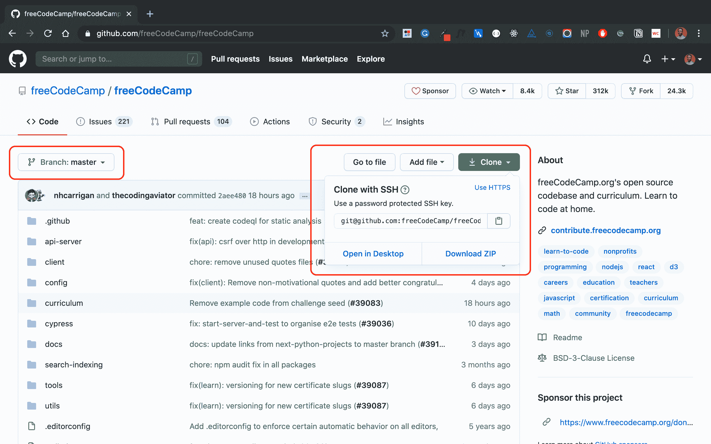
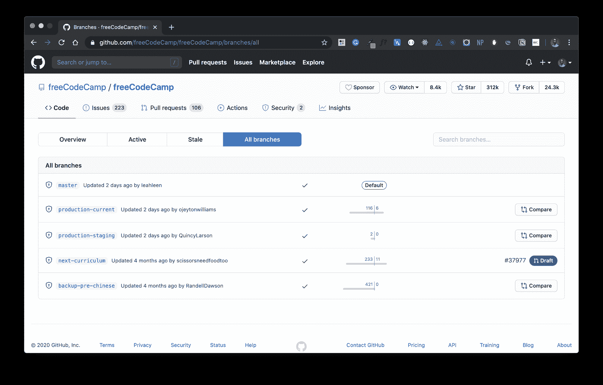
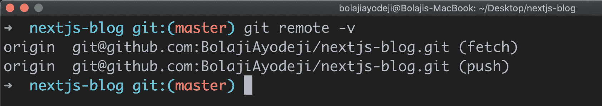
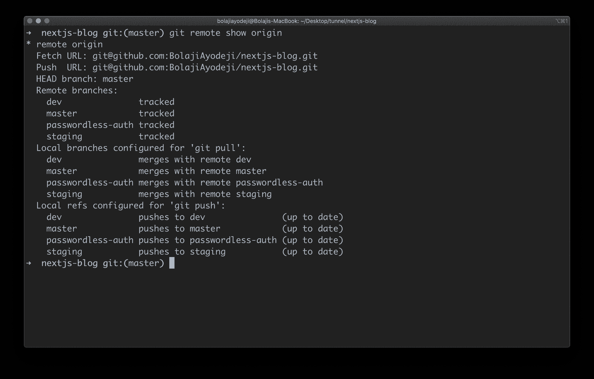
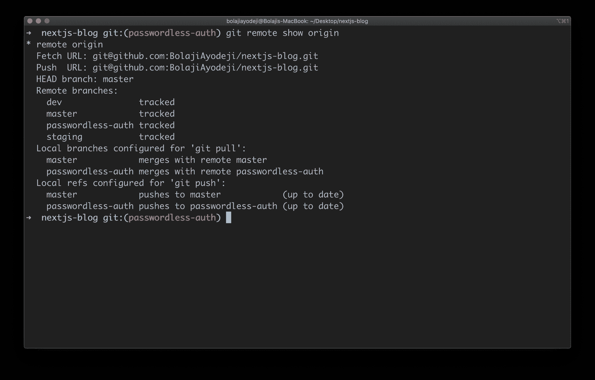
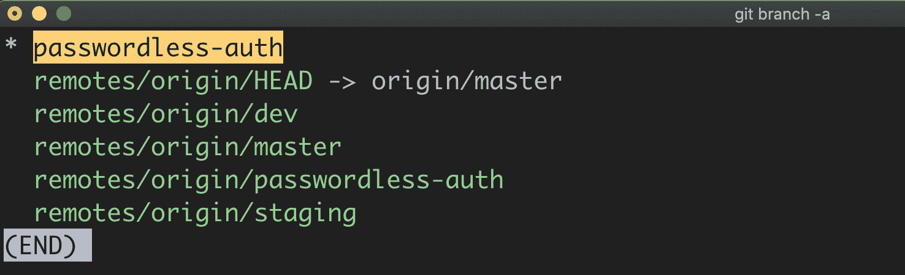
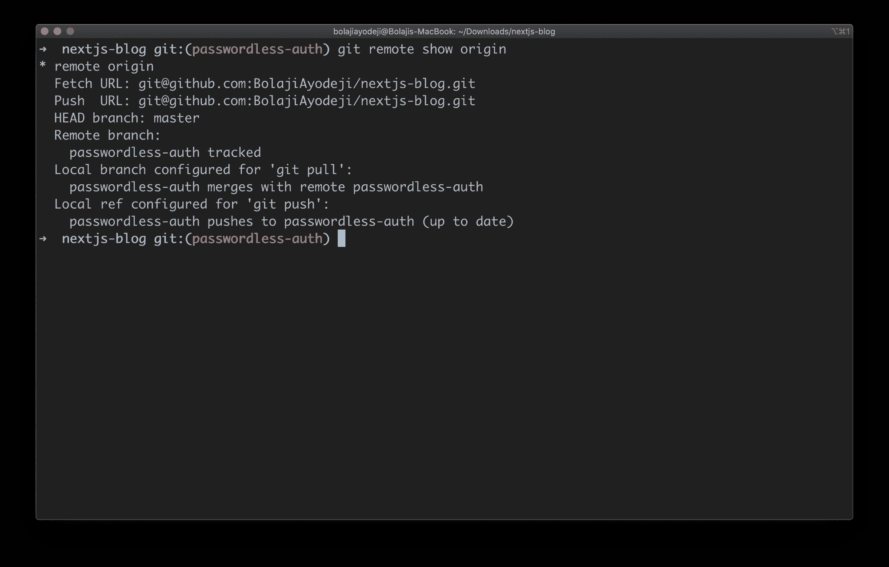

# Git 克隆分支——如何克隆特定的分支

> 原文：<https://www.freecodecamp.org/news/git-clone-branch-how-to-clone-a-specific-branch/>

与旧的集中式版本控制系统如 SVN 和 CVS 不同，Git 是分布式的。每个开发人员在本地或远程都有他们代码的完整历史和控制。他们还可以从不同的位置访问或操作他们认为合适的代码的几个部分。

自从 Linus Torvalds(Linux 操作系统内核的著名创造者)在 2005 年为 Linux 内核开发创建了 Git 以来，它已经成为世界上使用最广泛的现代版本控制系统。

在本文中，我将向您介绍 Git 克隆和 Git 分支工作流，并向您展示如何根据您的需求克隆特定的分支。我们开始吧！？

## 先决条件

*   终端的基本知识
*   能够在终端中键入命令
*   Git 已安装(我仍将向您展示如何安装)
*   GitHub 账户
*   脸上挂着微笑(收起那个微笑的朋友？)

## Git 和 GitHub 快速介绍

根据[维基百科](https://en.wikipedia.org/wiki/Git)，

> Git 是一个分布式版本控制系统，设计用于在软件开发中跟踪项目(代码)的变更。它旨在加强开发人员之间的协调、合作、速度和效率。

另一方面，GitHub 是一个基于网络的托管服务，使用 Git 进行版本控制。它提供了 Git 的所有分布式版本控制和源代码管理功能，并为计算机代码添加了更多特性。

## 如何在 Windows 上安装 Git

在这里下载并安装最新的 [Git for Windows Installer。](https://git-for-windows.github.io/)

## 如何在 Linux 上安装 Git

以下是基于您的 Linux 发行版的命令:

### Debian 还是 Ubuntu

```
sudo apt-get update
sudo apt-get install git
```

### 一种男式软呢帽

```
sudo dnf install git
```

### CentOS

```
sudo yum install git
```

### Arch Linux

```
sudo pacman -Sy git
```

### 巴布亚企鹅

```
sudo emerge --ask --verbose dev-vcs/git
```

## 如何在 Mac 上安装 Git

在此下载并安装最新的 [Git for Mac 安装程序。](https://sourceforge.net/projects/git-osx-installer/files/)

或者，您可以键入以下命令:

```
brew install git
```

现在我们已经安装了 Git，让我们继续学习教程。

## Git 克隆简介

Git 允许您在一个“存储库”中管理和版本化您的项目。这个存储库存储在基于 web 的托管服务上，用于版本控制，比如 GitHub。

然后，您可以将这个存储库克隆到您的本地机器上，并在本地拥有所有的文件和分支(我将很快解释更多关于分支的内容)。



例如，你可以像这样用 SSH 克隆 freeCodeCamp 的存储库:

```
git clone git@github.com:freeCodeCamp/freeCodeCamp.git
```

## Git 分支简介

当在一个项目中工作时，你可能会有不同的特性。多个贡献者将致力于这个项目及其功能。

分支允许你用`master`分支中的相同文件创建一个“游乐场”。您可以使用这个分支来构建独立的功能、测试新功能、进行突破性的更改、创建修复、编写文档或尝试想法，而不会破坏或影响产品代码。完成后，将分支合并到生产`master`分支中。

分支是 Git 中的一个核心概念，GitHub 也用它来管理一个项目不同版本的工作流。`master`分支总是存储库中的默认分支，通常被认为是“生产和可部署的代码”。像`passwordless-auth`或`refactor-signup-ux`这样的新分支可以从`master`分支中创建。



All branches in freeCodeCamp's repository

## 如何克隆 Git 分支

虽然您可以使用`git clone`命令克隆存储库，但是请记住，这将克隆分支和远程`HEAD`。默认情况下，这通常是`master`，包括存储库中的所有其他分支。

因此，当您克隆一个存储库时，您克隆了`master`和所有其他分支。这意味着你必须自己检查另一个分支。

假设您的项目任务是开发一个特性，将无密码身份验证添加到用户仪表板中。而这个特性在`passwordless-auth`分支。

你真的不需要`master`分支，因为你的“特征分支”之后会合并到`master`中。那么，如何克隆这个`passwordless-auth`分支，而不获取所有其他带有“一堆你不需要的文件”的分支？

我创建了这个样本库来解释这一点。这个存储库包含一个用 Nextjs 构建的简单博客，有四个虚拟分支:

*   掌握
*   偏差
*   脚手架
*   无密码授权

在 Nextjs 中，文件夹`pages/api`中的任何文件都被映射到`/api/*`路径，并将被视为 API 端点而不是`page`。在我们的资源库中，我在这个目录中创建了不同的虚拟 API[，以使每个分支都不同。](https://github.com/BolajiAyodeji/nextjs-blog/tree/master/pages/api)

`master`分支保存文件 **pages/api/hello.js** ，而`passwordless-auth`保存文件 **pages/api/auth.js** 。每个文件只返回一个虚拟文本响应。请看`master`的 hello API 响应[这里](https://nextjs-blog.bolajiayodeji.vercel.app/api/hello)(有一条特别的消息给你？).

让我们克隆存储库:

```
git clone git@github.com:BolajiAyodeji/nextjs-blog.git
```

这使我们能够访问这个存储库中的所有分支，您可以轻松地在每个分支之间切换，以查看每个版本及其文件。

```
git branch -a
```


好奇**遥控器/原点在哪里/..**树枝来自哪里？

当你克隆一个存储库时，你从互联网上的一个存储库或者一个叫做**远程**的内部服务器中提取数据。单词 origin 是由您的 Git 创建的一个别名，用来替换远程 URL(如果您愿意，可以更改或指定另一个别名)。

这些**遥控器/原点/..**分支将您指向从互联网克隆的原始存储库，因此您仍然可以从原始存储库执行拉/推操作。



所以当你把`master`克隆到你的机器上的时候，`remotes/origin/master`是互联网上原来的`master`分支，`master`在你的本地机器上。所以你将从`remotes/origin/master`来回拉动/推动。

总之 **Remote** 是指向互联网上的存储库的 URL，而 **Origin** 是这个远程 URL 的别名。



## 如何克隆特定的分支

现在让我们从我们的演示存储库中克隆一个特定的分支。有两种方法可以克隆特定的分支。您可以:

*   克隆存储库，获取所有分支，并立即签出到特定的分支。
*   克隆存储库并只获取一个分支。

### 选项一

```
git clone --branch <branchname> <remote-repo-url>
```

或者

```
git clone -b <branchname> <remote-repo-url>
```

Here **-b** is just an alias for **--branch**

这样，您可以获取存储库中的所有分支，签出到您指定的分支，并且这个特定的分支成为为`git push`和`git pull`配置的本地分支。但是您仍然从每个分支获取了所有文件。这可能不是你想要的，对吗？？

让我们来测试一下:

```
 git clone -b passwordless-auth git@github.com:BolajiAyodeji/nextjs-blog.git
```

这会自动将`passwordless-auth`配置为本地分支，但仍会跟踪其他分支。



### 选择二

```
git clone --branch <branchname> --single-branch <remote-repo-url>
```

或者

```
git clone -b <branchname> --single-branch <remote-repo-url>
```

Here **-b** is just an alias for **--branch**

除了在 Git 版本 1.7.10 和更高版本中引入了`--single-branch`选项之外，它执行与选项一相同的操作。它允许您只从指定的分支获取文件，而不获取其他分支。

让我们来测试一下:

```
git clone -b passwordless-auth --single-branch git@github.com:BolajiAyodeji/nextjs-blog.git
```

这会自动将`passwordless-auth`配置为本地分支，并且只跟踪该分支。



如果你运行`cd pages/api`，你会在`passwordless-auth`分支中找到`auth.js`文件，正如之前设置中所预期的那样。

## 结论

您可能用完了互联网或存储空间，但您需要在特定分支中执行任务。或者，出于各种原因，您可能希望克隆一个包含有限文件的特定分支。幸运的是，Git 为您提供了实现这一点的灵活性。舒展你的肌肉，尝试一下，有更多的“Git”要学。

一次一个，耶？✌?