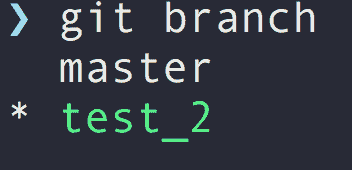
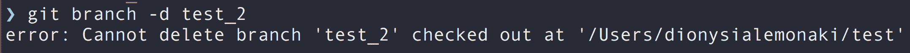
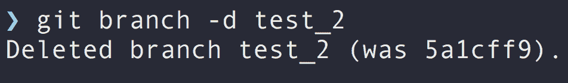
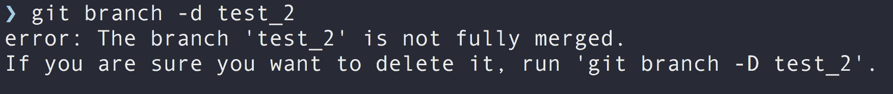
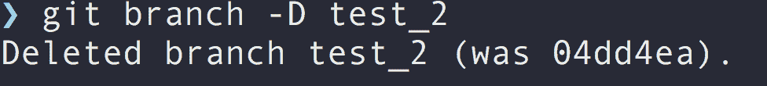
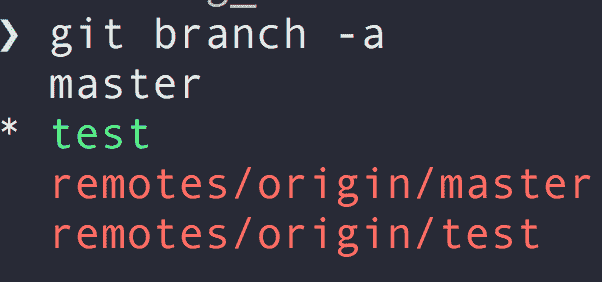
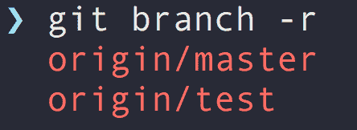
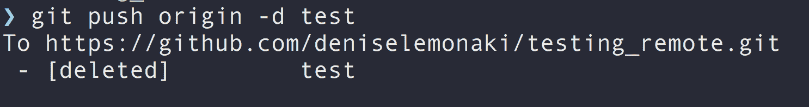
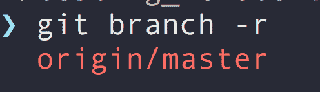

# Git 删除分支——如何删除本地或远程分支

> 原文：<https://www.freecodecamp.org/news/git-delete-branch-how-to-remove-a-local-or-remote-branch/>

Git 是一个流行的版本控制系统，也是 web 开发人员工具箱中的一个重要工具。

分支是使用 Git 的一个强大且不可或缺的部分。

在本文中，您将学习如何在 Git 中删除本地和远程分支的基础知识。

## Git 中的分支是什么？

分支是指向提交的指针。

Git 分支是项目及其变更的快照，从一个特定的时间点开始。

当从事一个大项目时，有一个包含所有代码的主存储库，通常称为`main`或`master`。

分支允许您创建原始主工作项目的新的独立版本。您可能会创建一个分支来编辑它，以进行更改、添加新功能，或者在尝试修复 bug 时编写测试。一个新的分支让您可以在不影响主代码的情况下完成这项工作。

总而言之，分支允许你在不影响核心代码的情况下对代码库进行修改，直到你完全准备好实现这些修改。

这有助于保持代码库整洁有序。

## 为什么要在 Git 中移除分支？

因此，您已经创建了一个分支来保存您想要在项目中进行更改的代码。

然后，您将该变更或新特性合并到项目的原始版本中。

这意味着您不再需要保留和使用那个分支，所以删除它是一个常见的最佳实践，这样就不会弄乱您的代码。

## 如何在 Git 中删除本地分支

本地分支是本地计算机上的分支，不会影响任何远程分支。

在 Git 中删除本地分支的命令是:

```
git branch -d  local_branch_name 
```

*   `git branch`是本地删除分支的命令。
*   `-d`是一个标志，命令的一个选项，是`--delete`的别名。顾名思义，它表示你想删除一些东西。- `local_branch_name`是要删除的分支的名称。

让我们通过一个例子更详细地研究一下这个问题。

要列出所有本地分支，可以使用以下命令:

```
git branch 
```

我有两个，分支，`master`和`test2`。我目前在`test2`分公司，如`(*)`所示:



我想删除`test2`分支，但是无法删除您当前正在查看的分支。

如果您尝试这样做，将会得到类似如下的错误:



因此，在删除一个本地分支之前，确保使用`git checkout`命令切换到您不想删除的另一个分支:

```
git checkout branch_name

#where branch_name is the name of the branch you want to move to
#in my case the other branch I have is master, so I'd do:
#git checkout master 
```

以下是输出结果:


现在我可以删除分支:



我们刚刚使用的删除本地分支的命令并不是在所有情况下都有效。

如果分支包含未合并的变更和未推送的提交，`-d`标志将不允许删除本地分支。

这是因为提交不会被任何其他分支看到，Git 会保护您不会意外丢失任何提交数据。

如果您尝试这样做，Git 将向您显示一个错误:



正如错误所暗示的，您需要使用`-D`标志来代替:

```
git branch -D local_branch_name 
```

带有大写字母 D 的`-D`标志(它是`-- delete --force`的别名)强制删除本地分支，不考虑其合并状态。

但是注意**你应该小心使用这个命令**，因为没有提示要求你确认你的操作。

仅当您完全确定要删除本地分支时，才使用它。

如果您没有将它合并到另一个本地分支中，或者将它推到代码库中的一个远程分支中，您将面临丢失您所做的任何更改的风险。



## 如何在 Git 中删除远程分支

远程分支机构独立于本地分支机构。

它们是托管在远程服务器上的存储库，可以在那里访问。这与本地分支不同，本地分支是本地系统上的存储库。

删除远程分支的命令是:

```
git push remote_name -d remote_branch_name 
```

*   您可以使用`git push`命令删除远程分支，而不是使用用于本地分支的`git branch`命令。
*   然后指定遥控器的名称，在大多数情况下是`origin`。
*   `-d`是删除的标志，是`--delete`的别名。
*   `remote_branch_name`是要删除的远程分支。

现在，让我们看一个如何删除远程分支的例子。

要查看任何远程分支，可以使用以下命令:

```
git branch -a 
```

`-a`标志(`--all`的别名)显示所有分支——本地和远程。



我有两个本地分支叫做`master`和`test`，还有两个远程分支`origin/master`和`origin/test`。

`-r`(T1 的别名)只向*和*显示远程存储库。



我想删除远程`origin/test`分支，所以我使用命令:

```
git push origin -d test 
```

输出:



这删除了名为`origin`的远程存储库中的`test`分支。

`origin/test`远程存储库不再存在:



## 结论

您现在知道了如何在 Git 中删除本地和远程分支。

如果你想了解更多关于 Git 的知识，你可以在 freeCodeCamp 的 YouTube 频道上观看以下课程:

*   了解如何设置 git，以及重要 Git 命令和典型 Git 工作流的概述—[Git 和 GitHub 初学者速成班](https://www.youtube.com/watch?v=RGOj5yH7evk)。
*   更深入地研究分支并了解它们是如何工作的—[Git 分支教程](https://www.youtube.com/watch?v=e2IbNHi4uCI&t=6s)。

感谢阅读，快乐学习！