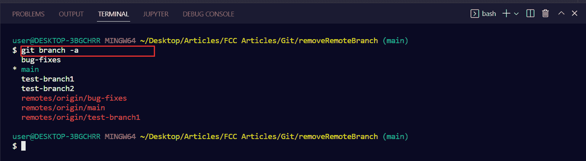
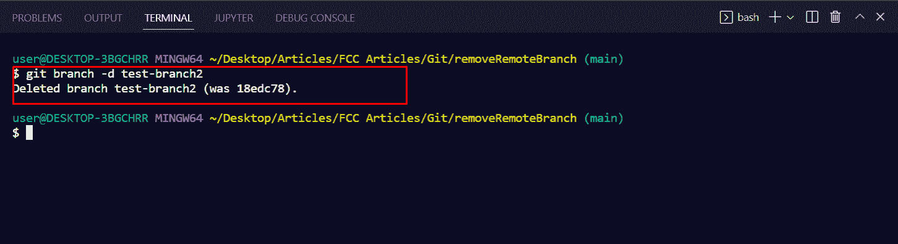
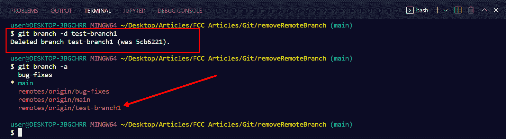
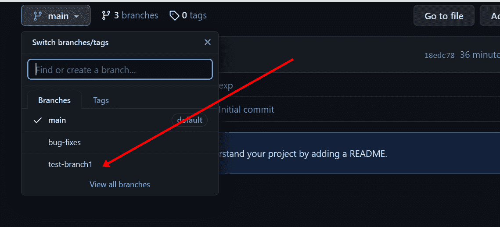
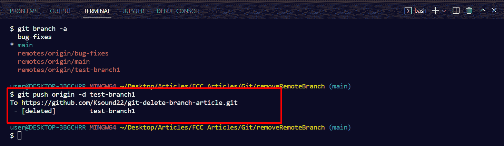
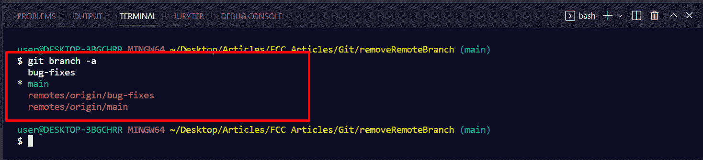
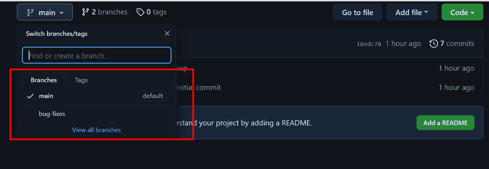

# Git 删除远程分支——如何在 Git 中删除远程分支

> 原文：<https://www.freecodecamp.org/news/git-delete-remote-branch/>

当您使用 Git 时，出于各种原因，您可能希望删除推送到 GitHub 等平台的远程分支。

在本文中，我将向您展示如何在 Git 中删除远程分支。但是首先，让我们看看如何删除本地分支。

我将在本文中使用 Git bash，因为它使使用 Git 比任何其他终端都容易。但是如果你使用另一个终端也没关系。命令仍然是相同的。

## 如何在 Git 中删除本地分支

运行`git branch`或`git branch -a`来查看您为项目创建的分支。

如果您特别运行`git branch -a`，它将使远程分支不同。这是我只在 Git bash 中见过的一个特性。

在这种情况下，`test-branch2`是我尚未推送的分支，因此它是一个本地分支。

要删除本地分支，运行`git branch -d branch-name`。

如果您正确地输入命令，您将得到一个响应，表明该分支已被删除。

## 如何在 Git 中删除远程分支

如果您尝试使用删除本地分支时使用的同一命令来删除远程分支，您将收到一条消息，提示该分支已被删除。但是如果运行`git branch -a`，分支还是会列出来。

而如果检查 GitHub，分支还是会在:

要完全删除远程分支，您需要使用带有`-d`标志的`git push origin`命令，然后指定远程分支的名称。

因此，表示删除远程分支命令的语法如下所示:`git push origin -d branch-name`。

例如，要删除`test-branch1`分支，我将运行`git push origin –d test-branch1` :

要验证远程分支是否已被删除，请再次运行`git branch -a`。

您可以看到远程分支`test-branch1`不再列出。

再去查 GitHub，就不在了:

## 包扎

请记住，要从项目中完全删除一个 Git 分支，您需要使用`git push origin`命令。

那是因为你已经推过树枝了。因此，运行`git branch -d`命令只会在本地删除分支。

如果使用 Git 有问题，我建议您将终端切换到 Git bash。这是因为它对所有内容都进行了语法突出显示——这使得使用 g it 更加容易。

感谢您的阅读。