# Git diff 命令——如何比较代码中的变化

> 原文：<https://www.freecodecamp.org/news/git-diff-command/>

嘿，朋友们，你有没有在 Git 中工作过，发现自己不知道是否要进行正确的修改？

或者，您可能想要查看与上次提交相比，您将要提交的更改。也许您想看看两个分支、提交或文件之间的区别。

这些是使用版本控制系统时的常见问题和任务。幸运的是，您可以使用 Git diff 命令来验证这一切。

我知道你可能担心你的时间，所以让我们上路吧。

别担心，我会用一个有趣的例子教你每个命令。刚开始兴致勃勃的看文章。

## `git diff`–通用差异命令

`git diff`列出了**当前工作目录和暂存区**之间的变化。

让我们举个例子:我创建了一个名为`cat_vs_dog`的 Git 存储库。不，这不是正式的回购，但它是相当严重的😉。然后我创造了`cat.txt`和`dog.txt`。

他们用自己的名字介绍自己，就像这样:

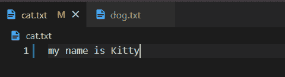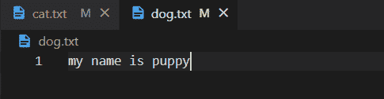

然后我们使用`git add cat.txt dog.txt`将这个变更移动到临时区域。想确认一下吗？然后使用`git status`，它显示了哪些更改已经准备好提交，如下所示:

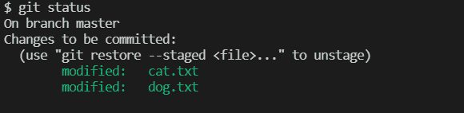

然后，假设我想对狗的名字做一些修改——比如我想叫它“小狗”,而不是“小狗”。

在此之前，如果我运行`git diff`命令，它显示**什么也没有**。你能猜到原因吗？如果你不能，那也没关系。继续和我一起旅行，在这上面暂停几秒钟。

现在，我把“小狗”改成了“小狗”。叫它小狗很酷。

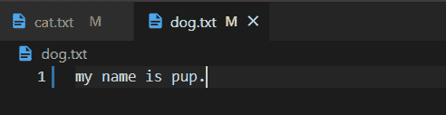

在暂存它们之前，我希望看到我在当前工作目录(即当前工作文件夹)中更改的内容与暂存的更改相比较。

为此，我运行`git diff`命令。现在你可以在下面看到它们的区别。

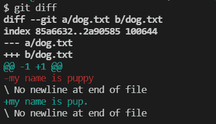

这有点道理，但也有点奇怪，对吧？不要害怕，我在这里教你每一行 diff 的结果。

之前，我们运行了`git diff`命令，但没有显示任何内容。因为`git diff`显示了你的工作目录和 staged 区域变化的区别。但是，在我们进行更改之后，我们没有更改工作目录中的任何内容。因此，与舞台区相比，没有什么不同。我希望这有意义。

## 逐行了解`git diff`的结果

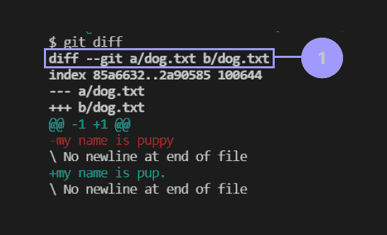

**第 1 行**–这是同一个文件的两个版本。Git 将其命名为**第一版**的 **A** 和**第二版**的 **B** 。

*   a–文件的旧版本
*   b–文件的新版本

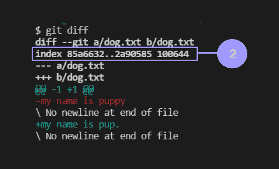

**第 2 行**–关于对你的生活不是超级有用的文件的元数据。前两个散列与两个被比较的文件有关。 **100644** 是内部文件模式标识符。

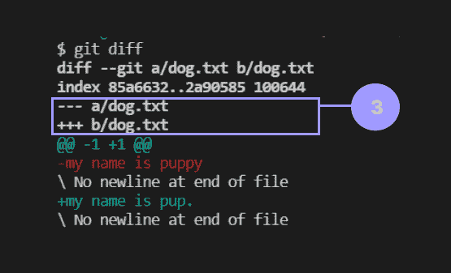

**第 3 行**–Git 给文件的 **A** 版本分配一个减号(-)，给文件的 **B** 版本分配一个加号(+)。

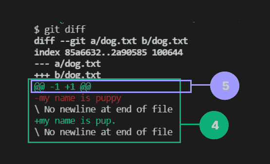

**第 4 行–**Git 通常显示已经被修改的一大块**行**，而不是整个文件。

*   以(-)符号开始的行来自 A 版本
*   以(+)符号开始的行来自 B 版本

除了修改过的代码行之外，这些代码行还包括该代码块前后的一些代码行，以显示上下文。

**第 5 行**–每个块都以一个**块头**开始。块头将由 **@@** 标识(在开始和结束)。然后，有两组数字。能看到 **-1** 和 **+1** 吗？

*   **-1** 表示从 **A 版本**文件中，从第 1 行开始提取一行。
*   **+1** 表示从 **B 版**文件中，从第 1 行开始提取一行。

如果集合看起来像 **-3，4** **+3，2，**，那么:

*   **-3，4** 表示从 **A 版本**文件中，从第 3 行开始提取四行。
*   **+3，2** 表示从 **B 版**文件中，从第 3 行开始提取两行。

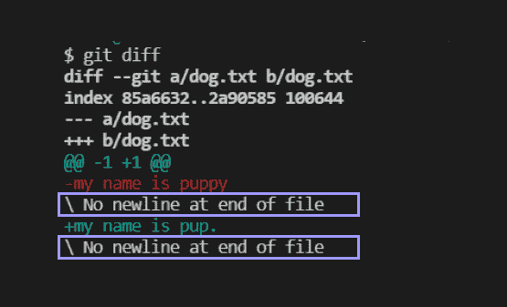

**在文件**的结尾没有换行–文本表明在那些被修改的行之后没有任何行。这意味着，在上面的例子中，我只添加了一行，并修改了同一行。所以，那之后就没有台词了。

这就是为什么它在 diff 的结果中显示"*在文件结尾没有换行"*。希望你明白我的意思。

## 庆祝时间

花一点时间庆祝你的认知努力。因为你已经染指了 diff 的成果。现在，您已经有了坚实的基础，可以微笑着开始学习更多的命令....

## 如何比较 Git 中的阶段性变化

在提交您的更改之前，您可以将**阶段化的更改与上次提交的**进行比较。您可以通过添加单个标志`--staged`或`--cached`来实现这一点。我喜欢`--staged`，因为它有意义。如果你更喜欢`--cached`，那也不错。

我通过一个例子来解释一下。首先，我们在`cat_vs_dog`回购中提交我们的阶段性变化。如果你不记得我们上演了什么，他们介绍自己是小猫和小狗。

在那里，我们想做一些改变——也就是说，我们希望将“puppy”改为“pup ”,而不是上演。

好的，首先我们通过`git commit -m "intro to cat and dog"`提交阶段性变更:

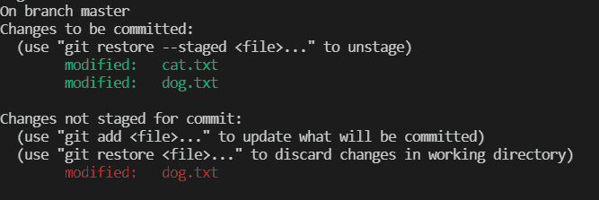

现在，上演“小狗”到“小狗”的变化。然后，运行`git diff --staged`命令，该命令列出了**暂存区域**和**最后一次提交**之间的变化。

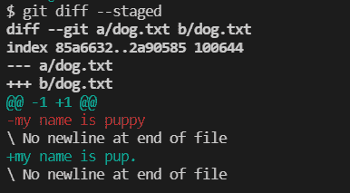

*   **一个版本——**最后一次提交，包含`dog.txt`中的行`my name is puppy`
*   **B 版本**–与上次提交不同的暂存区。像`dog.txt`里的“小狗”到“小狗”。

从 diff 的结果来看，我们清除了我们修改和登台的内容——A 版的“我的名字是小狗”, B 版的“我的名字是小狗”。

我希望您现在能够比较这些变化，并通过查看 diff 的结果来认识到我们改变了什么。`diff`是一个超级强大的命令，可以让你以多种方式比较变化。

## 你需要知道的 4 个差异比较

您可以运行`git diff HEAD`命令，将暂存和未暂存的更改与您上次提交的更改进行比较。

您还可以运行`git diff <branch_name1> <branch_name2>`命令来比较第一个分支的变更和第二个分支的变更。在比较分支时，顺序确实很重要。所以 diff 的结果会根据顺序变化。

提示:分支比较只考虑提交。它不寻找分阶段和未分阶段的变化。

您可以运行`git diff <commit_hash> <commit_hash>` 命令来比较两次提交之间的变化。像分支比较一样，顺序在比较提交时也很重要。

您可以运行以下命令来比较特定文件的更改:

*   `git diff HEAD <file_name>`
*   `git diff <file_name>`
*   `git diff --staged <file_name>`或`git diff --cached <file_name>`，
*   `git diff <branch_name1> <branch_name2> <file_name>`
*   `git diff <commit_hash> <commit_hash> <file_name>`

## 结论

我希望这篇文章能帮助你更准确地进行下一次提交。在使用 Git 命令时，您的心态很重要。自信地处理它，你可以从任何错误中学习。

如果您在本教程中发现任何需要更新的内容，请随时联系我😜。