# Git 内部的可视化指南——对象、分支以及如何从头开始创建 Repo

> 原文：<https://www.freecodecamp.org/news/git-internals-objects-branches-create-repo/>

我们很多人每天都在使用`git`。但是我们中有多少人知道引擎盖下发生了什么？

比如我们用`git commit`会怎么样？提交之间存储了什么？这仅仅是当前提交和先前提交之间的差异吗？如果是，diff 是如何编码的？还是每次都存储回购的整个快照？当我们使用`git init`时会发生什么？

很多用`git`的人都不知道上面问题的答案。但这真的重要吗？

首先，作为专业人士，我们应该努力理解我们使用的工具，尤其是如果我们一直在使用它们的话——就像`git`。

但是更尖锐的是，我发现理解 git 实际上是如何工作的在许多场景中都是有用的——无论是解决合并冲突，寻求进行一次有趣的重新定基，或者甚至只是当有些事情稍微出错的时候。

如果你对`git`有足够的经验，能够自如地使用`git pull`、`git push`、`git add`或`git commit`这样的命令，你会从这篇文章中受益。

尽管如此，我们将从一个概述开始，以确保我们在关于`git`的机制，特别是这篇文章中使用的术语方面有相同的看法。

我还上传了一个关于这篇文章的 YouTube 系列——欢迎你在这里观看。

# 从本教程中可以期待什么

我们将很难理解在我们几乎每天所做的事情背后发生了什么。

我们将从覆盖对象开始— **斑点、树、**和**提交。**然后我们将简要讨论**分支**以及它们是如何实现的。我们将深入到**工作目录、暂存区**和**存储库**。

我们将确保理解这些术语与我们所知道并用于创建新存储库的`git`命令的关系。

接下来，将从头开始创建一个存储库——不使用`git init`、`git add`或`git commit`。这将让我们**在与`git`合作时，加深对幕后发生的事情**的理解。

我们还将创建新的分支，切换分支，并创建额外的提交—所有这些都不使用`git branch`或`git checkout`。

到这篇文章结束时，**你会觉得你*理解*** `**git**`。你准备好了吗？😎

# Git 对象— blob、树和提交

将`git`理解为维护一个文件系统是非常有用的，具体来说就是这个系统的快照。

文件系统以一个*根目录*(在基于 UNIX 的系统中为`/`)开始，它通常包含其他目录(例如`/usr`或`/bin`)。这些目录包含其他目录和/或文件(例如，`/usr/1.txt`)。

在`git`中，文件的内容存储在名为**blob**的对象中，二进制大对象。

**blob**和文件的区别在于文件也包含元数据。例如，一个文件“记得”它是何时创建的，因此如果您将该文件移动到另一个目录中，它的创建时间保持不变。

另一方面，Blobs 只是内容——二进制数据流。一个 **blob** 不注册它的创建日期、名字或者除了它的内容之外的任何东西。

`git`中的每个**斑点**由其 [SHA-1 散列](https://en.wikipedia.org/wiki/SHA-1)识别。SHA-1 哈希由 20 个字节组成，通常用 40 个十六进制字符表示。在这篇文章中，我们有时会只显示散列的前几个字符。

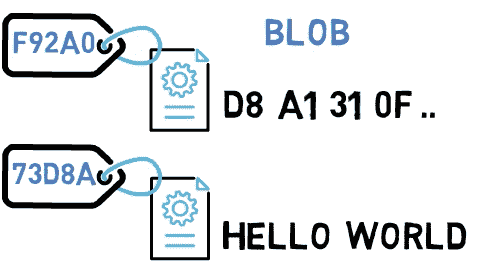

在`git`中，相当于目录的是一棵**树**。一个**树**基本上是一个目录列表，引用**斑点**以及其他**树**。

**树**也通过它们的 SHA-1 散列来识别。参考这些对象，无论是**斑点**还是其他**树**，都是通过对象的 SHA-1 散列发生的。

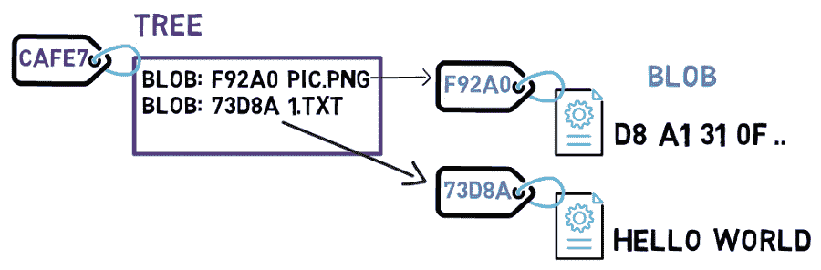

注意，**树** **CAFE7** 将**斑点 F92A0** 称为*pic.png。*在另一个**树**中，同一个**斑点**可能有另一个名字。

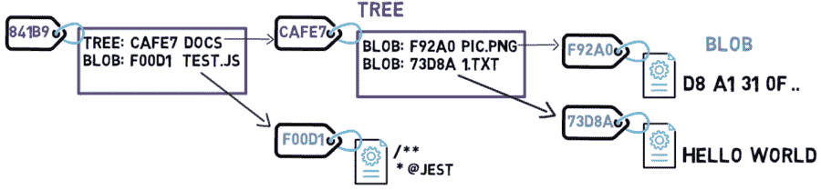

上图相当于一个文件系统，根目录在`/test.js`有一个文件，名为`/docs`的目录有两个文件:`/docs/pic.png`和`/docs/1.txt`。

现在是时候拍摄该文件系统的快照了，并存储当时存在的所有文件及其内容。

在`git`中，快照是一个**提交**。一个**提交**对象包括一个指向主**树**(根目录)的指针，以及其他元数据，如**提交者**、**提交**消息和**提交**时间。

在大多数情况下，一个**提交**也有一个或多个父**提交**——之前的快照。当然，**提交**对象也通过它们的 SHA-1 散列来标识。这些是我们在使用`git log`时习惯看到的哈希。

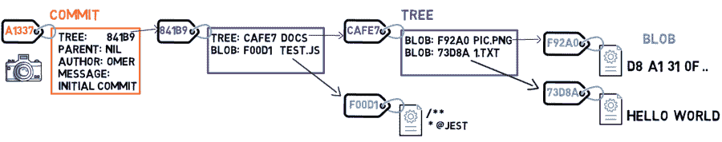

每次**提交**都会保存*的整个快照*，而不仅仅是与之前的**提交**不同。

这怎么可能呢？这难道不意味着我们每次提交都必须存储大量数据吗？

让我们来看看如果我们改变文件的内容会发生什么。比方说我们编辑`1.txt`，加一个感叹号——也就是我们把内容从`HELLO WORLD`，改成了`HELLO WORLD!`。

这个变化意味着我们有了一个新的 **blob，**和一个新的 SHA-1 hash。这是有意义的，因为`sha1("HELLO WORLD")`不同于`sha1("HELLO WORLD!")`。

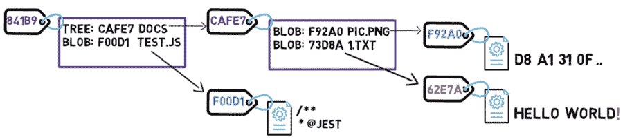

既然我们有了新的散列，那么**树**的列表也应该改变。毕竟，我们的**树**不再指向 **blob 73D8A** ，而是指向 **blob 62E7A** 。当我们改变**树**的内容时，我们也改变了它的散列。

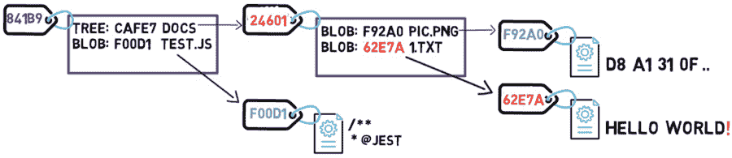

The tree that points to the changed blob needs to change as well

而现在，由于那个 ****树**** 的 hash 不同，我们也需要改变父 ****树**** —因为后者不再指向 ****树 CAFE7**** ，而是 ****树 24601**** 。因此， ****父**** ****树**** 也将有一个新的散列。

几乎准备好创建一个新的 **commit** 对象了，看起来我们要再次存储大量数据—整个文件系统！但这真的有必要吗？

实际上，一些对象，特别是 **blob** 对象，自上次提交以来没有改变过——**blob f92a 0**保持不变， **blob F00D1 也是如此。**

这就是诀窍——只要一个对象没有改变，我们就不会再次存储它。在这种情况下，我们不需要再次存储**斑点 F92A0** 和**斑点 F00D1** 。我们只通过它们的哈希值来指代它们。然后我们可以创建我们的**提交**对象。

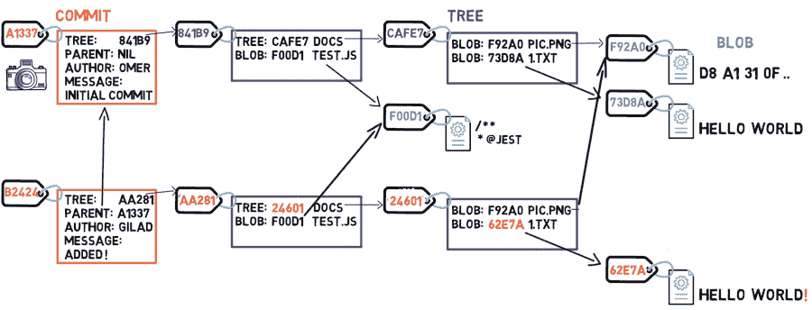

Blobs that remained intact are referenced by their hash values

由于这个**提交**不是第一个**提交**，它有一个父**提交 A1337** 。

#### 概括一下，我们引入了三个 git 对象:

*   **blob —** 文件的内容。
*   **树**——一个目录列表(关于**斑点**和**树**)。
*   **提交** —工作树的快照。

让我们考虑一下这些对象的散列。假设我写了字符串`git is awesome!`并从中创建了一个 **blob** 。你在你的系统上做了同样的事情。我们会有同样的杂烩吗？

答案是——是的。由于**斑点**由相同的数据组成，它们将具有相同的 SHA-1 值。

如果我做了一个引用了`git is awesome!`的 **blob** 的**树**，并给它一个特定的名称和元数据，而你在你的系统上做了完全相同的事情，会怎么样呢？我们会有同样的杂烩吗？

再说一遍，是的。因为**树**对象是相同的，所以它们会有相同的散列。

如果我用提交消息`Hello`创建了那个**树**的**提交**，而你在你的系统上做了同样的事情，会怎么样呢？我们会有同样的杂烩吗？

在这种情况下，答案是——不。即使我们的**提交**对象引用同一个**树**，它们也有不同的**提交**细节——时间、提交者等。

# Git 中的分支

分支只是对提交的命名引用。

我们总是可以通过它的 SHA-1 散列来引用一个**提交**，但是人们通常更喜欢用其他形式来命名对象。一个**分支**是引用一个**提交**的一种方式，但实际上就是这样。

在大多数存储库中，开发的主线是在一个叫做`master`的分支中完成的。这只是一个名字，是我们使用`git init`时创建的，使得它被广泛使用。然而，它一点也不特别，我们可以使用我们喜欢的任何其他名称。

通常，该分支指向我们当前工作的开发路线中最近的**提交**。

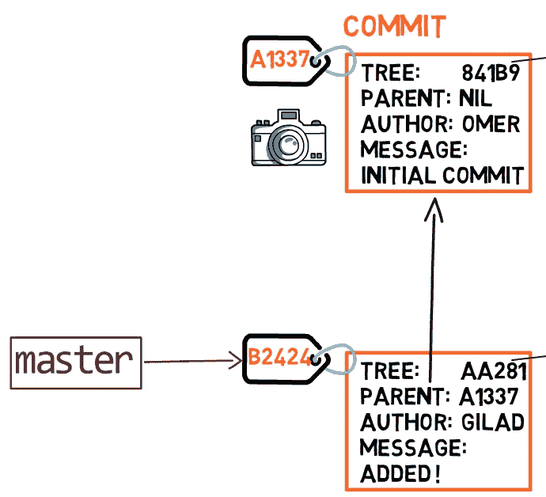

为了创建另一个分支，我们通常使用`git branch`命令。通过这样做，我们实际上创建了另一个指针。因此，如果我们创建一个名为`test`的分支，通过使用`git branch test`，我们实际上创建了另一个指针，它指向与我们当前所在的分支相同的**提交**。

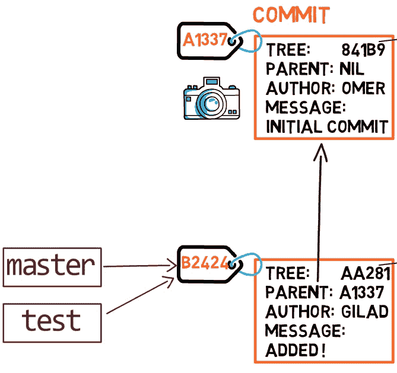

Using `git branch` creates another pointer

`git`如何知道我们目前在哪个分支？它保留了一个名为`HEAD`的特殊指针。通常，`HEAD`指向一个分支，该分支又指向一个**提交**。在某些情况下，`HEAD`也可以直接指向一个**提交**，但是我们不会关注这个。

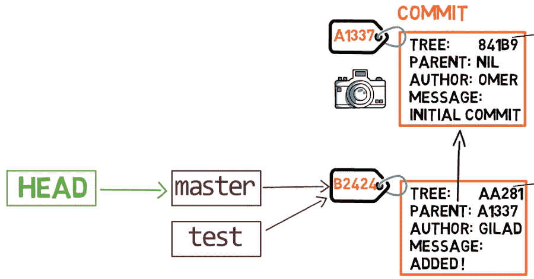

HEAD points to the branch we are currently on.

为了将活动分支切换到`test`，我们可以使用命令`git checkout test`。现在我们已经可以猜到这个命令实际上做了什么——它只是将`HEAD`改为指向`test`。

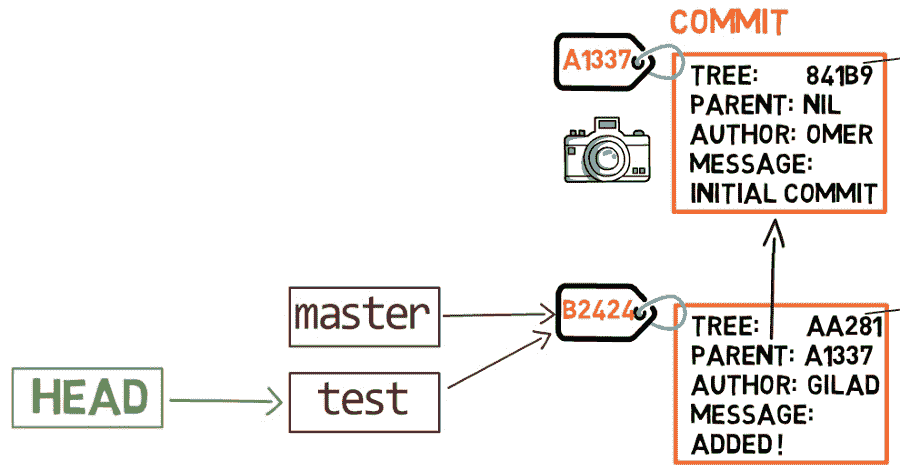

`git checkout test` changes where `HEAD` points

我们也可以在创建`test`分支之前使用`git checkout -b test`，这相当于运行`git branch test`来创建分支，然后`git checkout test`移动`HEAD`指向新的分支。

如果我们做了一些更改，并使用`git commit`创建一个新的**提交**，会发生什么？新的**提交**将被添加到哪个分支？

答案是`test`分支，因为这是活动分支(因为`HEAD`指向它)。之后，`test`指针将移动到新添加的**提交**。注意`HEAD`仍然指向`test`。

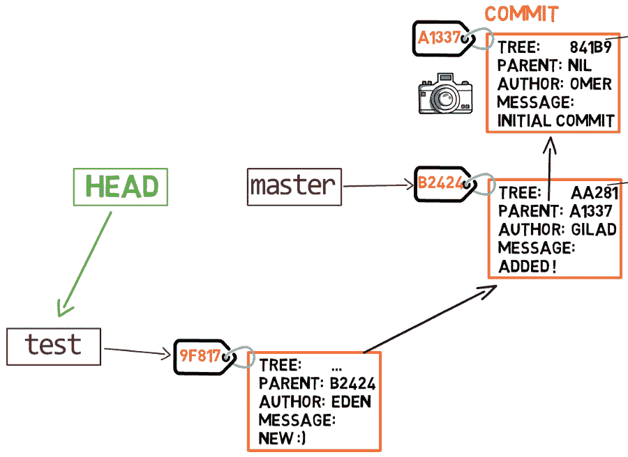

Every time we use `git commit`, the branch pointer moves to the newly created commit.

所以如果我们通过`git checkout master`回到主节点，我们移动`HEAD`再次指向`master`。

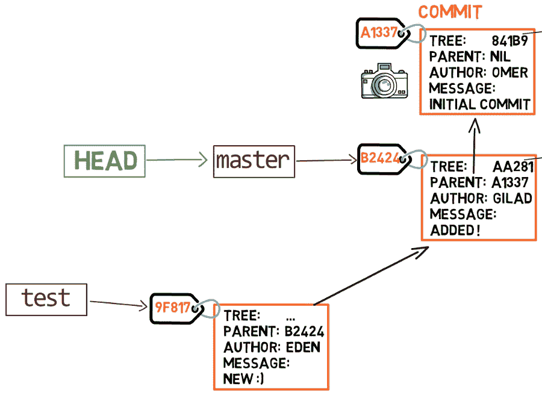

现在，如果我们创建另一个**提交**，它将被添加到`master`分支(其父将是**提交 B2424** )。

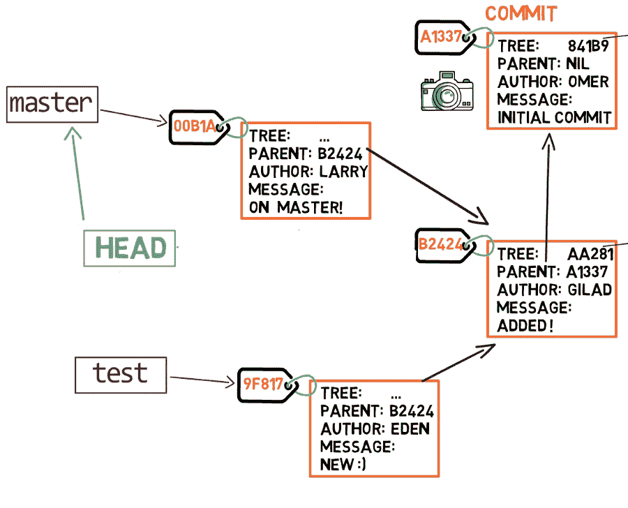

# 如何在 Git 中记录变化

通常，当我们在源代码上工作时，我们从一个**工作目录**开始工作。一个**工作目录(e story)**(或者**工作树** ) 是我们的文件系统中任何一个有**库**与之关联的目录。它包含我们项目的文件夹和文件，还有一个名为`.git`的目录，我们将在后面详细讨论。

在我们做了一些更改之后，我们希望将它们记录在我们的**存储库**中。一个**库**(简而言之:**回购**)是一个**提交**的集合，每个提交都是项目的**工作树**在过去某个日期的样子的档案，无论是在我们的机器上还是在其他人的机器上。

一个**库**还包括我们代码文件之外的东西，比如`HEAD`，分支，等等。

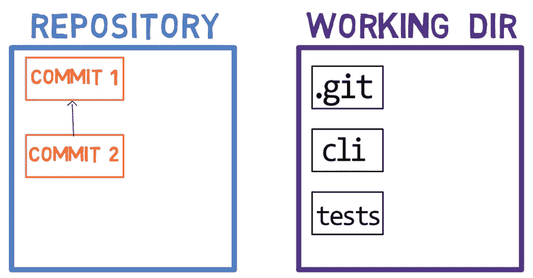

与您可能使用过的其他类似工具不同，`git`不会将**工作树**中的变更直接提交到**库**中。取而代之的是，变更首先被注册在一个叫做**索引**或**暂存区**的地方。

这两个术语指的是同一个东西，它们经常在`git`的文档中使用。在这篇文章中，我们将交替使用这些术语。

当我们`checkout`一个分支时，`git`用最后签出到我们的**工作目录**中的所有文件内容和它们最初被签出时的样子填充**索引**。当我们使用`git commit`时，基于**索引**的状态创建**提交**。

使用**索引**允许我们仔细准备每个**提交**。例如，在我们的**工作目录**中，自从我们最后一次**提交**以来，我们可能有两个文件发生了变化。我们可以只将其中一个添加到**索引**(使用`git add`)，然后使用`git commit`只记录这个变化。

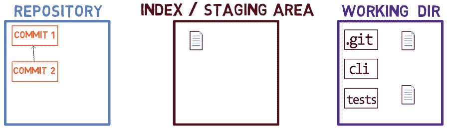

我们的**工作目录**中的文件可以处于两种状态之一:**被跟踪**或**未被跟踪**。

**被跟踪的文件**是`git`知道的文件。它们或者在最后一个快照中(**提交**，或者它们现在正在**暂存**(也就是说，它们在**暂存区**)。

**未跟踪的文件**是所有其他的东西——我们的**工作目录**中的任何文件，它们不在我们的最后一个快照(**提交**)中，也不在我们的**暂存区**中。

# 如何创建回购——传统方式

让我们确保理解我们引入的术语如何与创建**库**的过程相关联。在我们更深入地研究这个过程之前，这只是一个快速的高级视图。

注意—大多数带有 shell 命令的帖子都显示 UNIX 命令。为了区别起见，我将提供 Windows 和 UNIX 的命令，以及来自 Windows 的屏幕截图。当命令完全相同时，我将只提供一次。

我们将使用`git init repo_1`初始化一个新的**存储库**，然后使用`cd repo_1`将我们的目录更改为存储库的目录。通过使用`tree /f .git`，我们可以看到运行`git init`在`.git`中产生了相当多的子目录。(标志`/f`包括`tree`输出中的文件)。

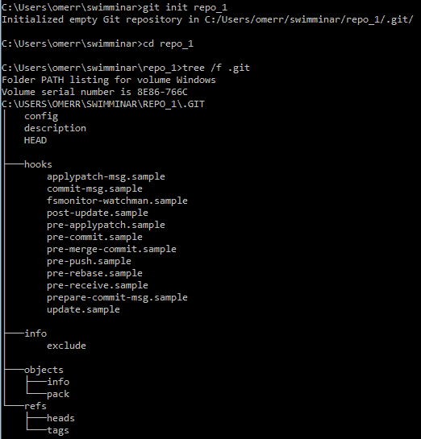

让我们在`repo_1`目录中创建一个文件:

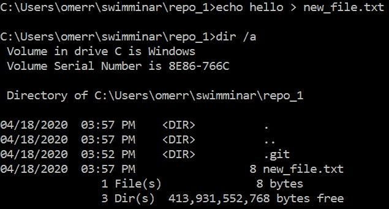

在 Linux 系统上:

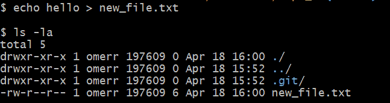

这个文件在我们的**工作目录**中。然而，由于我们没有将它添加到**集结区**，它目前是**未被跟踪**。让我们用`git status`来验证一下:

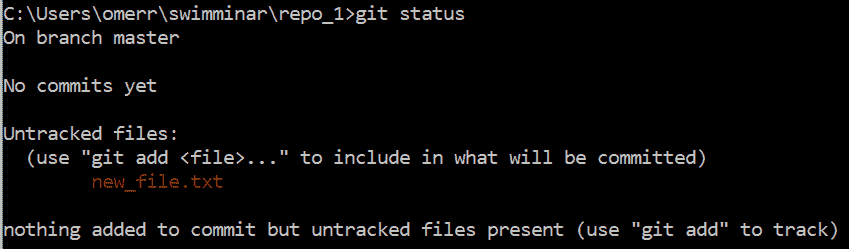

The new file is untracked as we haven’t added it to the staging area, and it wasn’t included in a previous commit

我们现在可以通过使用`git add new_file.txt`将这个文件添加到**暂存区**。我们可以通过运行`git status`来验证它是否已被转移:

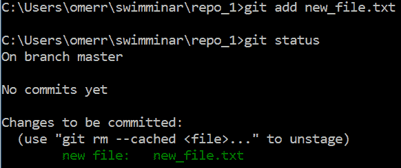

Adding the new file to the staging area

我们现在可以使用`git commit`创建一个**提交**:

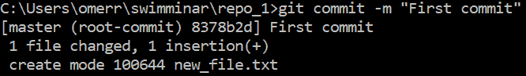

`.git`目录中发生了变化吗？让我们运行`tree /f .git`来检查:

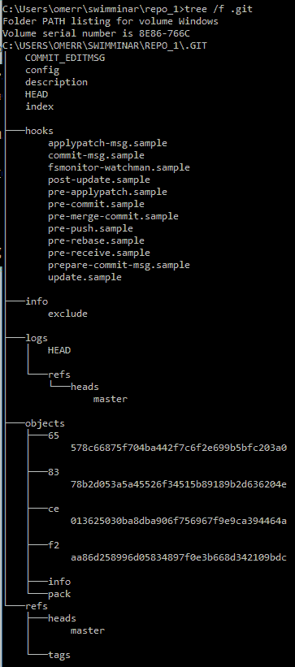

A lot of things have changed within `.git`

显然，很多事情都变了。是时候更深入地研究一下`.git`的结构，理解当我们运行`git init`、`git add`或`git commit`时，在引擎盖下发生了什么。

# 是时候得到硬核了

到目前为止，我们已经介绍了一些 Git 基础知识，现在我们准备好真正开始 Git 了。

为了深入理解`git`是如何工作的，我们将创建一个 ****存储库**** ，但是这一次—我们将从头开始构建它。

我们不会使用`git init`、`git add`或`git commit`，这样可以让我们更好地理解这个过程。

# 如何设置`.git`

让我们创建一个新目录，并在其中运行`git status`:

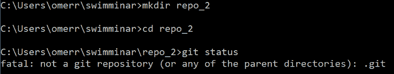

好吧，所以`git`看起来不高兴，因为我们没有`.git`文件夹。很自然的事情就是简单地创建这个目录:

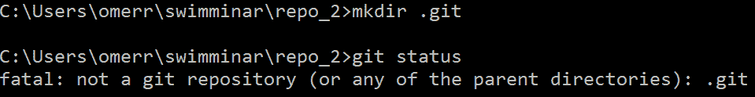

显然，创建一个`.git`目录是不够的。我们需要向该目录添加一些内容。

******git 库有两个**主**组件**** :**

1.  **对象的集合—****blob****， ****trees，**** 和 ****提交**** 。**
2.  **命名这些物体的系统——称为 ****参考**** 。**

**一个 ****存储库**** 可能还包含其他东西，比如 git 挂钩，但至少——它必须包含对象和引用。**

**让我们在`.git\objects`为对象创建一个目录，在`.git\refs`为引用创建一个目录(简而言之: ****refs**** )(在基于 UNIX 的系统上分别为`.git/objects`和`.git/refs`)。**

**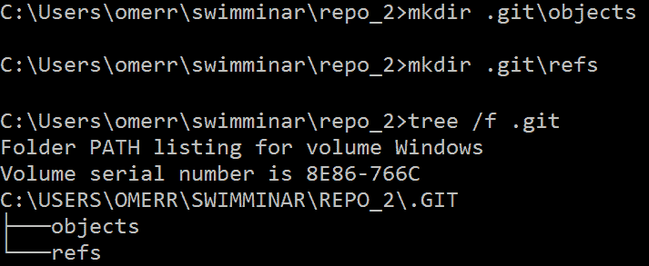**

**一类参照是 ****分支**** 。在内部，`git`通过名称 ****头**** 来调用 ****分支**** 。所以我们将为它们创建一个目录— `.git\refs\heads`。**

**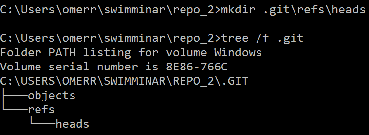**

**这仍然不能改变我们的`git status`:**

**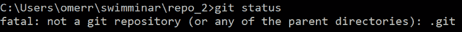**

**在 ****资源库**** 中寻找 ****提交**** 时`git`如何知道从哪里开始？正如我前面解释的，它寻找指向当前活动分支的`HEAD`(或者在某些情况下，寻找 ****提交**** )。**

**因此，我们需要创建`HEAD`，它只是一个驻留在`.git\HEAD`的文件。我们可以应用以下内容:**

**在 Windows 上:`> echo ref: refs/heads/master > .git\HEAD`**

**在 UNIX 上:`$ echo "ref: refs/heads/master" > .git/HEAD`**

**⭐:所以我们现在知道了`HEAD`是如何实现的——它只是一个文件，它的内容描述了它指向什么。**

**遵照上面的命令，`git status`似乎改变了主意:**

**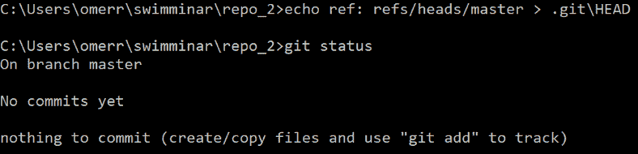

HEAD is just a file** 

**请注意，`git`认为我们在一个名为`master`的分支上，尽管我们还没有创建这个分支。如前所述，`master`只是一个名字。如果我们想的话，我们也可以让`git`相信我们在一个叫做`banana`的分支上:**

**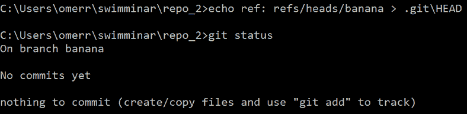

🍌** 

**在这篇文章的剩余部分，我们将切换回`master`，只是为了遵守正常的惯例。**

**现在我们已经准备好了我们的`.git`目录，我们可以开始我们的 ****提交**** (同样，不使用`git add`或`git commit`)。**

# **Git 中的管道与瓷器命令**

**此时，区分两种类型的`git`命令会很有帮助:**和 ****瓷器**** 。这些术语的应用奇怪地来自厕所(是的，这些—🚽)，传统上由瓷器制成，以及管道基础设施(管道和排水管)。****

**我们可以说陶瓷层为管道系统提供了一个用户友好的界面。大多数人只和瓷器打交道。然而，当事情变得(糟糕)时，有人想知道为什么，他们不得不卷起袖子检查管道。(注:这些术语不是我的，在`git`中使用非常广泛)。**

**`git`使用这个术语作为类比，将用户通常不需要直接使用的低级命令(“管道”命令)与更用户友好的高级命令(“瓷器”命令)分开。**

**到目前为止，我们已经处理了瓷器命令— `git init`、`git add`或`git commit`。接下来，我们过渡到管道命令。**

# **如何在 Git 中创建对象**

**让我们首先创建一个对象，并将其写入位于`.git\objects`内的`git`的对象数据库。我们将通过使用我们的第一个管道命令`git hash-object`，以如下方式找到一个 ****blob**** 的 SHA-1 散列值:**

**在 Windows 上:**

**`> echo git is awesome | git hash-object --stdin`**

**在 UNIX 上:**

**`$ echo "git is awesome" | git hash-object --stdin`**

**通过使用`--stdin`，我们指示`git hash-object`从标准输入中获取输入。这将为我们提供相关的哈希值。**

**为了将那个 ****斑点**** 实际写入`git`的对象数据库，我们可以简单地为`git hash-object`添加`-w`开关。然后，我们可以检查`.git`文件夹的内容，并看到它们已经改变。**

**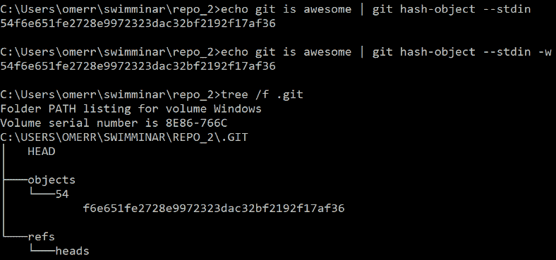

Writing a blob to the objects’ database** 

**我们现在可以看到我们的 ****blob**** 的散列是— `54f6...36`。我们还可以看到在`.git\objects`下创建了一个目录，这个目录名为`54`，在这个目录中，有一个名为`f6...36`的文件。**

**所以`git`实际上采用 SHA-1 散列的前两个字符，并将它们用作目录名。剩余的字符用作实际包含 ****斑点**** 的文件的文件名。**

**为什么会这样呢？考虑一个相当大的存储库，它的数据库中有 300，000 个对象(**、 ****树**** 和 ****提交**** )。在 300，000 个散列中查找一个散列可能需要一段时间。因此，`git`简单地将那个问题除以 256。****

**为了查找上面的散列，`git`将首先在目录`.git\objects`中查找名为`54`的目录，该目录可能有多达 256 个目录(`00`到`FF`)。然后，它将搜索该目录，缩小搜索范围。**

**回到我们生成 ****提交**** 的过程。我们现在已经创建了一个对象。那个物体是什么类型的？我们可以使用另一个管道命令`git cat-file -t` ( `-t`代表“类型”)来检查这一点:**

**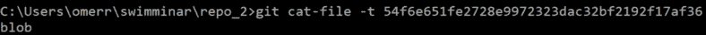**

**不出意外，这个物体是一个 ****斑点**** 。我们还可以使用`git cat-file -p` ( `-p`代表“漂亮打印”)来查看它的内容:**

**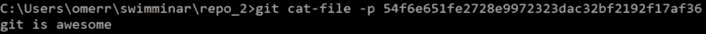**

**这个创建 ****斑点**** 的过程通常发生在我们向 ****暂存区**** 添加东西时——也就是说，当我们使用`git add`时。**

**请记住，`git`会创建一个 **整个** 文件的 ****blob**** ，该文件已登台。即使修改或添加了单个字符(正如我们在前面的例子中添加的`!`，文件也有一个新的 ****blob**** 和一个新的 ****hash**** 。**

**`git status`会有变化吗？**

**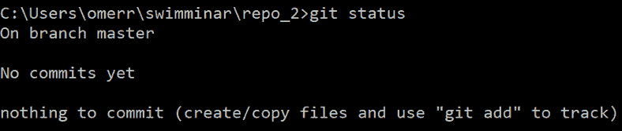**

**显然，没有。将一个 ****blob**** 对象添加到`git`的内部数据库不会改变状态，因为`git`在这个阶段不知道任何被跟踪或未被跟踪的文件。**

**我们需要跟踪这个文件—将它添加到 ****暂存区**** 。为此，我们可以使用管道命令`git update-index`，就像这样:`git update-index --add --cacheinfo 100644 <blob-hash> <filename>`。**

**注:`cacheinfo`是 git 存储的 16 位文件模式[，遵循](https://github.com/git/git/blob/master/Documentation/technical/index-format.txt) [POSIX 类型和模式](http://pubs.opengroup.org/onlinepubs/9699919799/basedefs/sys_stat.h.html)的布局。这不在本帖讨论范围内)。**

**运行上面的命令将导致`.git`的内容发生变化:**

**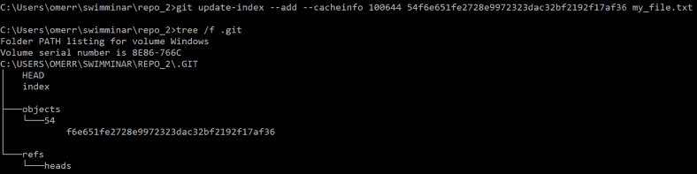**

**你能看出变化吗？一个名为`index`的新文件被创建。就是它了——著名的 ****索引**** (或 ****暂存区**** )，基本上就是驻留在`.git\index`内的一个文件。**

**所以现在我们的 ****斑点**** 已经被添加到了 ****索引**** 中，我们期望`git status`看起来有所不同，就像这样:**

**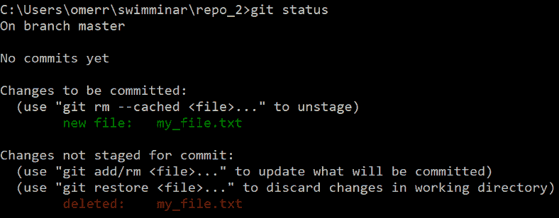**

**真有意思！这里发生了两件事。**

**首先，我们可以看到`new_file.txt`在`Changes to be committed`区域显示为绿色。这是因为 ****指数**** 现在已经有了`new_file.txt`，等待提交。**

**第二，我们可以看到`new_file.txt`以红色出现——因为`git`认为 **文件** `my_file.txt`已经被删除，文件已经被删除的事实并没有上演。**

**当我们将带有内容`git is awesome`的 ****blob**** 添加到对象数据库中，并告知 ****index**** 文件`my_file.txt`具有那个 ****blob**** 的内容时，就会发生这种情况，但我们实际上从未创建过那个文件。**

**我们可以通过获取 ****blob**** 的内容，并将它们写入我们的文件系统，写入一个名为`my_file.txt`的文件来轻松解决这个问题:**

**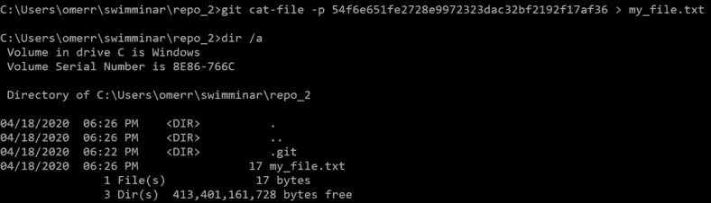**

**因此，到`git status`时，它将不再以红色显示:**

**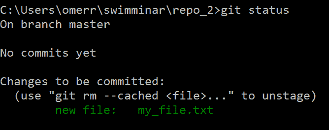**

**所以现在是时候从我们的 ****临时区域**** 创建一个 ****提交**** 对象了。如上所述，一个 ****提交**** 对象引用了一个 ****树**** ，所以我们需要创建一个 ****树**** 。**

**我们可以用命令`git write-tree`来完成，该命令记录了一个 ****树**** 对象中 ****索引**** 的内容。当然，我们可以用`git cat-file -t`看到它确实是一棵 ****树:******

**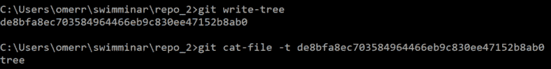

Creating a tree object of the index** 

**我们可以使用`git cat-file -p`来查看它的内容:**

**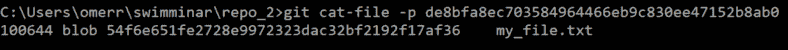**

**太好了，所以我们创建了一个 ****树**** ，现在我们需要创建一个 ****提交**** 对象来引用这个 ****树**** 。为此，我们可以使用`git commit-tree <tree-hash> -m <commit message>`:**

**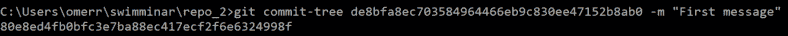**

**现在，您应该对用于检查所创建对象的类型并打印其内容的命令感到满意了:**

**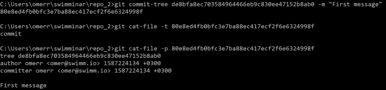

Creating a commit object** 

**注意，这个 ****提交**** 没有 ****父**** ，因为它是第一个 ****提交**** 。当我们添加另一个 ****提交**** 时，我们将不得不声明它的 ****父****——我们稍后会这样做。**

**我们得到的最后一个散列——`80e...8f`——是一个 ****提交**** 的散列。我们实际上非常习惯于使用这些散列——我们一直在看着它们。注意，这个 ****提交**** 拥有一个 ****树**** 对象，有自己的 hash，我们很少明确指定。**

**`git status`会有什么变化吗？**

**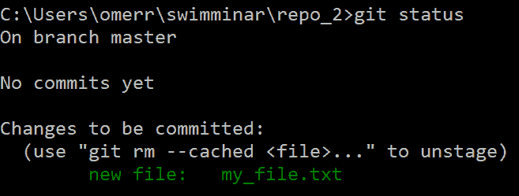**

**不🤔。**

**这是为什么呢？嗯，要知道我们的文件已经提交，`git`需要了解最新的 ****提交**** 。`git`是怎么做到的？它朝`HEAD`走去:**

**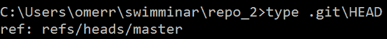

Looking at `HEAD` on Windows** **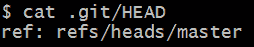

Looking at `HEAD` on UNIX** 

**`HEAD`指向`master`，但什么是`master`？我们还没有真正创造它。**

**正如我们在本文前面解释的，一个分支只是对一个 ****提交**** 的命名引用。在这种情况下，我们希望`master`使用哈希`80e8ed4fb0bfc3e7ba88ec417ecf2f6e6324998f`来引用 ****提交**** 。**

**我们可以通过简单地在`\refs\heads\master`创建一个文件来实现这一点，该文件包含这个散列的内容，如下所示:**

****

**⭐总而言之，一个 ****分支**** 只是`.git\refs\heads`里面的一个文件，包含它所引用的 ****提交**** 的散列。**

**现在，`git status`和`git log`似乎终于感激我们的努力了:**

**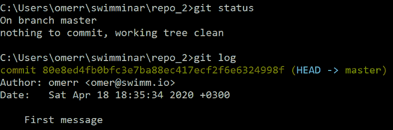**

**我们已经成功创建了一个 ****提交**** 而没有使用瓷瓶命令！多酷啊。🎉**

# **如何在 Git 中使用分支——在幕后**

**正如我们已经创建了一个 ****库**** 和一个 ****提交**** 而没有使用`git init`、`git add`或`git commit`，现在我们将创建**分支并在它们之间切换，而不使用瓷瓶命令(`git branch`或`git checkout`)。****

****如果你感到兴奋，这完全可以理解，我也是🙂****

********我们开始:********

**到目前为止我们只有一个 ****分支******命名为`master`。要创建另一个名为`test`(相当于`git branch test`)的文件，我们只需在`.git\refs\heads`中创建一个名为`test`的文件，该文件的内容与`master`指向的 ****提交**** 的散列相同。****

**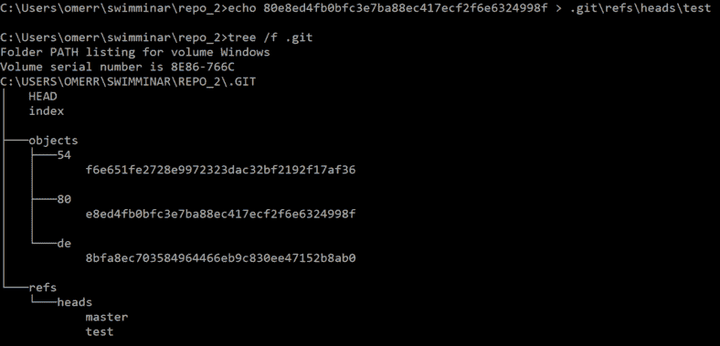**

**如果我们使用`git log`，我们可以看到事实确实如此—`master`和`test`都指向这个 ****提交**** :**

**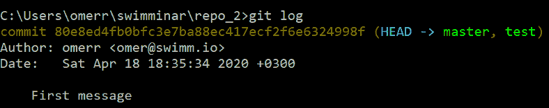**

**让我们也切换到我们新创建的分支(相当于`git checkout test`)。为此，我们应该将`HEAD`改为指向我们的新分支:**

**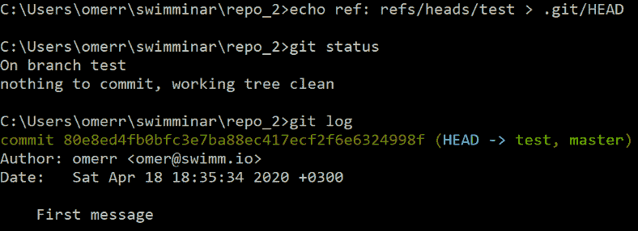

Switching to branch `test` by changing `HEAD`** 

**正如我们所见，`git status`和`git log`都确认了`HEAD`现在指向`test`，因此它是活动分支。**

**我们现在可以使用已经使用过的命令来创建另一个文件，并将其添加到索引中:**

**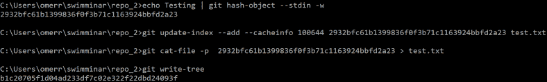**

**使用上面的命令，我们创建了一个名为`test.txt`的文件，内容为`Testing`，创建了一个相应的 ****blob、**** 并将其添加到 ****索引**** 。我们还创建了一个 ****树**** 代表 ****索引**** 。**

**现在是时候创建一个 ****提交**** 引用这个 ****树**** 。这一次，我们还应该指定这个 ****提交**** 的 **父**——也就是之前的 ****提交**** 。我们使用`git commit-tree`的`-p`开关指定父节点:**

**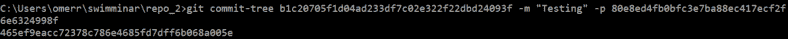**

**我们刚刚创建了一个 ****提交**** ，带有一个 ****树**** 以及一个父节点，我们可以看到:**

**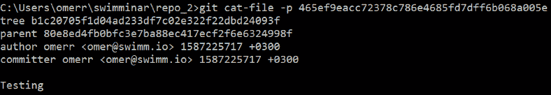**

**`git log`会给我们展示新的 ****承诺**** 吗？**

**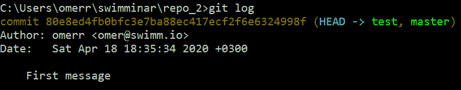**

**正如我们所见，`git log`没有显示任何新的东西。这是为什么呢？🤔记住，`git log`跟踪 ****分支**** 以找到相关的提交来显示。它向我们展示了现在的`test`和它所指向的 ****提交**** ，它还展示了指向同一 ****提交**** 的`master`。**

**没错——我们需要将`test`改为指向我们新的 ****提交**** 。我们可以通过简单地改变`.git\refs\heads\test`的内容来实现:**

**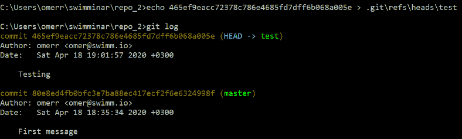**

**成功了！🎉🥂**

**`git log`转到`HEAD`，后者告诉它转到分支`test`，后者指向 ****提交**** `465...5e`，后者链接回其父 ****提交**** `80e...8f`。**

**随意欣赏美女，我们 **饭桶** 你。😊**

# **摘要**

**这篇文章向你介绍了`git`的内部情况。我们从覆盖基本对象开始——**斑点**、**树、**和**提交**。**

**我们了解到一个 **blob** 保存了一个文件的内容。一棵**树**是一个目录列表，包含**斑点**和/或子**树**。一个**提交**是我们工作目录的快照，带有一些元数据，比如时间或者提交消息。**

**然后我们讨论了**分支**，并解释了它们只不过是对**提交**的命名引用。**

**我们继续描述了**工作目录**，一个有相关存储库的目录，保存下一个**提交**的**树**的**暂存区(索引)**，以及**存储库**，它是**提交**的集合。**

**我们通过创建一个新的存储库并使用众所周知的`git init`、`git add`和`git commit`提交文件，澄清了这些术语与我们所知的`git`命令的关系。**

**然后，我们无畏地深入`git`。我们停止使用瓷瓶命令，转而使用管道命令。**

**通过使用`echo`和低级命令如`git hash-object`，我们能够创建一个 ****blob**** ，将其添加到 ****索引**** ，创建一个 ****树**** 的**，并创建一个 ****提交**** 对象指向那个 ****树**** 。****

**我们还能够创建和切换 ****分支**** 。向那些自己尝试过的人致敬！👏**

**希望在看完这篇文章后，你会觉得自己加深了对使用`git`时发生的事情的理解。**

****感谢阅读！**如果你喜欢这篇文章，你可以在[的](http://swimm.io/) wimm.io 博客上阅读更多关于这个话题的内容。**

***[欧默·罗森鲍姆](https://www.linkedin.com/in/omer-rosenbaum-034a08b9/)，[斯威姆](https://swimm.io/)的首席技术官。网络培训专家，Checkpoint 安全学院创始人。* [*计算机网络(希伯来语)*](https://data.cyber.org.il/networks/networks.pdf) *的作者。***

***访问我的* [*YouTube 频道*](https://www.youtube.com/watch?v=79jlgESHzKQ&list=PL9lx0DXCC4BMS7dB7vsrKI5wzFyVIk2Kg) *。***

* * *

# **附加参考**

**关于`git`，已经写了很多，也说了很多。具体来说，我发现这些参考资料非常有用:**

*   **[Git 内部 YouTube 播放列表—简介](https://www.youtube.com/playlist?list=PL9lx0DXCC4BNUby5H58y6s2TQVLadV8v7)**
*   **[蒂姆·贝里隆德的演讲——“从点滴做起”](https://www.youtube.com/watch?v=MYP56QJpDr4)**
*   **约翰·威格利**
*   **[正如承诺的那样，医生:为困惑的人提供食物](http://www.gelato.unsw.edu.au/archives/git/0512/13748.html)**
*   **[Git Internals——Git Objects——来自斯科特·沙孔和本·施特劳布所著的 Pro Git 一书](https://git-scm.com/book/en/v2/Git-Internals-Git-Objects)**