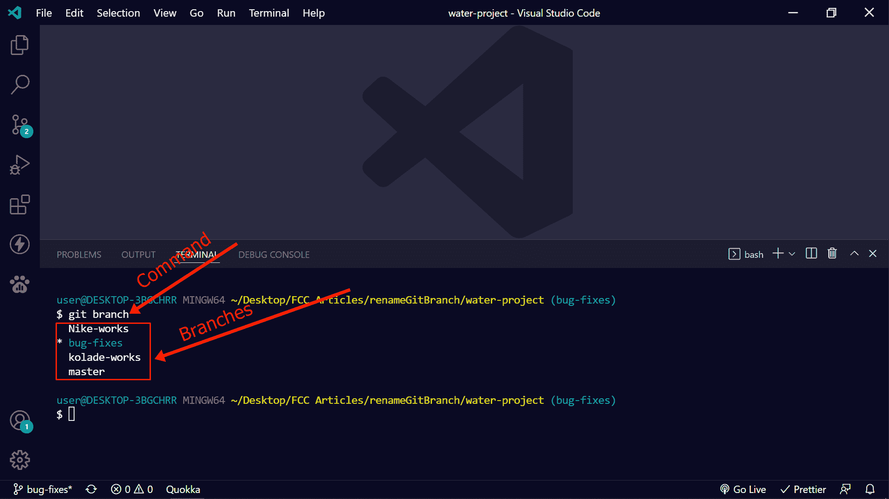
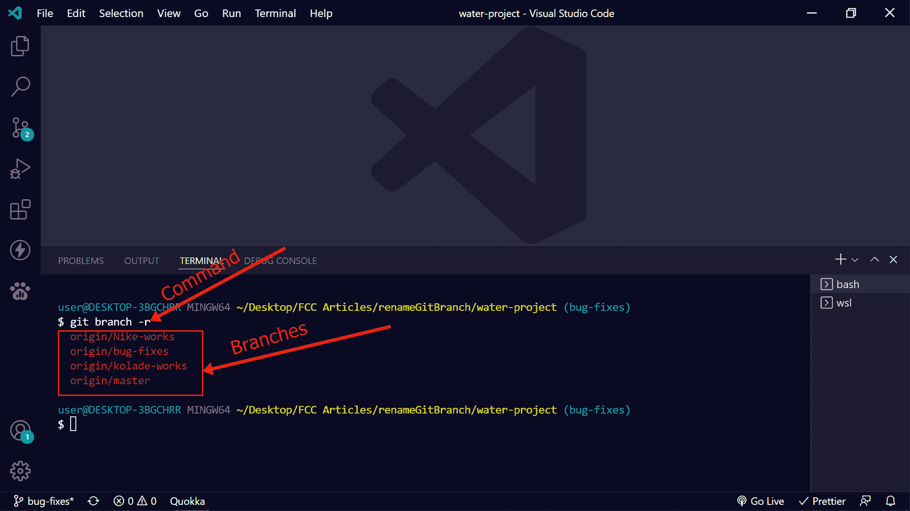
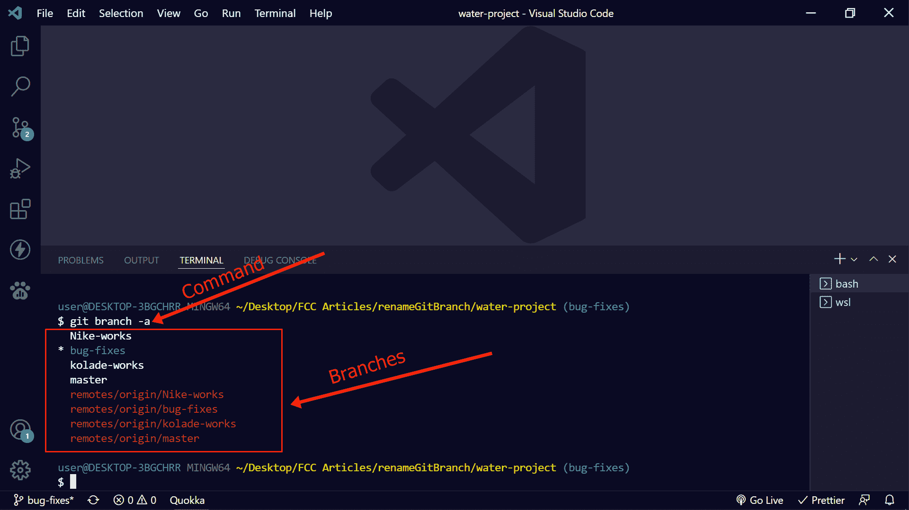
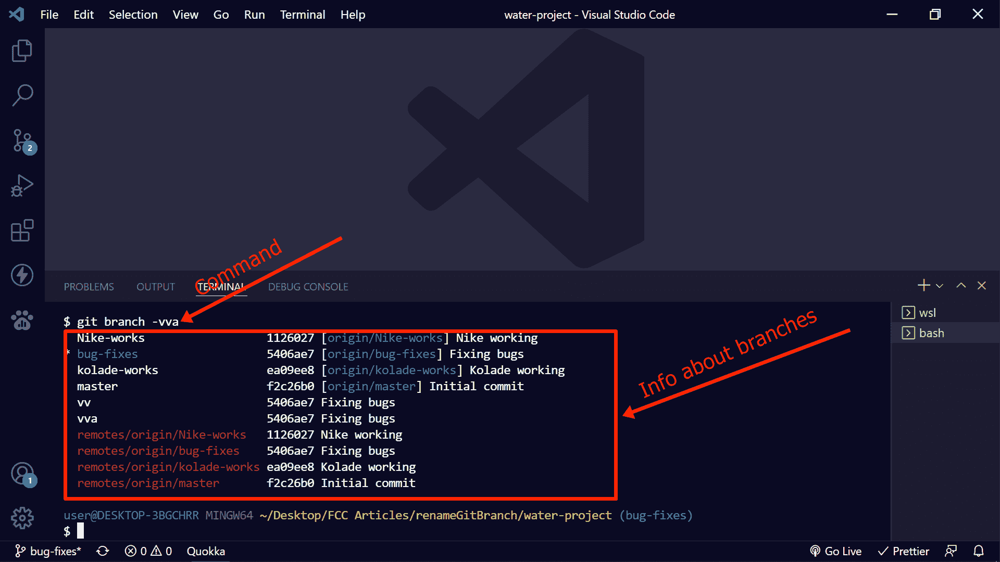

# Git 列出分支——如何显示所有远程和本地分支名称

> 原文：<https://www.freecodecamp.org/news/git-list-branches-how-to-show-all-remote-and-local-branch-names/>

Git 是一个版本控制系统，软件开发人员使用它来跟踪应用程序的变化并在项目上进行合作。

让 Git 更加动态的一个特性是分支。在将他们的更改与原始代码或主分支合并之前，从事一个项目的开发人员可以在不同的分支中工作。

有时，您可能想要查看您和其他合作者创建的分支。这就是我将在本文中向您展示的方法。

## 如何显示所有远程和本地分支名称

要查看本地分行名称，请打开您的终端并运行`git branch` :

**注意**当前的本地分支将标有星号。此外，如果您使用 Git bash 或 WSL 的 Ubuntu 作为终端，当前的本地分支将以绿色突出显示。

要查看所有远程分支名称，运行`git branch -r` :

要查看所有本地和远程分支，运行`git branch -a` :

您可以通过运行`git branch -vv`或`git branch -vva` :
来查看详细信息，如正在使用的本地或远程分支、提交 id 和提交消息

## 结论

本文向您展示了如何在使用 Git 时列出分支。

能够列出项目的 Git 分支可以帮助您更多地了解项目，并了解您的团队成员正在做什么。

如果你觉得这篇文章有帮助，不要犹豫，与可能需要它的人分享。

感谢您的阅读。