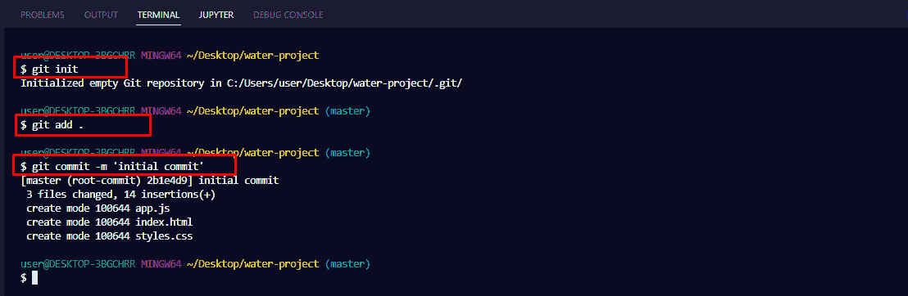
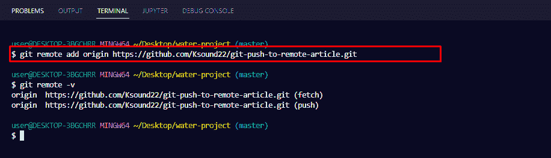
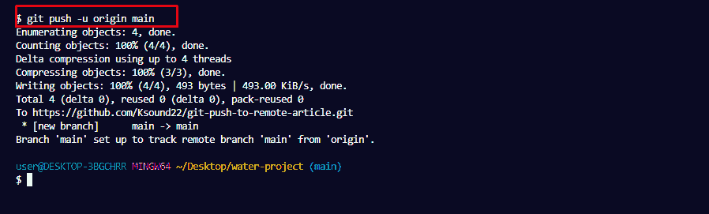
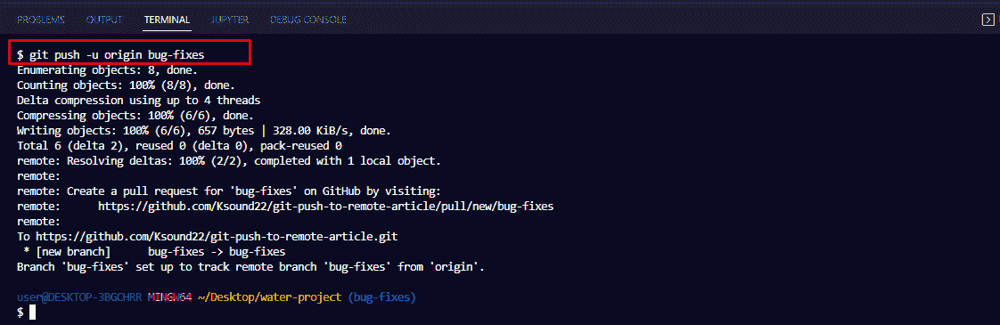
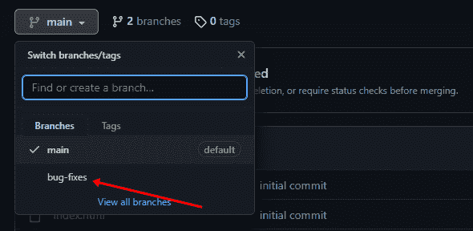

# Git 将本地分支推送到远程——如何在 Git 中发布新分支

> 原文：<https://www.freecodecamp.org/news/git-push-local-branch-to-remote-how-to-publish-a-new-branch-in-git/>

Git 分支允许您添加新特性，而无需篡改项目的活动版本。如果你在一个团队中工作，不同的开发人员可能有他们工作的独特的分支。

从长远来看，您必须将这些独立的分支推到远程服务器上。比如 GitHub，GitLab，等等。

在本文中，我将向您展示如何将本地 git 分支推送到远程服务器。你是否还没有用力并不重要。你甚至可能已经推动了你的主要分支，并想推动另一个分支。我将从头开始向你展示一切。

## 如何将主分支推到远程

如果你想把主分支推到远程，有可能你是第一次推。在尝试推送至 remote 之前，请确定您已经执行了以下命令:

*   `git init`用于初始化本地存储库
*   `git add .`将您的所有文件添加到本地存储库中
*   `git commit -m ‘commit message’`保存您对这些文件所做的更改

要推送主 repo，首先必须通过运行`git remote add <url>`将远程服务器添加到 Git。

要确认遥控器已添加，请运行`git remote -v`:

为了最终推动回购，运行`git push -u origin <branch-name>`
(“main”对我来说是那个分支的名字)。对你来说它可能是主的或主要的。最初是“大师”，我就跑`git branch -M main`改了。

如果您没有将 Git 配置为使用凭证助手，您将被要求输入您的 GitHub 用户名和 PAT(个人访问令牌):

第一次推主枝就是这样。

## 如何将新分支推到远程

如果您有另一个您已经处理过的分支，您想将其推送到远程，您仍然可以使用`git push`命令，但是方式略有不同。

提醒一下，要创建一个新的分支，您需要运行`git branch branch-name`。要切换到那个分支，以便你能在那里工作，你必须运行`git switch branch name`或`git checkout branch-name`。

要将分支推送到远程服务器，运行`git push –u origin <branch name>`。在我的例子中，那个分支的名字是`bug-fixes`。所以，我不得不跑`git push -u origin bug-fixes`:

要确认分支已被推送，请前往 GitHub 并单击分支下拉菜单。你应该会看到那里的分支:

## 结论

本文向您展示了如何将新的分支推到远程。除此之外，我们还看了第一次如何推送远程服务器。

如果你想了解更多关于 git 的知识，请查看 Git 和 GitHub 上的其他 [freeCodeCamp 文章。](https://www.freecodecamp.org/news/tag/git/)