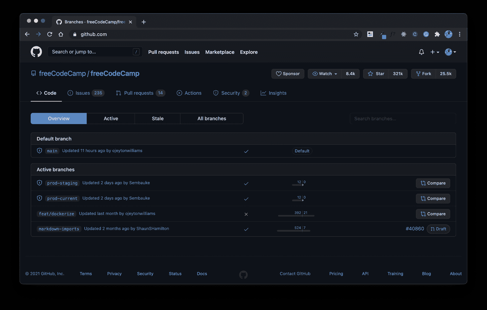
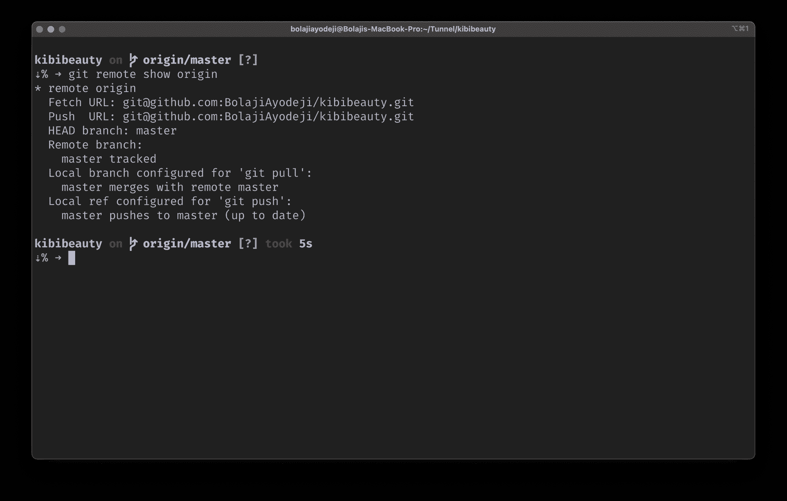

# Git 重置到远程头——如何将远程分支重置到原点

> 原文：<https://www.freecodecamp.org/news/git-reset-to-remote-head-how-to-reset-a-remote-branch-to-origin/>

分支是 Git 中的核心概念。它可以帮助您为团队协作建立分布式工作流，并使您的开发过程更加高效。

当你使用版本控制并在分支间分发特性时，你的本地计算机和你在 GitHub 上的在线存储库之间会有大量的通信。在此过程中，您可能需要重置回项目的原始副本。

如果重置分支让您感到害怕，那么不要担心——本文将向您介绍远程分支、远程头，以及如何轻松地将远程分支重置为远程头。

## **先决条件**

*   如何使用终端的基本知识。
*   Git 已安装(如果您还没有安装 Git，请在此了解如何安装 Git)。
*   GitHub 和资源库的基础知识。
*   你脸上的笑容。😉

## Git 中的分支是什么？

分支是 Git 和 GitHub 中的核心概念，你会一直用到它。分支帮助您管理一个项目的不同版本。

`main`分支总是存储库中的默认分支，被认为是“生产和可部署的代码”。你可以从`main`分支创建新的分支，比如`prod-staging`或`prod-current`。



All branches in https://github.com/freeCodeCamp/freeCodeCamp

### Git 中的远程分支是什么？

一个**远程分支**是对一个远程存储库中分支状态的引用(一个托管在互联网或类似 GitHub 的网络上的项目版本)。

当你克隆一个存储库时，你从互联网上的一个存储库或者一个被称为**(看起来有点像`(remote)/(branch)`)的内部服务器中提取数据。**

## **Git 中的 Origin(或远程头)是什么？**

**单词 origin 是 Git 创建的一个别名，用来替换远程存储库的远程 URL。它代表远程系统上的默认分支，并且是一个本地引用，代表远程存储库中 HEAD 的本地副本。**

**总之，origin/HEAD 代表远程系统上的默认分支，这是在您从 internet 克隆存储库时自动定义的。**

****

## **如何在 Git 中将远程分支重置为原点**

**现在您已经了解了远程和分支如何工作的背景知识，让我们解决我们的问题，并使用`git reset --hard`命令将远程分支重置为原点。**

**在你这样做之前(如果这是你的第一次)，确保你在重置它之前备份了你的分支，以防出错。您可以像这样备份它:**

```
`git commit -a -m "Branch backup"
git branch branch-backup`
```

**现在运行下面的命令将远程分支重置为原点。如果您有不同的远程和默认分支名称(分别不是`origin`或`main`，只需用适当的名称替换它们。**

```
`git fetch origin
git reset --hard origin/main`
```

**如果您创建了一些新的文件或目录，它们可能在重置后仍然存在。您可以使用下面的命令来清理工作树，方法是从先前的分支中递归地删除不受版本控制的文件。**

```
`git clean -xdf`
```

*   **`-x`标志删除所有未被跟踪的文件，包括被忽略的构建目录。**
*   **当没有指定路径时，`-d`标志允许 Git 递归进入未跟踪的目录。**
*   **`-f`标志覆盖了默认的 Git clean 配置，并开始清理未被跟踪的文件和目录。**

## **结论**

**如果您的远程存储库的名称不是“origin ”,并且远程存储库中名为的分支不是“main ”,不要忘记用适当的名称更新上面的命令。您可以随时运行`git remote show origin`来检查这一点。**

**我希望这篇文章能让你更好地使用和重置分支。你也应该加入新的 [freeCodeCamp 聊天服务器](https://www.freecodecamp.org/news/introducing-freecodecamp-chat)与其他学习者交流并提问。感谢阅读！💙**