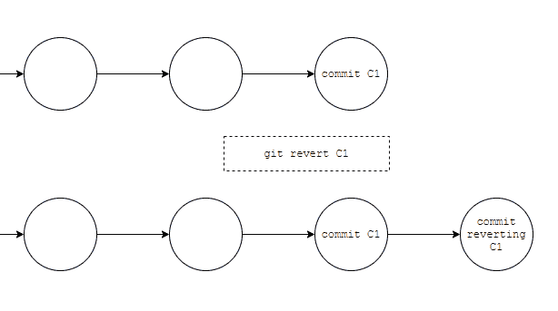
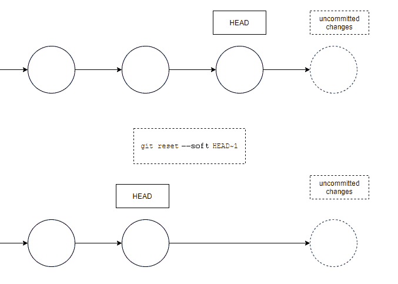
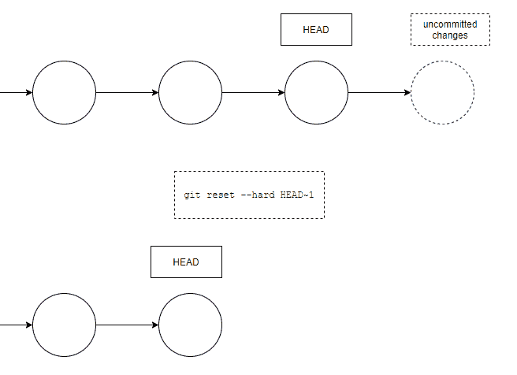

# Git 恢复提交–如何撤销最后一次提交

> 原文：<https://www.freecodecamp.org/news/git-revert-commit-how-to-undo-the-last-commit/>

假设您正在 Git 中编写代码，但有些事情没有按计划进行。所以现在您需要恢复您的最后一次提交。你是怎么做到的？让我们来了解一下！

有两种可能的方法来撤销您的最后一次提交。我们将在本文中研究这两个问题。

## `revert`命令

`revert`命令将创建一个提交，该提交恢复作为目标的提交的更改。您可以使用它来恢复最后一次提交，如下所示:

```
git revert <commit to revert>
```

您可以使用`[git log](/news/git-log-command/)`找到想要恢复的提交的名称。这里描述的第一个提交是创建的最后一个提交。然后您可以从那里复制字母数字名称，并在`revert`命令中使用它。



In this image, each circe represents a commit.

## `reset`命令

您也可以使用`reset`命令来撤销您的最后一次提交。但是要小心，它会改变提交历史，所以你应该很少使用它。它会将头(工作分支)移动到指示的提交，并在以下情况后丢弃任何内容:

```
git reset --soft HEAD~1
```

`--soft`选项意味着您不会丢失尚未提交的更改。



In this image, each circle represents a commit.

如果您想重置到最后一次提交并删除所有未提交的更改，您可以使用`--hard`选项:

```
git reset --hard HEAD~1
```

这将撤消最近的提交，也将撤消任何未提交的更改。



In this image, each circle represents a commit.

## Git 中应该用`reset`还是`revert`？

如果被重置的提交只存在于本地，那么你应该只使用`reset`。此命令会更改提交历史，并且可能会覆盖远程团队成员所依赖的历史。

相反,`revert`创建一个*新提交*来撤销更改，所以如果恢复提交已经被推送到一个共享存储库，最好使用`revert`,因为它不会覆盖提交历史。

# 结论

您已经学习了两种撤销上次提交的方法，以及何时最好使用其中一种。

现在，如果您注意到您的最后一次提交引入了一个 bug 或者不应该被提交，您知道如何修复它！