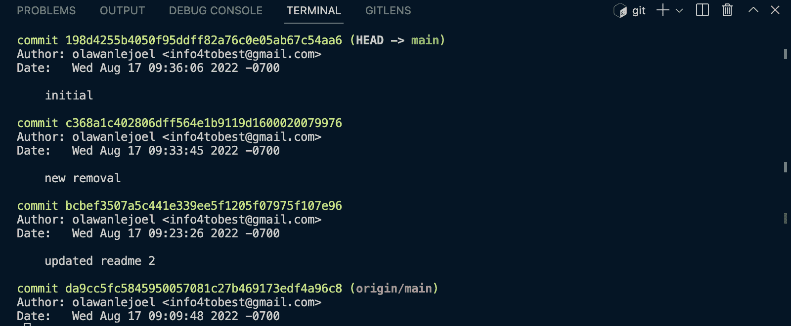

# Git 恢复文件–将文件恢复到以前提交的状态

> 原文：<https://www.freecodecamp.org/news/git-revert-file-reverting-a-file-to-a-previous-commit/>

Git 是一个版本控制系统，帮助团队和个人跟踪和记录对一个文件或整个项目所做的更改。

当使用 Git 时，您经常提交您的更改，然后将它们推送到远程存储库。

假设您已经提交了很多次，后来意识到您当前版本的变更是错误的。或者您发现了一种情况，需要您恢复到以前的提交，比如一个奇怪的 bug。

手动将文件中的每一行代码更改为其原始状态或特定的提交状态，并进行新的提交，可能会导致混乱的提交历史。恢复文件是一种更干净的处理方式。

有许多可能的方法，但是在本文中，您将学习最好的方法，即`git checkout`方法。

如果你很急，这里是命令:

```
$ git checkout SHA-HASH -- file/file-path 
```

但是假设你不着急。让我们首先学习如何定位所有以前的提交和它们的 SHA 散列。然后，我们将了解如何将文件恢复到以前的提交状态。

## 如何找到提交 SHA/ID

有许多方法可以获得每个提交的 SHA 和细节。最好的方法是在您的终端中使用下面的命令:

```
$ git log 
```

此命令将显示您在项目中对所有文件及其哈希代码所做的所有提交的列表:



但是更简单的命令是下面的命令，其中附加了`oneline`选项:

```
$ git log -- oneline 
```

**注意:**`oneline`选项将输出显示为每行一次提交。

```
198d425 (HEAD -> main) initial
c368a1c new removal
bcbef35 updated readme 2
da9cc5f (origin/main) updated Readme
a5150af first commit 
```

单独使用该命令将返回对该项目所做的所有提交。如果您想要将特定文件恢复到以前的提交，您必须首先查看对该文件所做的所有提交。

为此，请将文件名添加到命令中:

```
$ git log -- oneline README.md 
```

如果文件位于另一个文件夹中，您可以将终端导航到该文件夹，或者在命令中使用文件路径，如下所示:

```
$ git log -- oneline src/App.js 
```

这将只返回指定文件的提交和提交 SHA 哈希，后跟提交消息。您将使用 SHA 哈希来恢复您的文件:

```
198d425 (HEAD -> main) initial
c368a1c new removal
bcbef35 updated readme 2
da9cc5f (origin/main) updated Readme
a5150af first commit 
```

## 如何将文件恢复到以前提交的状态

现在您知道了如何获得 SHA 代码，您可以使用`git checkout`命令通过传递文件名或文件路径将您的文件恢复到您想要的任何提交状态:

```
$ git checkout da9cc5f -- README.md

Or

$ git checkout 55a1dff -- src/App.js 
```

在这样做之前，请确保您想要恢复一个文件，因为您将放弃当前对该文件的本地更改。Git 将用指定的提交版本替换该文件。仅当您确定并且不想要那些未保存的本地更改时，才使用此选项。

## 包扎

在本文中，您已经学习了如何使用`git checkout`命令将文件恢复到以前的提交状态。

重要的是要知道当您恢复时，您将需要再次提交更改(恢复的更改)。您可以使用标准的 commit 命令来实现这一点:

```
$ Git commit -m 'commit message' 
```

然后，您可以根据需要将提交推送到远程存储库。

你可以在这个[视频](https://www.freecodecamp.org/news/git-for-professionals/)或者[文章](https://www.freecodecamp.org/news/learn-git-and-version-control-in-an-hour/)中了解更多关于 Git 的信息。

祝编码愉快！