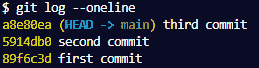
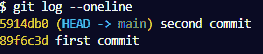
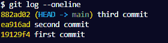
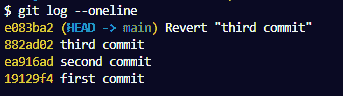

# Git 恢复到上一次提交–如何恢复到上一次提交

> 原文：<https://www.freecodecamp.org/news/git-reverting-to-previous-commit-how-to-revert-to-last-commit/>

Git 是一个非常棒的版本控制工具。这也使得与他人的合作更有效率。

在本文中，您将学习如何在使用 Git 跟踪项目时恢复到以前的提交。

我们将在本文中讨论的两个命令是`git reset`和`git revert`。这些命令可以帮助您撤消提交并返回到上一次提交。

不过，它们并不完全相同，所以我们将通过演示每个命令在项目中的工作方式，使本文更加实用。

任何人都可以跟随本教程，因为它不是特定于语言的——我们将使用一个文本(txt)文件。

## 如何使用`git reset`命令恢复到之前的提交

在这一节中，我们将经历创建一个新文件并进行三次提交的过程。然后，您将看到如何使用提交 ID 恢复到上一次提交或任何其他提交。

首先，我创建了一个名为`tasks.txt`的文件。文件中有这样的内容:

```
1\. code.
2\. Practice.
3\. Build. 
```

接下来，我们将初始化、添加并提交该文件:

```
git init
git add tasks.txt
git commit -m "first commit"
```

我们已经做出了第一次承诺。

我们将重复上述过程两次以上，但我们会在每次提交之前向文件中添加一行额外的文本。那就是:

```
1\. code.
2\. Practice.
3\. Build. 
4\. Research. 
```

```
git add tasks.txt
git commit -m "second commit"
```

最后，对于第三次提交:

```
1\. code.
2\. Practice.
3\. Build. 
4\. Research. 
5\. Write.
```

```
git add tasks.txt
git commit -m "third commit"
```

现在我们有三个提交。要恢复到以前的提交，您必须首先获取提交 ID。为此，请运行以下命令:

```
git log --oneline
```

在我的终端里，我有这个:



git log --oneline

正如您在上面看到的，这个命令列出了所有提交及其 id。

要回到第二次提交，您可以运行`git reset`命令，后跟提交 ID。那就是:

```
git reset 5914db0
```

如果您已经跟踪到这一点，您将不会注意到文件中的任何差异(您将看到如何撤消提交以及稍后对文件所做的任何更改)。

文件仍然是这样的:

```
1\. code.
2\. Practice.
3\. Build. 
4\. Research. 
5\. Write.
```

但是当我们运行`git log --oneline`命令时，第三次提交不会出现在提交日志中:



git log --oneline

我们已成功返回到先前的提交。

如果您想要撤销一个提交以及在该提交之后所做的所有更改，您可以将`--hard`标志附加到您的`git reset`命令上。

让我们通过返回到第一次提交来测试这一点:

```
git reset 89f6c3d --hard
```

这是文本文件现在的样子:

```
1\. code.
2\. Practice.
3\. Build. 
```

我们回到了文件在指定提交点的初始状态。提交后对文件所做的所有更改都被删除。当我们检查提交日志时，我们将只有第一次提交。

虽然这看起来很酷，但是使用这个命令时应该小心。尤其是当你和一个团队一起工作的时候。

如果您撤消一个提交并删除其后的每个文件更改，您可能会丢失您和其他队友对代码所做的重要更改。这也将更改项目的提交历史记录。

幸运的是，有办法恢复已删除提交的状态。你可以在这里了解更多关于那个[。](https://www.freecodecamp.org/news/how-to-recover-a-deleted-file-in-git/)

## 如何使用`git revert`命令恢复到之前的提交

我已经初始化了项目，并像上一节一样提交了三次。提交日志如下所示:



git log --oneline

要恢复到之前的提交，请运行`git revert`命令以及当前提交的提交 ID。

在我们的例子中，我们将使用第三次提交的 ID:

```
git revert 882ad02
```

上面的命令将撤销当前的提交，并将文件恢复到上一次提交的状态。当您检查提交日志时，您会看到类似这样的内容:



git log --oneline

与`git reset`命令不同，`git revert`命令为恢复的更改创建一个新的提交。不会删除从中恢复的提交。

所以你可以看到，`git reset`和`git revert`是不一样的。

`git reset`将撤消对指定提交 ID 状态的更改。例如，恢复到第二个提交 ID 将撤消更改，并将文件的状态保留为第二次提交的状态。

`git revert`将撤消对指定提交 ID 之前状态的更改。例如，恢复到第二个提交 ID 将撤消更改，并将文件的状态保留为第二次提交(第一次提交)之前的提交状态。

上面的解释可能会令人困惑。理解它的最好方法是亲自尝试。

## 何时使用`git reset`和`git revert`

当在本地存储库上工作时，您应该使用`git reset`来远程推送变更。这是因为在从远程 repo 中提取更改后运行此命令将会改变项目的提交历史，从而导致参与项目的每个人发生合并冲突。

当您意识到对某个特定的本地分支所做的更改应该在其他地方时，这是一个很好的选择。您可以重置并移动到所需的分支，而不会丢失文件更改。

`git revert`是恢复推送到远程存储库的变更的好选择。因为这个命令创建了一个新的提交，所以您可以安全地删除您的错误，而不需要为其他人重新安排提交历史。

## 摘要

在本文中，我们讨论了在 Git 中恢复到以前的提交。

我们讨论了两个显示如何撤销 Git 更改的主要命令——`git reset`和`git revert`命令。

我们还通过实例了解了这两个命令是如何工作的。

编码快乐！