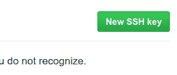
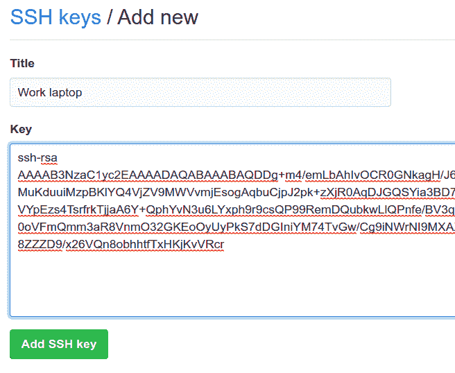

# 如何获取和配置您的 Git 和 GitHub SSH 密钥

> 原文：<https://www.freecodecamp.org/news/git-ssh-how-to/>

如果你使用 GitHub 而没有设置 SSH 密钥，你真的错过了。想一想——每次提交时，你在控制台上输入电子邮件地址和密码所花的时间可能都花在编码上了。

不会再有了。这里有一个用 GitHub 生成和配置 SSH 密钥的快速指南，这样你就再也不用用老式的方法进行认证了。

### 检查现有的 SSH 密钥

首先，检查您是否已经为您的机器生成了 SSH 密钥。打开终端并输入以下命令:

```
ls -al ~/.ssh
```

如果您已经生成了 SSH 密钥，您应该会看到类似如下的输出:

```
-rw-------  1 user_name user_name  1766 Jul  7  2018 id_rsa
-rw-r--r--  1 user_name user_name   414 Jul  7  2018 id_rsa.pub
-rw-------  1 user_name user_name 12892 Feb  5 18:39 known_hosts
```

如果您的密钥已经存在，请跳到下面的**复制您的公共 SSH 密钥**部分。

如果您看不到任何输出或者该目录不存在(您会得到一条`No such file or directory`消息)，那么运行:

```
mkdir $HOME/.ssh
```

然后使用以下内容生成一组新密钥:

```
ssh-keygen -t rsa -b 4096 -C your@email.com
```

现在用`ls -al ~/.ssh`命令检查您的键是否存在，并确保输出与上面列出的类似。

**注意:** SSH 密钥总是作为一对公钥(`id_rsa.pub`)和私钥(`id_rsa`)生成。极其重要的是，你**永远不要泄露你的私人**密钥，并且**只在 GitHub 认证之类的事情上使用你的公共**密钥。你可以在这里阅读更多关于 SSH / RSA 密钥对如何工作的信息。

### 将您的 SSH 密钥添加到 ssh-agent

`ssh-agent`是一个在您登录时启动并存储您的私钥的程序。为了让它正常工作，它需要运行，并有一个您的私钥副本。

首先，确保`ssh-agent`正在运行:

```
eval "$(ssh-agent -s)" # for Mac and Linux
```

或者:

```
eval `ssh-agent -s`
ssh-agent -s # for Windows
```

然后，使用以下命令将您的私钥添加到`ssh-agent`:

```
ssh-add ~/.ssh/id_rsa
```

### 复制您的公共 SSH 密钥

接下来，您需要将您的公共 SSH 密钥复制到剪贴板。

对于 Linux 或 Mac，使用以下命令将您的公钥内容打印到控制台:

```
cat ~/.ssh/id_rsa.pub # Linux
```

然后突出显示并复制输出。

或者对于 Windows，只需运行:

```
clip < ~/.ssh/id_rsa.pub # Windows
```

### 将您的公共 SSH 密钥添加到 GitHub

进入 GitHub [设置](https://github.com/settings/keys)页面，点击“新建 SSH 密钥”按钮:



然后给你的密钥一个可识别的标题，并粘贴你的公钥(`id_rsa.pub`):



最后，使用以下命令测试您的身份验证:

```
ssh -T git@github.com
```

如果您正确遵循了所有这些步骤，您应该会看到以下消息:

```
Hi your_user_name! You've successfully authenticated, but GitHub does not provide shell access. 
```

### 关于 SSH 的更多信息:

*   [SSH 终极指南](https://www.freecodecamp.org/news/the-ultimate-guide-to-ssh-setting-up-ssh-keys/)
*   [自上而下的 SSH 介绍](https://www.freecodecamp.org/news/a-top-down-introduction-to-ssh-965f4fadd32e/)