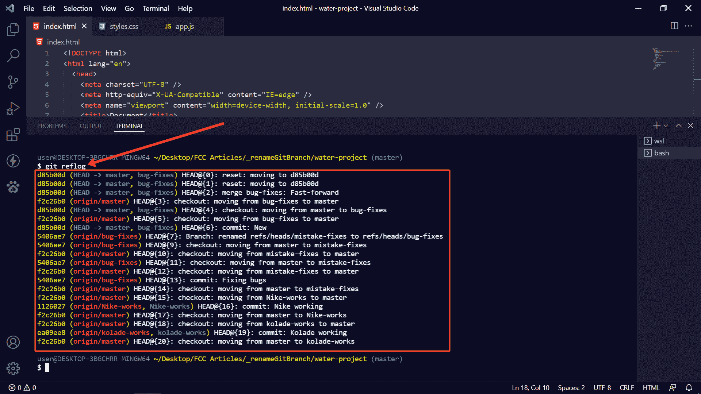
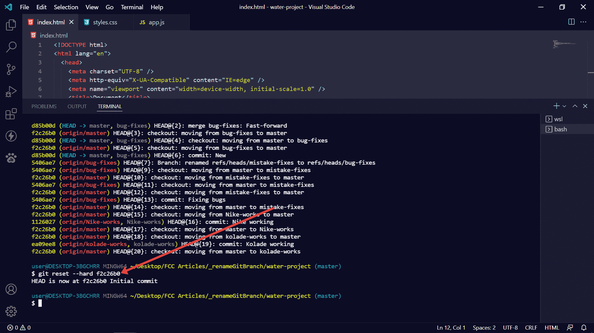
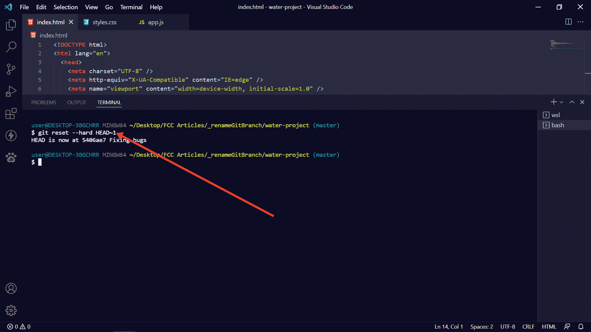
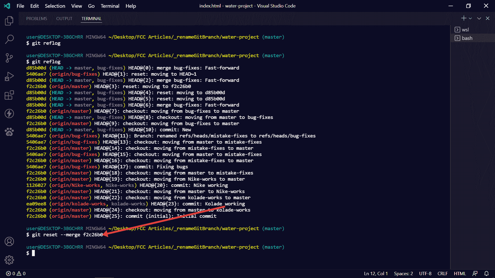
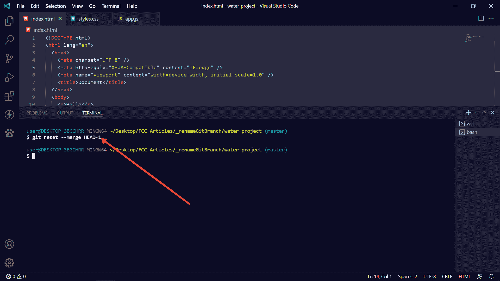

# Git 撤销合并——如何恢复 Git 中的最后一次合并提交

> 原文：<https://www.freecodecamp.org/news/git-undo-merge-how-to-revert-the-last-merge-commit-in-git/>

分支是 Git 不可或缺的一部分，因为它允许您在不篡改已经在生产中的代码的情况下工作。

当你完成一个分支而不是`main`的工作时，你会想把它与主分支合并，这样你刚刚集成的特性或错误修复就会被反映出来。

但是，如果你完成合并，并意识到你忘了做一件事呢？或者在没有准备好的时候不小心合并了怎么办？

在 Git 中，您几乎可以撤销任何操作。因此，在本文中，我将向您展示如何在 Git 中撤销合并，以便您可以恢复到上次提交的状态。

## 如何在 Git 中撤销合并提交

您可以使用 Git reset 命令来撤消合并。

首先，您需要检查提交散列(或 id ),这样您就可以使用它返回到上一次提交。

要检查散列，运行`git log`或`git reflog`。`git reflog`是一个更好的选择，因为用它写出来的东西可读性更强。

当您获得想要返回的提交的散列时，运行`git reset --hard commit-before-the-merge` :

当您运行该命令时，您应该会看到一些内容从代码编辑器中删除了。

如果你不确定最后一次提交的散列，你可以运行`git reset --hard HEAD~1`回到合并前的提交:

请注意，当您使用`--hard`标志撤销合并时，任何未提交的更改都将被恢复。

## 在 Git 中撤销合并的更好方法

由于上面讨论的方法将恢复未提交的更改，Git 提供了一个更安全的标志`--merge`。

要撤销带有`--merge`标志的合并，运行`git reflog`来查看提交的散列，然后运行`git reset --merge previous-commit` :

您也可以通过运行`git reset --merge HEAD~1` :
来使用带有`--merge`标志的 HEAD 关键字

**N.B.** :如果您在使用`--merge`标志时没有得到这个命令的响应，不要担心，它可以工作。

## 结论

在本文中，您了解了如何在 Git 中撤销合并，因此您可以撤销一个错误的或不需要的合并，并更有效地使用 Git。

下面是使用`--hard`和`--merge`标志撤销合并时的要点:`--hard`标志删除未提交的更改，而`--merge`标志保留未提交的更改。

感谢您的阅读！