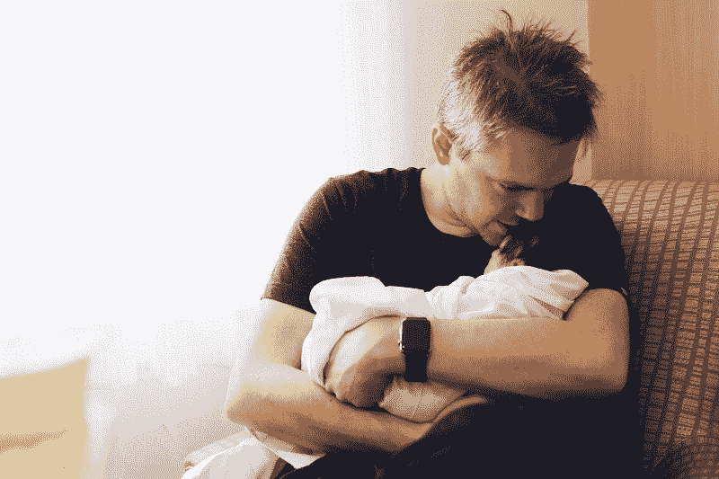
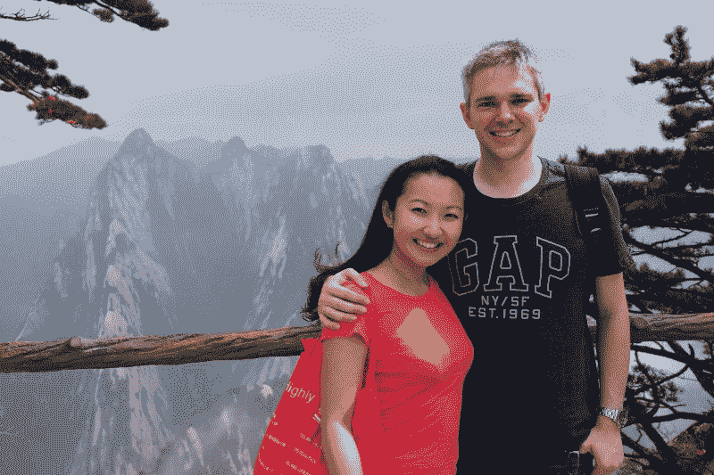
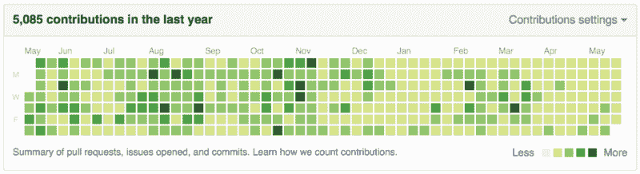

# GitHub 打破了我的 1000 天记录

> 原文：<https://www.freecodecamp.org/news/github-broke-my-1-000-day-streak-6ec0c4c3a7d9/>

杰德·沃森

# GitHub 打破了我的 1000 天记录

The most important day of my life so far

…这是我一路走来对自己和开源的了解。

当我打破了我的投稿记录时，我总是计划写一篇文章。五周前，我的第一个孩子(一个漂亮的小女孩，我们给她取名为 Grace)出生了，老实说，我不认为我“每天提交一些代码”的习惯会在那段经历中持续下去，甚至不会导致它。

我的习惯持续了很久。这丝毫没有反映出我作为一个新父母是多么的现实，也没有反映出我像一个正常的成年人一样理清自己的优先事项的能力。与一些批评不同，我的批评是针对个人的，不是为了炫耀或出名，也不是工作/生活平衡不佳的迹象。

话又说回来，当我开始的时候，我并不认为它会持续**大约一千天**——然而这大概就是它持续的时间(确切地说是多久？GitHub 不会再告诉你了，但是根据我的计算，大约是 980 天)

最终，所有的条纹都会被打破，就像许多长寿的条纹一样，我想我一直在想为什么以及如何结束它。超越 GitHub 上的功能——最初激励我开始的功能——似乎是一种合适的方式。

这是我的故事，更多的是因为我想讲，而不是因为我觉得你(或者任何人)应该读。这是一次在公共场所进行的个人旅行，所以这似乎是一个合适的总结方式。

> 警告:这有点乱。这是某个人在某件事情上工作了近三年，却眼睁睁看着它消失的快照。数字并不重要，宣传也不重要。但这是我生活中的一个建设性的动机，是我有意选择的，现在整个事情都结束了，我感觉很自省，也经历了很多。

我的连胜开始于 2013 年 9 月 15 日。七月，我和妻子结束了为期五周的欧洲蜜月旅行，准备开始新的生活；巧合的是，那天也是我的公司 Thinkmill 正式注册的日子。所以，两个生日合二为一。

但大概是两周后，我有意识地决定坚持下去；就像个人挑战。我最近还开源了 [KeystoneJS](http://keystonejs.com) ，这是我一生中最恐怖的时刻之一(如果人们讨厌它怎么办！如果我被审判了呢？我不够好怎么办？)

…持续了几天，直到我意识到没人注意到。没人在乎，也没人知道我是谁。呵。其实没那么可怕。事实证明，如果你想让某人注意到你的开源内容，你必须*为之努力*。

因此，这一举动开始是一种公开的方式来说“嘿！我致力于此！你可以相信我这个杂乱无章的小开源项目，因为我显然在关注它，并致力于构建它！”

我去了大约两个星期，才知道我必须告诉我的妻子；如果我没有她的支持，这一切都不可能持续下去。我照做了，希望她不要理会。相反，她知道我正在做一些不同的、对我来说很重要的事情，反而鼓励我。我想我可能会去几个月，如果我很强壮的话。

几个月后，我最初的“需要证明什么”的动机消失了，取而代之的是两种模式:

*   变得很难。有些日子我不想再坚持下去了。我想挖掘出来，让它去。最困难的是当我在工作中处于压力之下时，我已经每天花 12 个小时在不重要的事情上。但我已经走了这么远；做点什么吧。我照做了，而且总是一两天后我就会忘掉它，一切又变得容易了。第一课
*   我意识到，当我没有时间修复大问题时，我会从一堆问题中挑出一个简单的问题(结果人们*确实*喜欢 Keystone，这自然会导致 GitHub 问题)并修复它。我致力于解决用户关心的问题，因此我的项目质量更好。这种“好的维护者”的事情导致了更多的兴趣，更多的参与用户，以及最终一些惊人的贡献者/合作者。**第二课。**

受此鼓舞，我对连胜感觉很好。我也在完善我的艺术。我喜欢编码，尽管我经常被业务/管理/架构问题所困扰，无论我做什么，编码都是我的艺术。每天花时间在它上面(#1)和与不断扩大的社区合作(#2)是我为发展我的技能和经验所做的最好的事情。

第二年的四月，我和妻子去中国度假了几个星期。我确信这是连胜的结束。因为我不会让它成为我的生活！不*健康*。另外，我妻子不可能有耐心让我在假期写代码:)

…但我错了。最初，因为我在机场检查了我的通知，并合并了一个非常好看的 PR(对贡献者做出响应非常重要，稍后会详细介绍！)

然后我修复了一个简单的 bug。它有动力，很容易保持。

大约进行到一半的时候，我妻子问我:“你做完你的裸泳了吗？”我告诉她“不，我不担心这个”。她坚持。她看到了它对我的积极影响，并鼓励我继续下去。在我们回来后的几个月里，我受益匪浅，在接下来的一周里，每天花 15 分钟是值得的。她说，我辛辛苦苦挣来的，现在不要把它扔掉。

> 在接下来的几年里,“你做完你的连胜纪录了吗?”成了我们家经常重复的一句话，总是带着鼓励和永不放弃。

如果事情对你有利，爱你的人会注意到并鼓励他们。第三课

连续将近一年似乎有点疯狂。我的一个朋友开始了他自己的自我驱动的编码冒险(嗨 Tom？)并在我们办公室的大电视上做了一个状态面板，恐慌风格的，其中一个模块是我的 streak，是一个工业“自上次事故以来的日子”设计。这很有趣，也给了我一些鼓励。

原来遵守纪律可以是社交和乐趣。第四课

不过，值得注意的是，在这一点上，我的生活是围绕着我现在认为是一门学科建立起来的。这并不总是容易的，但没有纪律是容易的，我为此努力。得到我的朋友和家人的支持是至关重要的，经营一家能够在商业和开源工作之间建立健康关系的企业也是极其重要的。

如果你要做一件困难的事情，聪明一点，并让它可持续发展。第五课

接下来的一年有点模糊。Keystone 成长了，但当人们听说它或喜欢它时，我总是感到谦卑。通过这种方式，强烈发展起来的是一种“为好的东西而建设”的意识。我不是在无偿工作，我只是将这些想法表达出来(以软件的形式)，我认为这些想法将创造出超出我自己或我自己所能实现的利益。

我觉得我的生活很幸福。有些人会称之为特权、运气、财富等等。我对此没有意见，因为虽然我不能报答所有帮助过我的人，但我可以把它向前推进，尽可能慷慨地付出时间、代码或建议。

但是你知道吗？它回来了。2015 年初，我有机会参加了第一届 React Conf，在那里我结交了一些优秀的朋友，并开始成为 React 社区的一员。在这一点上，保持我的连胜几乎是第二天性。几乎被遗忘了，但仍然是一门学科，是我行为方式的基础。

2015 年的绝对亮点之一是前往巴黎参加 React Europe，讨论 React 和移动应用。但不仅仅是为了会议或演讲。那一年，我和 KeystoneJS 团队的成员 Camille Reynders 成为了朋友，在一起工作的时候，我们一起聊了很多小时。但我们从未见过面，因为他住在比利时，而我在悉尼。

他和妻子那个周末开车去闲逛，只是为了在现实生活中度过一些时间。我们坐在巴黎街头的咖啡馆里，看着骄傲游行走过，吃着奶酪，喝着啤酒，闲逛。

开始一个开源项目并全身心地投入其中，可以让你获得一些好朋友和独特的经历。第六课

进入 2016 年，我和妻子期待着我们的第一个孩子。这一年我有一个疯狂的开始，经营一个不断增长的业务，几乎每个月都去海外旅行，在我认真进入家庭模式之前完成一些事情。

11 月，我在纳什维尔的 KeystoneJS 上的第一次重要会议演讲。然后 PhoneGap Day US 在犹他州，我在那里对一屋子棱角分明的开发者做出了反应。然后 2 月份在旧金山参加 React Conf 2016。在这一点上，每一次旅行都像是与朋友叙旧，学习新东西，与我钦佩的开发人员一起开发创意，我非常乐意与他们面对面交流。

与我第一次将 KeystoneJS 开源到 crickets 的经历相比，我现在在 npm 上获得了每月超过一百万次下载的包，成千上万的追随者，以及我的各种个人项目中大约 15，000 颗星。

但更重要的是，一些人告诉我，我也鼓励他们进入开源领域。这不是一件小事，也是我真正引以为豪的事情。因为我相信为开源做贡献是个人的、强大的、有益的。

这些天来，我经常听到反馈说 KeystoneJS 周围的社区是支持的、包容的和鼓舞人心的。现在有*其他*人激励*更多的*人围绕着我创造的、充满我个人能量和哲学的东西，这就是**令人敬畏的**。没有别的词可以形容了。这就是我做这件事的原因。

更不用说所有的感谢、荣誉和机会如潮水般涌来作为回报。我这样做是为了我自己，因为我相信这种创造价值的方式，但通过反馈实现这一点非常有帮助。

坦率地说，这需要做很多工作和牺牲。而且还？完全值得。

现在，虽然我对我的连胜纪录和各种其他指标感到个人和私人的骄傲，但有必要提出一些观点。

这是个人问题。这对我很有好处。这并不适合所有人。没有人会评判你是否受益于更清晰的工作/生活平衡。对于那些说 GitHub streak 让他们在周末工作感到内疚并希望它消失的人，我没有什么可反驳的。

开源也有我刚开始不明白的坏处。内疚是巨大而真实的。当有人提交了一份简历，而我坐在上面时，我会因为忽视(或者仅仅是明显忽视)他们的工作而感觉很糟糕。他们的时间是宝贵的，他们给了我一些时间；总的来说，他们含蓄地要求我更多地回顾和维护他们的建议。

有时我是一个很好的维护者，会很快回复有用的反馈或者只是一个“合并 PR”的点击。其他时候，我不是。我也很幸运有人帮助我，在各种项目中进行审查、筛选和维护。我对那些人感激不尽。

今天早上，当我醒来时，发现我的条纹被移除了，这感觉很奇怪。不像我被抢走了什么，也不像我被解放了。只是有点空虚，有点麻木。一直以来，我都在想这个问题，但有人鼓励我不要去想，于是我被剥夺了这个选择。多么虎头蛇尾。

我不知道从 GitHub 的 UI 中移除条纹的活动是否是我真正赞同的事情。我理解这些争论，尤其是从精神健康的角度。仅仅因为我可以回顾过去并对我的经历感觉良好，也许总的来说我是个例外。也许对于每一个被它积极激励的开发人员来说，都有另一个被它不健康地惩罚了。除了平等和包容，解决我们(和每一个)行业的健康和平衡是一件积极的事情。

显然对某些人来说是好事。约翰·道尔顿的连胜纪录比我长，是我所知道的最鼓舞人心的开发者之一。我认为，John Resig 通过他的“[每天写代码](http://ejohn.org/blog/write-code-every-day/)”帖子激励了大量的开发人员。正如他所说:

> 我认为这种习惯的改变是一个巨大的成功，并希望尽我所能继续下去。与此同时，我会尽我所能把这种策略推荐给那些希望完成大量辅助项目工作的人。

在坚持了近一千天之后，我可以停止连胜纪录了。也许我会让图表全是绿色，或者也许会有一些灰色偷偷进来。其实并不重要；三年后，这个纪律已经完成了它的工作，我将在余生成为它的受益者。嘿，反正我也打算什么时候打破它。

我真的很想知道，当自律和激励机制可以双向进行，然后被单方面移除(我假设是对一场声势浩大的运动的回应)时，对于刚刚起步的一代开发人员来说，下一件事会是什么？我们人类对压力、竞争和游戏反应良好。正是这种本能让 streak 首先成为一个如此强大的指标。

我希望有新的东西出现，没有这样的负面影响(石头→硬地文本总是有点刻薄)，但激励开发人员像 GitHub Streak 那样挑战自己。