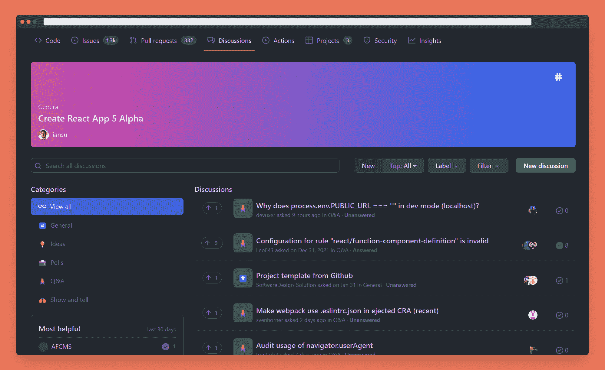
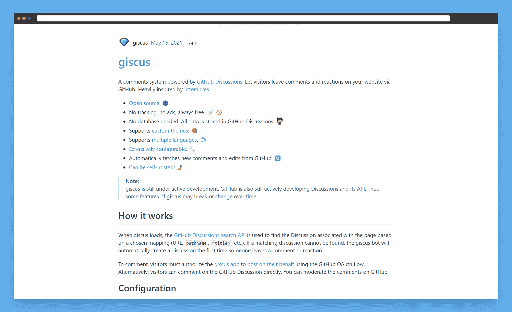
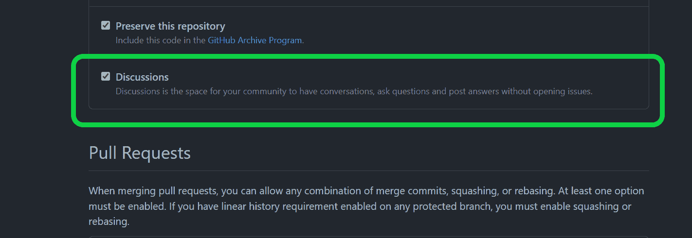
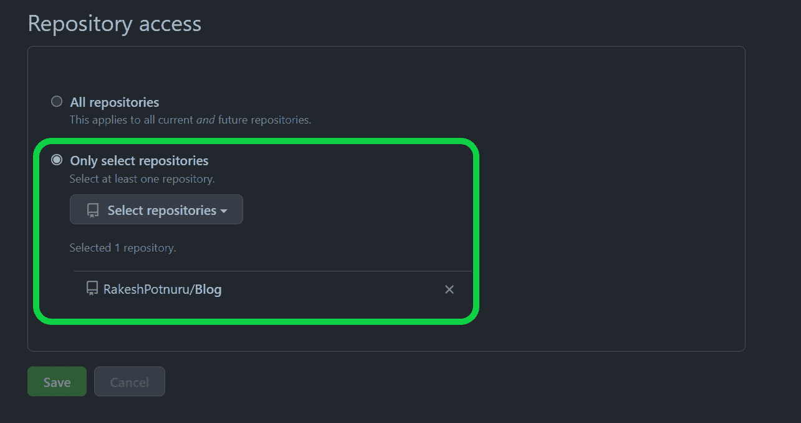
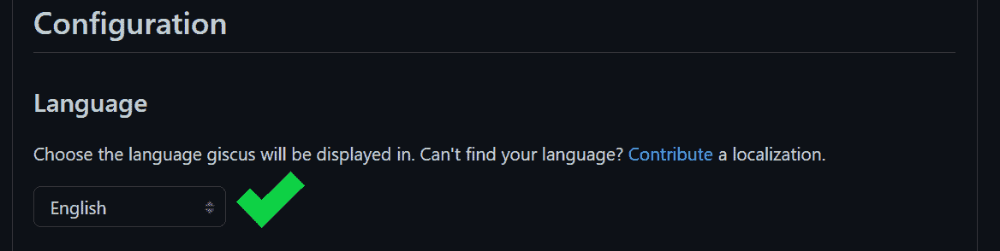
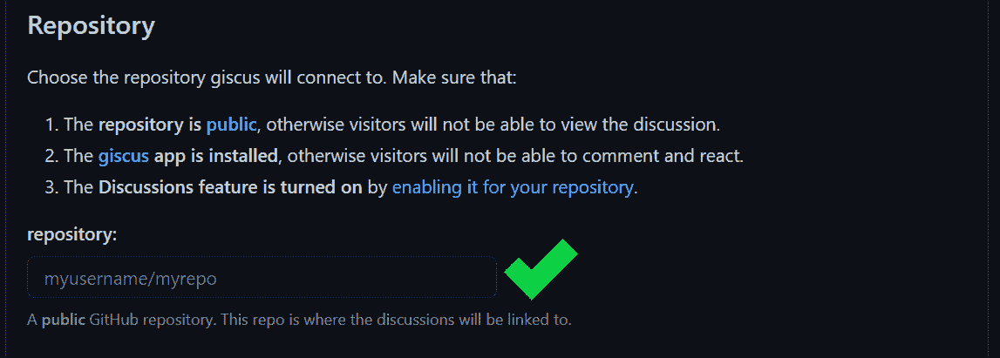
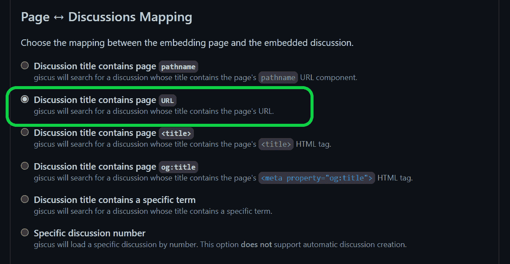
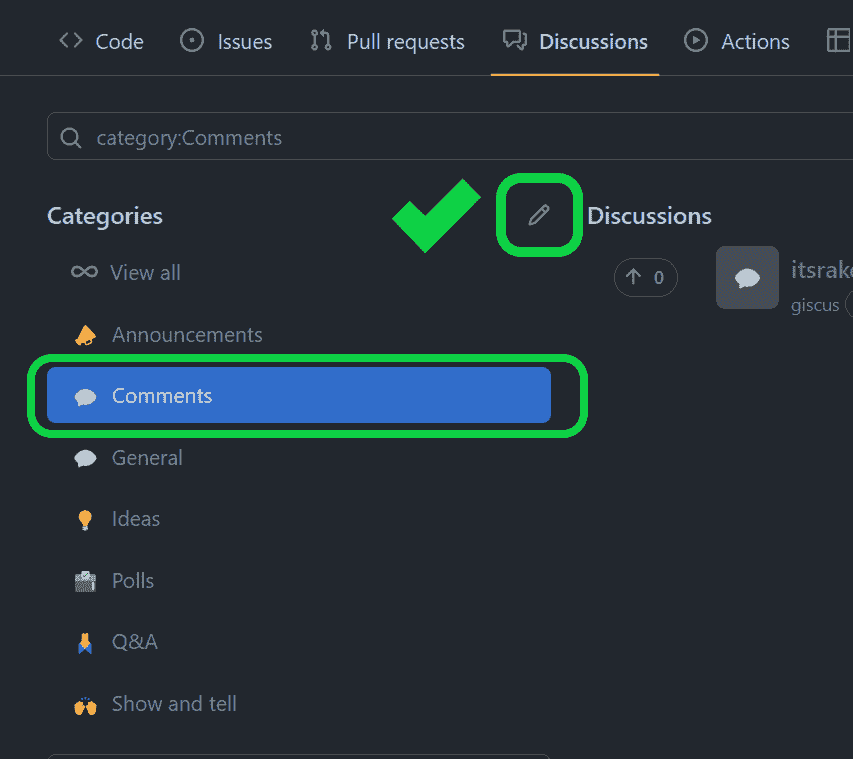
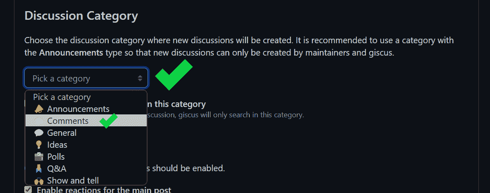
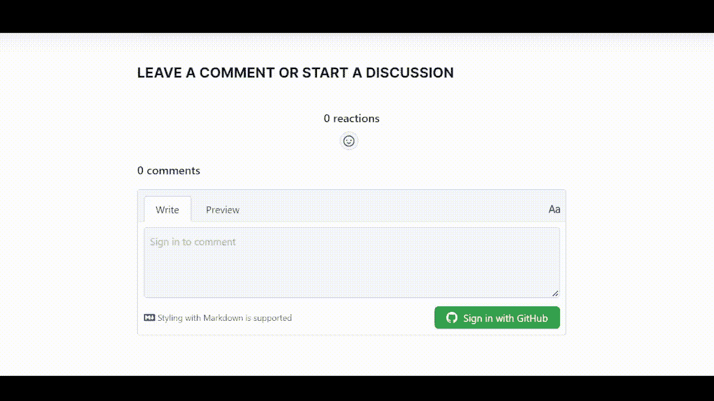

# 如何使用 GitHub 讨论作为你博客的聊天系统

> 原文：<https://www.freecodecamp.org/news/github-discussions-as-chat-system/>

如果你有一个个人博客，你可能会使用一个评论系统来管理你博客的讨论和评论。如果是这样，是时候考虑更新你的评论系统了。

在 GitHub 讨论的帮助下，你可以让你的博客评论更上一层楼。在这篇文章中，我将解释如何将 GitHub 讨论整合到你的博客中，并充分利用它。

## 什么是“GitHub 讨论”？



[GitHub Discussions](https://github.com/facebook/create-react-app/discussions)

[GitHub 讨论](https://docs.github.com/en/discussions)是一个可以在每个 GitHub 存储库上启用的论坛。开发人员可以轻松地讨论新特性、从社区获得反馈、创建投票、发布公告等等。

GitHub 讨论是开发者和社区成员的一站式协作场所。

## 如何使用 GitHub 讨论作为聊天系统

为了将 GitHub 讨论整合到您的博客中，我们将使用 **[giscus](https://giscus.app/)** 。



[giscus](https://giscus.app/)

giscus 是一个 GitHub 讨论支持的评论系统。它允许您将存储库中的讨论整合到您的博客中。

您的读者可以在您的博客上发表评论，这些评论将同时出现在您的回购的博客和讨论页面上。

### 使用讨论作为博客聊天系统的优势

*   完全免费
*   没有广告或跟踪
*   超级厉害
*   您可以完全控制评论，并拥有完全的审核权限。
*   有很多主题
*   这是非常可定制的
*   您可以在自己的服务器上自行托管

请记住，这个工具主要适用于开发博客，因为大多数开发人员都使用 GitHub。

## 如何在你的博客中融入 giscus

### 先决条件

*   一个博客(你必须有机会获得源代码)
*   一个 [GitHub 账户](https://github.com/)
*   您选择的存储库必须是公共的

首先，您需要为您的回购启动讨论。

进入**功能**部分- >下的**回购设置** - >勾选讨论框。



Discussions enabled

接下来，在你的回购中安装 giscus 应用程序。

转到[https://github.com/apps/giscus](https://github.com/apps/giscus)，按照提示进行操作，并且只允许访问所选的回购。



Repository access

现在重要的部分是:我们需要配置 giscus 小部件。

首先，进入 giscus [主页](https://giscus.app/)并滚动到**配置**部分。

选择您的 widget 语言。这是您希望用来显示小部件的语言。



Selecting language

然后键入你的**回购名称**以及你的**用户名**，如`username/reponame`。



Typing repository name along with username

对于**页面↔️讨论映射**，我建议选择“讨论标题包含页面`URL`”。但是根据你的需要选择一个最适合你的。



Page ↔️ Discussions Mapping

接下来，在 GitHub repo 的讨论页面中创建一个类别——类似于“评论”——或者选择现有的类别。



Creating a discussion category



Choosing a category

然后，如果需要，启用可选的**功能**。

接下来，选择主题。不要担心——您可以通过编程来切换不同的主题。

最后，复制并粘贴生成的代码。

Giscus 将根据您的设置生成一个脚本标签，您可以将它粘贴到您的代码中。但是我们将看到如何使用 giscus 组件。

### 如何使用 giscus 组件

如果你的博客是用 React/Vue/Svelte 或 Web 组件构建的，那么你可以安装 giscus 组件。

例如，要将 giscus 集成到 React 中，请执行以下操作:

*   安装 giscus 包。

```
npm i @giscus/react

or

yarn add $giscus/react
```

*   然后在组件中导入`giscus`并使用它。复制我们在上一步中得到的属性，从所有属性中移除`data-`，并将属性转换为有效的`jsx`属性。

```
import Giscus from '@giscus/react';

export default function MyApp() {
  return (
    <Giscus
      id="comments"
      repo="giscus/giscus-component"
      repoId="MDEwOlJlcG9zaXRvcnkzOTEzMTMwMjA="
      category="Announcements"
      categoryId="DIC_kwDOF1L2fM4B-hVS"
      mapping="specific"
      term="Welcome to @giscus/react component!"
      reactionsEnabled="1"
      emitMetadata="0"
      inputPosition="top"
      theme="light"
      lang="en"
      loading="lazy"
    />
  );
}
```

(Source: [giscus-component](https://github.com/giscus/giscus-component))

对于其他框架来说，基本上是相同的过程。

## 这是最终结果

整件事是这样运作的:



Final result

## 结论

在本文中，我们了解了使用 GitHub 讨论作为聊天系统的好处。我们还学习了如何在我们的网站中创建和集成 giscus 小部件。

我希望这能对你有所帮助。确保⭐的 giscus [GitHub repo](https://github.com/giscus) 支持他们。

在 Twitter 上关注我，我会分享一些关于 web 开发和技术写作的技巧、资源和我的心得。