# GitHub 扩展提高您的生产力

> 原文：<https://www.freecodecamp.org/news/github-extensions-to-boost-your-productivity-4692ad2b1796/>

尼克·卡尼克

# GitHub 扩展提高您的生产力

以下是我使用的 GitHub 扩展。它们将帮助您提高在 GitHub 上的工作效率。请在评论中分享你最喜欢的扩展。

[**八叉树**](https://github.com/buunguyen/octotree) **允许通过左侧面板在浏览器内轻松浏览源代码:**

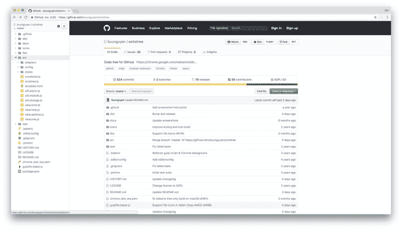

[**github-dashboard**](https://github.com/muan/github-dashboard)**提供了过滤 Github.com 活动仪表板上事件的能力**

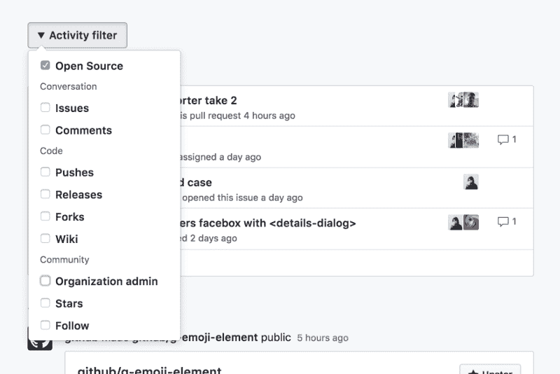

[**Sourcegraph**](https://about.sourcegraph.com/) **允许转到定义并在代码**中查找引用

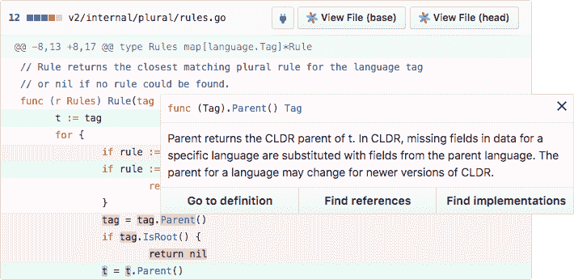

[**Octolinker**](https://github.com/OctoLinker/OctoLinker) **通过将模块导入转换成可点击的链接，您可以更有效地浏览代码，这样您就可以轻松查看它们的源代码**

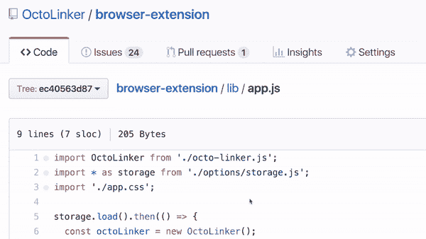

[**github-repo-size**](https://github.com/harshjv/github-repo-size)**在 GitHub 上显示存储库大小和单个文件大小**

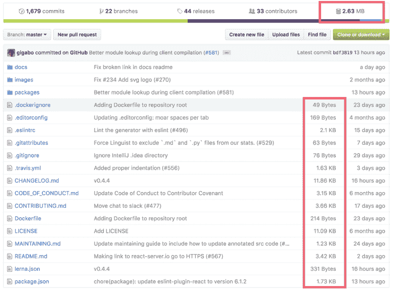

[**精炼——github**](https://github.com/sindresorhus/refined-github)**简化了 GitHub 界面，增加了几个有用的功能**

*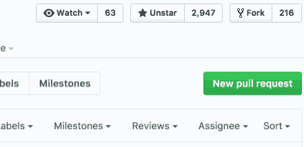*

****反应头像显示谁对某条评论作出了反应****

**

****该选项用于在合并 P 时等待检查****

*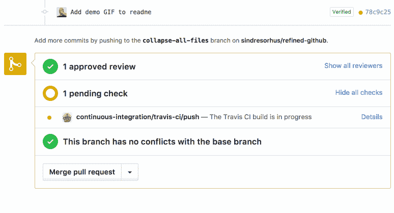*

****可点击的问题引用和拉式请求****

*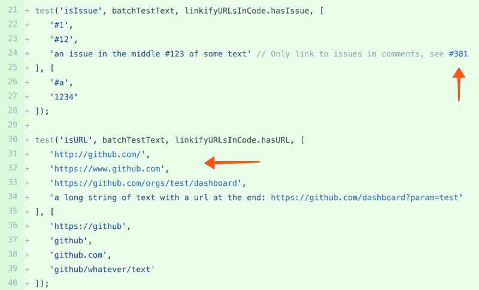*

****链接到问题的关闭提交或拉取请求****

**

*[**ZenHub**](https://www.zenhub.com/) **是管理你的 GitHub 问题的更好方法。它支持多重回购板、Epics 和报告——所有这些都在 GitHub** 中*

**

*[**GitHub-npm-stats**](https://github.com/katranci/github-npm-stats)**在 GitHub repo 上显示 NPM 下载统计***

*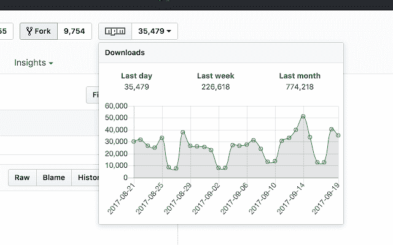*

*[**npmhub**](https://github.com/npmhub/npmhub) **显示 npm 对 GitHub repos 的依赖***

*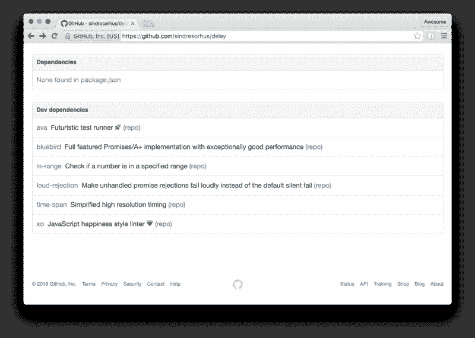*

*[**等距-贡献**](https://github.com/jasonlong/isometric-contributions) **渲染等轴像素艺术版 GitHub 贡献图***

*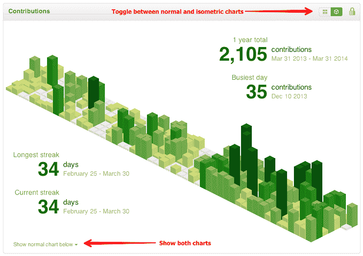*

#### *如果这篇文章是有帮助的？？？在推特上关注我。*

*

[You may also like my workshop on youtube:](https://twitter.com/intent/follow?screen_name=theoutlander) [How to Build a REST API with Node | Express | Mongo](https://youtu.be/egeHq-lYyxo)*