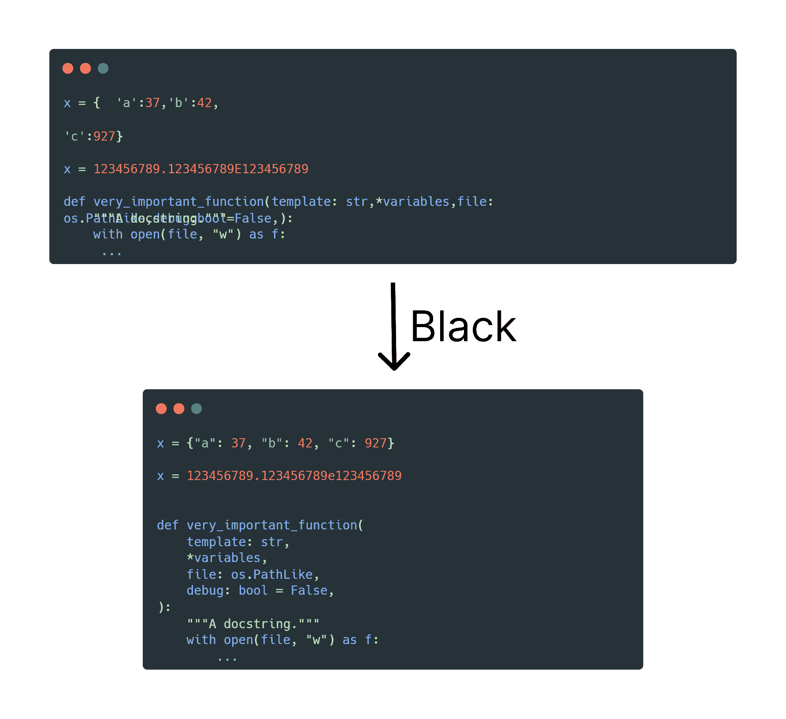

# 如何在你的项目中使用 GitHub Super Linter

> 原文：<https://www.freecodecamp.org/news/github-super-linter/>

当你开始一个新项目时，你可能需要添加多个林挺工具来美化你的代码并防止简单的错误。

您将经常使用多个 linters 其中一个可能支持 npm 安装，另一个可能支持 PyPI 安装，等等。您还会希望在您的 CI 中设置一些自动化来运行这些 linters，但是这个过程非常繁琐😫。

在本文中，我将向您展示如何使用 GitHub Super Linter，一个单独的 Linter 来解决所有这些问题。我的大多数个人项目也使用 GitHub Super Linter，我个人发现它是一个巨大的救星。

## 为什么林挺是必要的？

林挺本质上是静态代码分析的一种形式。它会根据一些规则分析您编写的代码，找出风格或编程错误。可以把它想象成一个标记软件中可疑用法的工具。

通过以下方式，linter 可以帮助您节省大量时间:

*   防止损坏的代码被推送
*   帮助建立编码最佳实践
*   代码布局和格式的构建指南
*   帮助代码评审更加顺畅
*   从语法错误中标记代码中的错误

鉴于林挺工具的有用性，理想情况下，您会希望在对推送到您的库的每一段代码进行任何代码评审之前运行一次 linter。这无疑有助于您编写更好、更可读、更稳定的代码。

这里有一个使用 [Black](https://github.com/psf/black) 的例子，这是 Python 的一个林挺工具，专注于代码格式化。



Formatting changes made by Black

GitHub Super Linter 可以帮助您轻松高效地将这些功能应用到项目中。GitHub 超级棉绒是多种常用棉绒的组合，您可以非常轻松地使用。它可以让你为这些棉条设置自动运行，以及在一个项目中管理多个棉条！

还有大量带有环境变量的定制功能，可以帮助您为自己的存储库定制超级 Linter。

## 如何在 GitHub 动作中使用 GitHub Super Linter

Super Linter 主要是为在 GitHub 动作中运行而设计的，这也是我一直以来使用它的方式。这个我们先说。为了跟进，您应该在存储库中创建一个新的 GitHub 动作。让我们在`.github/workflows/linter.yml`创建一个新文件。

接下来，我将假设您了解 GitHub 操作的基本语法。但是如果你不需要或者需要快速复习，我建议你浏览一下这个[快速入门指南](https://docs.github.com/en/actions/quickstart)。

### 如何创建操作

我们已经有了一个空白文件`.github/workflows/linter.yml`，现在我们将用一个动作填充它，您可以用它来 lint 您的项目。

我们将从给我们的操作命名开始。GitHub 操作状态检查下显示的内容如下:

```
name: Lint Code Base
```

接下来，让我们为我们的操作指定触发器。这回答了何时应该 lint 代码库的问题。这里我们告诉它在每次推送和每次拉取请求时运行 lint。

```
name: Lint Code Base

on: [push, pull_request]
```

这是触发器的另一个非常常用的配置。这只在您向`main`或`master`分支发出拉请求时运行，而不是向这些分支发出推请求。

```
on:
  push:
    branches-ignore: [master, main]
  pull_request:
    branches: [master, main]
```

接下来，我们要创建一个作业。您放在单个作业中的所有组件将按顺序运行。在这里，可以把它看作是步骤，以及每当触发器被满足时我们希望它们运行的顺序。

我们将这个作业命名为“Lint Code Base”，并要求 GitHub 在运行 GitHub 支持的 Ubuntu 最新版本的 runner 上运行我们的作业。

```
name: Lint Code Base

on: [push, pull_request]

jobs:
  build:
    name: Lint Code Base
    runs-on: ubuntu-latest
```

你不必像我们在这里一样使用单一种类的运行程序(ubuntu-latest)。拥有代理种类的矩阵是一种常见的做法，但是在这种情况下，它将在所有种类的运行程序上以相同的方式运行。你经常使用运行者矩阵来测试你的代码在各种平台上运行良好。

GitHub Super Linter 在其他机器类型上没有任何不同，所以我们只使用一种机器类型。

接下来，我们将开始定义我们希望该工作流具有的步骤。我们主要有两个步骤:

1.  检查代码
2.  运行超级棉绒机

继续检查代码。为此，我们将使用 GitHub 的官方结帐操作。

我们将设置`fetch-depth: 0`来获取所有分支和标签的所有历史，这是 Super linter 获取更改文件的正确列表所必需的。如果您没有这样做，那么只会获取一个提交。

我们还为我们的步骤命名，并告诉它我们想要使用在`actions/checkout@v3`的 GitHub 存储库中的动作。

```
name: Lint Code Base

on: [push, pull_request]

jobs:
  build:
    name: Lint Code Base
    runs-on: ubuntu-latest

    steps:

      - name: Checkout Code
        uses: actions/checkout@v3
        with:
          fetch-depth: 0
```

这段代码在`$GITHUB_WORKSPACE`下签出您的存储库，这允许工作流的其余部分访问这个存储库。我们签出的存储库是您的代码所在的存储库，理想情况下是同一个存储库。

### 如何运行棉绒机

现在我们将添加运行 linter 的步骤，因为我们已经签出了代码。您可以在运行动作时使用环境变量自定义 GitHub Super Linter。

```
name: Lint Code Base

on: [push, pull_request]

jobs:
  build:
    name: Lint Code Base
    runs-on: ubuntu-latest

    steps:

      - name: Checkout Code
        uses: actions/checkout@v3
        with:
          fetch-depth: 0

      - name: Lint Code Base
        uses: github/super-linter@v4
```

我们现在将谈论你将经常与 GitHub Super Linter 一起使用的环境变量以及一些例子。

*   这决定了 Super Linter 是应该 lint 整个代码库，还是只处理提交时引入的更改。使用`git diff`可以发现这些变化，但是您也可以改变搜索算法(但是我们不会在本文中研究这个)。例如:`VALIDATE_ALL_CODEBASE: true`。
*   `GITHUB_TOKEN`:顾名思义，这是 GitHub 令牌的值。如果你使用这个，GitHub 将在 UI 上显示你使用的每一个 linters(我们将很快看到如何做),作为单独的检查。示例:在 GitHub 操作中，您可以使用`GITHUB_TOKEN: ${{ secrets.GITHUB_TOKEN }}`。
*   `DEFAULT_BRANCH`:存储库默认分支的名称。例子:`DEFAULT_BRANCH: main`。
*   `IGNORE_GENERATED_FILES`:如果你有工具生成的文件，可以标记为`@generated`。如果这个环境变量设置为 true，Super Linter 会忽略这些文件。例如:`IGNORE_GENERATED_FILES: true`。
*   `IGNORE_GITIGNORED_FILES`:排除在中的文件。来自林挺的 gitignore。例子:`IGNORE_GITIGNORED_FILES: true`。
*   `LINTER_RULES_PATH`:自定义路径，任何 linter 自定义文件都应位于此路径。默认情况下，您的文件应该位于`.github/linters/`。例如:`LINTER_RULES_PATH: /`。

这些是一些您最常使用的环境变量，但是我们讨论的这些变量都没有涉及到特定于语言的林挺。

如果您不使用我们讨论的任何环境变量，Super Linter 会自动为您的代码库找到并使用所有适用的 Linter。

## 如何向超级棉绒中添加特定棉绒

你通常只会对在你的项目中使用特定的棉绒感兴趣。您可以使用以下环境变量模式来添加您想要的任何 linters:

```
VALIDATE_{LANGUAGE}_{LINTER}
```

你可以在[支持的 Linters](https://github.com/github/super-linter#supported-linters) 列表中找到它们的命名约定。

这里有几个例子，我们指定使用 Black 来 lint 所有 Python 文件，ESLint 用于 JavaScript 文件，HTMLHint 用于 HTML 文件。

```
name: Lint Code Base

on: [push, pull_request]

jobs:
  build:
    name: Lint Code Base
    runs-on: ubuntu-latest

    steps:

      - name: Checkout Code
        uses: actions/checkout@v3
        with:
          fetch-depth: 0

      - name: Lint Code Base
        uses: github/super-linter@v4
        env:
          VALIDATE_ALL_CODEBASE: true
          VALIDATE_JAVASCRIPT_ES: true
          VALIDATE_PYTHON_BLACK: true
          VALIDATE_HTML: true
          GITHUB_TOKEN: ${{ secrets.GITHUB_TOKEN }}
```

一旦您将其中一个棉条设定为`true`，所有其他棉条将不会运行。在上面的代码片段中，除了 ESLint、Black 或 HTMLHint 之外，其他所有的 linters 都不会运行。

然而，在这个例子中，我们将单个 linter 设置为`false`,因此除了 ESLint 之外的每个 linter 都将在这里运行:

```
name: Lint Code Base

on: [push, pull_request]

jobs:
  build:
    name: Lint Code Base
    runs-on: ubuntu-latest

    steps:

      - name: Checkout Code
        uses: actions/checkout@v3
        with:
          fetch-depth: 0

      - name: Lint Code Base
        uses: github/super-linter@v4
        env:
          VALIDATE_ALL_CODEBASE: true
          VALIDATE_JAVASCRIPT_ES: false
          GITHUB_TOKEN: ${{ secrets.GITHUB_TOKEN }}
```

## 如何自定义 Lint 检查

linter 经常使用配置文件，因此您可以修改 linter 使用的规则。在上面我展示的两个完整的例子中，Super Linter 将试图在`.github/linters/`下找到任何配置文件。

这些可能是用于配置 ESLint 的`.eslintrc.yml`文件，用于配置 HTMLHint 的`.htmlhintrc`文件，等等。

如果您使用 Python 的 Flake8 linter，下面是一个配置文件示例:

```
[flake8]
max-line-length = 120
```

你在`.github/linters/.flake8`保存这个。然后，您将在运行 Flake8 棉绒机时使用它。你可以在这里找到一个你可以使用的[模板配置文件的例子。](https://github.com/github/super-linter/tree/main/TEMPLATES)

但是，这里有两个如何修改该路径的示例:

1.  所有的 linter 配置文件都在其他目录中

将目录路径作为环境变量添加，如下所示:

```
LINTER_RULES_PATH: configs/
```

2.添加配置文件的路径

您还可以将特定 linter 的路径硬编码为环境变量。这里有一个例子:

```
JAVASCRIPT_ES_CONFIG_FILE: configs/linters/.eslintrc.yml
```

## 如何在 GitHub 动作之外运行 Super Linter

GitHub Super Linter 是为了在 GitHub Actions 内部运行而构建的。但是在本地或其他 CI 平台上运行它会特别有帮助。你将基本上运行 Super Linter，就像你在本地运行任何其他 CI 平台一样。

### 如何在本地运行超级棉绒

您首先希望使用以下命令从 DockerHub 中取出最新的 Docker 容器:

```
docker pull github/super-linter:latest
```

要运行该容器，您需要运行以下命令:

```
docker run -e RUN_LOCAL=true -e USE_FIND_ALGORITHM=true VALIDATE_PYTHON_BLACK=true -v /project/directory:/tmp/lint github/super-linter
```

注意这里的一些事情:

*   我们用`RUN_LOCAL`标志运行它，绕过一些 GitHub 动作检查。这将自动设置`VALIDATE_ALL_CODEBASE`为真。
*   我们将本地代码库映射到`/tmp/lint`,这样 linter 就可以获取代码。
*   我们设置环境变量的方式当然不同，但是运行 GitHub Super Linter 的整个过程是相同的。

### 如何在其他 CI 平台上运行 Super Linter

在其他 CI 平台上运行 GitHub Super Linter 与在本地运行它非常相似。这里有一个由杨韬在 Azure 管道中运行的例子。

```
- job: lint_tests
  displayName: Lint Tests
  pool:
    vmImage: ubuntu-latest
  steps:
  - script: |
      docker pull github/super-linter:latest
      docker run -e RUN_LOCAL=true -v $(System.DefaultWorkingDirectory):/tmp/lint github/super-linter
    displayName: 'Code Scan using GitHub Super-Linter'
```

这只是运行我们将在本地作为脚本运行超级 Linter 的命令。您可以在其他 CI 平台上以完全相同的方式运行它。

## **结论**

谢谢你坚持到最后。我希望你已经从林挺和使用 GitHub Super Linter 中学到了一些东西。这无疑是我最喜欢的开源项目之一。

如果你学到了新的东西或者喜欢阅读这篇文章，请分享给其他人看。在那之前，下期帖子再见！

你也可以在 Twitter [@rishit_dagli](https://twitter.com/rishit_dagli) 上找到我，我在那里发关于开源和机器学习的微博。