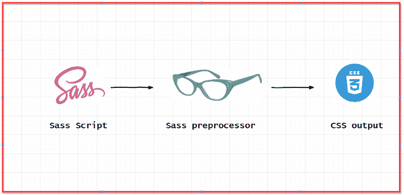
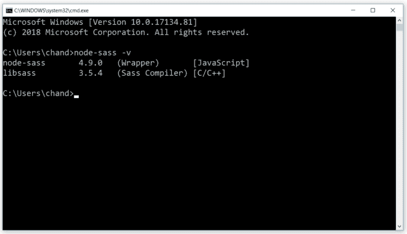
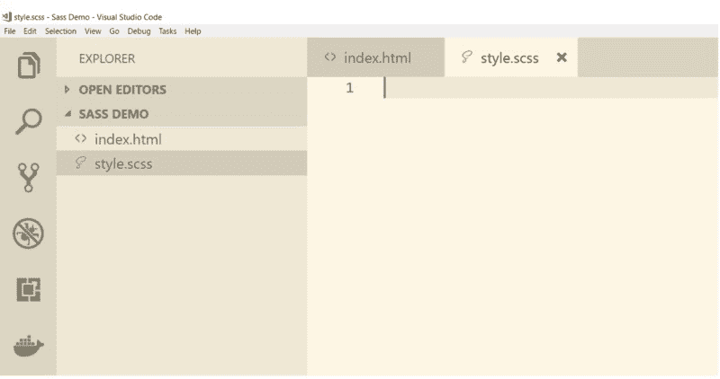
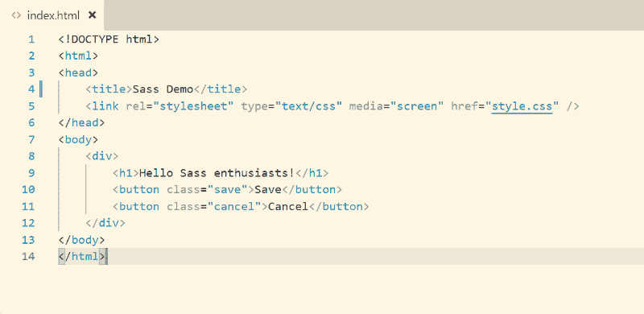
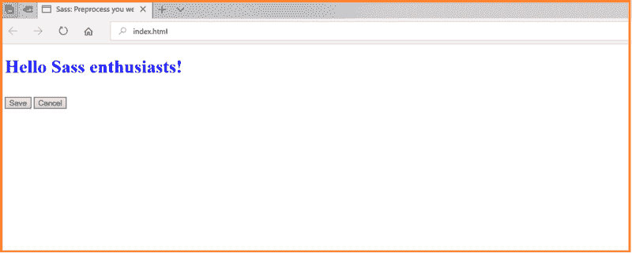
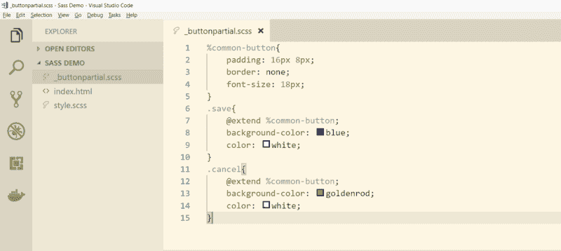

# sass——网络装饰的预处理器

> 原文：<https://www.freecodecamp.org/news/give-more-oompf-to-your-web-garnishes-with-preprocessors-in-sass-bd379226a114/>

#### 美学的重要性，它的影响，以及实现它的工具。

我记得小时候，每次去面包店，我都会选择浇头最漂亮的糕点。只有尝了第一口，我才知道那是不是我渴望的那一口。

一盘精心烹制的菜肴有时会胜过美味。挑剔外表的倾向对我们的选择有重大影响。这种倾向不仅局限于食物。时髦的衣服、装饰一新的公寓和精心设计的汽车就是几个例子。

一位厨艺大师明白展示对于一家成功餐厅的重要性。装饰艺术可以区分一个烹饪大师和一个新手的盘子。此外，一个创造性的电镀将增加乐趣和品味，鼓励顾客经常光顾。从这个意义上来说，网络与任何美食都没有什么不同。视觉冲击在所有成功的网络应用程序中也扮演着重要的角色。

你需要付出巨大的努力让 web 应用程序看起来令人愉快。这就是级联样式表(CSS)的用武之地。

随着 web 的发展，应用程序变得越来越大。为了满足我们的需求，我们需要更多现成的 CSS。但是 CSS 有一些限制。

既然你正在读这篇文章，你已经完成了浇头，现在是时候品尝剩下的蛋糕了。让我们看看 CSS 有哪些局限性，以及如何克服它们。目标是让你的电镀技术更上一层楼。

### 先决条件

你需要对 CSS 和 CSS 选择器有一个相当好的理解。您还需要安装 Node.js 和 npm。

### CSS 限制

识别局限性是主观的，尽管我想提几个。

1.  编程机制:CSS3 本身缺少变量、函数、类和操作符等特性。
2.  冗长的 CSS 文件:在富用户界面应用程序中，样式表可能会在一夜之间增长。对于维护来说，大文件可能是一场噩梦。
3.  缺少数学运算符:像`+`、`-`、`*`、`/`这样的数学运算符有时非常有用。

为了克服这些限制，我们有了预处理脚本语言。

### 预处理器

预处理器是一种软件，它接受用某种编程语言编写的输入文件，并按照另一种语言的语法对其进行处理，生成一个文件。它用于通过添加新的功能来扩展现有编程语言的语法。



illustration: Sass preprocessor

CSS 预处理器通过添加编程机制来扩展 CSS 语法。SassScript 是 CSS 的超集。编译时，它为您的 web 应用程序创建有效的 CSS 块。

有一些 CSS 预处理程序可用，如 Less、Stylus 和 Sass。我们的重点将放在 Sass(语法超棒的样式表)上。但是这个概念对于其他预处理程序或多或少是相同的。

我们将完成 Node.js Sass 编译器的安装，稍后我们将看到各种 Sass 特性的运行。所以，准备好装饰你美味的网络食谱吧？。

### 准备 Sass

Sass 最初是用 Ruby 编写的，后来用了其他语言。您可以从许多可用的实现中进行选择。对于本文，我们将坚持使用 Node.js 包— [node-sass](https://www.npmjs.com/package/node-sass) 。这个包在 C 语言中使用高性能的 Sass 实现，称为 libSassSass。

首先:让我们安装 node-sass。然后，我们将设置一个示例应用程序来查看各种 Sass 特性的运行情况。在你的机器上打开一个终端，执行下面的命令。

```
npm install node-sass -g
```

这里我们要求节点包管理器为我们安装`node-sass`。用标志`-g`，我们全局安装包。太好了！一旦完成，确保一切就绪。

```
node-sass -v
```



command to check node-sass version.

好吧！我们有可能需要的所有材料。让我们看看 Sass 有哪些特色，然后我们将开始探索 Sass 的旅程。

### 各种风味的萨斯

创建 Sass 文件有两种方法。您可以使用这两种语法中的任何一种。

1.  Sass 风格:这种语法使用缩进来分隔代码块和新行。
2.  SCSS 风格:这种语法像编程语言一样使用块。在本文中，我们将使用 SCSS 语法。

注意:可以通过一个简单的 Sass convert 命令将一种语法转换成另一种语法。随便领养一个你喜欢的。

### 准备主菜

当我们在我们的机器上 Sass-ready 时，我们可以开始尝试看看它能给我们带来什么样的功能。跟随我来设置一个示例应用程序。

这里我用的是 [Visual Studio 代码](https://code.visualstudio.com/)。您可以使用自己选择的任何代码编辑器。我已经用了很长时间，我会推荐它。它有一些很酷的生产力插件，可以提供很大的帮助。



到目前为止，我们已经创建了一个文件夹和两个文件。

1.  index.html:一个 html 文件。
2.  style.scss:根(或主)Sass 脚本文件。

首先，让我们在 HTML 文件中创建一个`div`、一个`h1`和两个`button`。



让我们遍历一下最常用的 Sass 特性。在途中，我们还将看到编译的 CSS 块。

### 变量

变量帮助您集中 CSS 属性。您可以在文件的顶部分配一次，然后在整个文件中使用它们。这些变量就像 CSS 属性值的占位符。在 Sass 中，变量名必须以一个`$`符号开始。

我们将创建两个变量:`$h1-color`和`$h1-height`。然后我们将使用这些变量为一个`h1`元素分配颜色和高度属性。下面是 Sass 片段。

```
$h1-color     : blue;
$h1-height    : 50px;
h1{
   color  : $h1-color;
   height : $h1-height;
}
```

好吧！到目前为止，我们有一个 HTML 文件和一个 Sass 文件。CSS 文件呢？还没有出现。

嗯，我们快到了。打开您的终端，转到我们创建的文件夹，执行下面的命令:

```
node-sass style.scss style.css
```

`node-sass`编译器的参数是输入和输出文件路径。现在，如果您在浏览器中打开我们在项目设置期间创建的 HTML，您应该会看到以下内容。



HTML with CSS applied

注意，CSS 文件已经包含在 HTML 的`head`部分中。

### 经营者

CSS 中总是缺少数学运算符。Sass 提供了基本的数学运算符，如加法`+`、减法`-`、乘法`*`和除法`/`。

您可以一起使用变量和操作符来操作 CSS 属性。我们举个例子。我们可以使用操作符根据父元素`div`的宽度来计算`h1`元素的填充。在这个例子中，我们将使用除法运算符`/`。

```
$h1-color   : blue;
$h1-font    : 50px;
$div-width  : 500px;
div{
   width: $div-width;
}
h1{
   color       :  $h1-color;
   height      :  $h1-font;
   padding     :  $div-width / 10;
}
```

### 混合蛋白

Mixins 就像抽象基类。Mixins 便于对相关属性进行分组。一旦创建，这些混合可以在其余的样式块中重用。而且，你甚至可以传递变量。迷惑？我们举个例子。

你一定注意到了为边界半径创建一个样式总是很麻烦。对于跨浏览器支持，我们必须使用特定于供应商的属性。然而，有了 mixins，这就变得非常简单了。让我们看着它发生。

```
@mixin border-radius($radius){
   -webkit-border-radius   : $radius;
   -moz-border-radius      : $radius;
   -ms-border-radius       : $radius;
   border-radius           : $radius;
}
div{
   width    : $div-width;
   border   : 2px solid grey;
   @include border-radius(20px);
}
```

这里我们使用了`@mixin`指令来定义一个名为`border-radius`的 mixin。这个 mixin 包含了设置边框半径的所有可能的属性。我们还向这个 mixin 传递了一个参数。每当你需要设置一个元素的半径时，用`@include`关键字包含这个 mixin。

再次编译脚本以生成 CSS。现在看起来怎么样？

```
//Processed CSS output
div {
   width: 500px;
   border: 2px solid grey;
   -webkit-border-radius: 20px;
   -moz-border-radius: 20px;
   -ms-border-radius: 20px;
   border-radius: 20px; 
}
```

### 嵌套

HTML 元素具有嵌套元素的逻辑树状结构。要编写结构化的 CSS 选择器，CSS 也应该遵循一些逻辑嵌套。然而，CSS 不支持嵌套。

因为你的机器上有 Sass，所以编写嵌套的 CSS 选择器是小菜一碟。

```
div{
   >h1{
      color: blue;
      &:hover{
         color: greenyellow;
      }
   }
}
```

这里我们使用了两个组合子，`&`gt；a `n` d &。组合子的目的是解释元素之间的关系。我们的示例将把蓝色应用到 `a` div 元素的`ll` h1 子元素。另一个选择器是父选择`o` r &。将此选择器用于伪类，如 hover、focus 和 active。

再次编译以查看生成的 CSS 块。

```
//Processed CSS output
div h1 {
   color: blue;
}
div h1:hover {
   color: greenyellow;
}
```

### 继承:

是的——您也可以使用 Sass 中最流行的 OOP 特性。积累父母的财产就是继承。但是在 CSS 中有意义吗？我们能使用它们吗？我们可以！相信我，我相信你会喜欢这个功能。

考虑一个应用程序，其中有各种类型的按钮。保存、取消和丢弃等等。你意识到他们有很多共同的特征。例如填充、字体大小、边距。唯一的区别是背景颜色。

有遗传的味道吗？是的——你猜对了！我们可以为所有这些公共属性创建一个父样式，并在子块中使用它们。

```
%common-button{
   padding: 16px 8px;
   border: none;
   font-size: 18px;
}
.save{
   @extend %common-button;
   background-color: blue;
   color: white;
}
.cancel{
   @extend %common-button;
   background-color: goldenrod;
   color: white;
}
```

这里，`save` 和`cancel`按钮从`common-button`类继承了它们的公共属性。要声明父样式，请使用`%`符号。使用`@extend`指令继承一个子块。

### 导入

我们已经看到了 Sass 提供的许多令人惊叹的特性。我们能够使风格更具可读性和结构化。尽管如此，它可能会增长并变得难以维护。

Sass 对这个问题也有一个解决方案:部分文件。部分文件是创建小型模块化 Sass 文件的一种方式。然后，根 Sass 文件可以一起导入这些模块化文件。部分文件的命名惯例是在文件名前加一个下划线`_`。



```
@import '_buttonpartial';
h1{
   color:blue;
}
```

使用`@import`指令在根 Sass 脚本中包含一个部分文件。

### 环

迭代是最常用的编程机制之一。Sass 脚本允许你迭代变量。您可以使用各种指令，如`@for`、`@each`和`@while.`

```
$totalButton: 2;
@for $i from 1 through $totalButton{
   .button-#{$i} {
      width: 50px * $i;
      height: 120px / $i;
   }
}
```

生成的 CSS 块将有两个不同样式的类。

```
//Processed CSS output
.button-1 {
  width: 50px;
  height: 120px; }
.button-2 {
  width: 100px;
  height: 60px; }
```

### 避免重复——使用食品加工机

食品加工机是一种厨房用具，用于在准备食物时简化重复性工作。

我们使用了 Node.js 包来编译 Sass 文件。如果每次在 Sass 脚本中进行更改时都必须进行编译，这可能会非常烦人。

有一个奇特的方法可以避免重复编译:一个任务runner。Visual Studio 代码有一个内置的任务运行器，但是你可以使用任何你选择的任务运行器。[大口](https://gulpjs.com/)是另一个流行的任务跑者。为了用 Gulp 编译 Sass 脚本，你需要用 [gulp sass 编译器](https://www.npmjs.com/package/gulp-sass)来代替。

**警告！** Sass 只是一个开发工具。避免运输任何与 Sass 相关的库或文件。在生产服务器上，您永远也不会需要它们。

### 下一步是什么

我们已经学习了如何使用预处理程序来创建高效且可维护的 CSS 块。我们已经通过例子看到了各种 Sass 特性。更多深度知识，跳转到官方[网站](https://sass-lang.com/guide)。

我还创建了一个[样本](https://github.com/SinghChandrabhan/SassSample)项目。继续，克隆项目并开始播放。