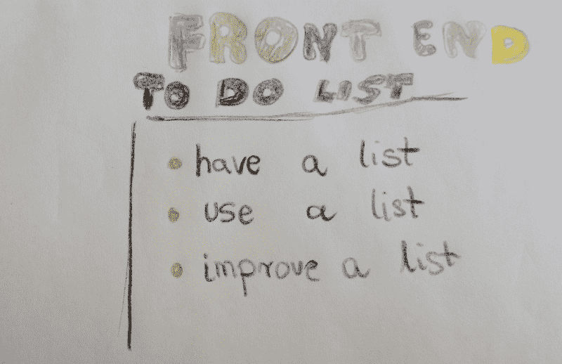
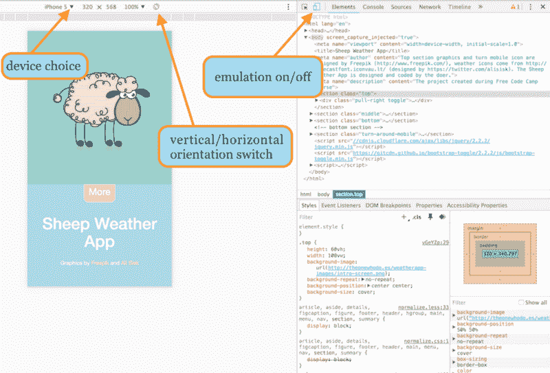
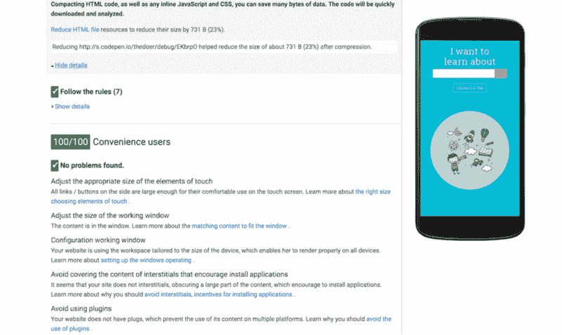
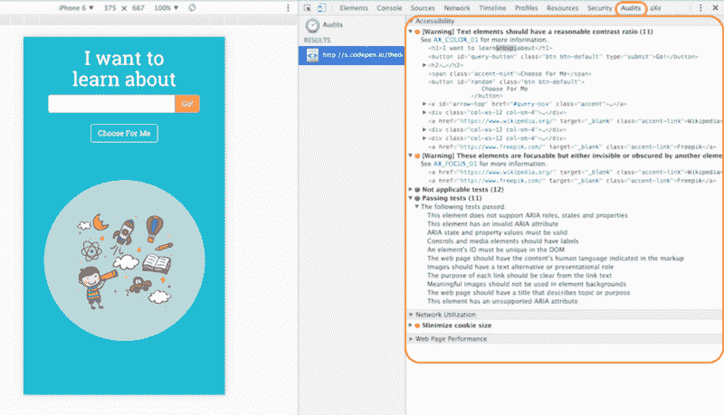
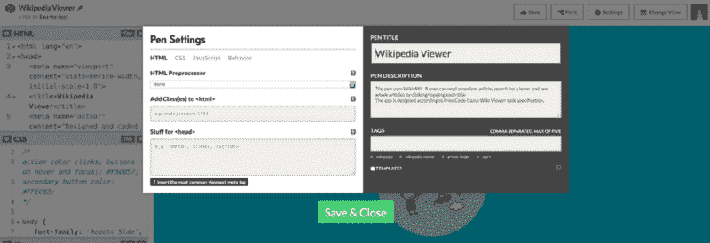

# 给你的前端做一次健康检查

> 原文：<https://www.freecodecamp.org/news/give-your-front-end-a-health-check-952c857ecdb4/>

埃娃·米切卡什卡

# 给你的前端做一次健康检查

你已经建立了所有的用户故事，你的应用程序正在工作。现在已经准备好提交了，所以你可以继续你的生活了。

没那么快！

您需要首先对您的代码进行健康检查。

专业歌手在检查麦克风和扬声器之前不会开始唱歌。在检查完前端、后端以及它们之间的一切之前，您不应该进行部署。

我是一个没有耐心的人，但是编码让我慢了下来。作为一名开发人员，我学会了至少思考两次，问问题直到代码运行，在庆祝成功之前等待片刻。

迭代是关键，因为好的产品永远不会完成。关键是迭代你引以为豪的版本，而不是那些远未准备好上线的版本。

因此，在上线之前，请将此作为最后的检查清单。

#### 1.反应灵敏

当您调整浏览器窗口大小时，您的应用程序的行为如何？代码中的断点在哪里？它的流动性是否足以适合所有尺寸，而不会出现更大的问题？

有各种各样的屏幕尺寸。不可能让所有的设备都触手可及，但是模仿它们的行为是很容易的。

在[代码审查室](http://gitter.im/freecodecamp/codereview)呆了一段时间，我注意到许多人专注于桌面开发，而实际上他们应该首先在移动设备上测试他们的应用。

浏览器工具允许我们在不同的屏幕尺寸和方向上模拟显示。使用它们，它们是免费的。

在 Chrome 中，您可以通过右键单击页面上的任何元素并选择“检查元素”来进入调试视图，然后进入移动视图并仿真不同的设备。

Chrome browser emulation mode

#### 2.考虑特殊情况和应用程序状态

空、错误、成功、等待、404 页面或等待 API 响应时重复的按钮点击——你的应用如何应对它们？你关心这些远离你编码的理想状态的状态吗？当用户遇到这些问题时，你有什么有用的反馈给他们吗？你测试过这些特例吗？你是在应用程序中倾听和回应，还是一直在说话？

[所有状态的设计、编码和测试](https://medium.com/@_mikehlee/designing-for-various-states-823816e49c8d#.4x0p9y4oh)。检查用户流量可以帮你摆脱这些容易被抛弃的点和死角。简单地和一些用户一起测试你的工作，或者至少自己做。

通过想象各种可能发生的场景，设身处地为用户着想，记住这个应用对这个人来说是全新的。

尝试不正确的数据输入，根本没有输入，拼写错误等。发挥想象力，尝试打破你的代码！你最好在你的用户之前做。

#### 3.优化您的性能

Google PageSpeed Insights 很好地告诉你哪些地方可以做得更好。

如果你想让其他人能够阅读和检查你的代码，不要缩小你的 JavaScript 或 CSS——这将使人们难以阅读。但是，您应该为生产代码这样做。

对于生产，还可以使用 [Grunt](http://gruntjs.com/) 等工具为你处理和优化其他操作。

通过使用诸如 [PageSpeed](https://developers.google.com/speed/pagespeed/insights/) 这样的测试，你不仅可以快速获得关于性能的意见，还可以获得关于可用性问题的意见。测试结果为您提供了如何改进代码的现成建议。同样，你不必接受所有的建议，只需选择那些对你想要实现的目标有用的建议。

UX basic health check with PageSpeed tool

#### 4.在你所有的设备上做跨浏览器测试

我们中的许多人至少可以使用两种不同的设备(一台电脑和一部智能手机)，我们中的一些人甚至可以双重启动不同的操作系统。浏览器仿真有其缺陷，所以尽可能使用本地硬件。

你不必为一个显示维基条目或当地天气的小应用程序编写单元测试来检查它们是否工作。测试驱动开发是一个很好的实践，但是对于新的程序员来说并不容易，对于简短的代码片段来说可能是一种过度的形式。

你必须意识到的是，测试是前端开发人员工作的一部分，即使有一个庞大的测试团队坐在你旁边的同一个房间里。在您将入场券分配给其他团队成员之前，您必须确保其有效。不要假设，检查。

有了代码，要么成功，要么失败。没有*也许是*或者*我猜是*。

跨浏览器测试可能很耗时，但是有很多技巧可以让它更高效。例如，每次测试时，尝试使用不同的浏览器。

由于您是在迭代项目时测试它的，因此在创建应用程序的过程中，您可以在各种浏览器上多次测试您的代码。然后，在发布最终版本之前，进行一次快速的浏览器健康检查会快得多，因为大多数问题可能已经被发现并修复了。

浏览器开发工具和扩展还允许您在项目上线之前轻松发现可访问性约束。你也可以使用[浏览器堆栈](https://www.browserstack.com/)，我发现它对跨浏览器测试很有帮助。

Accessibility Audits in Chrome

我最近[了一份很好的可访问性清单](http://a11yproject.com/checklist.html)。如果你想更深入地挖掘这个话题，你可能也喜欢用[唱腔技术](https://developer.mozilla.org/en-US/docs/Web/Accessibility/ARIA/ARIA_Techniques)检查你的应用，关于[键盘设计的文章](http://www.washington.edu/accessibility/checklist/keyboard/)，或者浏览[简单可访问的档案](http://simplyaccessible.com/archives/)。

#### 5.保持冷静

Source: giphy.com

仔细检查你的 HTML 的 head 部分，确保你有 meta 描述，一个为移动设备设置的视窗，一个标题标签和一个 favicon。至少保留基本的元标签，比如描述和作者。SEO 规则变化很快，但是一个信息丰富的描述可以增加你在拥挤的搜索结果页面上被点击的可能性。

如果你真的想分享你的工作，那就让其他人更容易合作。保持 README.md 文件简洁明了。这是大多数人在 GitHub 上查看你的项目的方式，所以不要在你的回购中忽略这个文件。

如果你在 CodePen 上编写一些小的项目，去设置部分，添加你的笔和标签的基本描述。这将使你的工作更容易被他人发现和理解。

Provide some small info about your pens.

确保正确导入资源和库。如果您想要将项目从 CodePen 移动到另一个服务器，请确保包含您在 Pen 中使用的外部库、框架和样式表。

如果你只是想要 Github 的一个副本，并且是一个小项目，你可以简单地将你的笔导出到 gist。为此，请使用编辑器视图右下角的导出按钮。

#### 6.代码优化

保持干燥(不要重复自己)。完成后，再看一遍代码。也许有一些你重复的片段，它们可以被一个智能功能所取代。再次分析你的代码，看看还有什么可以写得更好。你编码越多，你就越聪明。据说一段时间后回到自己的代码并重构它是一个很好的学习代码的实践。试试看。

在完成项目之前**清理你的玩具**。

所有控制台日志对于创建过程中的调试都是有用的，但对于生产代码来说却是不受欢迎的。

为阅读你的代码的其他人提供简洁明了的注释，最好是用英语，除非你团队中的其他人都说同样的语言。

确保没有任何控制台错误，并且所有资源都正确加载(对于浏览器开发工具中的“检查网络”选项卡)。

您可能希望对 [JavaScript](http://www.jslint.com/) 、 [HTML](https://validator.w3.org/) 和 [CSS](http://csslint.net/) **使用代码验证器。与 PageSpeed 一样，关键是要理解什么是值得优化的。**

#### 7.用户体验

项目的快速 UX 健康检查应包括以下基本内容:

*   **目标**。用户能够解决他们的问题吗？他们的期望达到了吗？他们在你的应用程序/网站上得到他们想要的东西了吗？用户会告诉应用程序什么是仅仅看一会儿？
*   **死胡同**。你检查过你的用户可以选择的所有可能的路径了吗？你有帮助吗？你会在用户需要的时候提供反馈吗？
*   **视觉层次**。等级制度保持了吗？你能吸引用户的眼球吗？你的行动号召是否可见？你是否有太多的项目需要关注，以成为给定屏幕上的主要元素？
*   **线条宽度。**你的文字容易扫描吗？你的行不能超过 80 个字符。确保你的线条不要太窄，填充太多。
*   **可读性。你的文字可读吗？图像大小合适吗？元素之间有没有[对比](http://leaverou.github.io/contrast-ratio/)合适？**
*   **负担能力。**你的纽扣看起来像纽扣吗？你的链接行为像链接吗？用户会知道一个元素是可点击的还是可点击的吗？你的光标在适当的地方变成手指指针了吗？
*   **一致性。**你的 app 是否一致？或者你用 5 种不同的颜色来标记同一个东西还是有条理的？
*   ****。当元素在桌面视图中悬停时，你能帮助你的用户注意到吗？你如何标记交互？你会对用户在你的应用中做的事情做出回应吗？****
*   ****阳光检查。**你的应用在室外阳光下表现如何？一切都可读吗？**
*   **屏幕阅读器测试。你试过用屏幕阅读器来使用你的应用吗？有没有可能只使用画外音或其他屏幕阅读器工具来完全控制它？**
*   **校对你的文稿。你摆脱 lorem ipsum 短信了吗？是您的提醒、警告等。是用人类语言写的，还是读起来像是开发人员匆忙写的？**

#### **8.Gitter 上的代码审查**

**当你准备好前面的要点后，去[代码审查室](https://gitter.im/FreeCodeCamp/CodeReview)。露营者很幸运属于这样一个社区，在那里每个人都知道你是编程新手。如果你犯了错误没关系。我们都是通过实践来学习，逐步完善我们的代码。**

**营员们有着各种各样的编码背景，并且都在自由代码营的项目中处于不同的位置。所以寻求帮助很容易。**

****

****不要问得太早。**当你的应用程序开始呈现出自己的特点和形状时，再征求反馈。先试着发现答案。谷歌和[栈溢出](http://stackoverflow.com/)是你的第一站。当然，如果你遇到了一些问题，跳到合适的房间去问！那是自由代码营魔术的一部分，不是吗？**

****明确你在寻找什么**。问精确的问题会让你得到更好的答案。问一个像“*这样的一般性问题，这是我的代码。你怎么看？”*会给你一个大概的答案。这可以带来许多新的想法，以及令人鼓舞的新面貌。然而，很多设计建议都是相当主观的(基于个人品味，以及几秒钟后的直觉反应)，所以不要因为一个人这么说就得出你必须重构所有代码的结论。如果你不明白对方的意思，就要求解释。重复你的问题以获得他人的反馈，如果你不确定这个改变是否适合你的项目，就考虑一下这些建议。**

**我喜欢得到建设性的反馈。得到一份建议清单比一堆赞扬要好。善意的话语有时是需要的，但充满同理心的信息性评论更有利于取得进步。随着你的进步，你的动力会变得更加内在。**

#### **更大的项目，更短的列表**

**网站地图、单元测试、功能测试、缓存、分析、适当的文件目录、检查资产是否丢失、印刷版本 css、SEO 优化……这个列表肯定会持续很长时间。**

**但是你编码得越多，这个列表看起来就越短，因为你只会编码得更好，并且将这些考虑内化。**

**我是一名正在接受培训的网站开发人员。我是一名[自由代码营员](http://www.freecodecamp.com/ewathedoer)。我在[媒体](https://medium.com/@thedoer)和[推特上发布关于 UX 和创业公司的消息](http://twitter.com/thedoerdoes)。我喜欢有用的解决方案和友好的协作。**