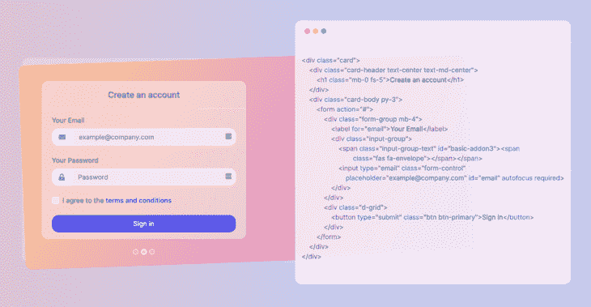
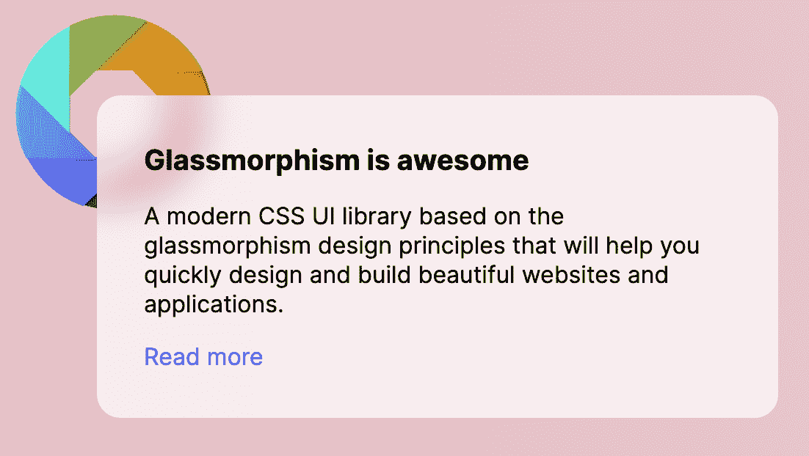
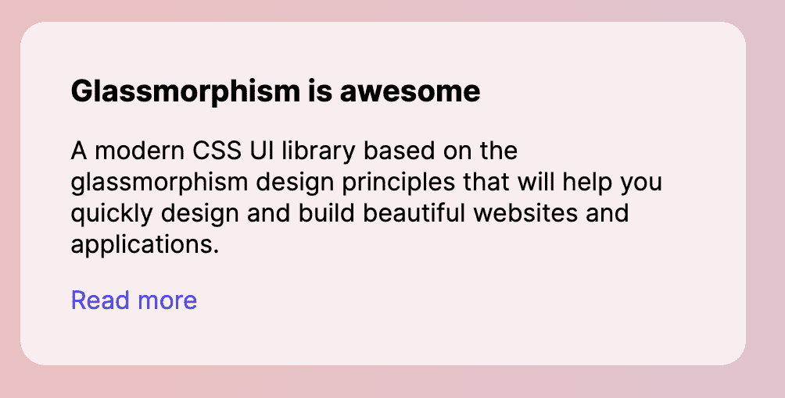
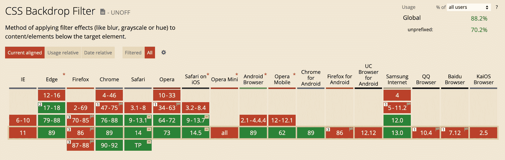

# 什么是玻璃态？仅使用 HTML 和 CSS 创建这种新的设计效果

> 原文：<https://www.freecodecamp.org/news/glassmorphism-design-effect-with-html-css/>

玻璃形态是目前非常流行的一种新的设计趋势。你会在 Dribbble 等网站上看到它，甚至像苹果和微软这样的大公司都在使用它。

让我给你介绍一下 **glassmorphism** 这种新的设计趋势。在去年的[神经形态设计趋势](https://demo.themesberg.com/neumorphism-ui/)之后，这是一种有争议的风格，缺乏可访问性，这种趋势似乎更有前途。

## 什么是玻璃态？

本质上，这种趋势的主要方面是半透明的背景，具有崇高的阴影和边界。

但是你也有一个模糊添加到背景本身，这样背景后面的任何东西都美丽地“变形”到元素本身。这有意义吗？

这里有一个例子:

[](https://ui.glass/)

这是 glassmorphism 的一个实际例子，您也可以在 [ui.glass](https://ui.glass/) 网站上查看(这是一个即将推出的 CSS UI 库)。

我一直在说的模糊效果，就是上图右侧代码后面你能看到的。看它在背景中变形得多美，但同时仍然保持可读性和悦目性？

这就是我想在本教程中向你展示如何创建的效果。我们将看到如何仅使用 HTML 和 CSS 来应用它。

## 入门指南

本教程需要的只是一个浏览器和一个代码编辑器，因为我们只使用老式的 HTML 和 CSS。

我们要构建的最后一个元素将如下所示:



Glassmorphism example

首先，让我们用下面的标记创建一个基本的 HTML 文件:

```
<!DOCTYPE html>
<html lang="en">
<head>
  <meta charset="UTF-8">
  <meta http-equiv="X-UA-Compatible" content="IE=edge">
  <meta name="viewport" content="width=device-width, initial-scale=1.0">
  <title>Glassmorphism effect</title>
</head>
<body>
    <!-- code goes here -->
</body>
</html>
```

我真的不喜欢默认字体系列，所以让我们使用谷歌字体中更漂亮的一些。我真的很喜欢 Inter 字体，所以让我们把它包含在我们的项目中的`head`标签中:

```
<link rel="preconnect" href="https://fonts.gstatic.com">
<link href="https://fonts.googleapis.com/css2?family=Inter:wght@300;400;500;600;700&display=swap" rel="stylesheet">
```

Google Fonts

现在，让我们给我们的`body`标签添加一些基本样式，并使用鲜艳的颜色和渐变创建一个背景:

```
body {
  padding: 4.5rem;
  margin: 0;
  background: #edc0bf;
  background: linear-gradient(90deg, #edc0bf 0,#c4caef 58%);
  font-family: 'Inter', sans-serif;
}
```

太好了！现在我们已经设置了一些基本的标记和样式，让我们在`body`标签中创建一个 card 元素:

```
<div class="card">
    <h3 class="card-title">Glassmorphism is awesome</h3>
    <p>A modern CSS UI library based on the glassmorphism design principles that will help you quickly design and build beautiful websites and applications.</p>
    <a href="https://ui.glass">Read more</a>
</div>
```

卡片内的内容并不重要——你可以添加额外的按钮、图标和其他元素。

在将 **glassmorphism** 效果应用到卡片之前，让我们首先通过添加以下 CSS 将一些间距和样式应用到排版中:

```
.card {
  width: 400px;
  height: auto;
  padding: 2rem;
  border-radius: 1rem;
}

.card-title {
  margin-top: 0;
  margin-bottom: .5rem;
  font-size: 1.2rem;
}

p, a {
  font-size: 1rem;
}

a {
  color: #4d4ae8;
  text-decoration: none;
}
```

到目前为止做得很好！接下来，我将向你展示如何实际应用特效。

## 如何使用 CSS 应用玻璃态效果

你所需要做的就是应用一个半透明的背景色，并使用`backdrop-filter`属性应用一个模糊。使用 CSS 将以下样式添加到`.card`元素中:

```
.card {
	/* other styles */
	background: rgba(255, 255, 255, .7);
	-webkit-backdrop-filter: blur(10px);
	backdrop-filter: blur(10px);
}
```

Glassmorphism using CSS

因此，我们现在已经成功地将 glassmorphism 风格应用于卡片——但是效果在哪里呢？

我们仍然需要在卡片后面有一些东西，比如一个形状或一个图像，以便看到它的实际效果。



Example without the shape

让我们使用一个`img`标签元素添加一个形状，就在`body`标签开始之后:

```

```

并将以下 CSS 样式应用于`.shape`元素，以将其正确定位在页面中:

```
.shape {
  position: absolute;
  width: 150px;
  top: .5rem;
  left: .5rem;
}
```

你现在应该看到新的玻璃形态设计趋势的全部效果。恭喜你！


Glassmorphism example

你可以查看这个[代码笔](https://codepen.io/themesberg/pen/RwKNMeY)直接从这个指南中获取代码和样式。

## 浏览器支持

glassmorphism 的一个主要缺点是 Internet Explorer 11 不支持`backdrop-filter`属性，Firefox 默认情况下也是禁用的。



Browser support for backdrop-filter

然而，据 caniuse.com 网站称，全球超过 88.2%的浏览器支持这种风格。如果 Firefox 决定默认启用该属性，并且随着旧浏览器(如 IE 11)的使用下降，我相信在未来几年 glassmorphism 将能够在更大的范围内使用。

在此之前，您可以随意将它用于您的个人项目，或者只是享受用这种令人敬畏的新设计趋势创建一些页面的乐趣。

## 结论

我希望这篇教程能帮助你更多地了解这种新的设计趋势。

如果你想进一步探索，我想给你介绍一个我和我朋友一起做的项目。

它被称为 [Glassmorphism UI](https://ui.glass/) ，它将是一个基于新设计趋势的免费开源 CSS UI 库。请随时注册您的电子邮件，以获得有关进展的更新，并成为第一个知道它何时启动的人。

该库将通过 NPM 提供，但也将在麻省理工学院许可下发布在 GitHub 上。