# Gmail 黑暗模式–如何在桌面、iOS 和 Android 上更改 Gmail 背景主题

> 原文：<https://www.freecodecamp.org/news/gmail-dark-mode/>

如果你像我一样，一周花几个小时在 Gmail 上。盯着 Gmail 明亮的白色设计会让你的眼睛疲劳——尤其是在晚上。

幸运的是，Gmail 内置了黑暗模式主题。这样晚上看书就方便多了。

除了减少眼睛疲劳，黑暗模式甚至可以减少设备的电池消耗，使您可以在不充电的情况下使用更长时间。(小进步，但有帮助。)

那么如何在 Gmail 中开启黑暗模式呢？我将向你展示如何通过几个步骤切换到 Gmail 的黑暗主题。

## 桌面上的 Gmail 黑暗模式

首先，打开你的浏览器，进入 [Gmail](https://mail.google.com/) 。如有必要，请登录。

点击右上角的齿轮图标，点击“主题”旁边的“查看全部”:

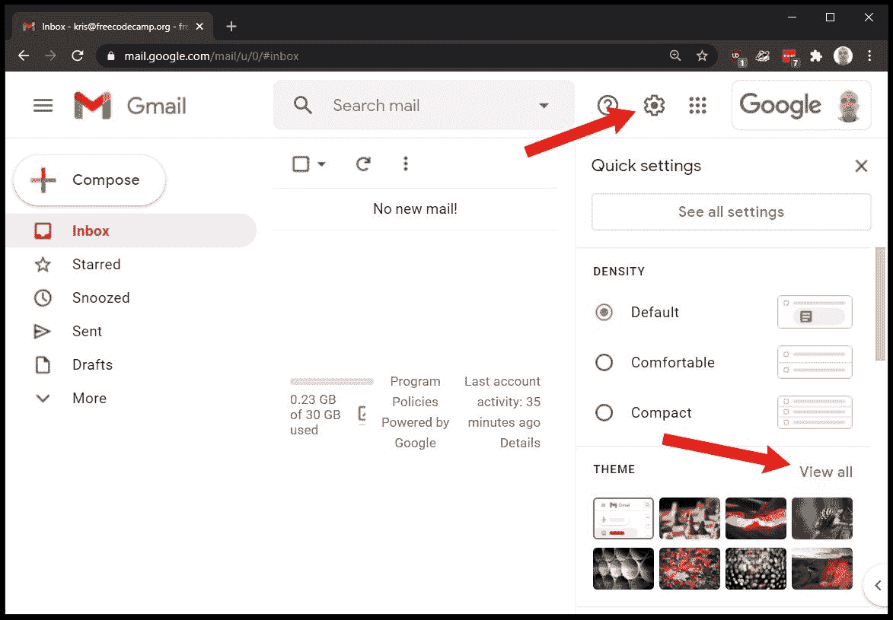

在“选择你的主题”菜单中，向下滚动直到你看到不同的颜色选项。

选择“深色”(当您将鼠标悬停在黑色缩略图上时，将会看到此文本)，然后单击“保存”:

当你回到收件箱时，它将处于黑暗模式:

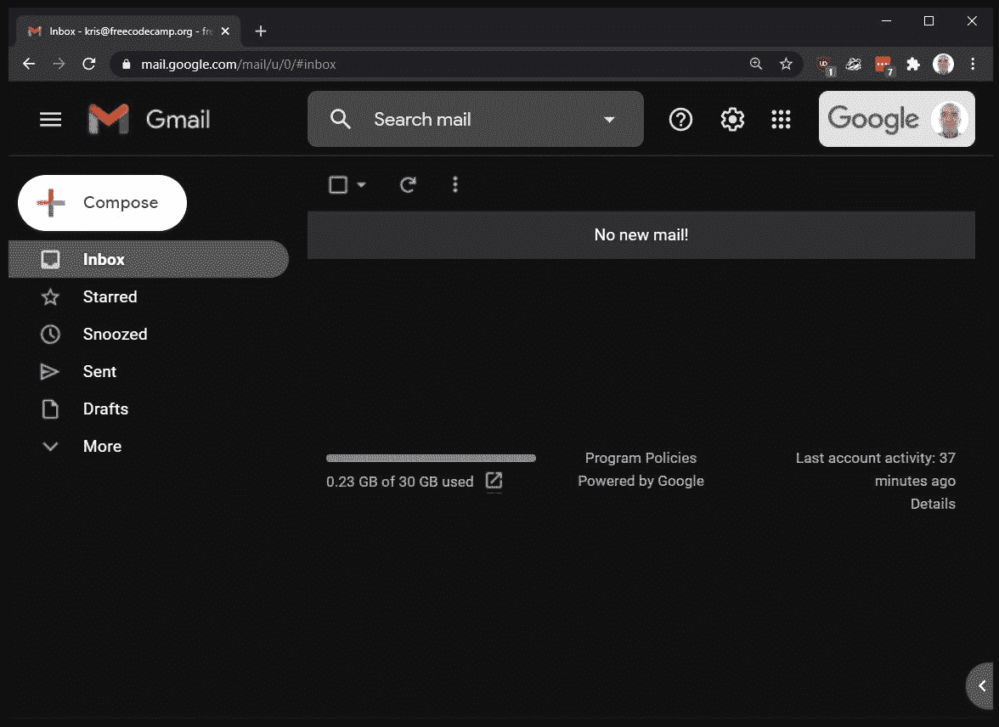

## Android 上的 Gmail 黑暗模式

**注意:**此方法要求 Android 10 及以上。

首先打开 [Gmail](https://play.google.com/store/apps/details?id=com.google.android.gm) app。如有必要，下载应用程序和/或登录。

在 Gmail 中，点击屏幕左上方的三个竖条，或者从左侧滑动，打开侧边菜单:

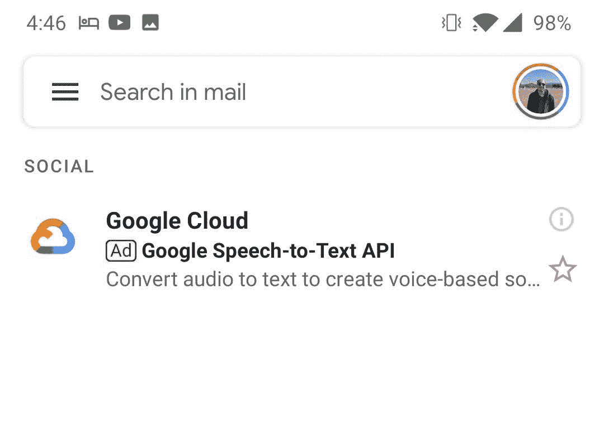

在侧边菜单中，向下滚动到底部并点击“设置”:

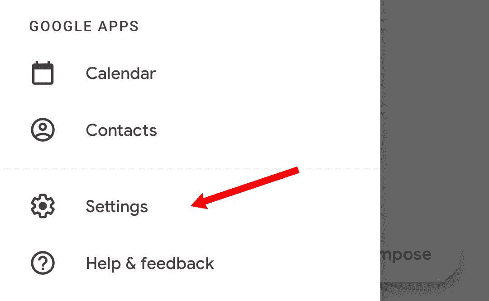

然后在设置菜单中，点击“通用设置”:

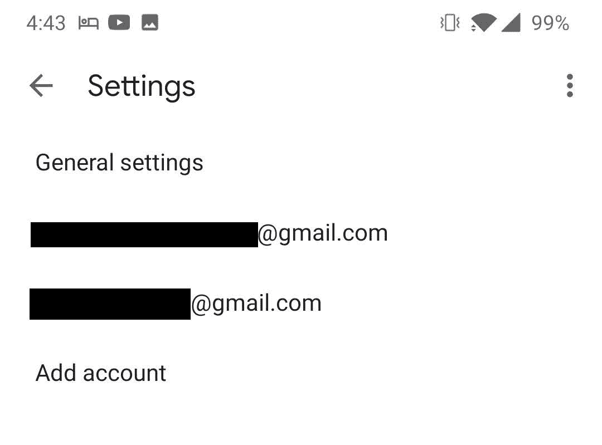

在通用设置菜单中，点击“主题”:

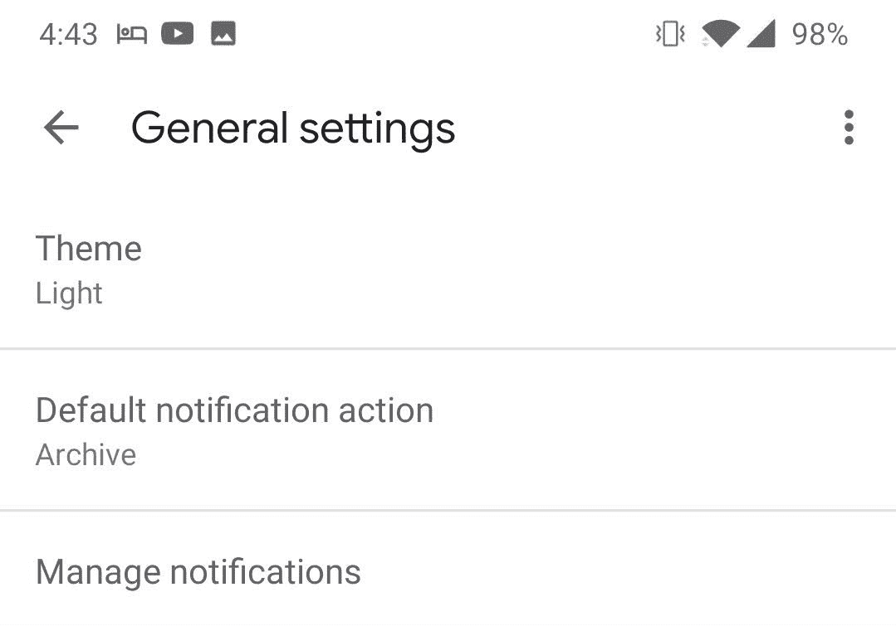

最后在主题弹出菜单中，选择“暗”:

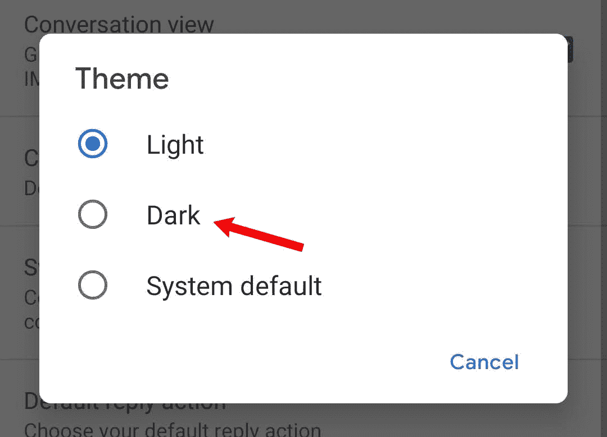

Gmail 将切换到黑暗模式:

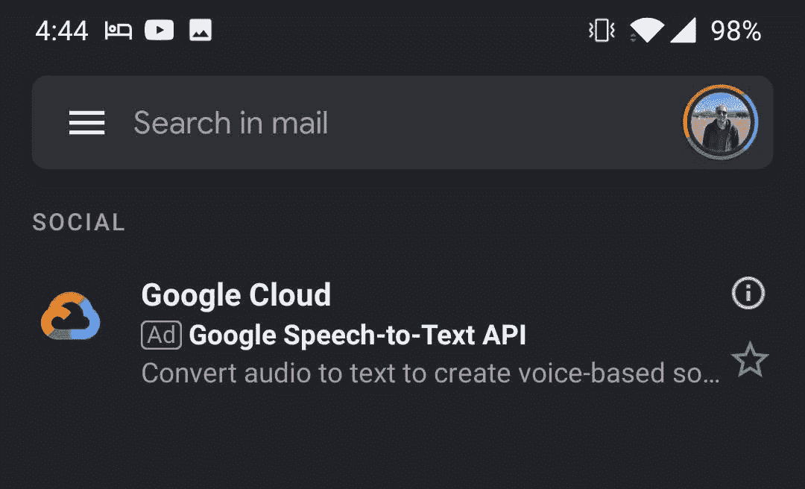

## iOS 上的 Gmail 黑暗模式

**注意:**此方法需要 iOS 13 及以上版本。

如果你有一部 iPhone，并想让你的 Gmail 处于黑暗模式，这非常简单。

Gmail 应用程序本身没有设置——你只需将手机设置为黑暗模式(Gmail 也会效仿)。以下是如何做到这一点。

首先，进入你手机的“设置”并滚动，直到你看到“显示和亮度”部分:

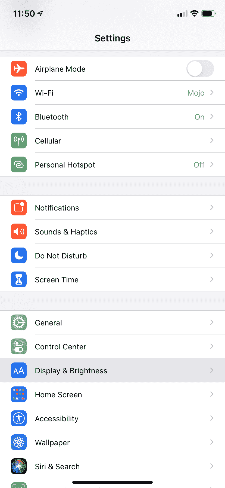

点击“显示和亮度”,你会看到这个屏幕:

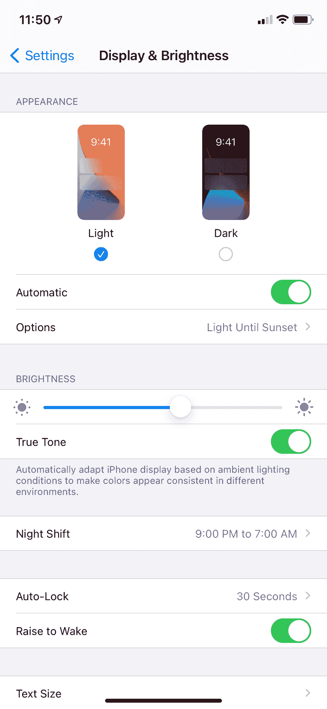

正如你所看到的，我的手机目前设置为轻模式(它被选中)。如果我想切换到黑暗模式，只需打开该选项，就像这样:

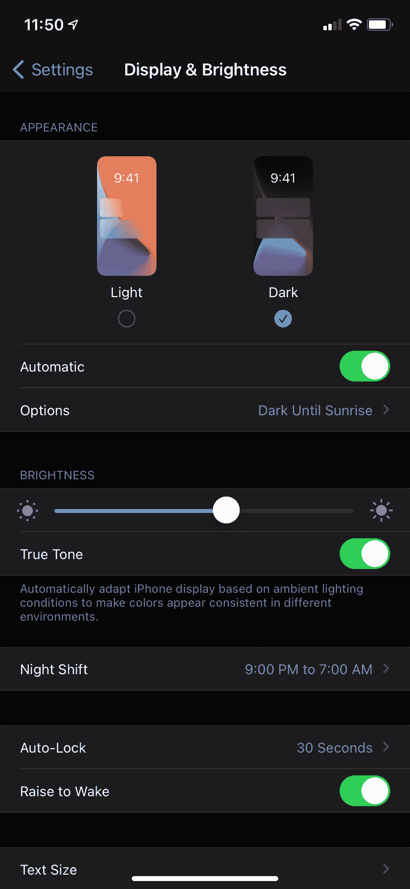

现在我的手机设置为黑暗模式(一直都是，而不仅仅是在外面天黑的时候自动调节)。

所以我的 Gmail 应用程序现在看起来像这样:

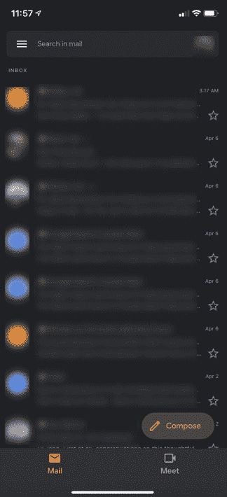

你有它！如果你只想让你的 Gmail 应用在晚上使用黑暗模式，你可以相应地更新你的设置。

只要确保你的手机处于灯光模式，并且“自动”选项已经打开。然后只需选择“选项”下的“日落到日出”选项，当太阳下山时，你的手机会自动将你的应用程序调整为黑暗模式！

它看起来会像这样:

## **感谢阅读**

如果您觉得这很有帮助，请与您的朋友分享，以便更多人可以在桌面、Android 和 iOS 设备上启用 Gmail 的黑暗模式。

另外，如果你喜欢这篇文章，请在 Twitter 上告诉我。