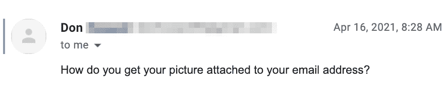
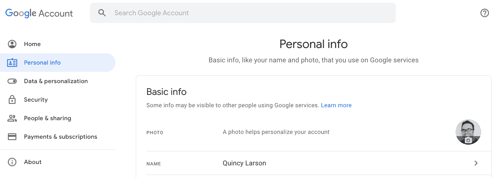
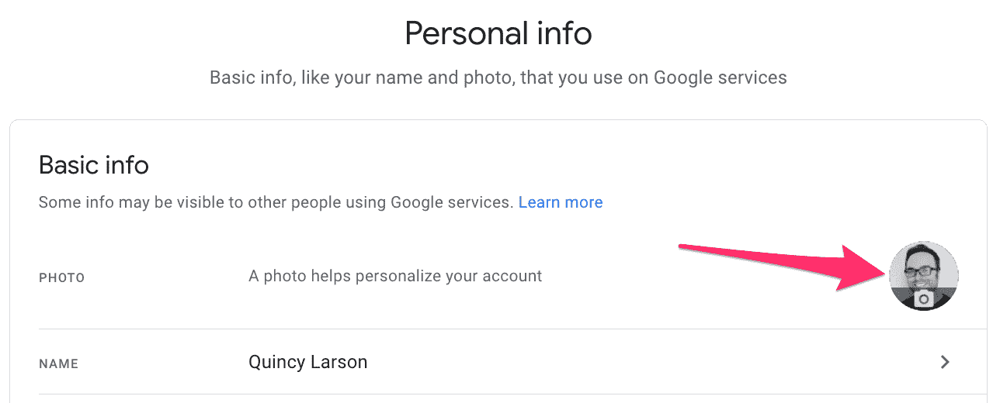
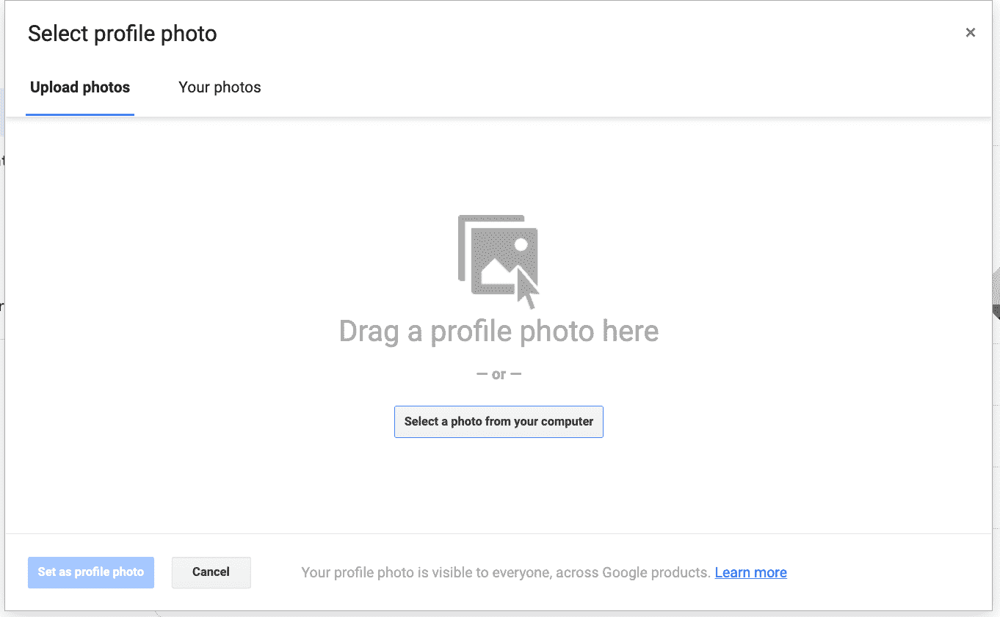
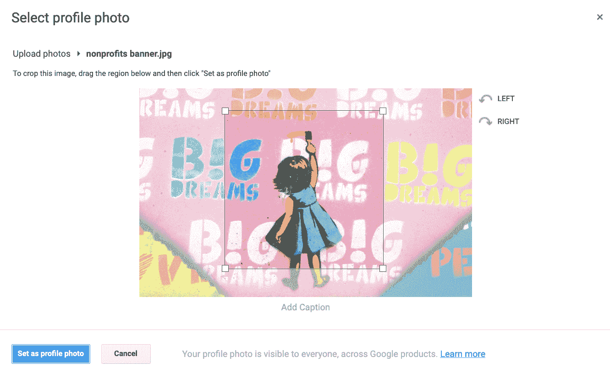

# Gmail 个人资料图片–如何在 Google Mail 中添加、删除或更改您的照片

> 原文：<https://www.freecodecamp.org/news/gmail-profile-picture/>

在 Gmail 中，您可以设置个人资料图片。使用 Gmail 的其他人在收到您的电子邮件时会看到这张照片。

当你设置个人资料图片时，谷歌将在他们的所有产品中使用它，包括谷歌会议和谷歌文档。

Shout-out to Don for inspiring me to write this article.

## 如何在 Google 中添加 Gmail 个人资料图片

我只是给你一个链接，而不是告诉你点击一堆链接来找到你可以设置它的地方。**在这里:[谷歌的我的账户关于我的页面](https://myaccount.google.com/personal-info?gar=1)。**

这是该页面的外观:

Google's About Me page. You can change a lot of other important things here as well, including important privacy settings.

请注意，添加新的个人资料图片和更改现有图片的过程完全相同。下面是如何做到这一点。

首先，点击带有相机图标的圆圈。

Google Personal Info panel, with an editable profile picture button

然后你可以上传一张新的图片或者从你的谷歌图片文件夹中选择一张。

Google's photo upload interface

一旦你选择了一个图像，你可以在确认之前调整它。图像必须是一个完美的正方形，但谷歌给了你一个工具来重新定位或放大和缩小。

Google's profile picture editing interface

转眼间。您现在已经更新了您的个人资料照片。

## 如何从 Google 中删除您的个人资料照片

从技术上讲，您不能删除您的个人资料照片，只能更新它。

但是这里有一个 400×400 像素的白色方块，你可以右击它并保存到你的硬盘上。

You can right click this square. (It's white and you may not be able to see it, but it is there.) Save it to your hard drive, then upload this to Google to replace your unwanted profile image.

然后你可以进入[谷歌的“我的账户”页面](https://myaccount.google.com/personal-info?gar=1)，上传图片作为你的新图片。

现在，您的个人资料图像完全空白。

### 我希望这篇教程有所帮助

现在，您可以在 Gmail 中展示您最好的一面，展示一张很酷的个人资料图片。(如果你担心自己的隐私，也可以不放个人资料照片。)那很容易，不是吗。

你知道什么不容易吗？学习编码。这是一项多年的努力。但是如果你对发展一些新技能和探索新的工作机会感兴趣，freeCodeCamp 为你提供了大量免费的学习资源。花点时间在这里，告诉你的朋友。😉