# 围棋手册——初学者学习围棋

> 原文：<https://www.freecodecamp.org/news/go-beginners-handbook/>

Golang 是一种令人敬畏的、简单的、现代的、快速的编程语言。

它是编译的、开源的、强类型的。

Golang 也称为 Go，由谷歌工程师创建，其主要目标是:

*   使他们的项目编译(和运行)更快
*   要简单，这样人们很快就能学会
*   要足够低，但也要避免一些太低的陷阱
*   具有可移植性(编译后的 Go 程序是不需要其他文件运行的二进制文件，并且是跨平台的，因此可以很容易地分发)
*   变得无趣、稳定、可预测，减少犯错的机会
*   使利用多处理器系统变得容易

Go 本来是 C 和 C++代码库的替代品。它旨在通过垃圾收集使一些事情变得更简单，比如并发和内存管理。

此外，由于它的 C 互操作性特性，它可以与 C 和 C++代码库一起工作。

你可以使用 Go 完成许多不同的任务，它既可以解决简单的问题，也可以解决非常复杂的问题。

您可以使用 Go 创建命令行实用程序和网络服务器，它被广泛用于许多不同的场景。

比如 Docker 和 Kubernetes 都是用 Go 写的。

我最喜欢的静态站点生成器(Hugo)是用 go 写的。

Caddy，一个相当流行的 web 服务器，是用 Go 写的。

有许多不同的、广泛使用的工具在幕后使用这种编程语言。

这本手册将向你介绍 Go 编程语言，这样你就可以开始用 Go 编程了。

[你可以在这里获得这本围棋初学者手册的 PDF 和 ePub 版本](https://thevalleyofcode.com/download/go/)。

## 目录

1.  [如何开始使用 Go](#how-to-get-started-with-go)
2.  [如何安装 Go](#how-to-install-go)
3.  [如何设置你的编辑器](#how-to-setup-your-editor)
4.  [怎么写你好，世界！进入](#how-to-write-hello-world-in-go)
5.  [如何编译和运行围棋程序](#how-to-compile-and-run-a-go-program)
6.  [Go 工作区](#the-go-workspace)
7.  [潜入 Go 语言](#diving-into-the-go-language)
8.  [Go 中的变量](#variables-in-go)
9.  [Go 中的基本类型](#basic-types-in-go)
10.  [Go 中的字符串](#strings-in-go)
11.  [Go 中的数组](#arrays-in-go)
12.  [切片在走](#slices-in-go)
13.  [Go 中的地图](#maps-in-go)
14.  [Go 中的循环](#loops-in-go)
15.  [Go 中的条件句](#conditionals-in-go)
16.  [Go 中的运算符](#operators-in-go)
17.  [Go 中的结构](#structs-in-go)
18.  [Go 中的功能](#functions-in-go)
19.  [Go 中的指针](#pointers-in-go)
20.  [Go 中的方法](#methods-in-go)
21.  [Go 中的接口](#interfaces-in-go)
22.  [何去何从](#where-to-go-from-here)

## 如何入门围棋

在我们深入研究这门语言的细节之前，有一些事情你应该知道。

第一， [https://go.dev](https://go.dev/) 是该语言的主页。这将是您的首选资源:

*   从[https://go.dev/doc/install](https://go.dev/doc/install)下载 Go 二进制文件(`go`命令和其他相关工具)
*   参考官方围棋文档[https://go.dev/doc/](https://go.dev/doc/)
*   查看所有的旅行套餐[https://pkg.go.dev/](https://pkg.go.dev/)
*   进入围棋运动场[https://go.dev/play/](https://go.dev/play/)

…以及更多。

## 如何安装 Go

去[https://go.dev/doc/install](https://go.dev/doc/install)下载你的操作系统的软件包。

运行安装程序，在该过程结束时，您将在终端中看到`go`命令:


Welcome to the Go installer

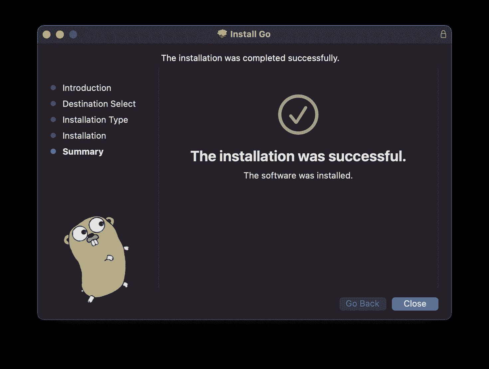

Successful installation modal

打开终端并运行`go version`，您应该会看到类似这样的内容:


Displaying the Go version you have

注意:在运行程序之前，您可能需要打开一个新的终端，因为安装程序将 Go binaries 文件夹添加到了路径中。

Go 安装文件的确切位置将取决于您的操作系统。

在 macOS 上是在`/usr/local/go`下面，二进制在`/usr/local/go/bin`里。

在 Windows 上，它将位于`C:\Program Files\go`下。

Windows 和 Mac 安装程序将自动设置 Go 二进制文件路径。

在 Mac 上，你可能还想使用`brew install golang`通过自制软件安装 Go。这将使以后的更新更容易。

在 Linux 上，您必须将 Go binaries 文件夹添加到您的终端路径中，然后才能运行`go`命令，在使用这个命令将 Linux 包解包到`/usr/local/go`之后:

```
echo 'export PATH=$PATH:/usr/local/go/bin' >> $HOME/.profile
source $HOME/.profile 
```

## 如何设置编辑器

我推荐使用 [**Visual Studio 代码**](https://code.visualstudio.com/) (又名 VS 代码)作为你的编辑器。

阅读 Visual Studio 代码中的[来快速“启动并运行”设置。至少，安装](https://code.visualstudio.com/docs/languages/go)[Go 扩展](https://marketplace.visualstudio.com/items?itemName=golang.go)。

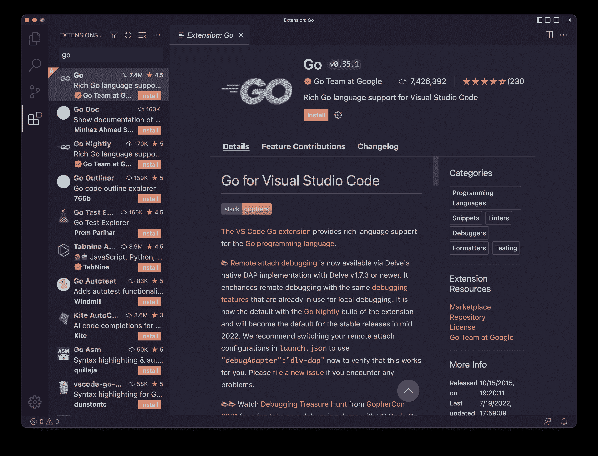

Go extension for VSCode

这个扩展将使您的生活更加轻松，因为它提供了智能感知(语法突出显示、自动完成、悬停信息、错误突出显示……)和其他东西，如自动格式化、安装包的菜单选项、测试等等。

## 如何写你好，世界！进去吧

现在我们准备创建我们的第一个 Go 程序！

让第一个程序打印“Hello，World！”是程序员的传统运行时连接到终端。因此，我们将首先这样做，然后解释我们是如何做到这一点的。

也许您的主目录中有一个文件夹，您在其中保存了所有的编码项目和测试。

在那里，创建一个新文件夹，比如称它为`hello`。

在那里，创建一个`hello.go`文件(你可以随意命名)。

添加此内容:

```
package main

import "fmt"

func main() {
	fmt.Println("Hello, World!")
} 
```

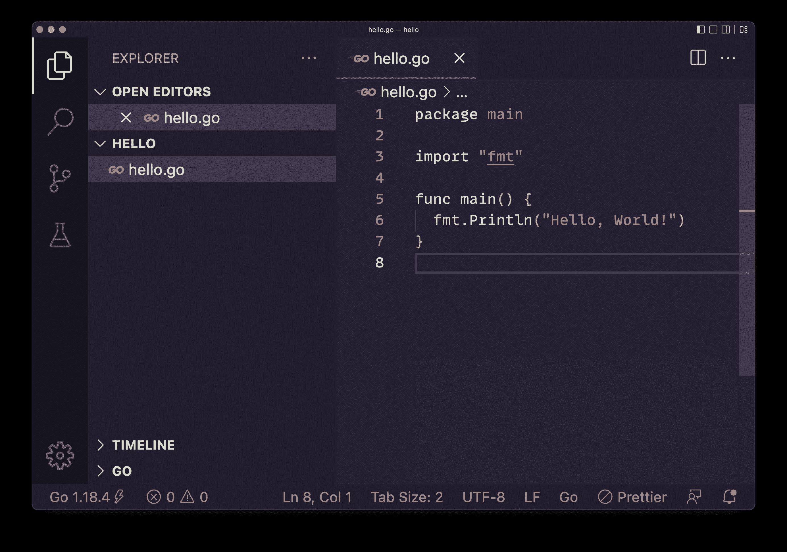

Go "Hello, World!" code

这是你的第一个围棋程序！

我们来一行一行的分析一下这个。

```
package main 
```

我们以包的形式组织围棋程序。

每个`.go`文件首先声明它是哪个包的一部分。

一个包可以由多个文件组成，也可以只由一个文件组成。

一个程序可以包含多个包。

`main`包是程序的入口点，标识一个可执行程序。

```
import "fmt" 
```

我们使用`import`关键字来导入一个包。

`fmt`是 Go 提供的内置包，提供输入/输出实用函数。

我们有一个[大型标准库](https://pkg.go.dev/std)可以使用，我们可以用它来做任何事情，从网络连接到数学、加密、图像处理、文件系统访问等等。

你可以在官方文档上读到这个`fmt`包提供的[的所有特性。](https://pkg.go.dev/fmt)

```
func main() {

} 
```

这里我们声明了`main()`函数。

什么是函数？我们稍后会看到更多关于它们的内容，但与此同时，让我们假设函数是一个有名字的代码块，包含一些指令。

`main`函数很特别，因为它是程序开始的地方。

在这个简单的例子中，我们只有一个函数——程序从这个函数开始，然后结束。

```
fmt.Println("Hello, World!") 
```

这是我们定义的函数的内容。

我们调用先前导入的`fmt`包中定义的`Println()`函数，传递一个字符串作为参数。

该函数根据[docs](https://pkg.go.dev/fmt#Printf)*按照格式说明符格式化并写入标准输出*。

看看这些文件，因为它们很棒。他们甚至有你可以运行的例子:

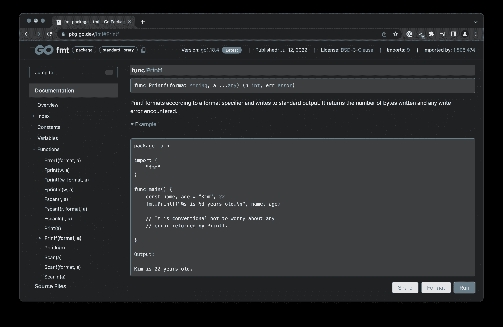

Go basic function example

我们使用“点”语法`fmt.Println()`来指定该功能由该包提供。

代码执行完`main`函数后，没有其他事情可做，执行结束。

## 如何编译和运行 Go 程序

现在打开`hello`文件夹中的终端，使用以下命令运行程序:

```
go run hello.go 
```

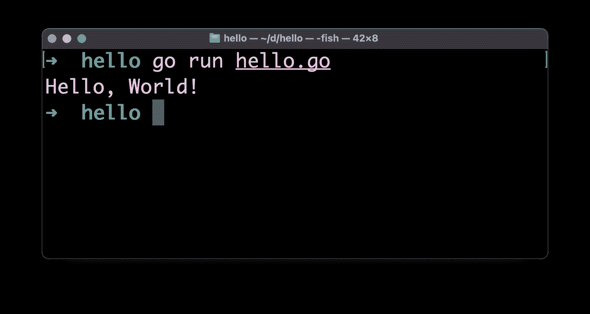

Hello world output in Go

我们的程序运行成功，它打印出“你好，世界！”到终点站。

`go run`工具首先编译，然后运行指定的程序。

您可以使用`go build`创建一个**二进制文件**:

```
go build hello.go 
```

这将创建一个`hello`文件，这是一个可以执行的二进制文件:

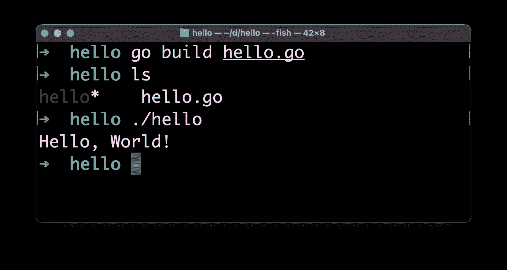

Executable binary in Go

在介绍中我提到过 Go 是便携的。

现在您可以分发这个二进制文件，每个人都可以按原样运行这个程序，因为这个二进制文件已经打包好可以执行了。

该程序将在我们构建它的同一架构上运行。

我们可以使用`GOOS`和`GOARCH`环境变量为不同的架构创建不同的二进制文件，如下所示:

```
GOOS=windows GOARCH=amd64 go build hello.go 
```

这将为 64 位 Windows 机器创建一个`hello.exe`可执行文件:

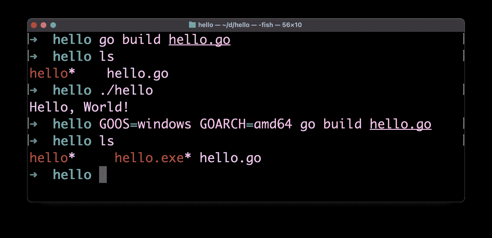

Hello.exe executable

64 位 macOS(英特尔或苹果芯片)的设置是`GOOS=darwin GOARCH=amd64`，Linux 是`GOOS=linux GOARCH=amd64`。

这是 Go 最好的特性之一。

## Go 工作区

围棋的一个特别之处是我们所说的**工作空间**。

工作区是 Go 的“大本营”。

默认情况下，Go 会选择`$HOME/go`路径，因此您会在自己的家中看到一个`go`文件夹。

它首先是在你安装一个包时创建的(我们将在后面看到)，同时也是为了存储一些工具。

例如，当我在 VS 代码中加载`hello.go`文件时，它提示我安装`[gopls](https://pkg.go.dev/golang.org/x/tools/gopls)`命令、Delve 调试器(`dlv`)和 [`staticcheck` linter](https://staticcheck.io/) 。

它们被自动安装在`$HOME/go`下:

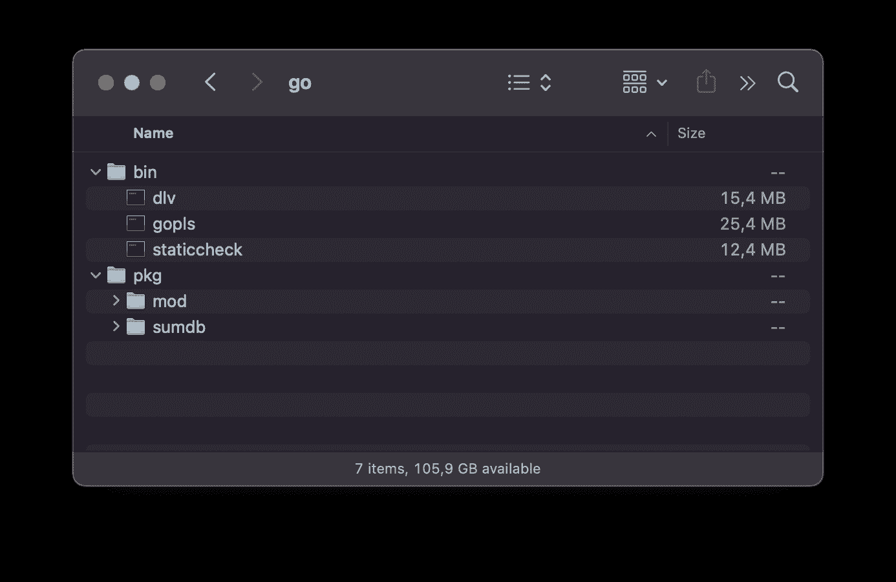

`$HOME/go`

当您使用`go install`安装软件包时，它们将存储在这里。

这就是我们所说的 **GOPATH** 。

你可以改变环境变量`GOPATH`来改变 Go 应该安装软件包的位置。

当您同时处理不同的项目，并且想要隔离您使用的库时，这很有用。

## 深入了解 Go 语言

现在我们已经有了第一个概念，我们运行了我们的第一个 Hello，World！程序，我们可以深入到语言中。

这种语言没有语义上的空白。这就像 C、C++、Rust、Java、JavaScript，但不像 Python，在 Python 中空白是有意义的，是用来创建块而不是花括号的。

分号是可选的，就像在 JavaScript 中一样(不像在 C、C++、Rust 或 Java 中)。

Go 非常重视缩进和视觉顺序。

当我们安装 Go 时，我们也可以使用`gofmt`命令行工具，我们可以用它来格式化 Go 程序。VS 代码使用它来格式化 Go 源文件。

这是非常有趣和创新的，因为格式化和诸如制表符和空格或者“我应该把花括号放在循环定义的同一行还是下一行”之类的问题是对时间的巨大浪费。

语言的创造者定义了规则，每个人都使用这些规则。

这对大型团队的项目来说非常好。

建议您在 VS 代码设置中启用保存时的**格式**和粘贴时的**格式**:

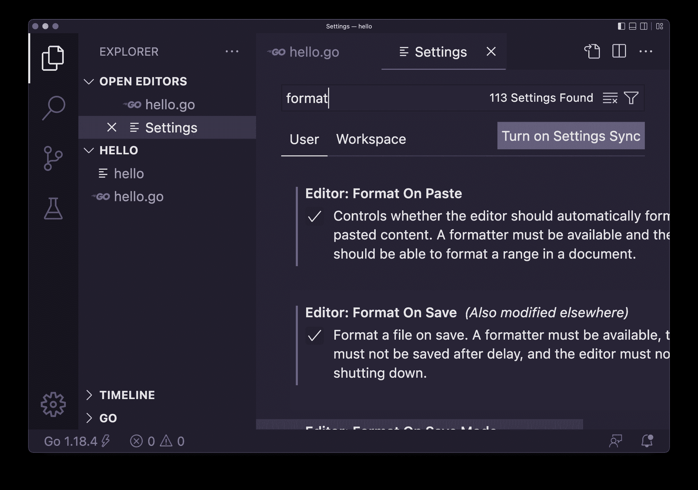

VS Code settings for Go - Format on Paste and Format on Save

您可以使用常用的 C / C++ / JavaScript / Java 语法在 Go 中编写注释:

```
// this is a line comment

/*
multi
line
comment
*/ 
```

## 围棋中的变量

在编程语言中，你首先要做的事情之一就是定义一个变量。

在 Go 中，我们使用`var`定义变量:

```
var age = 20 
```

您可以在包级别定义变量:

```
package main

import "fmt"

var age = 20

func main() {
	fmt.Println("Hello, World!")
} 
```

或者在函数内部:

```
package main

import "fmt"

func main() {
	var age = 20

	fmt.Println("Hello, World!")
} 
```

在包级别定义的变量在组成包的所有文件中都是可见的。一个包可以由多个文件组成，你只需要创建另一个文件并在顶部使用相同的包名。

在函数级定义的变量只在该函数中可见。它在函数被调用时被初始化，在函数结束执行时被销毁。

在我们使用的示例中:

```
var age = 20 
```

我们将值`20`赋给`age`。

这使得 Go 确定变量`age`的**类型**为`int`。

我们稍后会看到更多关于类型的内容，但是你应该知道有许多不同的类型，从`int`、`string`和`bool`开始。

我们也可以声明一个没有现有值的变量，但是在这种情况下，我们必须像这样设置类型:

```
var age int
var name string
var done bool 
```

当您知道值时，通常使用带有`:=`操作符的短变量声明:

```
age := 10
name := "Roger" 
```

对于变量名，可以使用字母、数字和下划线`_`，只要名称以字符或`_`开头。

名称是区分大小写的。

如果名字比较长，常用 camelCase。所以我们用`carName`来表示汽车的名称。

你可以用赋值操作符`=`给变量赋值

```
var age int
age = 10
age = 11 
```

如果你有一个在程序中从不改变的变量，你可以使用`const`将它声明为一个常量:

```
const age = 10 
```

您可以在一行中声明多个变量:

```
var age, name 
```

并对它们进行初始化:

```
var age, name = 10, "Roger"

//or

age, name := 10, "Roger" 
```

程序中未使用的已声明变量会引发错误，并且程序不会编译。

您将在 VS 代码中看到一条警告:

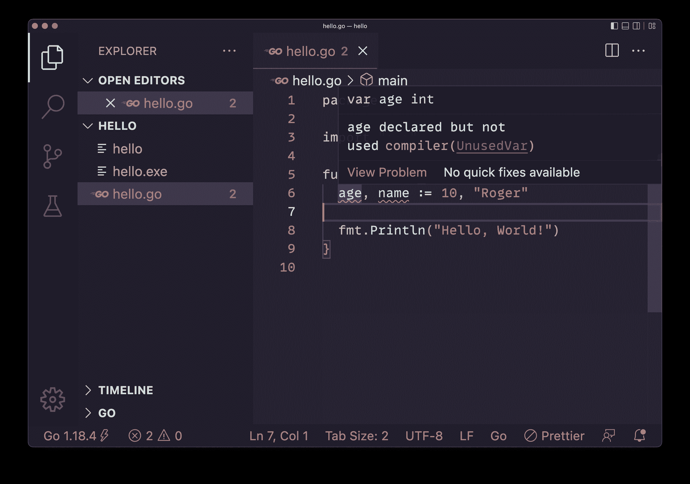

Warning for unused declared variables

编译器的错误是:

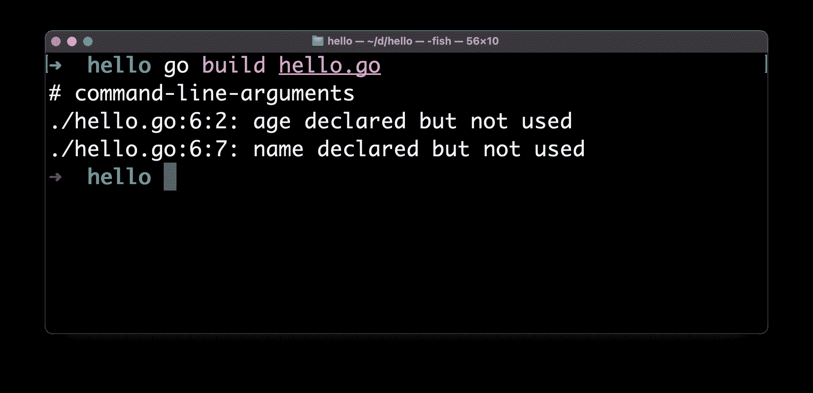

Error in compiler for unused declared variables

如果你声明了一个变量而没有初始化它的值，它会自动被赋予一个依赖于类型的值——例如一个整数是`0`而一个字符串是一个空字符串。

## 围棋的基本类型

Go 是一种类型化的语言。

我们看到了如何声明变量并指定其类型:

```
var age int 
```

或者，您可以根据分配的初始值来推断类型:

```
var age = 10 
```

围棋的基本类型有:

*   整数(`int`、`int8`、`int16`、`int32`、`rune`、`int64`、`uint`、`uintptr`、`uint8`、`uint16`、`uint64`)
*   浮点数(`float32`、`float64`)，用于表示小数
*   复杂类型(`complex64`，`complex128`)，在数学中很有用
*   Byte ( `byte`)，代表单个 ASCII 字符
*   字符串(`string`)，一组`byte`
*   布尔(`bool`)，真或假

我们有很多不同的类型来表示整数。你大部分时间都会用到`int`，可能会选择更专业的一个进行优化(不是刚学的时候需要考虑的事情)。

在 64 位系统上使用时，`int`类型默认为 64 位，在 32 位系统上为 32 位，依此类推。

`uint`是一个无符号的`int`,如果你知道这个数字不会是负数，你可以用它来加倍你可以存储的值的数量。

以上所有基本类型都是**值类型**，这意味着当作为参数传递时，或者当从函数返回时，它们是通过值传递给函数的**。**

## 围棋中的弦乐

Go 中的一个字符串是一系列的`byte`值。

如上所述，您可以使用以下语法定义字符串:

```
var name = "test" 
```

需要注意的是，与其他语言不同，字符串只使用双引号来定义，而不是单引号。

要获得字符串的长度，使用内置的`len()`函数:

```
len(name) //4 
```

您可以使用方括号访问单个字符，传递您想要获取的字符的索引:

```
name[0] //"t" (indexes start at 0)
name[1] //"e" 
```

您可以使用以下语法获取字符串的一部分:

```
name[0:2] //"te"
name[:2]  //"te"
name[2:]  //"st" 
```

使用它，您可以使用以下命令创建字符串的副本:

```
var newstring = name[:] 
```

您可以像这样将字符串赋给新变量:

```
var first = "test"
var second = first 
```

字符串是不可变的，所以你不能更新字符串的值。

即使你使用赋值操作符给`first`赋值，值`second`仍然是`"test"`:

```
var first = "test"
var second = first

first = "another test"

first  //"another test"
second //"test" 
```

字符串是引用类型，这意味着如果你传递一个字符串给一个函数，字符串的引用将被复制，而不是它的值。但是由于字符串是不可变的，在这种情况下，例如传递一个`int`在实践中没有太大的区别。

您可以使用`+`操作符连接两个字符串:

```
var first = "first"
var second = "second"

var word = first + " " + second  //"first second" 
```

Go 在`strings`包中提供了几个字符串工具。

我们已经看到了如何在“Hello，World！”举例。

以下是导入`strings`的方法:

```
package main

import (
    "strings"
) 
```

然后就可以用了。

例如，我们可以使用`HasPrefix()`函数来查看一个字符串是否以特定的子字符串开始:

```
package main

import (
    "strings"
)

func main() {
    strings.HasPrefix("test", "te") // true
} 
```

你可以在这里找到完整的方法列表:[https://pkg.go.dev/strings](https://pkg.go.dev/strings)。

以下是您可能经常使用的方法列表:

*   `strings.ToUpper()`返回一个大写的新字符串
*   `strings.ToLower()`返回一个新的小写字符串
*   `strings.HasSuffix()`检查字符串是否以子字符串结尾
*   `strings.HasPrefix()`检查字符串是否以子字符串开头
*   `strings.Contains()`检查字符串是否包含子串
*   `strings.Count()`统计子字符串在字符串中出现的次数
*   `strings.Join()`用于连接多个字符串并创建一个新的
*   `strings.Split()`用于从一个字符串创建一个字符串数组，将原来的一个字符串除以一个特定的字符，如逗号或空格
*   `strings.ReplaceAll()`用于替换字符串中的一部分，并用新的替换它

## 围棋中的数组

数组是单一类型的项目序列。

我们这样定义一个数组:

```
var myArray [3]string //an array of 3 strings 
```

您可以使用以下值初始化数组:

```
var myArray = [3]string{"First", "Second", "Third"} 
```

在这种情况下，你也可以放手去做一些工作，为你清点物品:

```
var myArray = [...]string{"First", "Second", "Third"} 
```

一个数组只能包含相同类型的值。

数组不能调整大小——你必须在 Go 中明确定义数组的长度。那是数组的*类型*的一部分。此外，您不能使用变量来设置数组的长度。

由于这个限制，数组很少在 Go 中直接使用。相反，我们使用**切片**(稍后将详细介绍)。切片在幕后使用数组，所以仍然有必要了解它们是如何工作的。

您可以使用我们已经在字符串中使用的方括号符号来访问数组中的一个项，以访问单个字符:

```
myArray[0] //indexes start at 0
myArray[1] 
```

您可以为数组中的特定位置设置新值:

```
myArray[2] = "Another" 
```

您可以使用`len()`函数获得数组的长度:

```
len(myArray) 
```

数组是**值类型**。这意味着复制一个数组:

```
anotherArray := myArray 
```

或者将数组传递给函数，或者从函数返回数组，都会创建原始数组的副本。

这不同于其他编程语言。

让我们举一个简单的例子，在复制数组后，我们给数组赋值。看，副本没有改变:

```
var myArray = [3]string{"First", "Second", "Third"}
myArrayCopy := myArray
myArray[2] = "Another"

myArray[2]     //"Another"
myArrayCopy[2] //"Third" 
```

记住你只能在一个数组中添加一种类型的条目，所以设置`myArray[2] = 2`将会产生一个错误。

低级元素连续存储在内存中。

## 围棋中的切片

切片是一种类似于数组的数据结构，但是它的大小可以改变。

在底层，片使用一个数组，它们是建立在它们之上的一个抽象，使它们更加灵活和有用(可以把数组看作较低的层次)。

您将会以一种非常类似于在高级语言中使用数组的方式使用切片。

您可以像定义数组一样定义切片，省略长度:

```
var mySlice []string //a slice of strings 
```

您可以用以下值初始化切片:

```
var mySlice = []string{"First", "Second", "Third"}

//or

mySlice := []string{"First", "Second", "Third"} 
```

您可以使用`make()`功能创建一个特定长度的空切片:

```
mySlice := make([]string, 3) //a slice of 3 empty strings 
```

您可以从现有切片创建新切片，向其追加一个或多个项目:

```
mySlice := []string{"First", "Second", "Third"}

newSlice := append(mySlice, "Fourth", "Fifth") 
```

注意，我们需要将`append()`的结果赋给一个新的片，否则我们会得到一个编译器错误。原始切片未被修改，我们将获得一个全新的切片。

您还可以使用`copy()`功能复制一个片，这样它就不会与另一个片共享相同的内存，并且是独立的:

```
mySlice := []string{"First", "Second", "Third"}

newSlice := make([]string, 3)

copy(newSlice, mySlice) 
```

如果您要拷贝到的切片没有足够的空间(比原始切片短)，则只会拷贝前几个项目(直到有空间为止)。

您可以从数组中初始化切片:

```
myArray := [3]string{"First", "Second", "Third"}

mySlice = myArray[:] 
```

多个切片可以使用相同的数组作为基础数组:

```
myArray := [3]string{"First", "Second", "Third"}

mySlice := myArray[:]
mySlice2 := myArray[:]

mySlice[0] = "test"

fmt.Println(mySlice2[0]) //"test" 
```

这两个片现在共享相同的内存。修改一个切片会修改底层数组，并导致从该数组生成的另一个切片也被修改。

与数组一样，切片中的每一项都存储在内存中连续的内存位置。

如果您知道需要对切片执行操作，您可以请求它拥有比最初所需更多的容量。这样，当您需要更多空间时，空间将随时可用(而不是通过旧位置的垃圾收集来查找和移动切片到具有更多增长空间的新内存位置并进行处置)。

我们可以通过向`make()`添加第三个参数来指定**容量**:

```
newSlice := make([]string, 0, 10)
//an empty slice with capacity 10 
```

与字符串一样，您可以使用以下语法获取切片的一部分:

```
mySlice := []string{"First", "Second", "Third"}

newSlice := mySlice[:2] //get the first 2 items
newSlice2 := mySlice[2:] //ignore the first 2 items
newSlice3 := mySlice[1:3] //new slice with items in position 1-2 
```

## Go 中的地图

地图是 Go 中非常有用的数据类型。

在其他语言中，它也被称为*字典*或*散列图*或*关联数组*。

以下是创建地图的方法:

```
agesMap := make(map[string]int) 
```

您不需要设置地图将容纳多少个项目。

您可以通过以下方式向地图添加新项目:

```
agesMap["flavio"] = 39 
```

您也可以使用以下语法直接用值初始化映射:

```
agesMap := map[string]int{"flavio": 39} 
```

您可以使用以下方法获取与键相关联的值:

```
age := agesMap["flavio"] 
```

您可以通过以下方式使用`delete()`功能从地图中删除项目:

```
delete(agesMap, "flavio") 
```

## 围棋循环

Go 最好的一个特点就是给你的选择更少。

我们有一个循环语句:`for`。

你可以这样使用它:

```
for i := 0; i < 10; i++ {
	fmt.Println(i)
} 
```

我们首先初始化一个循环变量，然后我们设置每次迭代检查的*条件*，以决定循环是否应该结束。最后，我们有在每次迭代结束时执行的 *post 语句*，在这种情况下，它增加了`i`。

`i++`增加`i`变量。

`<` *运算符*用于将`i`与数字`10`进行比较，返回`true`或`false`，决定是否执行循环体。

我们不需要在这个代码块周围加括号，不像其他语言，比如 C 或 JavaScript。

其他语言提供了不同种类的循环结构，但是 Go 只有这一种。我们可以模拟一个`while`循环，如果你熟悉有它的语言，就像这样:

```
i := 0

for i < 10 {
	fmt.Println(i)
  i++
} 
```

我们也可以完全忽略条件，并在需要时使用`break`来结束循环:

```
i := 0

for {
	fmt.Println(i)

	if i < 10 {
		break
	}

  i++
} 
```

我在循环体中使用了一个`if`语句，但是我们还没有看到*条件语句*！我们接下来会这么做。

我现在要介绍的一件事是`range`。

我们可以使用以下语法使用`for`来遍历数组:

```
numbers := []int{1, 2, 3}

for i, num := range numbers {
	fmt.Printf("%d: %d\n", i, num)
}

//0: 1
//1: 2
//2: 3 
```

注意:我使用了`fmt.Printf()`，它允许我们使用动词*`%d`向终端打印任何值，动词*表示十进制整数*，`\n`表示添加一个行结束符。*

*当不需要使用索引时，通常使用以下语法:*

```
*`for _, num := range numbers {
  //...
}`* 
```

*我们使用特殊的`_`字符，意思是“忽略这个”，以避免 Go 编译器产生一个错误，说“你没有使用`i`变量！”。*

## *围棋中的条件句*

*我们使用`if`语句根据条件执行不同的指令:*

```
*`if age < 18 {
	//underage
}`* 
```

*`else`部分是可选的:*

```
*`if age < 18 {
	//underage
} else {
  //adult
}`* 
```

*并可与其他`if`组合:*

```
*`if age < 12 {
	//child
} else if age < 18  {
  //teen
} else {
	//adult
}`* 
```

*如果你在`if`中定义了任何变量，那么这只在`if`中可见(这同样适用于`else`和任何你用`{}`打开一个新块的地方)。*

*如果您要用许多不同的 If 语句来检查一个条件，那么最好使用`switch`:*

```
*`switch age {
case 0: fmt.Println("Zero years old")
case 1: fmt.Println("One year old")
case 2: fmt.Println("Two years old")
case 3: fmt.Println("Three years old")
case 4: fmt.Println("Four years old")
default: fmt.Println(i + " years old")
}`* 
```

*与 C、JavaScript 和其他语言相比，你不需要在每个`case`后面都有一个`break`。*

## *Go 中的运算符*

*到目前为止，我们已经在代码示例中使用了一些操作符，比如`=`、`:=`和`<`。*

*让我们多谈谈他们。*

*我们使用赋值操作符`=`和`:=`来声明和初始化变量:*

```
*`var a = 1

b := 1`* 
```

*我们有比较运算符`==`和`!=`，它们接受两个参数并返回一个布尔值:*

```
*`var num = 1
num == 1 //true
num != 1 //false`* 
```

*以及`<`、`<=`、`>`、`>=`:*

```
*`var num = 1
num > 1 //false
num >= 1 //true
num < 1 //false
num <= 1 //true`* 
```

*我们有二元(需要两个参数)算术运算符，如`+`、`-`、`*`、`/`、`%`。*

```
*`1 + 1 //2
1 - 1 //0
1 * 2 //2
2 / 2 //1
2 % 2 //0`* 
```

*`+`还可以加入字符串:*

```
*`"a" + "b" //"ab"`* 
```

*我们有一元运算符`++`和`--`来递增或递减一个数字:*

```
*`var num = 1
num++ // num == 2
num-- // num == 1`* 
```

*注意，不像 C 或 JavaScript，我们不能把它们加到像`++num`这样的数字前面。此外，该操作不返回值。*

*我们有布尔运算符来帮助我们基于`true`和`false`值做出决策:`&&`、`||`和`!`:*

```
*`true && true  //true
true && false //false
true || false //true
false || false //false
!true  //false
!false //true`* 
```

*那些是主要的。*

## *go 中的 struts*

*一个**结构**是一个包含一个或多个变量的*类型*。这就像一个变量的集合。我们称它们为*场*。它们可以有不同的类型。*

*下面是一个结构定义的例子:*

```
*`type Person struct {
	Name string
	Age int
}`* 
```

*请注意，我对字段使用了大写名称，否则这些名称将是包的私有名称。当您将该结构传递给另一个包提供的函数时，就像我们用来处理 JSON 或 database 的函数一样，这些字段是无法访问的。*

*一旦我们定义了一个结构，我们就可以用这个类型初始化一个变量:*

```
*`flavio := Person{"Flavio", 39}`* 
```

*我们可以使用点语法访问各个字段:*

```
*`flavio.Age //39
flavio.Name //"Flavio"`* 
```

*您还可以通过以下方式从结构中初始化新变量:*

```
*`flavio := Person{Age: 39, Name: "Flavio"}`* 
```

*这也让您只能初始化一个字段:*

```
*`flavio := Person{Age: 39}`* 
```

*甚至不用任何值来初始化它:*

```
*`flavio := Person{}

//or

var flavio Person`* 
```

*并在以后设置这些值:*

```
*`flavio.Name = "Flavio"
flavio.Age = 39`* 
```

*结构很有用，因为您可以将不相关的数据分组，在函数之间传递，存储在一个片上，等等。*

*一旦定义，结构就是类似于`int`或`string`的类型，这意味着你也可以在其他结构中使用它:*

```
*`type FullName struct {
	FirstName string
	LastName string
}

type Person struct {
	Name FullName
	Age int
}`* 
```

## *Go 中的功能*

*函数是一个有名字的代码块，包含一些指令。*

*在“你好，世界！”例子我们创建了一个`main`函数，它是程序的入口点。*

```
*`package main

import "fmt"

func main() {
	fmt.Println("Hello, World!")
}`* 
```

*那是一个特殊的功能。*

*通常我们用自定义名称定义函数:*

```
*`func doSomething() {

}`* 
```

*然后你可以这样称呼他们:*

```
*`doSomething()`* 
```

*一个函数可以接受参数，我们必须这样设置参数的类型:*

```
*`func doSomething(a int, b int) {

}

doSomething(1, 2)`* 
```

*`a`和`b`是我们在函数内部关联到参数的名称。*

*函数可以返回值，如下所示:*

```
*`func sumTwoNumbers(a int, b int) int {
	return a + b
}

result := sumTwoNumbers(1, 2)`* 
```

*注意，我们指定了返回值类型。*

*Go 中的函数可以返回多个值:*

```
*`func performOperations(a int, b int) (int, int) {
	return a + b, a - b
}

sum, diff := performOperations(1, 2)`* 
```

*这很有趣，因为许多语言只允许一个返回值。*

*函数中定义的任何变量都是函数的局部变量。*

*一个函数也可以接受无限数量的参数，在这种情况下，我们称之为*可变函数*:*

```
*`func sumNumbers(numbers ...int) int {
	sum := 0
	for _, number := range numbers {
		sum += number
	}
	return sum
}

total := sumNumbers(1, 2, 3, 4)`* 
```

## *围棋中的指针*

*Go 支持指针。*

*假设你有一个变量:*

```
*`age := 20`* 
```

*使用`&age`你得到了指向变量的指针，它的内存地址。*

*当指针指向变量时，可以通过使用`*`操作符获得它所指向的值:*

```
*`age := 20
ageptr = &age
agevalue = *ageptr`* 
```

*当您想要调用函数并将变量作为参数传递时，这很有用。缺省情况下，Go 复制函数中变量的值，所以这不会改变`age`的值:*

```
*`func increment(a int) {
	a = a + 1
}

func main() {
	age := 20
	increment(age)

	//age is still 20
}`* 
```

*您可以为此使用指针:*

```
*`func increment(a *int) {
	*a = *a + 1
}

func main() {
	age := 20
	increment(&age)

	//age is now 21
}`* 
```

## *围棋方法*

*你可以给一个结构分配一个函数，在这种情况下我们称之为*方法*。*

*示例:*

```
*`type Person struct {
	Name string
	Age int
}

func (p Person) Speak() {
	fmt.Println("Hello from " + p.Name)
}

func main() {
	flavio := Person{Age: 39, Name: "Flavio"}
	flavio.Speak()
}`* 
```

*您可以将方法声明为指针接收器或值接收器。*

*上面的例子显示了一个值接收器。它接收结构实例的副本。*

*这将是一个指针接收器，它接收指向结构实例的指针:*

```
*`func (p *Person) Speak() {
	fmt.Println("Hello from " + p.Name)
}`* 
```

## *Go 界面*

*接口是定义一个或多个*方法签名*的*类型*。*

*方法没有被实现，只有它们的签名:名称、参数类型和返回值类型。*

*大概是这样的:*

```
*`type Speaker interface {
	Speak()
}`* 
```

*现在，您可以让一个函数接受实现该接口定义的所有方法的任何类型:*

```
*`func SaySomething(s Speaker) {
	s.Speak()
}`* 
```

*我们可以传递给它任何一个能屏蔽这些方法的结构:*

```
*`type Speaker interface {
	Speak()
}

type Person struct {
	Name string
	Age int
}

func (p Person) Speak() {
	fmt.Println("Hello from " + p.Name)
}

func SaySomething(s Speaker) {
	s.Speak()
}

func main() {
	flavio := Person{Age: 39, Name: "Flavio"}
	SaySomething(flavio)
}`* 
```

## *从这里去哪里*

*这本手册是对 Go 编程语言的介绍。*

*除了这些基础知识，现在还有很多东西要学。*

*垃圾收集、错误处理、并发和网络、文件系统 API 等等。*

*天空是极限。*

*我的建议是选择一个你想建立的程序，然后开始，在这个过程中学习你需要的东西。*

*这将是有趣和有益的。*

*注意:[你可以在这里](https://thevalleyofcode.com/download/go/)获得这本围棋初学者手册的 PDF 和 ePub 版本。*