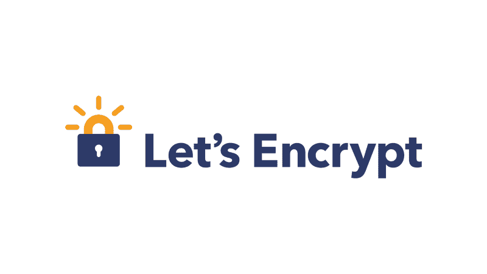
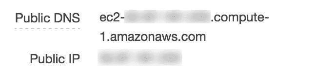

# 使用让我们加密 Certbot 获得亚马逊 EC2 NGINX 盒子上的 HTTPS

> 原文：<https://www.freecodecamp.org/news/going-https-on-amazon-ec2-ubuntu-14-04-with-lets-encrypt-certbot-on-nginx-696770649e76/>

作者卡兰·塔卡尔

# 使用让我们加密 Certbot 获得亚马逊 EC2 NGINX 盒子上的 HTTPS



让我们加密一个新的*认证机构*，它提供免费的 SSL 证书(每周达到一定的限制)。它在大约一个月前发布了测试版，并得到了 T2 众多浏览器的支持。

Certbot 是官方的 Let's Encrypt 客户端，由[电子前沿基金会](https://www.eff.org/)开发。它使得为您的 web 服务器自动获取和部署 SSL/TLS 证书成为一个相对简单的过程。

让我们开始吧。

### **第一步**

确保您已经将实例**安全组**中的端口 80 (HTTP)和 443 (HTTPS)向公众开放。Certbot 将在生成您的证书时使用它来建立连接。

请注意，我花了太多时间来找出为什么我不能生成证书，而唯一的问题是我没有在 EC2 实例安全组中打开端口 443。


**Inbound** settings in EC2 Security Group

### 第二步

设置您域的 **CNAME 记录**指向您 EC2 实例的**公共 DNS** 。



**Public DNS** value in your EC2 instance description


This setting would point **api.mydomain.com** to my EC2 instance

### 第三步

在您的实例上安装 Certbot。基于你的操作系统和服务器，你可以在 [Certbot 的主页](https://certbot.eff.org)找到如何安装。对于 **Ubuntu 14.04** 上的 NGINX，用[这个](https://certbot.eff.org/#ubuntutrusty-nginx)。

```
wget https://dl.eff.org/certbot-auto
chmod a+x certbot-auto
```

在您的主目录中运行以下命令:

```
/home/ubtuntu
```

### 第四步

停止在端口 80 和 443 上运行的任何现有服务器，因为 Certbot 使用这些服务器来验证您的域并生成证书。

完成证书生成后，您可以重新启动这些服务器。

### **第 5 步**

运行以下命令为您的域生成证书:

```
./certbot-auto certonly --standalone -d xyz.yourdomain.com
```

您可以使用这种方法为多个域生成证书。

### **第 6 步**

将您在 **/etc/nginx/nginx.conf** 中的 NGINX 配置更改为[启用 SSL](http://nginx.org/en/docs/http/configuring_https_servers.html) :

```
http {
  ##
  # Logging Settings
  ##

  access_log /var/log/nginx/access.log;
  error_log /var/log/nginx/error.log;

  server {
    listen 80;
    server_name xyz.yourdomain.com;
    location / {
      # Redirect any http requests to https
      return 301 https://$server_name$request_uri;
    }
  }

  server {
    listen 443 ssl;
    server_name xyz.yourdomain.com;
    ssl_certificate /etc/letsencrypt/live/xyz.yourdomain.com/fullchain.pem;
    ssl_certificate_key /etc/letsencrypt/live/xyz.yourdomain.com/privkey.pem;
    add_header Strict-Transport-Security “max-age=31536000”;
    location / {
      proxy_pass http://127.0.0.1:3000;
    }
  }

}
```

在 HTTPS 会话期间，[严格传输安全](https://developer.mozilla.org/en-US/docs/Web/Security/HTTP_strict_transport_security) (HSTS)报头确保任何不是 HTTPS 的内部链接将[自动路由](https://loune.net/2016/01/https-with-lets-encrypt-ssl-and-nginx)到 HTTPS 版本。

### **第 7 步**

最后，重新加载您的 NGINX 配置:

```
sudo service nginx reload
```

恭喜你！你的网站**xyz.example.com**现在已经在 HTTPS 成功运行。

**注** : Let's 加密证书仅在签发后 3 个月内有效。所以每 3 个月就要更新一次。下面是如何使用 cron 作业来自动化这个[。](https://loune.net/2016/01/https-with-lets-encrypt-ssl-and-nginx/)

如果这篇文章对你有帮助，点击下面的心形按钮。？如果没有，请留下评论，告诉我如何让它变得更好。

PS:感谢 [Narendra N Shetty](https://www.freecodecamp.org/news/going-https-on-amazon-ec2-ubuntu-14-04-with-lets-encrypt-certbot-on-nginx-696770649e76/undefined) 校对并给出建议。


[Karan Thakkar](https://twitter.com/geekykaran) 是[crowd fire](https://www.freecodecamp.org/news/going-https-on-amazon-ec2-ubuntu-14-04-with-lets-encrypt-certbot-on-nginx-696770649e76/undefined)——*你超级聪明的营销伙伴*的前端领导。他的[文章](https://bit.ly/hackingtwitter)之前已经在[赫芬顿邮报](https://www.freecodecamp.org/news/going-https-on-amazon-ec2-ubuntu-14-04-with-lets-encrypt-certbot-on-nginx-696770649e76/undefined)上[专题报道过](https://bit.ly/geekyonhuffpo)。他喜欢在业余时间尝试新技术，已经建立了 [Tweetify](https://karanjthakkar.com/projects/tweetify) (使用 React Native)和 [Show My PR 的](https://showmyprs.com)(使用 Golang)。

他写的其他文章:

[**我是如何在短短 3 周内从 300 名粉丝增长到 5000 名粉丝的**](https://blog.markgrowth.com/how-i-grew-from-300-to-5k-followers-in-just-3-weeks-2436528da845)
[*# growth hacking 我的 Twitter 账户@Crowdfire Twitter 英超联赛*blog.markgrowth.com](https://blog.markgrowth.com/how-i-grew-from-300-to-5k-followers-in-just-3-weeks-2436528da845)[**使用 Github 建立网站的图解指南&cloud flare**](https://medium.freecodecamp.org/an-illustrated-guide-for-setting-up-your-website-using-github-cloudflare-5a7a11ca9465)
[*易于设置、即时部署、免费 HTTPS、HTTP2/SPDY 支持、自定义重定向、浏览器缓存过期、HTTP Secure……*medium.freecodecamp.org](https://medium.freecodecamp.org/an-illustrated-guide-for-setting-up-your-website-using-github-cloudflare-5a7a11ca9465)