# 出去吃饭了解 Express.js 的基础知识

> 原文：<https://www.freecodecamp.org/news/going-out-to-eat-and-understanding-the-basics-of-express-js-f034a029fb66/>

凯文·科诺年科


# 出去吃饭了解 Express.js 的基础知识

如果你曾经去过坐式餐厅，那么你就能理解 Express 的基本知识。但是，如果您刚刚开始构建您的第一个 Node.js 后端……您可能会遇到困难。

是的——如果您过去有使用 JavaScript 的经验，学习 Node 肯定会更容易。但是在构建后端时，您将面临的挑战与在前端使用 JavaScript 时完全不同。

当我学习 Node 的时候，我选择了艰难的道路。我一遍又一遍地学习电子书、书面教程和视频，直到我最终明白了为什么我在做我正在做的事情。

有一个更简单的方法。我将用一个餐馆的例子来解释你的第一个快递应用程序的四个关键部分。Express.js 是一个组织代码的流行框架，我向所有初学者推荐它。一会儿我会进一步解释。

以下是我们将涉及的四个关键部分:

1.  所需声明
2.  中间件
3.  按指定路线发送
4.  App.listen()/启动服务器

在这个类比中，你是一家餐馆的老板，想招聘一名总经理——这个人创建所有的流程并管理这个地方，使它运行顺利，顾客满意而归。

下面是下一步的预览:

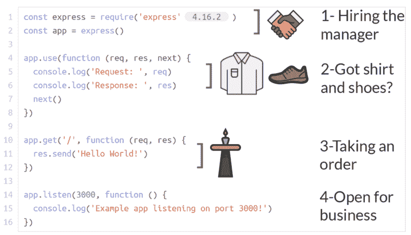

到最后，你会了解一个基本的快速应用程序的每个部分的功能。

### 第一步:招聘经理(要求陈述)

在本例中，您是餐馆老板。你需要聘请一位专家来管理你的新餐厅的日常运营。你当然不是专家，你也不能让服务员和厨房来解决。

如果你想经营一家高效安全的餐厅，你需要有人让你的员工以最高效率工作。Express 是新经理。

第一部分非常简单。与任何其他 npm 包一样，您需要 NPM 安装 express 模块，然后使用 **require** 语句来加载该模块。

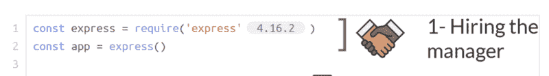

与许多其他 NPM 软件包不同，您还需要使用这一行:

```
const app = express();
```

这是因为您需要一个变量来保存新的 Express 应用程序。Express 不是节点的默认部分。

### 步骤 2:在餐厅做决策(中间件)

让我们后退一步。餐厅里有哪些常见的套路？有三个立即跳入我的脑海:

1.  让新顾客入座
2.  接受食物订单
3.  用餐结束时出示账单

对于每一个，在执行操作之前，都需要运行一系列检查。例如，在为客户安排座位之前，您需要了解:

1.  他们穿着衬衫和鞋子(和裤子)吗？否则，他们无法入座。
2.  如果他们想坐吧台，是 21 岁吗(如果你在美国)？

这不是沙滩酒吧！类似地，在您的代码中，您将需要验证请求在能够继续之前具有特定的标准。例如，如果有人试图登录您的站点:

1.  他们有账户吗？
2.  他们输入了正确的密码吗？

这就是中间件概念的由来。中间件功能允许您对任何传入的请求采取行动，并在发回响应之前修改它。

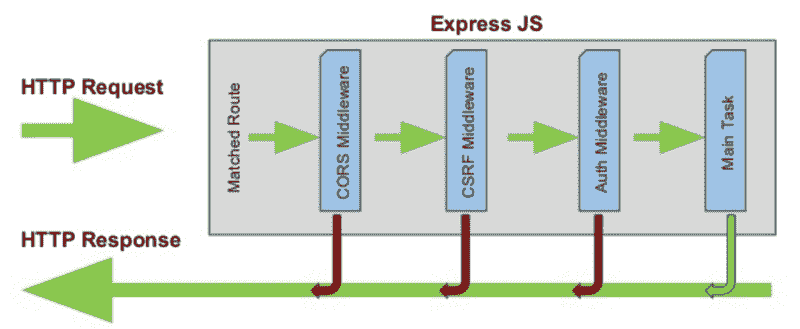

在你的餐馆里，你需要一系列的规则来决定你是否应该让新来的人入座。假设一对夫妇走进你的门。在给他们一张桌子之前，你有一个规则:他们穿着衬衫和鞋子吗？

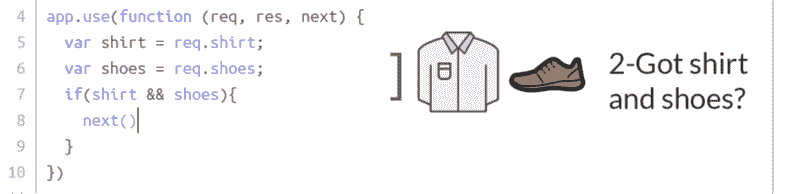

首先，你从 [app.use()](http://expressjs.com/en/api.html#app.use) 开始。这意味着这些只是需要应用于接下来的路线的规则。它们不是 GET、POST、PUT 或 DELETE。

在第 4 行中，有一个匿名函数，带有参数 req、res 和 next。对于这个代码块，您只是检查请求(req ),看看它是否有衬衫和鞋子。

您还需要在最后使用 next()函数，因为您只是在这里验证服装。稍后，在路线中，您将允许客人获得实际的桌子。

在第 5 行和第 6 行，您检查他们是否有衬衫和鞋子。

在第 7-9 行中，只有当它们都有时，您才继续。

上面的代码块缺少一个重要的东西:一个**路径**。这是请求中包含的特定字符串。因为它缺少一条路径，所以它将在每个请求上运行。

你能想象吗？当顾客进入餐厅…点餐…要求结账…员工将被迫上下打量他们，以确保他们穿着衣服！这是一种快速的歇业方式。

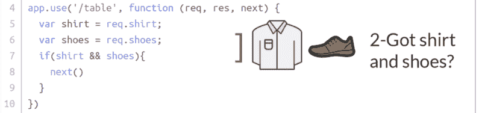

因此，我们改变上面例子中的第 4 行。现在，我们将只在用户沿着'/table '路径请求时运行这段代码。

完整的解释:

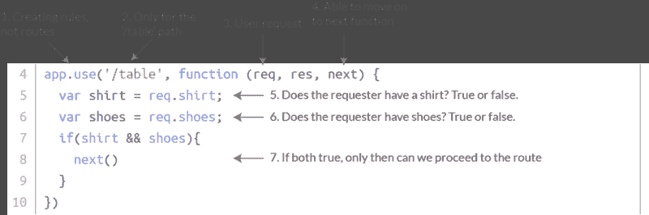

### 步骤 3:执行通用例程(路由)

让我们继续座位的例子。到目前为止，我们只知道如何验证某人是否应该坐下。但是我们实际上不知道如何把他们带到一张桌子前坐下。

这就是**路线**的用武之地。路线允许我们根据**路径**编写特定的动作。选项有 GET、POST、PUT 和 DELETE，但我们现在将重点关注 GET 和 POST。

在餐馆的上下文中，我们需要创建一个 GET 请求，以便选择特定的桌子并为客人安排座位。不要修改或添加到数据库中。它们只是根据特定的参数检索信息。

在这种情况下，假设您需要创建一个为两个人安排座位的过程。数字 2 来自客户**的请求。**

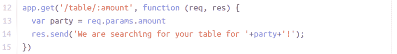

好吧，在我解释之前:是的，这只是在最后传递一个信息。它实际上还没有找到一张特定的桌子让顾客就座。我需要在一个数组中搜索一个打开的表，有更多的背景故事…这超出了本教程的范围。

在第 12 行，我们定义了当客人**沿着“/table”**路线**请求**时查找桌子的过程。就像上面的中间件例子一样，我们有可用的请求和响应参数。它还有一个**参数**，金额。在这个例子中是两个。

事实上，第 12 行中函数声明之后的一切从技术上来说都是中间件，因为它修改了用户请求。你会在最后的图表中看到。

在第 13 行，我们从请求对象的**参数**中访问聚会的人数。因为请求来自用户，所以没有在任何地方声明，并且我们没有任何前端代码。如果这是一个真正的应用程序，那么这个请求可能是这样的:

```
req = {  params: {    amount: 2;  }}
```

在第 13 行，我方变量访问**请求**中参数**对象**的金额**属性**。

最后在第 14 行，我们向客户发送了一个**响应**:我们正在寻找大小合适的桌子。

一下子就很多了。这是一个图表:

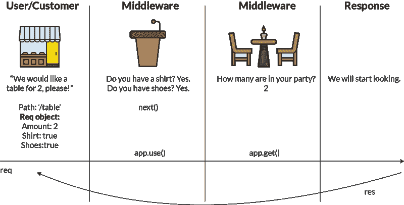

### 步骤 3.5:让你的餐厅高效(路由器)

现在，您可以跟踪从请求到响应的完整路径。但是当你的应用程序变大的时候，你可能不想为每条路线单独编写规则。您会发现一些路由共享相同的规则，因此您需要找到一种方法将一组规则应用于多条路由。

就座位而言，你可以让顾客坐在吧台或餐桌旁。这些都有共同的规则，如衬衫+鞋子，但在酒吧就座要求每个成员都是 21 岁。

而且，在服务顾客方面，你需要使用稍微不同的程序来服务开胃菜、主菜和正餐。但是，这三条路线也有很多共同点。

这就是**路由器**的用武之地。路由器允许您对路由进行分组，以便创建通用规则。

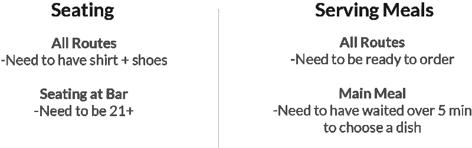

我们需要创建中间件来涵盖所有这些情况。我现在只讨论座位的情况，因为它会覆盖上面的代码。

以下是完整的代码片段:

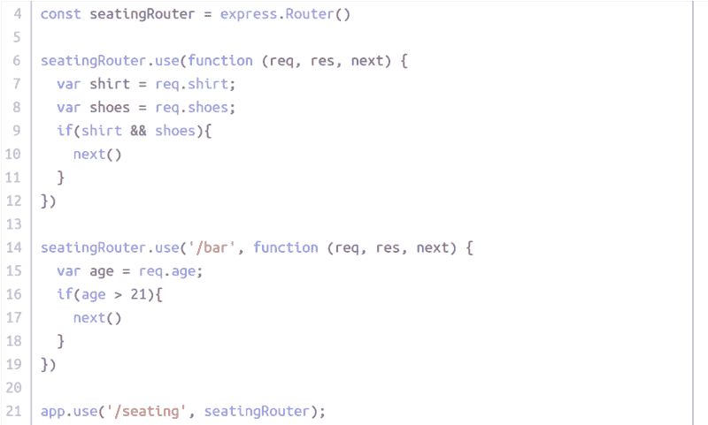

我将分别介绍每一部分。

在第 4 行，我们声明我们的路由器。

在第 6 行和第 14 行，我们现在用 seatingRouter.use()代替 app.use()来表示这个**中间件**只与 seatingRouter 路由相关。

最后，在第 21 行，我们添加了更多的中间件来显示每个 seatingRouter 路由都以“/seating”开头。因此，如果有人在酒吧请求座位，完整路径应该是“/seating/bar”这可能感觉有点混乱，因为您可能希望在第 4 行创建路由器时定义路径。这很正常！

以下是图表形式:

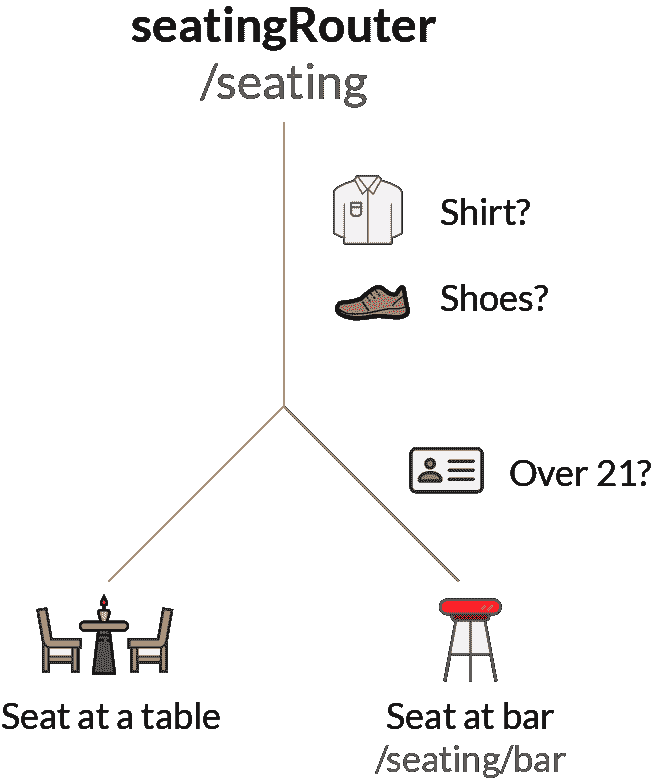

此外，当您添加 GET route 时，它位于您向路由器分配路由的最后一条语句之上。

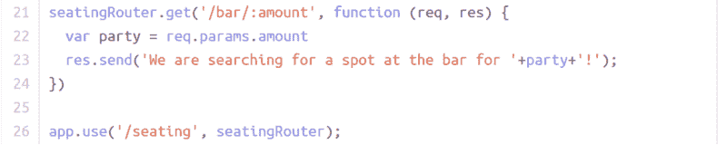

### 第四步:开业(港口)

好了，最后一部分。到目前为止，你已经雇佣了一个经理，定义了在接受客户请求之前要做的事情，并且决定了一旦客户提出具体的请求，该如何处理。现在，您只需要确定这一切发生的位置的地址。

你的服务器有**个端口**，有点像餐馆本身的地址。由于你的服务器可以同时处理多种类型的餐厅(或者服务器端脚本)，你需要告诉它每个脚本应该在哪里运行。


在上面的例子中，端口是 3000，它位于您的计算机上。所以如果你输入:

```
https://localhost:3000/
```

进入您的浏览器，并且您正在运行您的节点应用程序，服务器知道运行特定的脚本。在这种情况下，只要您输入 URL，您就会在控制台中记录该消息，并且能够使用您的任何**路线**。如果餐馆本身就是你的整个应用程序，那么它现在在地址 3000 营业。

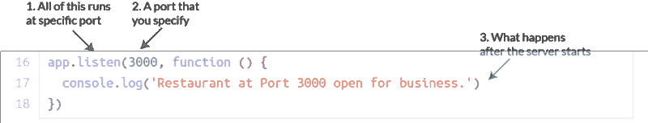

你喜欢这个吗？为它鼓掌，这样其他人也能发现它。如果你想在我发布使用类比的教程时得到通知，请在这里注册: