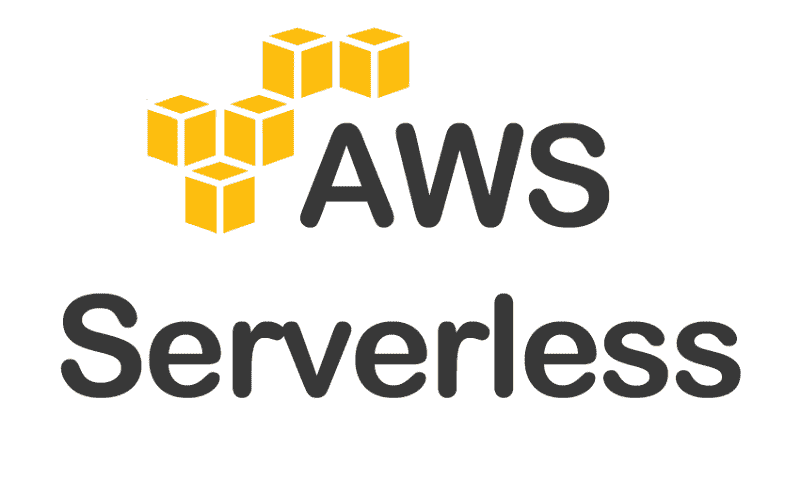
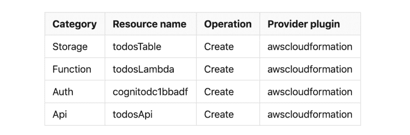
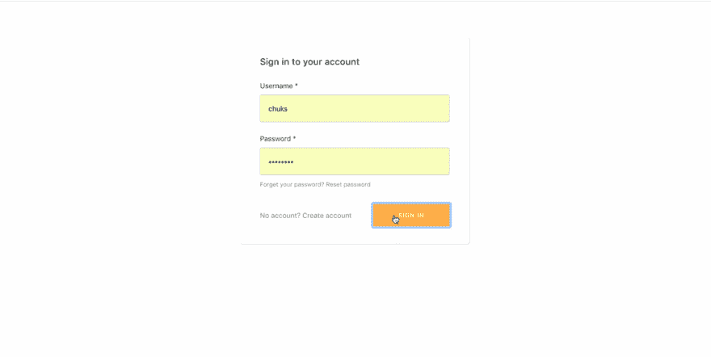

# 使用 React 和 AWS 实现无服务器扩展第 2 部分:创建和使用无服务器服务

> 原文：<https://www.freecodecamp.org/news/going-serverless-with-react-and-aws-amplify-part-2-creating-and-using-serverless-services-d401ba346eeb/>

彼得·姆巴努戈

# 使用 React 和 AWS 实现无服务器扩展第 2 部分:创建和使用无服务器服务



无服务器是一种云计算执行模型，其中云提供商负责通过在需要时动态分配资源来运行代码，从而执行一段代码。在之前的[帖子](https://medium.freecodecamp.org/going-serverless-with-react-and-aws-amplify-development-environment-set-up-9b15c3363bd)中，我们了解了什么是无服务器，我们设置我们的计算机能够使用 AWS Amplify 构建无服务器应用程序。我们启动了一个 React 项目，并向其中添加了 Amplify 库。在本文中，我们将使用 Amplify CLI 来提供一个安全的后端 API 和一个 NoSQL 数据库。然后我们将从 React 项目中使用这个 API。

### 创建无服务器后端服务

我们将要构建的应用程序将允许用户执行基本的 CRUD 操作。我们将使用一个带有 NoSQL 数据库的 REST API。按照下面的说明创建无服务器后端。

1.  打开命令行并转到项目的根目录。
2.  运行命令`amplify add api`。
3.  您会收到选择服务类型的提示。选择`REST`并按下回车键。
4.  它会提示您输入当前类别(API 类别)的名称。输入`todosApi`并按回车键。
5.  你被要求走一条路。按 Enter 键接受默认的`items`路径。
6.  下一个提示询问 Lambda 源。无服务器 REST API 的工作方式是在 API Gateway 上创建一个路径，并将该路径映射到一个 lambda 函数。lambda 函数包含当请求被映射到的路径时要执行的代码。我们将创造一个新的λ。选择选项`Create a new Lambda function`并按下回车键。
7.  输入`todosLambda`作为类别(功能类别)的资源名称，然后按回车键。
8.  您将被要求输入 lambda 函数的名称。输入`todos`并按回车键。
9.  您将被要求选择一个模板来为这个函数生成代码。选择选项`CRUD function for Amazon DynamoDB table (Integration with Amazon API Gateway and Amazon DynamoDB)`并按下回车键。这创建了一个使用 API Gateway with Express 的架构，该架构运行在一个 AWS Lambda 函数中，该函数读写 Amazon DynamoDB。
10.  下一个提示要求您选择一个 DynanoDB 数据源。我们没有现成的 DynamoDB 表，所以我们将选择`Create a new DynamoDB table`选项。按回车键继续。现在您应该看到 DynamoDB 数据库向导。它将询问一系列问题来确定如何创建数据库。
11.  您将被要求输入该资源的名称。输入`todosTable`并按回车键。
12.  下一个提示是输入表名。输入`todos`并按回车键。
13.  您将被要求向 DynamoDB 表中添加列。按照提示创建类型为`String`的列`id`。
14.  当询问表的分区键(主键)时，选择`id`列。
15.  将询问您是否要向表中添加一个排序关键字。选择假。
16.  下一个提示询问您是否想要将全局二级索引添加到表中。输入`n`并按回车键。您应该会看到消息`Successfully added DynamoDb table locally`
17.  下一个提示询问**你想现在编辑本地 lambda 函数吗？**。输入`n`并按回车键。您应该会看到消息`Successfully added the Lambda function locally`。
18.  系统会询问您是否希望限制对 API 的访问。输入`y`并按回车键。
19.  对于下一个提示，选择`Authenticated and Guest users`并按回车键。该选项允许授权用户和访客用户访问 REST API。
20.  接下来，你会被问到`What kind of access do you want for Authenticated users`。选择`read/write`并按回车键。
21.  现在，我们得到一个提示，让我们为未经身份验证的用户(即 gues 用户)选择访问类型。选择`read`并按下回车键。您应该会收到消息`Successfully added auth resource locally`。这是因为我们选择了限制对 API 的访问，并且 CLI 将 Auth 类别添加到了项目中，因为我们在项目中没有任何 Auth 类别。至此，我们已经添加了创建 API 所需的资源(API Gateway、DynamoDB、Lambda 函数和用于身份验证的 Cognito)。
22.  我们被询问是否要向 API 添加另一个路径。输入`n`并按回车键。这个过程就完成了，我们得到了消息`Successfully added resource todosApi locally`。

`amplify add api`命令带我们完成了创建 REST API 的过程。这个 API 将根据我们选择的选项创建。创建这个 API 需要 4 个 AWS 服务。他们是:

1.  亚马逊 DynamoDB。这将作为我们的 NoSQL 数据库。当我们添加`todosTable`资源时，我们创建了一个名为`todos`的 DynomoDB 表。我们给它 3 列，用`id`作为主键。
2.  AWS Lambda 函数。这让我们无需供应或管理服务器即可运行代码。这是我们在 DynamoDB 表上执行 CRUD 操作的代码所在的位置。
3.  亚马逊 Cognito。这负责认证和用户管理。这让我们可以向我们的应用程序添加用户注册、登录和访问控制。我们选择了限制访问我们的 API 的选项，这个服务将帮助我们认证用户。
4.  亚马逊 API 网关。这就是我们创建 REST API 端点的原因。我们为此添加了一个名为`todosApi`的资源，路径为`items`。我们还选择了限制访问 API 的选项。

然而，这些服务的服务规范还没有出现在云中。我们需要用信息更新云中的项目，以提供所需的服务。运行命令`amplify status`，我们应该得到一个关于 amplify 项目的信息表。



打开文件**back end/function/todos lambda/src/app . js**。您会注意到这个文件包含在资源设置过程中生成的代码。它使用 [Express.js](https://expressjs.com/) 设置路线，使用 [aws-serverless-express](https://github.com/awslabs/aws-serverless-express) 包在 AWS Lambda 和 Amazon API Gateway 之上使用 Express.js 框架轻松构建 RESTful APIs。

当我们将项目配置推送到云端时，它将使用 Amazon API Gateway 配置一个简单的代理 API，并将其与 Lambda 函数集成。该包包含中间件，可以轻松地从 API Gateway 获得 Lambda 接收的事件对象。它应用在第 32 行`app.use(awsServerlessExpressMiddleware.eventContext());`上，并在代码类似于`req.apiGateway.event.*`的路线上使用。预定义的路径允许我们在 DynamoDB 表上执行 CRUD 操作。

我们将对这个文件做一些修改。第一个是将变量`tableName`的值从`todosTable`改为`todos`。在创建 DynamoDB 资源时，我们将`todosTable`指定为资源名，将`todos`指定为表名，因此在创建文件时，它错误地将资源名用作表名。这可能会在 CLI 的未来版本中得到修复，因此如果您没有发现它被错误地使用，您可以跳过这一步。我们还需要更新定义。

将第一个路由定义更改为使用下面的代码。

```
app.get(path, function(req, res) {  const queryParams = {    TableName: tableName,    ProjectionExpression: "id, title"  };
```

```
 dynamodb.scan(queryParams, (err, data) => {    if (err) {      res.json({ error: "Could not load items: " + err });    } else {      res.json(data.Items);    }  });});
```

这定义了一条路径，用代码响应 **/items** 路径，返回 DynamoDB 表中的所有数据。`ProjectionExpression`值用于指定它应该只获取列`id`和`title`。

将第 77 行的路线定义改为`app.get(path + hashKeyPath + sortKeyPath, function(req, res) {`。这允许我们按照路径 **/items/:id** 通过项目的`id`来检索项目。另外，将第 173 行改为`app.delete(path + hashKeyPath + sortKeyPath, function(req, res) {`。这响应 HTTP DELETE 方法，删除路径为 **/items/:id** 的项目。

AWS 资源已经在本地添加和更新，我们需要在云中提供它们。打开命令行，运行`amplify push`。如果您想继续执行该命令，您将得到一个提示。输入`y`并按回车键。它会将最新版本的资源嵌套堆栈模板上传到 S3 部署桶，然后调用 AWS CloudFormation API 在云中创建/更新资源。

### 构建前端

当`amplify push`命令完成时，你会在 **src** 文件夹中看到一个文件 **aws-exports.js** 。该文件包含云中创建的资源的信息。每次通过运行`push`命令创建或更新资源时，这个文件都会被更新。它是为 JavaScript 项目创建的，将在 Amplify JavaScript 库中使用。我们将在 React 项目中使用它。我们还将使用 Bootstrap 来设计页面样式。打开 **public/index.html** 并在标题中添加以下内容:

```
<link  rel="stylesheet"  href="https://stackpath.bootstrapcdn.com/bootstrap/4.1.3/css/bootstrap.min.css"  integrity="sha384-MCw98/SFnGE8fJT3GXwEOngsV7Zt27NXFoaoApmYm81iuXoPkFOJwJ8ERdknLPMO"  crossorigin="anonymous"/><script  src="https://code.jquery.com/jquery-3.3.1.slim.min.js"  integrity="sha384-q8i/X+965DzO0rT7abK41JStQIAqVgRVzpbzo5smXKp4YfRvH+8abtTE1Pi6jizo"  crossorigin="anonymous"></script><script  src="https://cdnjs.cloudflare.com/ajax/libs/popper.js/1.14.3/umd/popper.min.js"  integrity="sha384-ZMP7rVo3mIykV+2+9J3UJ46jBk0WLaUAdn689aCwoqbBJiSnjAK/l8WvCWPIPm49"  crossorigin="anonymous"></script><script  src="https://stackpath.bootstrapcdn.com/bootstrap/4.1.3/js/bootstrap.min.js"  integrity="sha384-ChfqqxuZUCnJSK3+MXmPNIyE6ZbWh2IMqE241rYiqJxyMiZ6OW/JmZQ5stwEULTy"  crossorigin="anonymous"></script>
```

添加一个新文件 **src/List.js** ，内容如下:

```
import React from "react";
```

```
export default props => (  <div>    <legend>List</legend>    <div className="card" style={{ width: "25rem" }}>      {renderListItem(props.list, props.loadDetailsPage)}    </div>  </div>);
```

```
function renderListItem(list, loadDetailsPage) {  const listItems = list.map(item => (    <li      key={item.id}      className="list-group-item"      onClick={() => loadDetailsPage(item.id)}    >      {item.title}    </li>  ));
```

```
 return <ul className="list-group list-group-flush">{listItems}&lt;/ul>;}
```

该组件将从 API 中呈现一个项目列表。添加一个新文件 **src/Details.js** ，内容如下:

```
import React from "react";
```

```
export default props => (  <div>    <h2>Details</h2>    <div className="btn-group" role="group">      <button        type="button"        className="btn btn-secondary"        onClick={props.loadListPage}      >        Back to List      </button>      <button        type="button"        className="btn btn-danger"        onClick={() => props.delete(props.item.id)}      >        Delete      </button>    </div>    <legend>{props.item.title}</legend>    <div className="card">      <div className="card-body">{props.item.content}</div>    </div>  </div>);
```

该组件将显示一个项目的详细信息，并带有删除该项目的按钮或返回到列表视图。打开 **src/App.js** 并用以下代码更新它:

```
import React, { Component } from "react";import List from "./List";import Details from "./Details";
```

```
import Amplify, { API } from "aws-amplify";import aws_exports from "./aws-exports";import { withAuthenticator } from "aws-amplify-react";Amplify.configure(aws_exports);
```

```
class App extends Component {  constructor(props) {    super(props);    this.state = {      content: "",      title: "",      list: [],      item: {},      showDetails: false    };  }
```

```
 async componentDidMount() {    await this.fetchList();  }  handleChange = event => {    const id = event.target.id;    this.setState({ [id]: event.target.value });  };
```

```
 handleSubmit = async event => {    event.preventDefault();    await API.post("todosApi", "/items", {      body: {        id: Date.now().toString(),        title: this.state.title,        content: this.state.content      }    });
```

```
 this.setState({ content: "", title: "" });    this.fetchList();  };  async fetchList() {    const response = await API.get("todosApi", "/items");    this.setState({ list: [...response] });  }
```

```
 loadDetailsPage = async id => {    const response = await API.get("todosApi", "/items/" + id);    this.setState({ item: { ...response }, showDetails: true });  };
```

```
 loadListPage = () => {    this.setState({ showDetails: false });  };
```

```
 delete = async id => {    //TODO: Implement functionality  };
```

```
 render() {    return (      <div className="container">        <form onSubmit={this.handleSubmit}>          <legend>Add</legend>          <div className="form-group">            <label htmlFor="title">Title</label>            <input              type="text"              className="form-control"              id="title"              placeholder="Title"              value={this.state.title}              onChange={this.handleChange}            />          </div>          <div className="form-group">            <label htmlFor="content">Content</label>            <textarea              className="form-control"              id="content"              placeholder="Content"              value={this.state.content}              onChange={this.handleChange}            />          </div>          <button type="submit" className="btn btn-primary">            Submit          </button>        </form>        <hr />        {this.state.showDetails ? (          <Details            item={this.state.item}            loadListPage={this.loadListPage}            delete={this.delete}          />        ) : (          <List list={this.state.list} loadDetailsPage={this.loadDetailsPage} />        )}      </div>    );  }}
```

```
export default withAuthenticator(App, true);
```

我们导入了 Amplify 库，并通过调用`Amplify.configure(aws_exports);`来初始化它。当组件被挂载时，我们调用`fetchList()`从 API 中检索项目。

这个函数使用 Amplify 库中的 API 客户端来调用 REST API。在幕后，它利用 [Axios](https://github.com/axios/axios) 来执行 HTTP 请求。它将向请求添加必要的头，这样您就可以成功地调用 REST API。如果您为 API 定义了自定义头，则可以添加头。

对于我们的项目，当从 API 客户机调用函数时，我们只指定 apiName 和 path。`loadDetailsPage()`函数通过 API 从数据库中获取特定的项目。然后用响应和`showDetails`设置`item`状态为真。这个`showDetails`在渲染功能中用于在显示项目列表或所选项目的详细信息页面之间切换。提交表单时会调用函数`handleSubmit()`。它将表单数据发送给 API，在数据库中创建一个文档，包含列`id`、`title`和`content`，然后调用`fetchList()`来更新列表。我将`delete()`函数留空，以便您可以自己实现它。有什么比自己尝试更好的学习方法呢？。

该函数将从`Details`组件中的删除按钮调用。其中的代码应该调用 API 通过`id`删除一个条目，并显示包含正确条目的列表组件。

我们用 Amplify React 库中的`withAuthenticator`高阶组件包装了 App 组件。这为应用程序提供了完整的用户注册、登录、注册和注销流程。只有登录的用户才能访问该应用程序，因为我们使用的是这种高阶组件。`withAuthenticator`组件自动检测认证状态并更新 UI。如果用户已登录，则显示底层的**应用**组件，否则显示登录/注册控件。

设置为`true`的第二个参数告诉它在页面顶部显示一个注销按钮。使用`withAuthenticator`组件是将认证流程添加到应用程序中的最简单的方法。您还可以拥有一个定制的 UI，并使用 Amplify 库中的一组 API 来实现登录和注册流程。详见[文件](https://aws-amplify.github.io/docs/js/authentication#working-with-the-api)。

我们拥有使用该应用程序所需的所有代码。打开终端，运行`npm start`启动应用程序。您需要注册并登录才能使用该应用程序。



completed application

### 包扎

我们使用 Amplify CLI 创建了后端服务。命令`amplify add api`带我们完成了为 DynamoDB、Lambda、API Gateway 和用于认证的 Cognito 添加资源的过程。我们更新了**back end/function/todos lambda/src/app . js**中的代码，以符合我们的 API 要求。我们添加了 UI 组件来对应用程序执行 CRUD 操作，并使用了 Amplify React 库中的一个更高阶的组件，只允许经过身份验证的用户访问应用程序。

您应该注意到，我们只使用了几行代码来添加身份验证流和调用 API。同样，创建无服务器后端服务并将它们连接在一起是通过一个命令并响应随后的提示来完成的。从而展示了 AWS Amplify 如何使开发变得更加容易。

> *最初发布在我的[博客](https://www.pmbanugo.me/blog/2019-01-14-going-serverless-with-react-and-aws-amplify-part-2-creating-and-using-serverless-services/)上。*