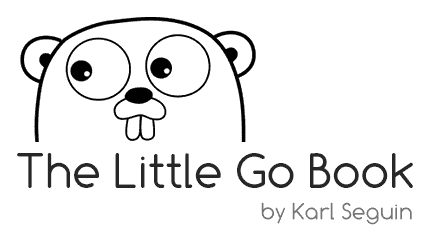

# Golang 教程指南-学习 Go 编程语言的免费课程列表

> 原文：<https://www.freecodecamp.org/news/golang-tutorial-list-free-courses-learn-go-programming-language/>

为什么选择 Go？在我进入我的 Go 学习资源列表之前，让我告诉你编程史上最著名的背叛之一。

Node.js 中有一个开发者如此多产，以至于很多人都相信他不是一个真实的人。他们推测他实际上是一群用一个名字工作的开发人员。

那个开发者是 TJ·霍洛韦丘克。他编写了许多最常用的 npm 包，并为关键的 JavaScript 库做出了贡献。

但他确实是一个真实的人。而在 2014 年的某一天，他决定[离开 Node 社区专注于 Go](https://medium.com/code-adventures/farewell-node-js-4ba9e7f3e52b) 。

许多人从椅子上坐了起来。去吗？

是的。走吧。

这种语言已经达到了承诺的水平，甚至一些最有影响力的开发人员都在向它前进。

围棋界张开双臂拥抱 TJ。

那么，为什么这样的开发人员会喜欢相对简单和直接的语法，而不去考虑其他后端语言呢？

对于像我这样自学成才的人来说，围棋提供了一个深入计算机科学和系统工程不同领域的绝佳机会。

Go 类似于 C，但是具有内存安全和内置并发的运行时。就这一点而言，可以说，当涉及到与作为操作系统基础的通用原语进行接口时，它“更接近金属”。

我现在主要做分布式系统。在学习围棋之前，我的背景和 TJ 一样，主要是 Node 和 JavaScript。Node 做很多事情都很好，但是并发性不行。Node 不再是那些在分布式系统上工作的人的首选工具。相反，Go 已经成为主流语言。

## 作为一种语言使用

Go 是一种静态类型的编译语言，以其简单明了的语法而闻名。它解决了 C 语言的常见缺陷，同时保持了它的性能和互操作性。

尽管如此简单，Go——在其核心——是为处理并发而设计的。并且它遭受了由此带来的复杂性。

Go 也相当惯用，这使得最佳实践有点难以捉摸。

Go 最吸引人的一个特点就是入门容易。学习者通常很难从成千上万的可用资源中挑选出。

考虑到这一点，这里有一些关于从哪里开始的固执己见的建议。

## 推荐书籍:必备围棋

[Essential GoEssential Goa free Go programming book](https://www.programming-books.io/essential/go/)

Essential Go 提供了该语言的全面概述。对于初学者和中级学习者来说，这是一个极好的资源。

它深入涵盖了该语言的基本数据结构。

它还解释了并发性和 Goroutines，提供了对惯用最佳实践的见解。

## 推荐书籍:围棋小百科

[The Little Go BookFree to download, The Little Go Book is an introduction to Google’s Go programming language](https://www.openmymind.net/The-Little-Go-Book/)

对于那些希望快速入门的人来说，这是另一个不错的选择。

这本小书涵盖了基础知识。它可能已经过时了，但它所涵盖的基本面并没有改变。

## 推荐课程:学习围棋编程

[https://www.youtube.com/embed/YS4e4q9oBaU?feature=oembed](https://www.youtube.com/embed/YS4e4q9oBaU?feature=oembed)

[freeCodeCamp 的全面 7 小时潜入围棋](https://www.freecodecamp.org/news/go-golang-course/)。最好分块处理，这对初学者来说是一个极好的资源。

课程内容也使中级围棋程序员能够重温不同的主题。

## 推荐练习工具:边学边考

[quii/learn-go-with-testsLearn Go with test-driven development. Contribute to quii/learn-go-with-tests development by creating an account on GitHub.quiiGitHub](https://github.com/quii/learn-go-with-tests)

最好的入门方式是开始写代码。

Learn Go With Tests 是学习这门语言的一个很好的入门。

## 推荐博客:Go 编程语言博客

[The Go Programming LanguageGo is an open source programming language that makes it easy to build simple, reliable, and efficient software.](https://golang.org)

这是 Go 中新特性和最佳实践的事实上的信息来源。

这个博客为开发者提供了一系列优秀的资源。

这里详细描述了新特性、最佳实践和 Go 模式。

## 推荐文档:GoDoc

[https://godoc.org/](https://godoc.org/)

GoDoc 是 Go 开发者使用最多的资源。

它是标准库和第三方包中所有文档的单一来源。

我们鼓励学习者将此网站作为第一个访问点。

一旦你掌握了围棋的基本知识，这将是你唯一需要的资源。

## 推荐阅读:Go 语言规范

最后，[Go](https://golang.org/ref/spec)的参考手册是一个很好的信息来源，可以帮助你解决在学习过程中遇到的问题。

与任何编程语言一样，您需要编写代码来改进。Go 非常灵活，有着广泛的应用。

找到一个感兴趣的项目并使用 Go，在进行过程中特别使用 GoDoc。一个好的起点是 https://tour.golang.org。