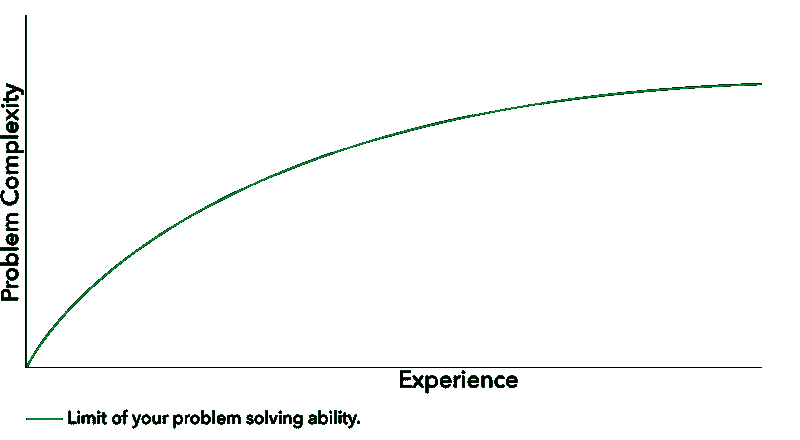

# 良好的编码本能最终会让你大吃一惊

> 原文：<https://www.freecodecamp.org/news/good-coding-instincts-will-eventually-kick-you-in-the-teeth-2b3766897f3f/>

大约 32 年前，当我 6 岁的时候，我写了我的前几行代码。我有很强的编码本能。我可以看到任何问题，并立即知道如何解决它，只是凭直觉。

当我开始以编码为生时，我感觉自己像个摇滚明星。我发现和修复错误的速度比我的任何同事都快。我的团队开始给我分配所有最具挑战性的特性和最烦人的 bug。他们甚至开始叫我“巫师”

但是跟随你的直觉只能带你走这么远。我遇到了瓶颈。再多的编码本能也无法让我超越它。

#### 相信直觉的麻烦在于

不幸的是，直觉作为一种学习和解决问题的技术并没有很好地扩展。当你仅仅依靠本能和直觉时，你会得到一条类似这样的曲线:

当然，你可以选择接受自己的极限，只处理线下的问题。这将满足你的“摇滚明星程序员”的幻想，但它将很快开始限制你的成长和你的职业生涯。另外，很无聊。

随着我在事业上越走越远，开始真正挑战自己的能力，我开始注意到一个令人不安的趋势。我不再是街区里跑得最快的孩子。

我一直知道，我最终会遇到比我更聪明、更有才华的人。(我对伟大的幻想仍然基于现实。我不是天才。)

但是当我环顾四周，我意识到一些击败我的人并没有使用超群的智力或某种天生的代码天赋。他们有一个我非常缺乏的秘密武器:纪律。

事实证明，一种一致的、可重复的、有条不紊的学习和解决问题的方法最终会胜过你可能已经形成的任何天赋或本能。

Your instincts don’t stand a chance

#### 让我们提高解决问题的能力

不管你是谁，不管你有多少激情或天赋，你最终都会碰到一个坚硬的天花板。我将与你分享一些技巧，它们将极大地提高你解决问题的能力。

我假设，如果你有一个调试器，你已经运行了它，谷歌了输出，没有运气。

我还假设，如果这个问题是由其他人报告的，您就能够重现这个问题。第二个假设很重要。如果您不能重现问题，那么这需要是您的第一步。

您需要将问题发生的背景和环境与您试图重现问题的背景和环境进行比较。开始消除你能消除的任何差异，一个接一个，直到你能繁殖。

一旦您可以重现问题，并且在调试器没有任何用处之后，您可以尝试下面的**规范的**方法。

#### 阅读各类手册

看文档，你这个笨蛋！(诚然，这并不是 RTFM 的确切含义，但可能会有孩子在阅读。)

实际阅读它——如果你需要的话，不止一次。不要只是浏览一下，寻找一些你可以复制、粘贴并祈祷有用的东西。

问题是你想尽快得到答案。你想要胜利的快感。但是你不愿意投入工作。所以慢点。深呼吸。喝杯咖啡。从头到尾阅读**相关的**文档。

如果您没有文档，可以考虑创建一些，然后在解决问题后与其他人共享。

#### 测试你的假设

如果你期望某件事能成功，但它没有，那是因为你在这个过程中做了一个错误的假设。列出你的假设，并努力证明每一个都是正确的。

从可以快速检验的最基本的假设开始。服务器真的在运行吗？它连接到网络了吗？所有东西都拼写正确吗？所有的括号和分号都在正确的位置吗？

如果你不从简单的事情开始，而它确实是这些事情中的一件，当你最终弄明白时，你会想从窗户跳出去。所以省省你的头痛吧。

#### 拆卸和重新组装

Johnny 5 may have been alive, but your code isn’t. Don’t be afraid to disassemble it.

从溶液中取出组件，直到它再次开始工作，然后将组件一个接一个地放回原处，以便找到损坏的部分。

这听起来乏味又可怕，但是这是找到代码中 bug 的原因的最有效、最严格的方法之一。不过，请确保在开始之前有一个备份，以防您意外地以 Humpty Dumpty 代码(无法重新组合的代码)结束。

顺便说一句，如果您发现自己处于不知道如何将代码重新组装成原来样子的情况，这表明了一个潜在的更大的问题:您不了解您正在处理的代码库。那是坏香蕉，我的朋友。

如果你时间紧迫，立即向比你更了解代码库的人寻求帮助。如果不存在这样的人，那就花上一整夜的时间，优先去了解和理解这些代码是如何工作的，这样你就可以修复它们了。

#### 消除变量

在调试过程中，任何可以从一次试验到下一次试验发生变化的东西都应该保持不变。你不能击中移动的目标。这就是测试驱动开发(TDD)派上用场的地方。如果您正在使用 TDD，那么您应该有一些模拟对象供您使用。

> 模拟对象是以受控方式模仿真实对象行为的模拟对象。程序员通常创建一个模拟对象来测试其他对象的行为，就像汽车设计师使用碰撞测试假人来模拟人在车辆碰撞中的动态行为一样。— [维基百科](https://en.wikipedia.org/wiki/Mock_object)

如果您没有进行 TDD，那么您现在需要模拟出任何活动的部分，以便您可以在稳定的条件下找到 bug。

这里有一个提示:如果你模仿一个对象，而这个 bug 突然消失了，那么这个 bug 很可能在你模仿的对象中。

#### 使用“萨夫挤压”

有一种叫做“萨夫挤压”的技术——由肯特·贝克命名并推广——是上述两种想法的某种结合。

他是这样描述的:

> 为了有效地隔离缺陷，从系统级测试开始，逐步内联和修剪，直到你有了证明缺陷的最小可能的测试—肯特·贝克

因此，您只需将正在测试的函数体添加到测试本身中，然后将断言下移，直到 bug 消失，而不是正式的模拟或代码反汇编。

这有一个额外的好处，那就是留给你更小、更具体的测试。

> **编辑**:感谢[吉姆·巴尔特](https://www.freecodecamp.org/news/good-coding-instincts-will-eventually-kick-you-in-the-teeth-2b3766897f3f/undefined)指出[这个链接](http://stackoverflow.com/a/23890913/544557)是一个关于 Saff 挤压的很好的例子和解释。

#### 修好之后，把它弄坏，然后再修好

永远不要留下一个 bug，直到你完全理解你是如何修复它的。你应该能够重现 bug，随意再修复一次。

我怎么强调都不为过。如果你修复了一个 bug，但是你不确定到底是什么导致了它，或者你是如何修复它的，那么这个 bug 会在最糟糕的时候回来咬你。

#### 那些本能呢？

现在你已经学会了这些技巧，这是否意味着你应该总是首先使用它们，而不是依靠你的直觉？不，绝对不行。

我建议你给你的直觉一个时间盒，在这个时间盒里你会成功。如果你对问题可能是什么有很强的预感，并且你可以很快地检验你的预感，那么先这样做。如果 bug 在上面图表中的绿线之下，那么你的直觉很有可能是找到解决方案的最快途径。

一旦你很快尝试了你的第一次或第二次直觉，但都是错的，停止散弹枪式的方法，开始有条不紊地做事。

同时拥有直觉和纪律会让你成为任何团队中的顶尖程序员。

如果你喜欢这首曲子，请❤推荐❤并分享它。我想尽我所能帮助更多的开发者。

为了给你更多的帮助，我整理了一份免费的 PDF 格式的清单，列出了我最喜欢的五种代码重构技术——它们会导致更少的错误——点击这里
[**获取。**](https://devmastery.com/signup/instinct/index.html)