# 足够好的工程技术来开一家互联网公司

> 原文：<https://www.freecodecamp.org/news/good-enough-engineering-to-start-an-internet-company/>

我于 2019 年 3 月在[德克萨斯 A & M 大学](https://www.tamu.edu/)的一个本科软件工程班( [CSCE431](https://parasol.tamu.edu/~jeff/course/431/syllabus.html) )做了一次客座演讲。现在我把这个讲座变成了一篇博文，希望网上的一些人会觉得这很有用。

如果你是从谷歌搜索来的，这里有一些背景:

我在经营一家小型互联网公司——Listen Notes，Inc .，只有一名全职员工(我)，截至 2019 年 8 月 2 日。我们建立了一个播客搜索引擎网站[ListenNotes.com](https://www.listennotes.com/)和[播客 API](https://www.listennotes.com/api/) 。

* * *

我给大家分享一下我开互联网公司的经验。打造一个互联网产品并不像打造一个 iPhone 或者一个金字塔。你的产品不需要一开始就很完美。如果你正在构建有用的东西，其他人会告诉你下一步该做什么。你会知道接下来会发生什么。一般来说，如果你想创办自己的公司，你应该能够自如地应对不确定性。

脸书的第一个版本于 2004 年 2 月初发布，这是一个本科生仅仅四周的工作。这是一个足够好的产品，有足够好的工程技术。如今，每一个计算机科学学院的毕业生都应该能够用一个现代的 web 编程框架(比如 Rails、Django……)在一个周末的时间里构建出脸书的第一个版本。

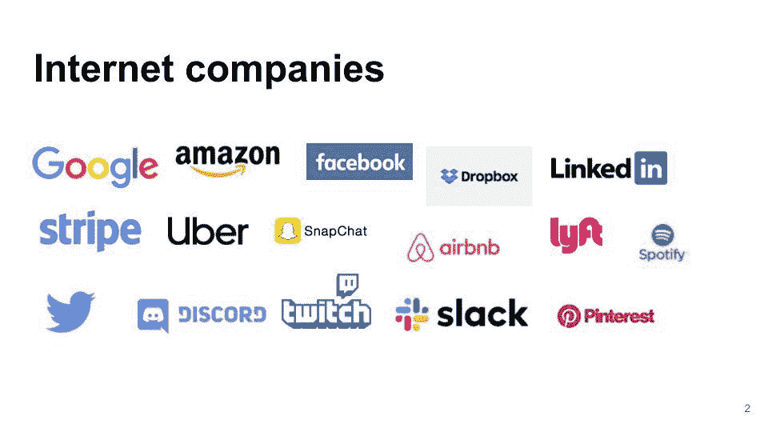

谷歌、Snapchat、Spotify、亚马逊、Twitter 等公司都是我们这一代伟大的互联网公司。

但是，我不能告诉你如何成为像他们一样成功的公司。我还没到那一步。这些公司如此成功，如此庞大。例如，截至 2019 年 3 月，谷歌有 10 万名员工。但在历史上有一个时刻，谷歌只有两名员工。你必须从某个地方开始，或者不从任何地方开始。我可以说说怎么入门。

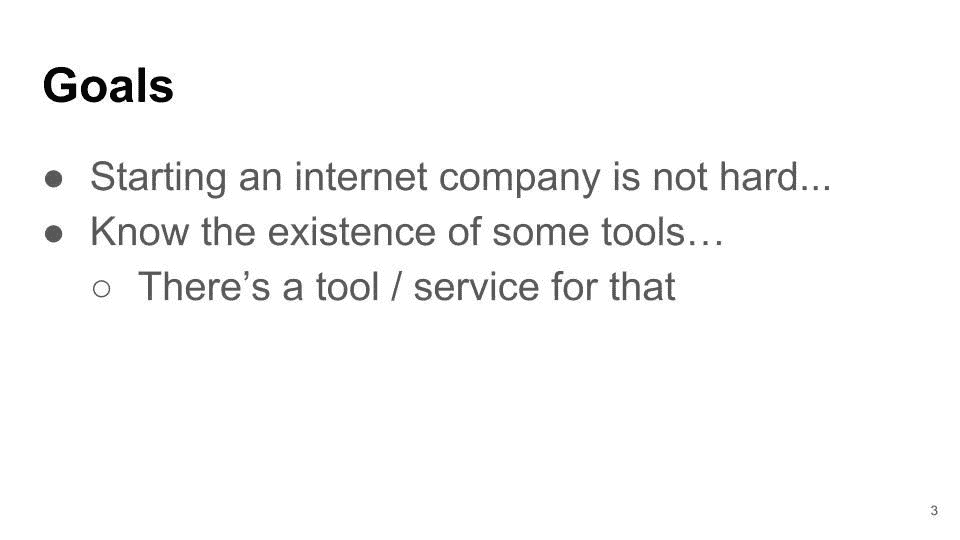

希望学完这一课，你会觉得创办一家互联网公司一点也不难。您还将了解一些可以在未来项目中使用的工具和服务。

你会经常听到我说“有一个工具”。这就是我所说的“足够好的工程”现在是 2019 年。你不太可能是第一个遇到全新问题的人。一定有工具和服务可以帮助你解决问题——通常是免费的！

在我们深入研究之前，让我简单介绍一下听力笔记。

听笔记是一个播客搜索引擎网站。你输入一个关键词，搜索整个互联网的播客。和谷歌一样简单:)但是简单不代表容易。我们还在核心搜索引擎的基础上构建了许多工具来帮助人们发现和享受播客。

[https://www.listennotes.com/](https://www.listennotes.com/)

让我们退一步来谈谈播客。播客是一种媒体格式。有人称之为“点播广播”我们每天消费大量的媒体内容。我们看 YouTube 视频，看电视，看书，听音乐，听播客。我们消费媒体内容是因为我们想要获取信息、获取知识和娱乐。如今，你可以通过听播客来学习任何话题。你可以在眼睛和手忙的时候听播客(比如开车、健身、散步、做家务……)。

在 2017 年初，我发现自己从播客中消费的信息比从其他媒体格式(例如，电视、书籍……)中消费的信息更多。我需要一个播客搜索引擎，我可以用它来搜索和寻找单个剧集来尽情聆听。事后看来，播客搜索引擎应该是一个非常简单的存在。但是我找不到好的。所以我花了不到一周的时间构建了一个 Listen Notes 的原型，这个播客搜索引擎诞生于我自己的愿望和需要。

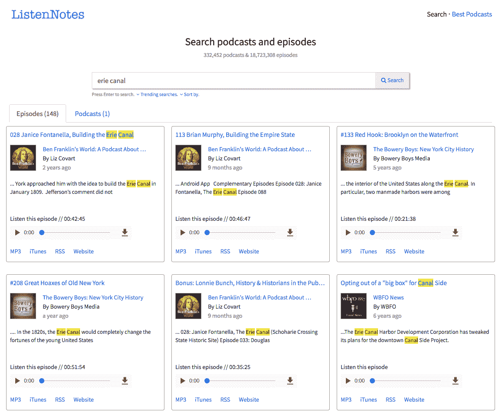

Very first version of Listen Notes. Credits: [Lifehacker](https://lifehacker.com/the-best-podcast-search-engine-1818560337)

我推出了原型，自己也用了很多。但是我在大约九个月的时间里没有接触过代码，直到我离开我第一个失败的创业公司后，我决定全职研究它。那是 2017 年 9 月。切到 1.5 年后，我还在享受做听力笔记的乐趣:)

你需要知道哪里可以找到办公室吗？是的，有这样的服务。我用 [WeWork](https://refer.wework.com/i/WenbinFang) 。我在旧金山的 [WeWork](https://refer.wework.com/i/WenbinFang) 里有一间小办公室。办公室并不便宜，但我认为这是提高生产力的好投资。

我可以选择花钱让自己的工作效率提高 200%，或者花钱多雇一名员工。我可以选择省钱多浪费时间，也可以选择省时间多赚钱。如果你是我，你会怎么选择？

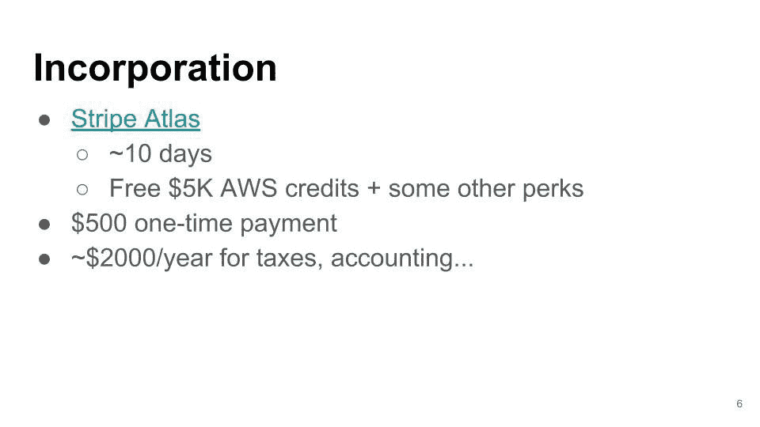

通过开始互联网业务，我们需要有一个正式的公司，一个法律实体。有这种服务。

我用 [Stripe Atlas](https://atlas.stripe.com/invite/wxg9m9er) 合并了 Listen Notes，Inc .我花了 500 美元，不到 10 天就得到一家特拉华 C 公司。Stripe Atlas 提供了一些不错的额外津贴，例如 5000 美元的 AWS(亚马逊网络服务)积分。但是为了维持公司的运转，我必须每年支付大约 2000 美元的税收、会计和其他费用。这让你对经营一家公司的最低成本有了一个基本的概念。

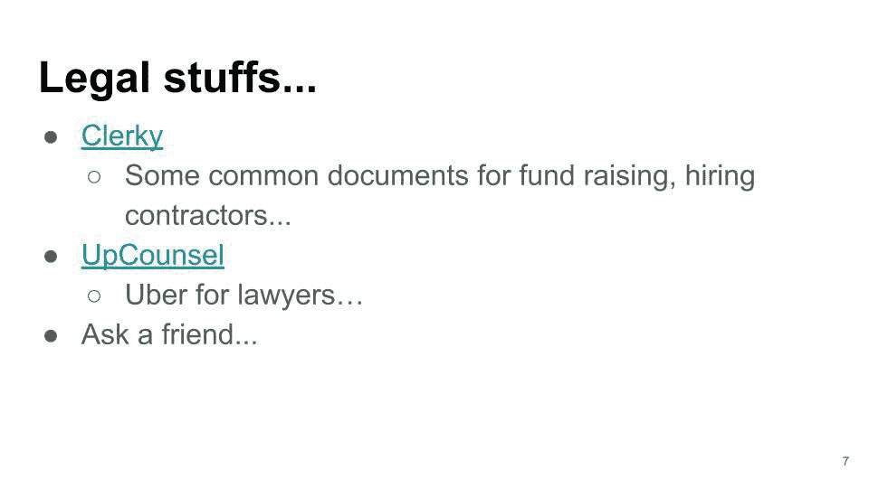

因为我们现在是一家公司，我们必须处理一些法律事务。有这种服务。

你可以使用 [Clerky](https://www.clerky.com/) 生成法律文件，或者使用[upadvise](https://www.upcounsel.com/rf/CvryzEze)找律师。两种服务我都用过。它们并不完美，但它们值这些钱。你不能指望用麦当劳的价格得到丽思卡尔顿级别的服务，对吗？如果你想快乐，你最好设定正确的期望值。

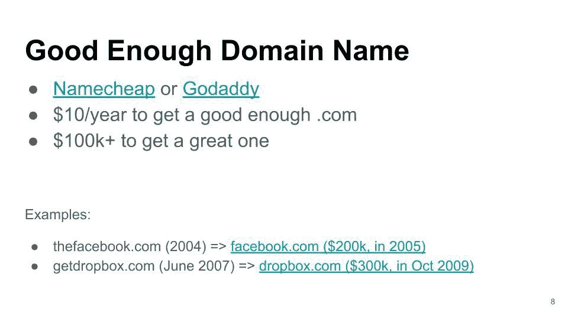

要开始，你只需要一个足够好的域名——10 美元/年。com 域。你可以随时购买一个伟大的域名。

例如，Dropbox 在用 30 万美元买下 dropbox.com 之前用了 getdropbox.com 2 年多。我是如何发现这种琐事的？我听播客！有一个对德鲁·休斯顿(Dropbox 联合创始人&首席执行官)的播客采访，他谈到了他们如何保护 dropbox.com 域名。

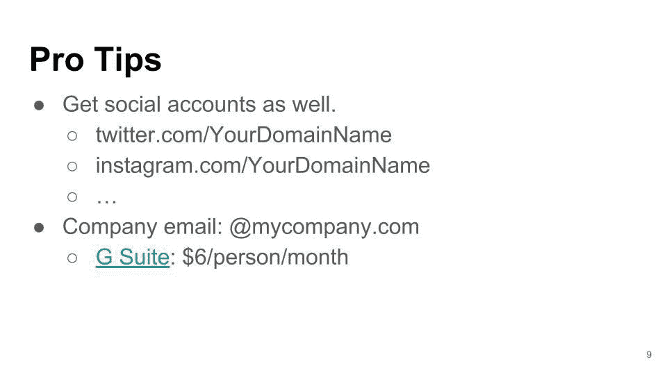

在你得到一个域名后，确保你也在社交网站上创建了一堆公司账户，比如 Twitter、脸书、Instagram 和(也许)Snapchat。

而且大部分公司只是用 [G Suite](https://gsuite.google.com/) 做公司邮箱，基本上就是 Gmail。

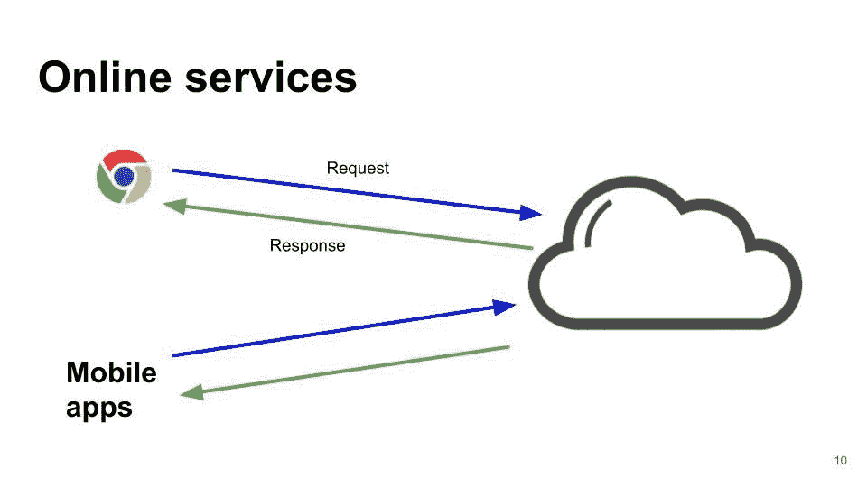

互联网公司建立在线服务。今天的大多数软件都是在线服务。如果不能上网，手机上的大部分 app 都无法使用。

在线服务通常遵循客户机/服务器模型。客户端软件向服务器端发送请求，并获得响应以呈现 UI 或执行某些任务。

显然，所有网站都是在线服务。我们使用网络浏览器访问网站。在某种程度上，移动应用是专门的浏览器。

在服务器端，我们运行服务器。您只需要足够好的服务器就可以开始了。我说的“服务器”指的是 VPS(虚拟专用服务器)，它基本上提供对 IP 地址的根访问。一旦你通过 ssh 进入一个 IP 地址(VPS)，你就可以做任何你想做的事情，例如，安装软件&把你的代码放在那里。你现在开始营业了。

对于副总裁，我建议在开始时使用简单的东西，例如 [DigitalOcean](https://m.do.co/c/2288c0b7e091) 或 [AWS Lightsail](https://aws.amazon.com/lightsail/) 。在 Listen Notes，我们使用[数字海洋](https://m.do.co/c/2288c0b7e091)大约一年，因为它便宜&容易设置，然后当我们的网站获得更多流量，我们需要更灵活的&“生产”式设置时，我们切换到 AWS EC2。

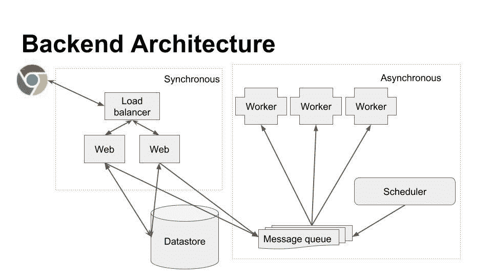

这种后端架构在运行在线服务时非常常见。

客户端(例如，浏览器)发送请求。负载平衡器将请求平均分配给 web 服务器。我们通常运行许多 web 服务器，服务器端代码在这些服务器上运行(例如 Rails、Django……)。我们需要一个数据存储来存储我们的数据。Web 服务器与数据存储进行交互，以读取和写入数据。

在左手边，是同步处理。这里有一个请求，web 服务器处理它并立即返回一个响应。它是同步的。

我们还需要异步处理来处理非紧急、长时间运行或计算密集型的任务。我们不想在 web 服务器上为这样的任务消耗计算资源。因此，我们通常会将此类任务交给员工来处理。Web 服务器将消息放在消息队列中，工作人员拾取消息来处理任务。

例如，我们为听力笔记上的搜索结果生成这种图像([示例](https://lnns.co/uzSXWqJbg9Y)):

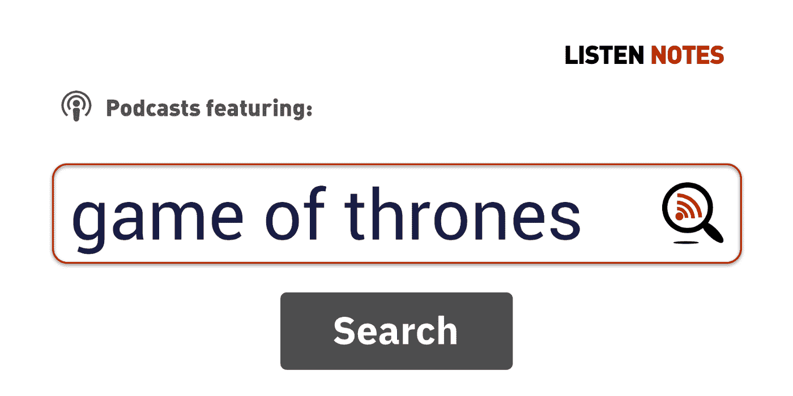

这种类型图像生成任务是一种计算密集型任务，并不紧急。所以我们把它卸载给员工来处理，而不是在网络服务器上处理。

最后，对于基于时间的调度作业，必须有一个调度程序。许多公司只是在 Linux 上使用 cron jobs，当他们变得更大时，他们会转向其他东西(例如，[几年前我为我的前雇主 Nextdoor 建立了一个调度系统，以取代 cron jobs](https://engblog.nextdoor.com/we-don-t-run-cron-jobs-at-nextdoor-6f7f9cc62040) )。对于监听笔记，我们有很多基于时间的调度工作，例如，发送[监听警报](https://www.listennotes.com/alerts/)。

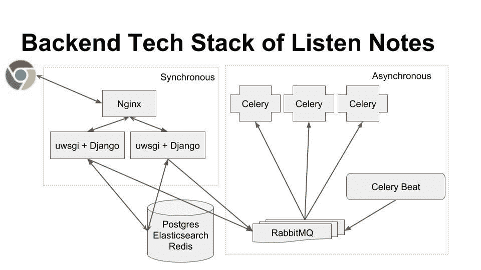

我们使用 Nginx 作为简单的负载平衡器。后端代码大部分是 Python/Django。我们使用不同的数据存储用于不同的目的。我们使用 Postgres 作为主数据存储，这是我们唯一的真实来源。我们是搜索引擎，所以用 Elasticsearch。我们使用 Redis 做很多事情，但主要是为了缓存&实现一些“快速”特性，比如[实时监听](https://www.listennotes.com/realtime/)。

在异步处理土地上，我们使用[芹菜](http://www.celeryproject.org/)、[芹菜打](http://docs.celeryproject.org/en/latest/userguide/periodic-tasks.html)、 [RabbitMQ](https://www.rabbitmq.com/) 。

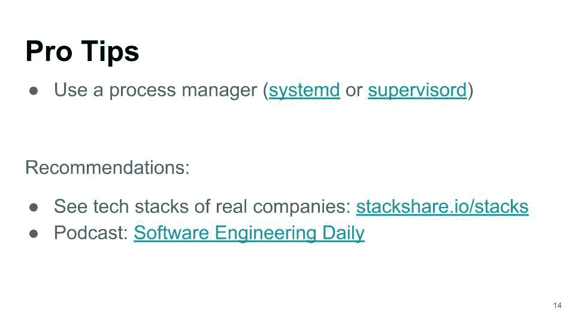

我们必须保持服务器端进程全天候运行。如果进程崩溃，我们最好使用某种进程管理器来自动重启进程。我们在听课笔记中大量使用[主管](http://supervisord.org/)。

这里有两个建议:

*   在 [stackshare.io](https://stackshare.io/stacks/trending) 上了解真实公司的技术堆栈
*   听[软件工程日报](https://www.listennotes.com/podcasts/software-engineering-daily-software-Gw1zYJbjPF-/)。他们面试真实公司的工程师，所以你可以了解公司是如何做工程的。

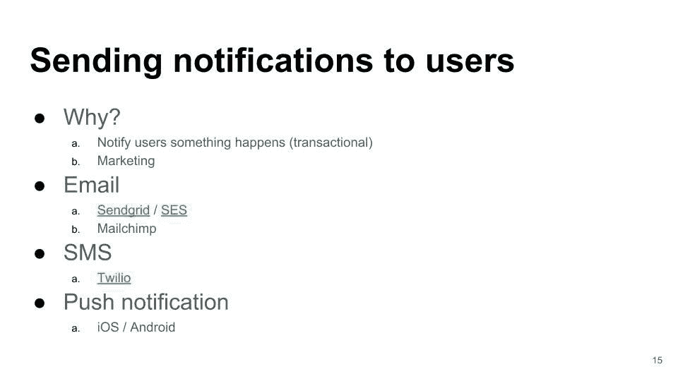

作为最终用户，我们通过电子邮件、短信和推送通知从在线服务获得大量通知。当优步司机靠近时，我们会收到推送通知。当我们在亚马逊购物时，我们会收到电子邮件通知(通常带有收据)。当我们的银行账户出现问题时，我们会收到短信通知。

让我们扭转局面。当我们构建在线服务时，我们如何向用户发送通知？每个通知通道都有一个服务或 API，例如，电子邮件的 [SendGrid](https://sendgrid.com/) 或 [Amazon SES](https://aws.amazon.com/ses/) ，短信的 [Twilio](https://www.twilio.com/)

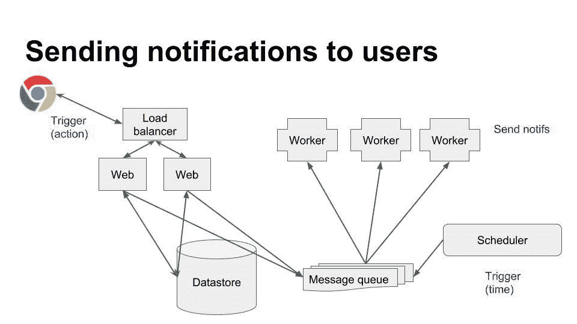

接下来，我们需要某种触发器来启动通知。

一种类型的触发器来自用户操作。例如，用户可以邀请人们在[稍后收听](http://listennotes.com/listen)上对同一个播放列表做出贡献。当他或她单击邀请按钮时，就会触发一个电子邮件通知，发送给潜在的贡献者。因此，web 服务器将一条消息放在消息队列中，其中一个工作人员获取该消息并在稍后发送邀请电子邮件。

另一种类型的触发来自基于时间的日程安排，例如，每天早上 7 点向这 500 个人发送电子邮件。

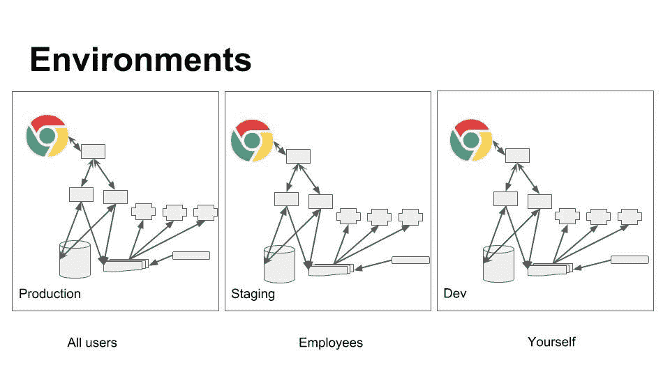

体系结构图中的每个块代表操作系统上的一个或多个进程。我们可以在一台或多台服务器上运行这些流程。

我们通常为不同的受众和不同的目的创建多套服务器。

每组服务器运行在单独的环境中。

生产环境中的服务器提供实时流量。受众是由真实用户组成的。

临时环境中的服务器主要用于测试。观众由公司的员工组成。在将整个产品发布到生产环境之前，我们需要登台环境来手动测试产品特性。

我们需要一个用于开发目的的开发环境，它通常由一个开发人员使用。

对于听课笔记，我们使用[流浪汉](https://www.vagrantup.com/) & [VirtualBox](https://www.virtualbox.org/) 建立一个虚拟机。我们在这个虚拟机中运行所有的东西。

由于 Listen Notes 的后端代码主要是用 Python/Django 编写的，所以我使用 PyCharm 来编写代码。我知道，不是 [VS Code](https://code.visualstudio.com/) 或者其他人用的什么很酷的文本编辑器。但是我使用 PyCharm 的效率是使用其他文本编辑器的 1000 倍——尽管我使用 Vim 年，使用 Emacs 年:)这就像有些人喜欢辛辣的食物，而有些人不喜欢。我们也不能怪不爱吃辣的人吧？不要卷入 ide、语言、技术的宗教战争…把事情做好更重要。

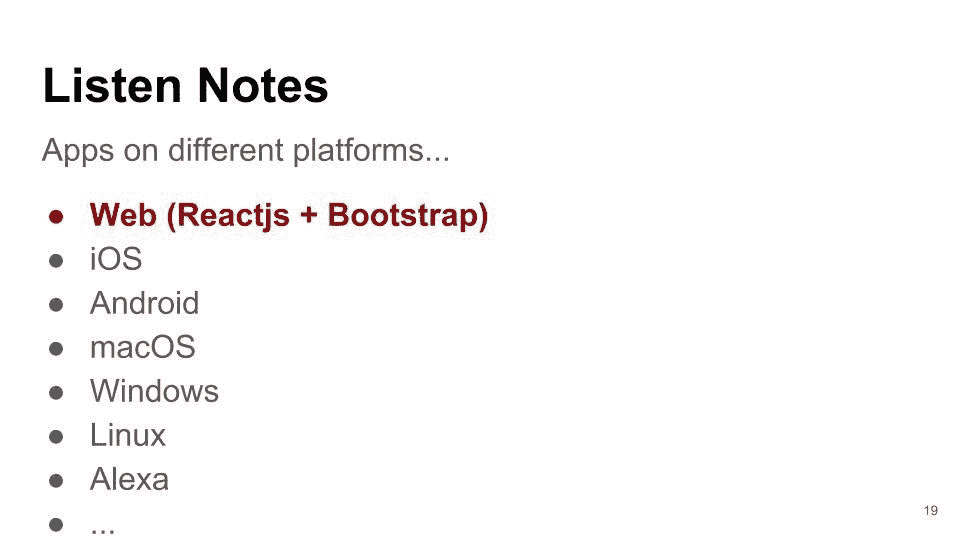

前端工程方面，我在这里分享的很少。听笔记只有一个网站。我们没有本地应用(除了[一个实验性的 Just Listen](https://www.listennotes.com/labs/) 应用)。

对于 web 前端，我使用传统的 Reactjs & [Bootstrap](https://getbootstrap.com/) 。现在很标准。

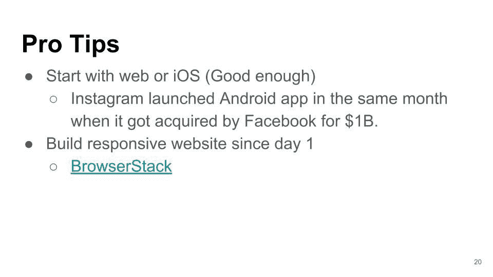

如果你刚刚开始你的项目，我建议你先关注一个单一的平台。不要过早跨平台。一开始我们的资源通常非常有限。看看 Instagram:当他们还是独立公司的时候，最初只有一个 iOS 应用。他们以 100 美元的价格被 1B 收购。

如果你正在建立一个网站，确保你从第一天起就做出响应。你可以很容易地使用现代浏览器的开发者工具来测试不同的屏幕尺寸(比如 Chrome 上的)。

您还想在多种操作系统和浏览器上进行测试。有一种服务可以做到这一点:使用 [BrowserStack](https://www.browserstack.com/) 。

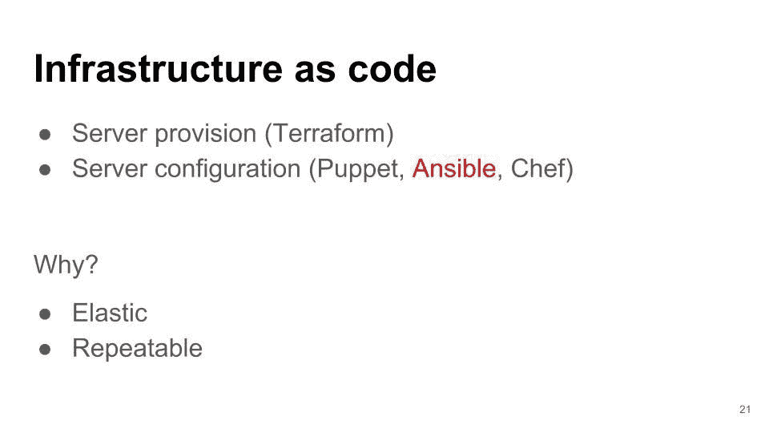

如果你有多台服务器，最好不要安装软件&手动配置。基础设施作为代码是当今互联网公司的常见做法。基本上，我们编纂了服务器的规范并自动化了服务器配置。

对于听力笔记，我们使用 [Ansible](https://docs.ansible.com/ansible/latest/index.html) 。我们需要写一堆 yml 配置文件来指定安装什么软件&把配置文件放在哪里。当我们在命令行中运行 ansible-playbook 时，它会自动为我们配置多个服务器。

如今，服务器是弹性的，甚至是短暂的，可以按需配置以适应必要的工作负载。服务器来来去去。你可以在白天运行更多的服务器，那时流量更大；在晚上流量较少的时候运行较少的服务器。作为代码的基础设施使这类事情变得容易。

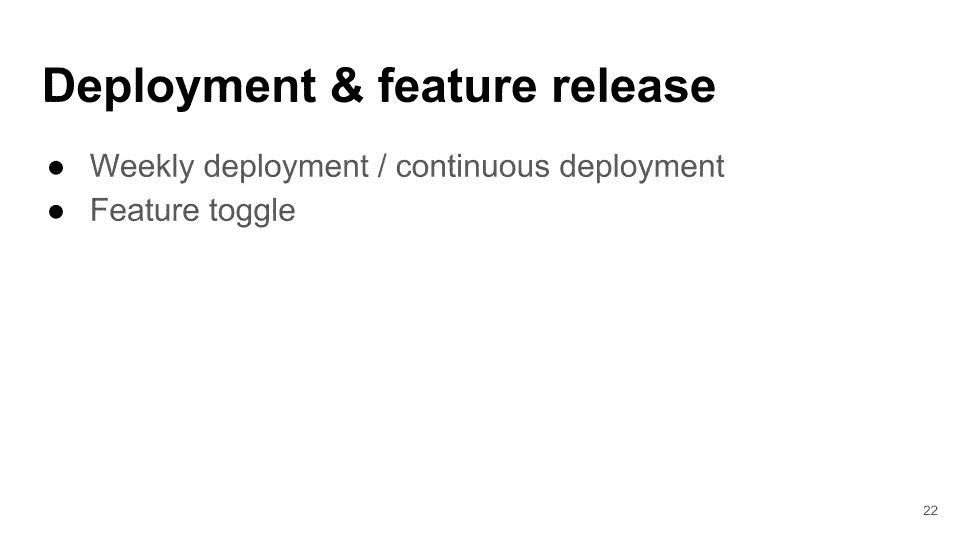

如今，互联网公司非常频繁地部署代码，至少每周一次，甚至一天多次。一些公司进行持续部署，每当有新的 git 提交时就发布代码。

对于 Listen Notes，我有一个快速脚本来部署代码，其中我可以指定部署环境、服务器类型和 git commit SHA 作为参数。因此，我可以按下按钮，将特定版本的代码(例如，HEAD 或任何 git 提交)部署到特定环境(例如，生产、试运行等)中的特定服务器(例如，web、API、worker 等)。

我们部署新代码，但不一定发布新功能。现在我们在代码中做[特性切换](https://martinfowler.com/articles/feature-toggles.html)，这基本上是一些 if-else 语句。我们可以在 if 语句后面隐藏新代码，并使用特性切换变量来控制是否执行新代码。我们通常将特性切换变量存储在某种数据存储中，例如 Redis。我们可以在这里玩得很开心。我们可以先向 10%的用户开放新功能，然后是 20%，50%，100%。

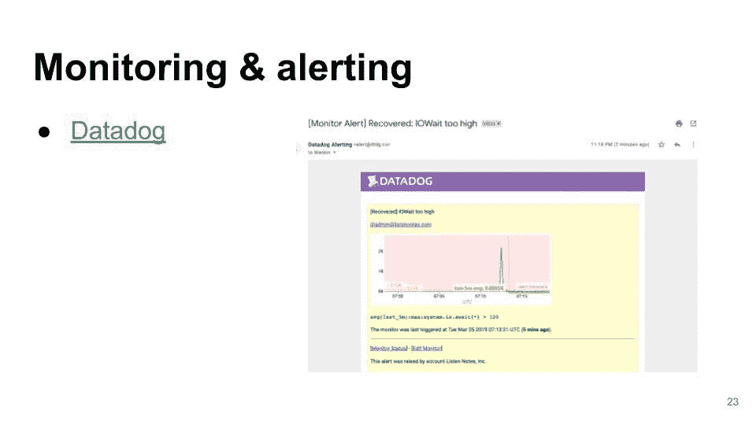

在线服务需要全天候运行。因此，拥有监控和警报工具非常重要。

这是有服务的！

很多公司都用 [Datadog](https://www.datadoghq.com/) 。我们也在听力笔记中使用 Datadog。我们可以轻松构建监控图表，为服务器和应用程序提供更好的可见性。我们还可以在某些指标异常时(例如，高于某个阈值)设置警报。

如果你想学习构建和运营在线服务的最佳实践，请阅读[十二要素应用](https://12factor.net/)。

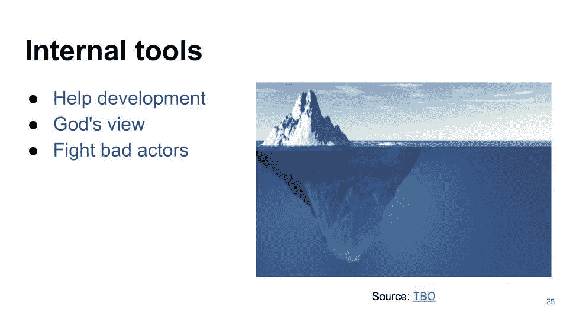

说到内部工具，我看到了这个冰山形象。内部工具就是像冰山一样潜伏在水下的一大块代码，外人是看不到的。

如果你以前从未运营过受欢迎的在线服务，你不会意识到你需要构建许多工具供内部使用(由你自己，由你的员工)。

不同的公司出于不同的目的构建不同的内部工具。到目前为止，我已经构建了一些内部工具来帮助开发(例如，预览电子邮件通知，而不实际发送电子邮件)，提供上帝的观点(例如，查看搜索查询，快速获取特定用户的信息…)，以及打击不良行为者(例如，内容审核，检测垃圾邮件…)。

所以到目前为止，我们知道如何用 500 美元创办一家公司，也知道如何用足够好的工程来建立一个在线服务。

利润！

哦，等等…

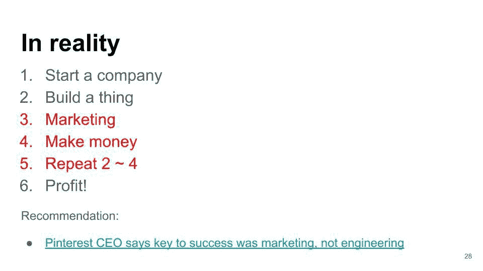

人们如何找到你做的东西？你是怎么赚钱的？

Pinterest 首席执行官称成功的关键是营销，而不是工程。嗯，确实如此。

工程是决定性的。营销和商业是不确定的。如果你想建立一个在线服务，你可以建立它。但是我们现在生活在一个嘈杂的世界。许多事情都在争夺我们的注意力。营销超级辛苦。

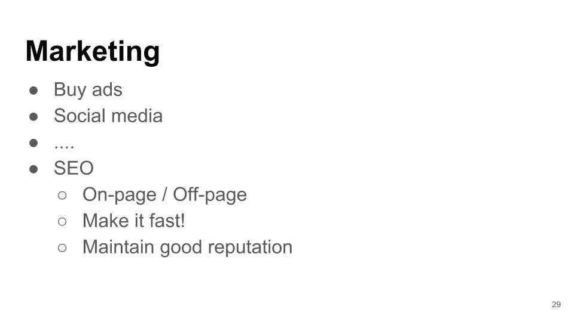

我不是营销专家。我自己也还在琢磨怎么做更好的营销…

你可以通过多种渠道来传达你的信息。全都试试。找到最有效的。那个加倍下注。这里有一个建议:[你可以用来吸引注意力的 19 个渠道](https://medium.com/@yegg/the-19-channels-you-can-use-to-get-traction-93c762d19339)

想做 SEO，可以在网上找一些好的教程。但是一般来说，你想让你的网站越快越好。如今谷歌更喜欢快捷网站。

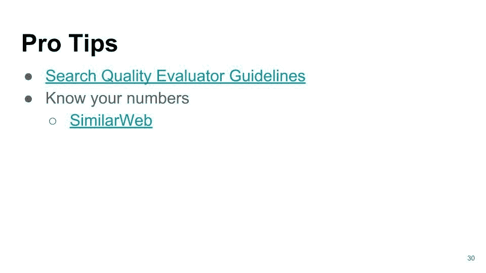

最好的 SEO 文档是来自 Google 本身的[。](https://static.googleusercontent.com/media/guidelines.raterhub.com/en//searchqualityevaluatorguidelines.pdf)

如果你对一个网站的流量感兴趣，就使用 SimilarWeb 的 chrome 扩展。数字不是 100%准确，应该在同一个数量级:)

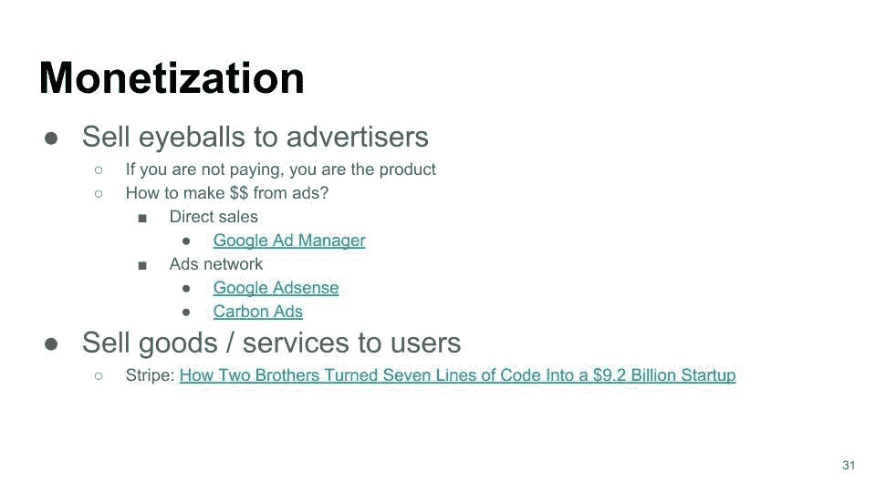

一个互联网公司是靠卖眼球给广告商或者直接卖商品/服务给用户来赚钱的。

在听笔记时，我们两者都做。我们结合[碳广告](https://www.carbonads.net/) &直销(通过[谷歌广告经理](https://admanager.google.com/home/)管理)来投放广告。我们也向开发者出售 API。

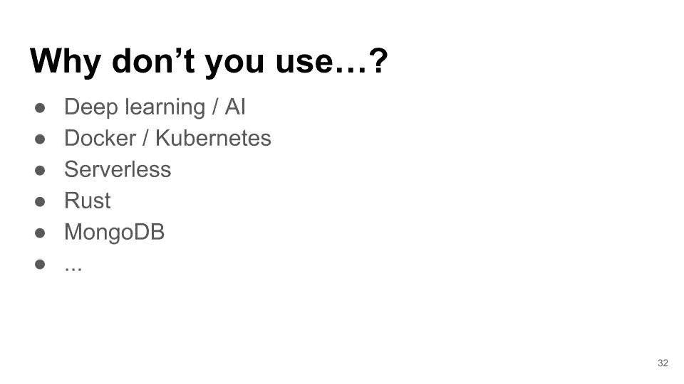

你可能会问我为什么不使用 XYZ 技术。嗯，我是个务实的人。我们的目标是把事情做好，而不是为了做技术而做技术。

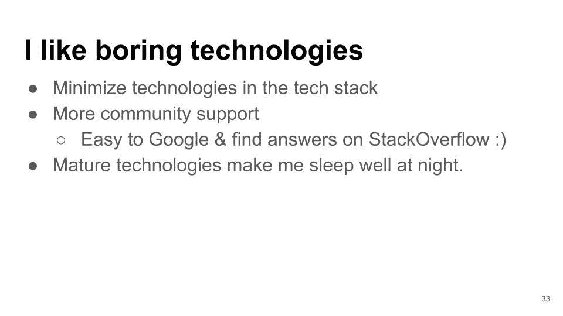

特别是，我更喜欢枯燥的技术，这些技术通常已经存在了很多年，甚至几十年。查看[这篇关于 Listen Notes 技术栈](https://broadcast.listennotes.com/the-boring-technology-behind-listen-notes-56697c2e347b)的博文。

现在的软件工程大多是 Google 和 StackOverflow 驱动的:)如果你需要帮助，你可以从 Google & StackOverflow 找到更多关于老&成熟技术的信息——但是就像我们生活中的很多事情一样，这并不总是对的。

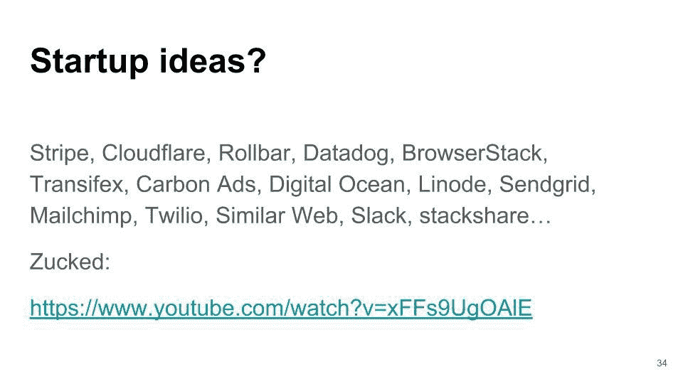

我需要告诉你一个坏消息:现在你不可能想出一个 100%原创的创业点子。如果你认为你的想法是独特的和原创的，那么更有可能的是你没有读足够多的书或者没有听足够多的播客:)

当我提到“有这样的工具/服务”时，它本身就是一个创业公司。你可以借用他们的想法，并建立一个更好的版本。或者你可以从不同的角度解决类似的问题。

哦，这里有一个关于 2005 年 https://www.youtube.com/watch?v=xFFs9UgOAlE 脸书科技的视频

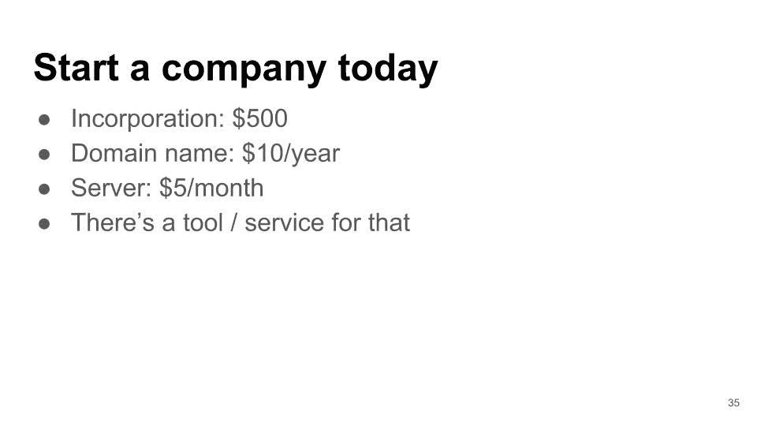

好吧。今天就可以开公司了！

*百分之八十的成功来自于出现*

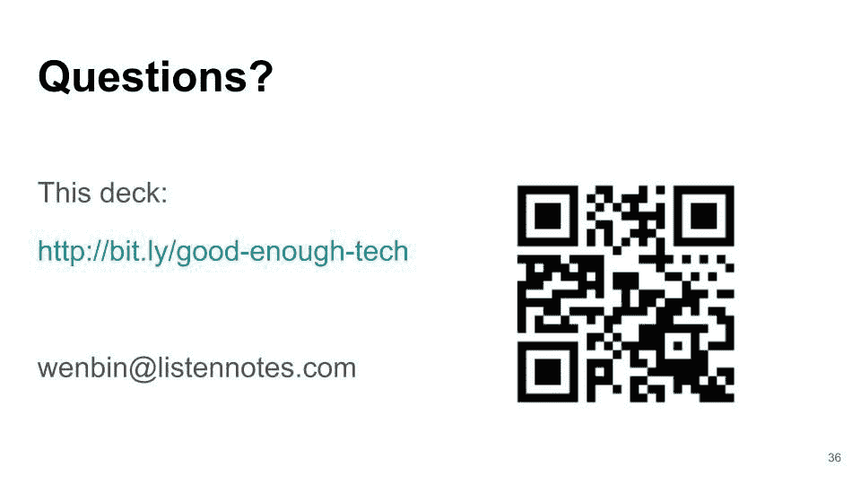

你可以在这里找到这张牌:[http://bit.ly/good-enough-tech](http://bit.ly/good-enough-tech)

你也可以通过邮件和我异步交流:)

* * *

如果你喜欢播客，试试[听课笔记](https://www.listennotes.com/)。

如果你想建立一个播客应用，试试 [Listen API](https://www.listennotes.com/api/) 。