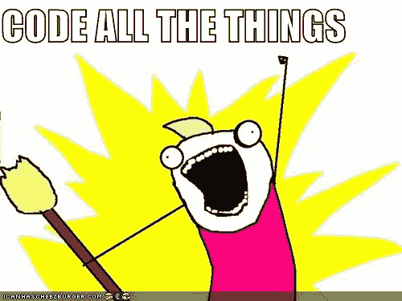

# 作为一个有抱负的/初级开发人员应该有的好习惯——以及应该避免的习惯

> 原文：<https://www.freecodecamp.org/news/good-habits-to-have-as-an-aspiring-junior-developer-and-those-to-avoid/>

当你学习编码时，很容易养成一些不好的习惯。这里有一些避免常见坏习惯的建议，以及要记住的好习惯。

## 好习惯

让我们从积极的方面开始，好吗？当与初级开发人员(以及所有开发人员)一起工作时，这些是经常给我留下深刻印象的最佳习惯。

## 经常提交/推送代码

在您的编码之旅中，您可能会遇到“Git”、“GitHub”、“源代码控制”等术语。如果您还没有:

1)你去哪里了？！？

2)可以在这里了解:[https://www . freecodecamp . org/news/how-You-can-learn-git-and-github-while-You-learning-to-code-7a 592 ea 287 ba/](https://www.freecodecamp.org/news/how-you-can-learn-git-and-github-while-youre-learning-to-code-7a592ea287ba/)

源代码控制是一件奇妙的事情。它是您代码的备份，允许您跟踪更改，并让您在遇到“哦，天哪！什么都坏了！”编码时的瞬间。

更不用说，作为团队的一员，这让生活变得更加轻松。我无法想象没有 it 的协作代码——通过电子邮件和 slack 共享代码？！* **颤抖** *。

一个好习惯是**经常提交代码，**即使是为了你自己的副业项目作为练习。就我个人而言，当我完成了项目的一小部分时，我喜欢“**签入**我的代码。例如，如果我正在创建一个待办事项列表应用程序，当我添加了“*新待办事项按钮”*，或者当我完成了“*复选框功能”时，我会提交并推送我的代码。*

对于*何时*检入代码，没有硬性规定。提交代码的其他好时机是:

*   如果你即将结束一天的工作(见下面一条非常重要的规则)
*   在进行重大重构或代码更改之前
*   如果大楼发生火灾(开玩笑，安全第一)

提交代码时，只有一条重要的规则要遵循。

> 代码必须成功构建，测试必须通过

这算不算两条规则？不管怎样，这很重要。一些肯定会让任何开发团队停下来的事情就是代码损坏。因此，在提交代码之前，请确保代码构建成功并且测试通过！

最后，确保使用**良好的提交消息**。“修复的错误”不如“修复了‘保存待办事项’按钮不能正确调用 onClick 函数的问题”清楚。这不仅对你自己有帮助，对你的队友也有帮助。

## 对变量、函数和文件使用清晰的命名

啊命名。在 web 开发中，我们都认为很容易的一件事，有时却非常困难。命名很重要，因为它使我们的代码更容易阅读和理解。

当你为你的变量、函数和文件选择一个名字的时候，试着使它尽可能的具有描述性。为什么？

*   它使快速浏览代码变得容易。如果您看到一个名为`getUsers()`的方法，而不必查看该方法，您可以非常确定它将返回一个用户列表。
*   帮助实施**关注点分离。哦，一个奇特的新名词！不要担心，这只是意味着把相关的东西放在一起。例如，在 Node.js 应用程序中，如果您有一个`/users`端点和一个`/products`端点，您可能会将`users`逻辑保存在同一个文件中(例如`usersService.js`，而将`products`逻辑保存在另一个文件中)。这样不是更容易找到东西吗？**

这里有一个简单的函数，它的名字很糟糕(参数名也是如此)，你能猜到它是做什么的吗？

```
 const function1 = (x, y) => {
    return x + y
} 
```

这个函数既可以**将 2 个数字**相加，也可以**将 2 个字符串**连接起来，但是它的初衷并不清楚。假设它的意图是添加数字，但是另一个不知情的开发人员出现了，用它来连接两个字符串。现在可能没问题，但是以后如果我们重构这个函数来*验证数字，*那么调用这个函数来连接字符串的代码将会中断。哦不！

下面是命名更好的函数:

```
 const addNumbers = (num1, num2) => {
    return num1 + num2
} 
```

现在，函数的功能和参数变得更加清晰了。

## 练习调试

你相信 web 开发人员花同样多的时间(如果不是更多的话)来修复 bug 吗？是的，会有 bug。识别和修复 bug 的最好方法是**调试代码。**调试是一行一行地“单步调试”您的代码，直到您发现一些意想不到的东西。

幸运的是，对于我们这些 web 开发人员来说，许多 IDE 都有内置的调试器，这使得调试变得非常容易(这里有一个 VS 代码指南，可以为不同的语言设置调试。对于其他 IDE，你可以查看谷歌[https://code.visualstudio.com/docs/editor/debugging](https://code.visualstudio.com/docs/editor/debugging)

那么，如何有效地调试代码呢？这里有一些提示:

*   **重现问题**——重现错误几次，这样你就能准确理解是什么导致了错误
*   **思考**——在你深入代码并开始漫无目的地四处搜寻之前，停下来思考一下。为什么会发生这种事？代码的哪个部分与此相关？
*   **调查代码**——一旦你知道这可能会影响代码的哪些部分，就开始深入研究。阅读完代码后，您可能会发现问题。万岁！如果没有，是时候让调试器退出了。
*   **调试**——启动调试器，逐行检查代码。留意变量值(以及它们如何变化)以及哪些函数被调用(哪些不被调用)。正在调用的是`if`语句中的正确分支吗？事件是否被正确触发？计算是否正确执行？

## 编码前计划

你刚刚从一夜好眠中醒来。你正在吃早餐，突然你想到了一个很棒的新项目点子。这是一个多么奇妙的想法啊！一个启示！



你从椅子上冲向你的笔记本电脑，玉米片飞得到处都是，然后开始疯狂地编码。(还是只有我这样？好的，快速前进...)

虽然直接进入 IDE 并开始编码通常很有诱惑力，但是一点点计划可能会大有帮助。

*   减少“浪费”的代码量
*   减少代码更改
*   给你坚定的目标去努力
*   对于初级开发人员来说，这是一项令人印象深刻的技能——它显示了您的批判性思维！

我不会在这里做太多的详细介绍，因为我已经在这里写了一篇关于这个主题的更全面的文章: **[开发者如何思考:一个简单 Web 应用背后的规划和设计的演练](https://www.freecodecamp.org/news/a-walk-through-the-developer-thought-process/)**

下面是对上述文章的一个快速总结:

*   "**它是做什么的？**——写出你希望你的应用程序拥有的特性
*   "**它看起来像什么？**-用你的应用程序的样子画一个草图或线框
*   "**我如何定位和样式化元素？**——一旦你有了自己的线框图，开始考虑如何在页面上放置所有的东西
*   "**它是如何表现的？**——接下来，开始思考你的应用程序的行为。思考这些功能，以及当用户点击和操作时会发生什么
*   我的代码会是什么样子？——记住你的行为和特性，开始计划你的代码。你需要什么组件？你需要事件处理程序吗？状态对象？
*   "**我需要测试什么？什么会出错呢？**——考虑测试、边缘情况和代码中可能出错的部分

## 不太好的习惯

现在让我们来看看一些容易养成的不太好的习惯。如果你现在做了这些，不要惊慌。我们在某些时候都会这样！通过一些练习，你可以克服它们——我会给你一些如何做到这一点的建议。

## 盲目复制粘贴代码

如果你在编码的时候遇到了问题或者卡住了，请举手？* ***扬起手*。*** 很明显，我们在编码的时候总是会遇到问题。这是游戏的一部分，我们的工作就是找出如何克服这些问题。

大多数时候，我们求助于使用 Google、StackOverflow 或类似工具来寻找问题的答案。现在，这种方法没有任何问题——可以说，它应该得到鼓励，因为这是开发人员自己解决问题的最好/最快的方法之一。

问题是，当我们盲目地复制/粘贴代码而不理解它的时候。

> 但如果成功了，又有什么问题？！

有效的观点。以下是这可能导致问题的原因:

*   当代码必须改变时会发生什么？很难修改我们不理解的代码
*   如果我们不理解代码，我们怎么能确定它真的解决了问题？
*   我们能确定它不会对代码库的其他部分产生负面影响吗？

那么，如何才能避免这种情况呢？

*   **阅读**——逐行通读，花时间理解代码
*   **Type -** 打出来而不是复制粘贴。这将迫使你在打字时能够阅读/分析每一行

复制和粘贴没有错，只要我们确切地理解代码是做什么的。如果一个高级开发人员正在审查我们的工作，而我们无法解释发生了什么，因为代码是复制/粘贴的，这看起来不会太好。

## 不写测试

这可以说是学习编码时养成的最糟糕的习惯。很多教程带我们走过创建一个应用程序的“**快乐之路**”，这很容易忽视测试编写。为什么考试如此重要？

*   **测试证明你的代码有效**。如果测试通过，没有人会质疑功能的工作！
*   **便于检查新功能是否破坏了任何东西**。编码时，定期运行测试。几个测试破了？**你在开发过程的早期就知道哪里出错了。**相反，当你偶然发现它的时候，明天就知道了
*   **重构的安全带。写你的代码。编写您的测试。重构您的代码。进行测试。测试通过？一切还在运转，快乐的日子！现在，尝试在没有运行一系列测试的情况下更改您的代码。你如何证明 ***一切*** 都正常工作？**

所以一定要测试你的代码。你不必一直测试像小项目这样的东西，但是现在再练习一次是很好的。当你得到一份工作时，你的目标是对你的大部分功能和特性进行测试。练习那些测试！

关于如何测试你的代码，有很多很棒的教程，根据你当前的项目和技术水平，试试谷歌“用{insert language}测试”或“如何测试{insert language}应用”。这里有一个测试 JavaScript 的很好的概述。

## 省略文档

文档。所有项目都附带的令人厌烦的“繁文缛节”。正如有人曾经说过的:

> 所有的开发人员都讨厌写它，但是所有的开发人员都想要它

这是真的。你有没有回到一个老的副业项目，却忘了它做了什么？如果您试图使用第三方库，并且没有文档来解释它是如何工作的，这会有多困难？在大型产品公司工作时，这一点变得尤为明显。如果另一个团队需要集成您的代码，但是不确定 API，该怎么办？

这是很重要的东西，所以这里有一些练习的技巧:

*   GitHub 允许你在你的项目中添加一个自述文件。这是存储项目文档的最佳位置，因为很容易找到
*   包括应用程序做什么以及如何运行——这给读者一个好的开始
*   解释其他“重要的东西”——比如复杂的逻辑、第三方库和 API，或者配置设置

* * *

### **感谢阅读！想要更多这样的文章？**

希望这已经给了你创造良好编码习惯的洞察力。如果你想在我发布更多这样的文章时得到更新，请随时加入邮件列表，地址是 [chrisblakely.dev](https://www.chrisblakely.dev/#sign-up) ！如果你想聊天，也可以通过[推特](https://twitter.com/chrisblakely01)联系我:)