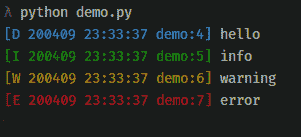

# 如何用 Logzero 练习 Python 中的日志记录

> 原文：<https://www.freecodecamp.org/news/good-logging-practice-in-python-with-logzero/>

Logzero 是由 [Chris Hager](https://twitter.com/metachris) 创建的 Python 包，它简化了 Python 2 和 3 的日志记录。Logzero 作为打印语句更容易显示信息和调试细节。

如果你想知道**什么是日志记录**，我推荐你阅读我之前写的关于[“如何用 Python 日志记录模块运行机器学习实验”](https://medium.com/analytics-vidhya/how-to-run-machine-learning-experiments-with-python-logging-module-9030fbee120e)的文章，尤其是前 3 节。

在那篇文章中，您将了解到:

*   什么是日志记录？
*   为什么日志记录很重要。
*   测井在不同技术行业中的应用。

Logzero 具有不同的特性，使得它更易于在 Python 项目中使用。这些功能包括:

*   轻松记录到控制台和/或文件。
*   提供完全配置的标准 Python logger 对象。
*   漂亮的格式，包括控制台中特定级别的颜色。
*   适用于各种字符编码和特殊字符。
*   兼容 Python 2 和 3。
*   不再依赖 Python。

## 装置

要安装带有 pip 的 logzero，请运行以下命令:

```
pip install -U logzero
```

你也可以从公共 [Github repo](https://github.com/metachris/logzero) 安装 logzero:

```
git clone https://github.com/metachris/logzero.git
cd logzero
python setup.py install
```

## 基本示例

我们将从一个基本的例子开始。在 python 文件中，我们将从 logzero 导入日志记录器，并尝试 4 种不同的日志记录级别示例。

```
#import logger from logzero
from logzero import logger

logger.debug("hello")
logger.info("info")
logger.warning("warning")
logger.error("error")
```

输出是彩色的，所以很容易阅读。



logzero output

如你所见，每一关都有自己的颜色。这意味着您可以通过检查颜色轻松识别级别。

## 将日志写入文件

大多数时候 Python 用户倾向于在文件中写日志。系统运行时，您可以将日志保存在文件中，并查看它们以进行错误检查和维护。您还可以设置一个文件来保存 legzero 中的所有日志条目。

我们将从 logezero 导入日志记录器和日志文件。logfile 方法将帮助我们配置日志文件来保存我们的日志条目。

现在，您的日志条目将被记录到名为 my_logfile.log 的文件中。

```
#import logger and logfile
from logzero import logger, logfile

#set logfile path
logfile('my_logfile.log')

# Log messages
logger.info("This log message saved in the log file")
```

my_logfile.log 中的输出包含日志级别标签(对于标记为“I”的信息级别)、日期、时间、python 文件名、行号和消息本身。

```
[I 200409 23:49:59 demo:8] This log message saved in the log file
```

## 旋转日志文件

您不需要一个单独的日志文件来保存所有的日志条目。这导致系统打开和关闭大量日志文件。

您可以使用 **maxBytes** 和 **backupCount** 参数来允许文件以预定的大小翻转。当大小即将超出时，文件将被关闭，并自动打开一个新文件进行输出。每当当前日志文件的长度接近 maxBytes 时，就会发生翻转。如果 maxBytes 或 backupCount 为零，则永远不会发生翻转。

在下面的例子中，我们将 maxBytes 设置为 **1000000 字节(1 MB)。**这意味着当文件大小超过 1MB 时，文件将被关闭，并打开一个新文件来保存日志条目。要保留的备份数量设置为 3。

```
# Set a rotating logfile
logzero.logfile("my_logfile.log", maxBytes=1000000, backupCount=3)
```

## 设置最低日志记录级别


[Photo by Son Nguyen Kim](https://www.toptal.com/resume/son-nguyen-kim?__hstc=753710.17be834d28ba29055621f0833fc6733b.1582400164835.1582400164835.1582400164835.1&__hssc=753710.1.1582400164836&__hsfp=3618320745)

日志级别是指设置给定日志消息的重要性级别。您还可以通过使用 logfile 方法中的 log level 参数为文件处理程序设置不同的日志级别。

在下面的例子中，我们将 loglevel 设置为`warning`。这意味着低于**警告级别**的所有日志条目将不会保存到日志文件中。

```
#import logzero package
from logzero import logger, logfile
import logging

# You can also set a different loglevel for the file handler
logfile("my_logfile.log", loglevel=logging.WARNING)

# Log messages
logger.info("This log message saved in the log file")
logger.warning("This log message saved in the log file")
```

## 设置自定义格式化程序

如何格式化日志记录由您决定。有不同的方法可以格式化你的日志记录。您可以在格式中包含日期、时间和日志记录级别，这样您就可以知道日志是何时发送的以及在什么级别发送的。

以下示例显示了如何配置日志记录的格式。

```
#import logzero package
import logzero
from logzero import logger, logfile
import logging

#set file path
logfile("my_logfile.log")

# Set a custom formatter
my_formatter = logging.Formatter('%(filename)s - %(asctime)s - %(levelname)s: %(message)s');
logzero.formatter(my_formatter)

# Log messages
logger.info("This log message saved in the log file")
logger.warning("This log message saved in the log file")
```

在上面的例子中，我们已经配置了日志格式，包括*文件名、日期、时间、日志级别名称、*和*消息。*

这是 my_logfile.log 中的输出:

```
demo.py - 2020–04–10 00:51:44,706 - INFO: This log message saved in the log file
demo.py - 2020–04–10 00:51:44,707 - WARNING: This log message saved in the log file
```

## 自定义记录器实例

除了使用默认的记录器，您还可以使用 **logzero.setup_logger(..)**。您可以使用不同的参数来配置并返回一个完全配置好的日志记录器实例，例如*名称、日志文件名称、格式化程序、最大字节数、备份计数、*和*日志记录级别。*

这是一个如何使用自定义记录器实例设置日志记录的工作示例:

```
import logzero package
from logzero import logger, logfile, setup_logger
import logging

# Set a custom formatter
my_formatter = logging.Formatter('%(filename)s - %(asctime)s - %(levelname)s: %(message)s');

#create custom logger instance
custom_logger = setup_logger(
 name="My Custom Logger",
 logfile="my_logfile.log",
 formatter=my_formatter,
 maxBytes=1000000,
 backupCount=3,level=logging.INFO)

# Log messages
custom_logger.info("This log message saved in the log file")
custom_logger.warning("This log message saved in the log file")
```

在上面的例子中，我们用不同的配置参数值设置了一个名为 **custom_logger** 的自定义记录器实例。

## 包裹

在本文中，您已经学习了如何使用 Logezero Python 包的基础知识和一些示例。您可以在[文档](https://logzero.readthedocs.io/en/latest/#)中了解更多可用功能。现在你可以开始在下一个 [python 项目](https://realpython.com/intermediate-python-project-ideas/)中实现 logzero 包了。

如果你学到了新的东西或者喜欢阅读这篇文章，请分享给其他人看。在那之前，下期帖子再见！也可以通过 Twitter [@Davis_McDavid](https://twitter.com/Davis_McDavid) 找到我