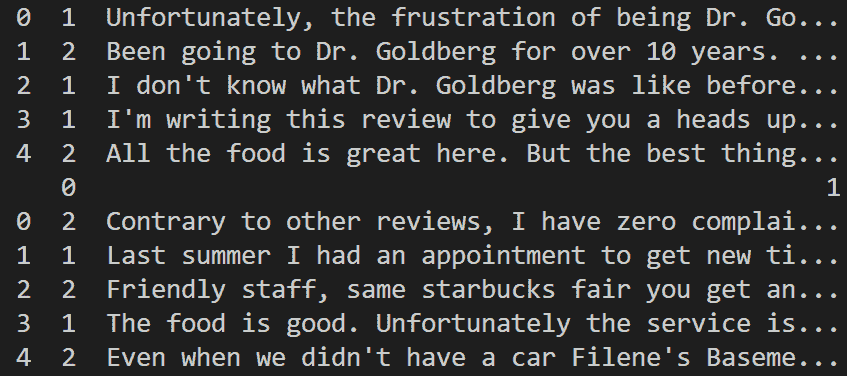
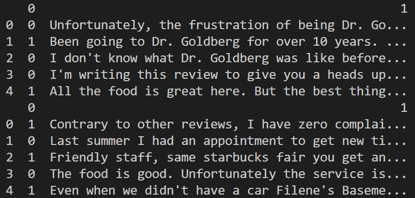

# 谷歌 BERT NLP 机器学习教程

> 原文：<https://www.freecodecamp.org/news/google-bert-nlp-machine-learning-tutorial/>

机器学习有很多应用，其中之一是自然语言处理或 NLP。

NLP 处理诸如文本响应、在上下文中计算单词的含义以及与我们进行对话等事情。它帮助计算机理解人类语言，这样我们就可以用不同的方式交流。

从聊天机器人到工作申请，再到将你的电子邮件分类到不同的文件夹，NLP 在我们身边无处不在。

自然语言处理的核心是计算机科学和语言学的融合。语言学为我们提供了用来训练机器学习模型的规则，并获得我们想要的结果。

自然语言处理成为机器学习的重要组成部分有很多原因。它可以帮助机器从客户的反馈中检测情绪，可以帮助分类你正在进行的任何项目的支持票，并且可以一致地阅读和理解文本。

因为它是按照一套语言规则运作的，它不会像人类一样有偏见。

因为 NLP 是一个很大的研究领域，所以有很多工具可以用来分析数据以达到特定的目的。

有一种基于规则的方法，您可以设置许多 if-then 语句来处理如何解释文本。通常语言学家会负责这项任务，他们的成果很容易让人理解。

这可能是一个好的开始，但是当您开始处理大型数据集时，它会变得非常复杂。

另一种方法是在不需要定义规则的地方使用机器学习。当您试图快速准确地分析大量数据时，这非常有用。

就效率和准确性而言，选择正确的算法以使机器学习方法起作用是很重要的。常见的算法有[朴素贝叶斯](https://scikit-learn.org/stable/modules/naive_bayes.html)和[支持向量机](https://www.freecodecamp.org/news/svm-machine-learning-tutorial-what-is-the-support-vector-machine-algorithm-explained-with-code-examples/)等。然后是更具体的算法比如谷歌 BERT。

## 伯特是什么？

BERT 是 2018 年在谷歌创建的开源库。这是 NLP 的一项新技术，它采用了与其他技术完全不同的方法来训练模型。

BERT 是变压器双向编码器表示的首字母缩写。这意味着与大多数从左到右或从右到左分析句子的技术不同，BERT 使用 [Transformer 编码器](https://arxiv.org/pdf/1706.03762.pdf)进行双向分析。它的目标是生成一个语言模型。

这使得它在较小的数据集上具有难以置信的准确性和性能，解决了自然语言处理中的一个巨大问题。

虽然有大量基于文本的数据可用，但其中很少被标记用于训练机器学习模型。由于大多数解决 NLP 问题的方法都利用了深度学习，所以你需要大量的数据来训练。

当一个模型经过数百万个数据点的训练后，你会真正看到它的巨大改进。为了帮助解决没有足够标记数据的问题，研究人员想出了通过使用互联网上的文本进行预训练来训练通用语言表示模型的方法。

然后，可以对这些预训练的表示模型进行微调，以处理比深度学习中常用的数据集更小的特定数据集。这些较小的数据集可以用于情感分析或垃圾邮件检测等问题。这是处理大多数 NLP 问题的方法，因为它给出了比从较小的数据集开始更准确的结果。

这就是为什么伯特是如此重大的发现。它提供了一种用更少的数据更准确地预训练模型的方法。它使用的双向方法意味着它比只在一个方向上训练获得了更多的单词上下文。有了这个额外的上下文，它就能够利用另一种称为屏蔽 LM 的技术。

## 它与其他机器学习算法有何不同

Masked LM 用一个[MASK]标记随机屏蔽一个句子中 15%的单词，然后尝试根据被屏蔽单词周围的单词来预测它们。这就是伯特能够从左到右和从右到左看单词的原因。

这与其他现有的语言模型完全不同，因为它同时查看屏蔽单词前后的单词。伯特的准确性很大程度上归功于此。

要让 BERT 处理您的数据集，您必须添加一些元数据。需要有**标记嵌入**来标记句子的开始和结束。你需要有**片段嵌入**来区分不同的句子。最后，你需要**位置嵌入**来表示单词在句子中的位置。

它看起来会像这样。

```
[CLS] the [MASK] has blue spots [SEP] it rolls [MASK] the parking lot [SEP]
```

将元数据添加到数据点后，masked LM 就可以工作了。

一旦预测完单词，BERT 就会利用下一句预测。这个看两句话的关系。它这样做是为了更好地理解整个数据集的上下文，方法是获取一对句子，并根据原文预测第二个句子是否是下一个句子。

对于在 BERT 技术中工作的下一个句子预测，第二个句子通过基于模型的[转换器发送。](https://ai.googleblog.com/2017/08/transformer-novel-neural-network.html)

根据您正在处理的数据的规模，有四种不同的预训练版本的 BERT。你可以在这里了解他们更多:[https://github.com/google-research/bert#bert](https://github.com/google-research/bert#bert)

这种方法的缺点是损失函数只考虑屏蔽字的预测，而不考虑其他字的预测。这意味着 BERT 技术比其他从右到左或从左到右的技术收敛得更慢。

BERT 可以应用于你能想到的任何 NLP 问题，包括意图预测、问答应用和文本分类。

## 代码示例

### 正在设置

现在我们来看一个 BERT 的实际例子。你需要做的第一件事是克隆伯特回购。

```
git clone https://github.com/google-research/bert.git
```

现在你需要从 [BERT GitHub 页面](https://github.com/google-research/bert#pre-trained-models)下载预先训练好的 BERT 模型文件。在本教程的其余部分，我将把这个 repo 的目录称为根目录。

这些文件为你提供了超参数、重量和其他你需要的东西，以及伯特在训练前学到的信息。我将使用 [BERT-Base，无外壳模型](https://storage.googleapis.com/bert_models/2018_10_18/uncased_L-12_H-768_A-12.zip)，但是你会在 GitHub 页面上找到几个跨不同语言的其他选项。

你会选择基于 BERT 的无外壳模型的一些原因是，如果你不能访问谷歌 TPU，在这种情况下，你通常会选择一个基本模型。

如果您认为您试图分析的文本的大小写是区分大小写的(文本的大小写给出了真实的上下文含义)，那么您将使用大小写模式。

如果外壳不重要或者你还不太确定，那么无外壳模型将是一个有效的选择。

我们将使用一些 Yelp 评论作为我们的数据集。请记住，BERT 希望使用那些**令牌嵌入**和其他内容得到某种格式的数据。我们需要将它们添加到一个. tsv 文件中。这个文件类似于. csv，但是它有四列，没有标题行。

这是四列的样子。

*   列 0:行 id
*   第 1 列:行标签(需要是整数)
*   第 2 列:所有行都有相同字母的一列(它没有任何用途，但是 BERT 希望它有)
*   第 3 列:我们要分类的文本

您需要在克隆 BERT 的目录下创建一个名为 data 的文件夹，并在那里添加三个文件: *train.tsv、dev.tsv、test.tsv* 。

在 *train.tsv* 和 *dev.tsv* 文件中，我们将拥有我们之前谈到的四个列。在 *test.tsv* 文件中，我们只有想要分类为列的行 id 和文本。这些将是我们用来训练和测试模型的数据文件。

### 准备数据

首先，我们需要获得将要使用的数据。你可以在这里为自己下载 Yelp 评论:https://course.fast.ai/datasets#nlp 它会在 NLP 部分，你会想要极性版本。

我们将使用这个版本的原因是因为数据已经有了一个极性，这意味着它已经有了一个与之相关联的情绪。将该文件保存在数据目录中。

现在我们准备开始编写代码。在根目录下创建一个名为 *pre_processing.py* 的新文件，并添加以下代码。

```
import pandas as pd
# this is to extract the data from that .tgz file
import tarfile
from sklearn.preprocessing import LabelEncoder
from sklearn.model_selection import train_test_split

# get all of the data out of that .tgz
yelp_reviews = tarfile.open('data/yelp_review_polarity_csv.tgz')
yelp_reviews.extractall('data')
yelp_reviews.close()

# check out what the data looks like before you get started
# look at the training data set
train_df = pd.read_csv('data/yelp_review_polarity_csv/train.csv', header=None)
print(train_df.head())

# look at the test data set
test_df = pd.read_csv('data/yelp_review_polarity_csv/test.csv', header=None)
print(test_df.head())
```



在这段代码中，我们导入了一些 Python 包并解压缩了数据，以查看数据是什么样子的。您会注意到与评论相关的值是 1 和 2，1 是差评，2 是好评。我们需要把这些值转换成更标准的标签，所以 0 和 1。您可以通过下面的代码来实现。

```
train_df[0] = (train_df[0] == 2).astype(int)
test_df[0] = (test_df[0] == 2).astype(int)
```

每当您更新数据时，检查一下事情是否正确总是很重要的。所以我们将使用下面的命令来完成。

```
print(train_df.head())
print(test_df.head())
```



当你看到你的极性值变成了你所期望的。既然数据应该有 1 和 0。

既然我们已经清理了初始数据，是时候为 BERT 做准备了。我们必须使我们的数据符合我们之前讨论过的列格式。先说训练数据。

训练数据将包含所有四列:行 id、行标签、单个字母、我们要分类的文本。

BERT 期望两个用于训练的文件，称为 *train* 和 *dev* 。在使用以下命令格式化数据后，我们将通过将初始的 train 文件分成两个文件来创建这些文件。

```
bert_df = pd.DataFrame({
    'id': range(len(train_df)),
    'label': train_df[0],
    'alpha': ['q']*train_df.shape[0],
    'text': train_df[1].replace(r'\n', ' ', regex=True)
})

train_bert_df, dev_bert_df = train_test_split(bert_df, test_size=0.01)
```

使用 *bert_df* 变量，我们将数据格式化为 bert 期望的格式。如果您愿意，可以选择任何其他字母作为 alpha 值。我们在开始时导入的 *train_test_split* 方法处理将训练数据分割成我们需要的两个文件。

看看这个命令是如何格式化数据的。

```
print(train_bert_df.head())
```

现在我们需要格式化测试数据。这将与我们处理训练数据的方式不同。BERT 只希望测试数据有两列:行 id，我们想要分类的文本。一旦我们有了这种格式的测试数据，我们就不需要对它做任何其他的事情，我们将用下面的命令来做。

```
test_bert_df = pd.DataFrame({
    'id': range(len(test_df)),
    'text': test_df[1].replace(r'\n', ' ', regex=True)
})
```

这类似于我们对训练数据所做的，只是少了两列。看一看新格式化的测试数据。

```
test_bert_df.head()
```

如果一切正常，您可以将这些变量保存为。伯特将要处理的 tsv 文件。

```
train_bert_df.to_csv('data/train.tsv', sep='\t', index=False, header=False)
dev_bert_df.to_csv('data/dev.tsv', sep='\t', index=False, header=False)
test_bert_df.to_csv('data/test.tsv', sep='\t', index=False, header=False)
```

### 训练模型

在我们开始训练这个模型之前，有一个小提示:BERT 在笔记本电脑上可能是非常资源密集型的。这可能会导致内存错误，因为没有足够的内存或其他一些硬件不够强大。你可以试着让 *training_batch_size* 变小，但是这会让模型训练变得非常慢。

在根目录下添加一个名为 *model_output* 的文件夹。训练结束后，我们的模型将保存在那里。现在打开一个终端，转到这个项目的根目录。一旦您进入正确的目录，运行以下命令，它将开始训练您的模型。

```
python run_classifier.py --task_name=cola --do_train=true --do_eval=true --data_dir=./data/ --vocab_file=./uncased_L-12_H-768_A-12/vocab.txt --bert_config_file=./uncased_L-12_H-768_A-12/bert_config.json --init_checkpoint=./uncased_L-12_H768_A-12/bert_model.ckpt.index --max_seq_length=128 --train_batch_size=32 --learning_rate=2e-5 --num_train_epochs=3.0 --output_dir=./model_output --do_lower_case=False
```

您应该看到一些输出在终端上滚动。一旦运行完成，你将有一个训练有素的模型，准备进行预测！

### 做一个预测

如果你看一下 *model_output* 目录，你会注意到有一堆 *model.ckpt* 文件。这些文件包含训练模型在训练过程中不同点的权重，因此您希望找到数字最高的那个。这将是您想要使用的最终训练模型。

现在我们将使用稍微不同的选项再次运行 *run_classifier.py* 。特别是，我们将把*的 init_checkpoint* 值改为最高的模型检查点，并将新的 *- do_predict* 值设为 true。下面是您需要在终端中运行的命令。

```
python run_classifier.py --task_name=cola --do_predict=true --data_dir=./data --vocab_file=./uncased_L-12_H-768-A-12/bert_config.json --init_checkpoint=./model_output/model.ckpt-<highest checkpoint number> --max_seq_length=128 --output_dir=./model_output
```

一旦命令运行完毕，您应该会看到一个名为 *test_results.tsv* 的新文件。这将有你的预测结果的基础上，你训练的模型！

您刚刚使用 BERT 分析了一些真实数据，希望这些都有意义。

## 其他想法

我觉得有必要在这里完成数据清理过程，以防有人以前没有经历过。有时机器学习看起来像魔术，但它真的需要时间来让你的数据处于正确的状态，以便用算法进行训练。

自 2018 年刚刚发布以来，BERT 仍然相对较新，但迄今为止，它已被证明比现有模型更准确，即使它更慢。