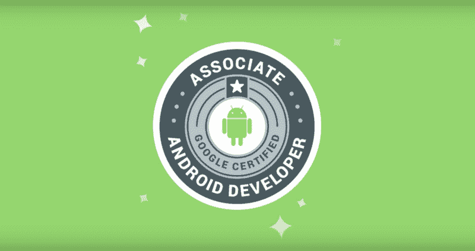
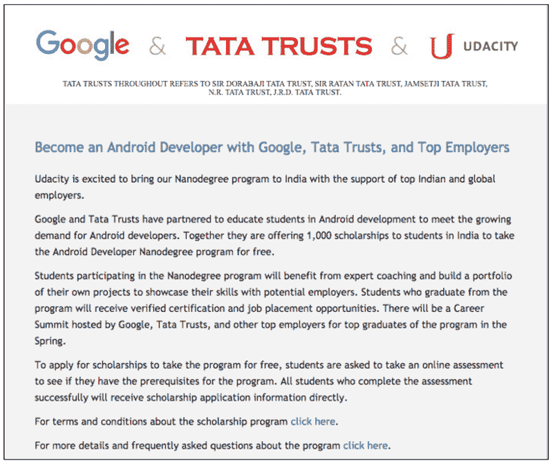
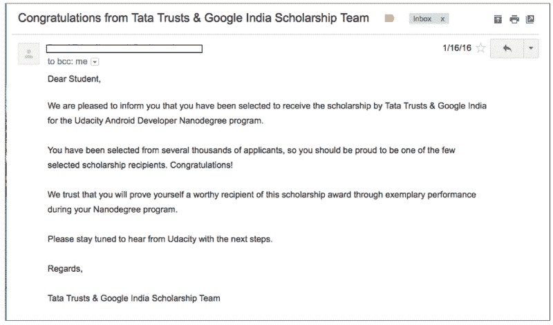
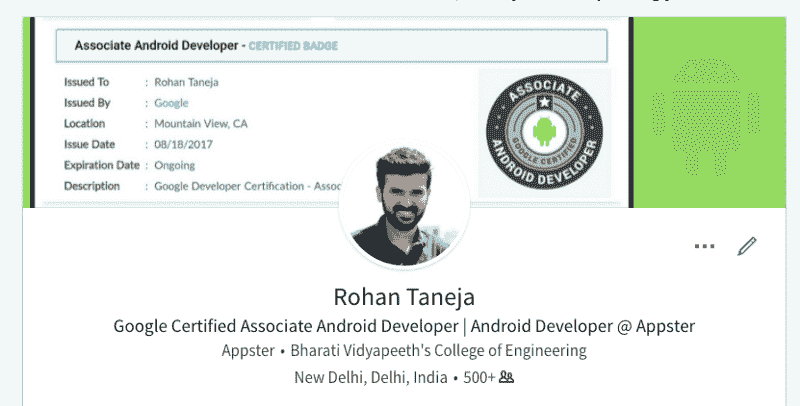
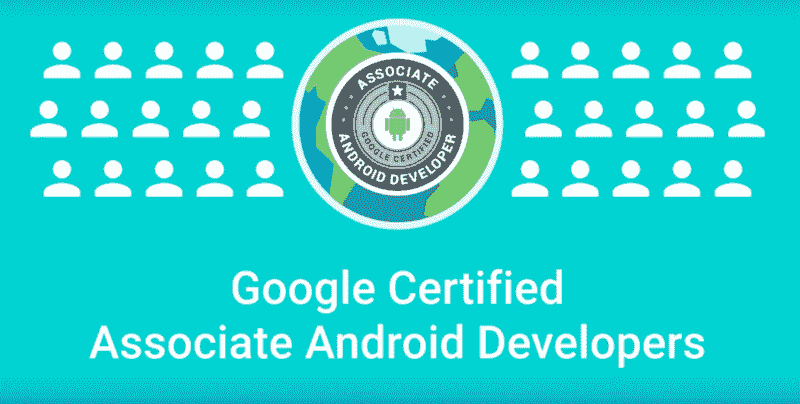

# 谷歌认证助理 Android 开发者:技巧、常见问题和我的旅程

> 原文：<https://www.freecodecamp.org/news/google-certified-associate-android-developer-my-journey-381a8e514f3a/>

作者 Rohan Taneja

# 谷歌认证助理 Android 开发者:技巧、常见问题和我的旅程

Image Source: [https://www.youtube.com/watch?v=GY5Olv1_dB4](https://www.youtube.com/watch?v=GY5Olv1_dB4)

这篇文章将告诉你我参加 Android 开发者认证考试的经历，以及在此之前我的旅程。

#### 这个认证是关于什么的？

*   来自谷歌的 Android 开发者助理认证是谷歌与 Udacity 合作提供的[开发者认证](https://developers.google.com/training/certification/)之一。
*   正如在[认证页面](https://developers.google.com/training/certification/associate-android-developer/)上提到的，这个考试旨在测试一个**入门级** Android 开发者的技能。
*   考生必须在 **24** 小时内，根据特定的**给定的**要求，开发一个安卓应用。

#### 这个认证考试的形式是什么？

*   要获得此认证，您需要通过两个阶段:
*   阶段 1:编码考试
*   第二阶段:基于第一阶段的离职面谈

#### 考试详情

(截至 2017 年 9 月 3 日；有关最新详情，请点击[此处](https://developers.google.com/training/certification/associate-android-developer/)

*   费用 : 6500 印度卢比或 149 美元
*   **时长:**在 **24** 小时内随时提交考试。
*   **尝试次数**:支付一次获得 3 次尝试。如果您在 3 次尝试后仍无法通过考试，您需要再次付费。

### 阶段 1:编码考试

*   付费参加考试后，下载 starter code 项目。
*   在您的 Android Studio 中打开下载的项目，修复错误，添加某些功能，并根据考试的给定要求测试您的代码。‍?
*   在 **24** 小时内上传项目，提交您的代码。⏳
*   上传您的身份证明和照片，进行身份验证。

### 第二阶段:离职面谈

*   离职面谈是通过 zoom.us 组织的在线视频电话，其中认证团队的一名成员会向您询问几个关于考试的问题。
*   这主要包括关于你的代码和 Android 基础的问题。
*   面试持续 15 到 30 分钟，有时在 10 分钟内就结束了。
*   再一次，你必须使用你在第一阶段结束时上传的 ID 来验证你自己。

如果一切顺利，你将在考试后 45 天内通过 [BadgeCert](https://bcert.me/bc/html/show-badge.html?b=zhtmrmf) 获得认证证书。

如果你想看看考试界面是什么样子，点击[这里](https://medium.com/@rohantaneja/google-certified-associate-android-developer-exam-walkthrough-ce09a039b29a)。

### 我的旅程

在我的工程学院第二年末学习 Java 之后，我热衷于学习 Android 应用程序开发，因此我选择在 2015 年 8 月再次学习[编码忍者](https://www.codingninjas.in/app/home)，就像我之前学习 Java 一样。在那里，教学和作业的质量增强了我对 Android 领域的兴趣。

我曾是谷歌开发者团队 [*新德里*](https://www.facebook.com/gdgnewdelhi/) 的成员，2015 年 11 月，我收到他们的一封电子邮件，通知我关于 [Udacity 的 Android 开发者纳米学位](https://in.udacity.com/course/android-developer-nanodegree-by-google--nd801/?)的奖学金项目。

我马上申请了。很快，我收到了奖学金团队的电子邮件，说我已经通过了预评估，现在正进入奖学金的面试阶段。面试于 2015 年 12 月举行，面试后不久，我的奖学金于 2016 年 1 月 16 日得到确认。

纳米学位的体验令人惊叹。Udacity 的视频内容和代码审查让我保持动力。来自 Udacity 的这个纳米学位最棒的一点是，它的课程创建者是来自谷歌本身的开发者拥护者。此外，视频课程包括这些开发人员与您交谈的录音，让您理解测验，并在疑问出现在您脑海中的几秒钟前给出答案。与其他提供视频讲座的网站相比，这是很棒的，在这些网站上，他们只是在键入代码时显示屏幕记录。

我终于在 2017 年 1 月设法与 Android 开发者 Nanodegree 一起毕业了。

Udacity Nanodegrees 给予你某些好处，如你的 nanodegree 证书，Nanodegree 校友对你的项目的代码审查，简历审查，面试准备课程和访问 Udacity 论坛。

如果你不为纳米学位付费，你只会错过这些东西，但如果你想学习，并且你只关心伟大的课程内容，那么在 Udacity 网站的[免费课程部分](https://in.udacity.com/courses/all)下，所有纳米学位都是免费的。

Google I/O Extended (2016) organised by GDG New Delhi

在 Okhla 由 Google Developer Group New Delhi 组织的 [I/O Extended (2016)](https://www.facebook.com/pg/gdgnewdelhi/photos/?tab=album&album_id=560315854139535) 之后不久，我就了解到了 Android 开发者联盟认证。

那时，我还在攻读我的 Android 开发者纳米学位，我已经决定在拿到纳米学位后参加这个认证考试。

在我参加认证考试之前，我想在 Play Store 上发布几个应用程序，只是为了在考试之前有完整的应用程序开发经验。

我一直想在谷歌 Play 商店上发布一些应用程序。我一直在等待一个完美的主意，但它从未出现。我犹豫要不要发布我在 Nanodegree 期间创建的应用程序，因为我知道它们不会被任何人使用，因为它们是我在学习 Android 时创建的应用程序，对普通人来说没有任何好的用例。

但在 2017 年 7 月，我在 Play Store 上偶然发现了一个下载量超过 100 万的应用。“那又怎么样？”，你问。这个应用程序所做的就是:*显示梅亨迪([指甲花(](https://fashionbuzzer.com/blog/wp-content/uploads/2017/06/Traditional-Mehendi-DEsign-For-Diwali.jpg))设计的图片*。

就这样。

我意识到我已经等得够久了，是时候在 Play Store 上发布一些东西了。因此，我在一周内在 Play Store 上发布了 3 个应用程序。

我认为发布应用程序是小菜一碟，因为编写应用程序才是真正的任务。我已经过了那段时间*，我也准备好了我的 APKs*。**

****但是我错了**。**

**编写应用程序只是开始。接下来是密钥库、应用程序签名、DebugBuild、ReleaseBuild、生成截图、功能图形、应用程序视频以及学习如何使用 ASO 增加下载量。**

****

**在那一周的时间里，我学到了很多东西，我希望我能早点做到。现在，我有一个应用程序组合可以展示，不管它们有多糟糕。**

**在推出这些应用程序之前，每当有人问我要我作品的链接时，我都会发给他们一个 GitHub 链接，一个 Google drive 链接，上面有应用程序和 APK 的截图。**

**接下来，他们会问我是否有游戏商店的东西。**

**对此我的回答是:**

> **不，我没有。因为我想推出一些能被人们实际使用的东西。**

**但是他们听到的是:**

> **不知道，**

**如果你是为了乐趣而开发，在 Play Store 上有下载量很少的应用程序并不意味着你失败了，或者你的应用程序不工作，或者，你不擅长你所做的事情。它可以证明，既然你对某件事充满热情，你就辛苦工作几天来生产某样东西，并且你喜欢向世界展示它。**

**如果扎克伯格决定向全世界发布脸书，或者根本不发布，我们现在还在工作。**

**对于所有初露头角的 Android 应用开发者来说，现在就发布你拥有的任何东西。即使它是你创建的第一个计算器应用程序，或者仍然有一些小错误的待办事项应用程序。现在就发表，这样以后你就不会“希望你能早点发表”。**

**现在让我们进入我的考试经历部分:**

### ****编码回合体验****

**我有 48 个小时提交我的考试，所以这就是我曾经*希望*做的:**

**但是我卡住了几次，这是我调试后的感觉:**

**除了测试之外，我几乎参与了考试(考试内容)所需的[Android 的所有方面。我对浓缩咖啡没有任何经验。考试前，我正在寻找学习浓缩咖啡的好资源，这时我得知 Android 开发者 Nanodegree 的内容已经更新，现在也包括浓缩咖啡了！如果你不是纳米学位学生，你可以在这里观看免费课程](https://developers.google.com/training/certification/associate-android-developer/)。**

**我于 2017 年 7 月 15 日参加了考试。**

*   **一旦你开始考试，你需要下载启动代码。**
*   **该考试旨在模拟现实生活中的情况，其中“一名开发人员被分配到该项目，但该开发人员由于某种原因离开了。现在你的任务是理解他们的代码并完成项目。”因此，您将获得一个启动代码。**
*   **有一个你的应用程序在最终提交时必须具备的功能列表。**
*   **您的任务是:实现需求中列出的新功能，创建新屏幕，调试现有代码，生成 UI 测试，等等。**
*   **我一启动测试，就在开始编码之前先检查了所有的需求:
    ——我先拿起简单的任务，确保在拿起另一个之前完成了一个功能的实现。
    -我在实现自定义视图时遇到了困难，但是一些简单的谷歌查询帮助我完成了。**

**-我遇到的另一件事与数据持久性有关。我好像不记得具体的语法了。斯达克弗洛又一次拯救了我。**

**-是的，有一些考试所需的功能我已经很久没有实现了，但是浏览一些在线资源，然后自己实现它们并不困难。**

****

**我在 19 日收到确认我通过了编码考试后，把视频电话面试安排在了 7 月 23 日晚上 11:30。**

*   **面试是通过 [zoom.us](https://zoom.us/) 组织的，我的面试时长约为 15 分钟。**
*   **我的面试官开始面试时，要求我的身份证明进行验证。**
*   **然后，我被要求提供我的编码考试任务的概述。**
*   **接下来是一些关于 Android 的基本问题，比如在 Android 中进行 ABC 的 3 种方式和进行 XYZ 的 2 种方式。**
*   **之后，他问我在我的编码考试中最难实现的特性。我告诉他我感觉到的挑战，以及我最终是如何解决的。**

**他告诉我，就这些了，如果一切顺利的话，我很快就会拿到证书。他问我是否有问题要问他，我问了他一些关于成为认证开发人员的好处的事情。**

**7 月 29 日，我收到了来自 Udacity 的一封电子邮件，说我也成功通过了面试，我现在是一名*谷歌认证的 Android 助理开发人员*！**

**8 月 19 日，我终于收到了我的 Android 开发助理徽章和一份 AAD 校友表格。我立即将徽章添加到了我的 [LinkedIn](http://www.linkedin.com/in/rohantaneja) 个人资料中？**

****

### **提示和常见问题:**

*   **“我是一名经验丰富的专业人士，开发 Android 应用程序已经有几年了，这个认证对我有用吗？”
    作为学习经历？也许不是。但这肯定会验证你作为 Android 开发人员的技能。你可能还会参加下一届谷歌开发者认证峰会(关于峰会的更多细节在本文末尾)。因此，我认为获得认证没有坏处。**
*   **“我是一名 Android 应用程序开发的业余爱好者，因此我对自己的 Android 技能没有信心。我应该从哪里准备？”
    考试前至少一次在认证网站上尝试执行*考试大纲中给出的一切*。此外，将这些东西整合到一个应用程序中。然后继续创建多个应用程序，通过增加每个应用程序实现的功能数量。这会给你所需要的自信。如果你在考试中遇到某个特定的任务，你将能够快速访问你的代码并更新你的知识。**
*   **“我对 Java 和数据结构很熟悉，但是我没有 Android 应用程序开发的经验，这个考试适合我吗？”
    可以，但前提是 Android 是你感兴趣的东西。如果你只是为了认证而想这么做，那是没有用的。如果你想从 Android 开始，我会推荐 Udacity 的初级免费课程。之后按照前面回答的步骤。不要急着参加考试，试试 Android，每天坚持练习至少 1-2 个月。**
*   ****“你推荐什么书？”**
    不，我们有大量的在线资源可以学习，因此我从未选择从书本上学习 Android 开发。但如果书籍能帮助你更好地学习，安东尼·j . f .格里菲斯和托马斯·阿斯布里奇的《Head First Android Development》是一本我听说过的的书。**
*   **“我可以在考试期间使用互联网吗？”
    当然，你是。否则，这次考试将会在一个有监考老师监督的地方举行。只要确保你没有在考试期间从 StackOverflow 或其他在线资源中复制&粘贴精确的代码。考试期间不禁止你使用网上资源。然而，确保你理解你在网上看到的任何东西，然后自己编码。**
*   ****“测试？我以前没这么做过！”**
    别担心，没有哪个新开发者在开始 Android 应用开发时会关注测试，尽管我们应该这样做。只要在考试前在 Udacity 或其他资源上进行一次 [Espresso UI](https://developer.android.com/training/testing/espresso/index.html) 测试，你就可以顺利通过了。**
*   ****第三方库？**
    避免使用它们。我在我的期间没有使用任何。考试指南没有明确允许你使用它们，所以你最好不要使用。安全总比后悔好。此外，我没有发现任何功能繁琐到需要第三方库。图像？`setImageResource(…)`就行了，没必要去全[毕加索 就行了。](http://square.github.io/picasso/)**
*   **"**如果我的提交失败了，我会得到同一个项目并从我停止的地方继续吗？** "
    不，如果你的提交失败了，你就失去了一次尝试的机会，下一次尝试你会得到一个全新的项目。**
*   ****“如果我错过了一个很小的功能怎么办？我的尝试会被视为失败吗？”**
    这是我还不清楚的事情。在我考试的时候，我有一个疑问，如果我错过了添加一个`textColor`或者如果我输入了错误的`textSize`该怎么办？当然，这么小的错误不应该被认为是一次失败的尝试？最有可能的是，不会。考试首先使用自动系统评分，但之后也可以手动评分。所以我很确定这种程度的错误会由人工分类员来处理。尽管如此，在你提交考试之前，还是要对这些进行三次检查。**
*   **更高级别的认证？
    这个认证是针对入门级 Android 开发者的。到目前为止，谷歌还没有宣布更高级别的 Android 开发者认证。**
*   ****“我的证件呢？”**
    截至目前，您只获得 [BadgeCert](https://www.badgecert.com/) 的数字证章，没有纸质证书。**
*   ****认证有效期？**
    您的认证有效期为 3 年。如获得认证后收到的认证行为准则文件中所述。**

### **有用的资源**

*   **有关考试的更多细节，请观看来自谷歌的视频:**

*   **该认证在 Google I/O 2016 上推出:**

*   **这个来自 DigToKnow 的视频是目前为止唯一一个 YouTube 视频，讲述了关于 T2 认证 T4 考试的经历。这无疑消除了我考试前的一些疑虑。我已经在我的帖子中介绍了这个视频的大部分内容，但我仍然建议你在考试前观看它。**

*   **几天前我偶然发现了这个 GitHub 回购。它包括一些帮助你准备考试的资源:**

**[**ame Jia 481/Associate-Android-Developer-Certification**](https://github.com/Amejia481/Associate-Android-Developer-Certification)
[*Associate-Android-Developer-Certification-我收集的所有关于认证的信息和资料……*github.com](https://github.com/Amejia481/Associate-Android-Developer-Certification)**

*   **如果你打算为这次认证考试做一个彻底的准备，请查看来自 Udacity 的 Android 开发人员快速通道课程。**

**[**Android 开发助理快速通道| Udacity**](https://in.udacity.com/course/associate-android-developer-fast-track--nd818/)
[*学习成功获得谷歌 Android 开发助理认证所需的技能。非常适合…*in.udacity.com](https://in.udacity.com/course/associate-android-developer-fast-track--nd818/)**

*   **(更新时间:2017 年 16 月 10 日)来自谷歌开发者印度 YouTube 频道的最新视频:**

**我希望我早点参加这个考试，这样我就可以参加 2017 年 4 月在班加罗尔举行的谷歌开发者认证峰会:**

**我希望谷歌明年也组织一次这样的活动。**

**如果你不想错过这次峰会，并且你也对 Android 开发充满热情，那么[今天就获取你的 Google 认证](https://developers.google.com/training/certification/associate-android-developer/),加入 Google 认证 Android 开发人员社区吧！**

**

Image Source: [https://www.youtube.com/watch?v=GY5Olv1_dB4](https://www.youtube.com/watch?v=GY5Olv1_dB4)** 

**如果你想从头到尾看一遍考试*，可以看看我的考试预演帖子:***

***[**Google Certified Associate Android Developer:考试演练**](https://medium.com/@rohantaneja/google-certified-associate-android-developer-exam-walkthrough-ce09a039b29a)
[*当我想参加这次认证考试时，我对考试界面的样子毫无头绪。我搜索了…*medium.com](https://medium.com/@rohantaneja/google-certified-associate-android-developer-exam-walkthrough-ce09a039b29a)***

****更新**:*2017 年 10 月 9 日:今天收到我的新证***

**[**Google Cloud Certified:可认证:证书、徽章、区块链凭据。**](https://www.credential.net/gwuixncl)
[*我有必要的技能来利用谷歌云技术，以一种有意义的方式改变商业……*www.credential.net](https://www.credential.net/gwuixncl)**

****