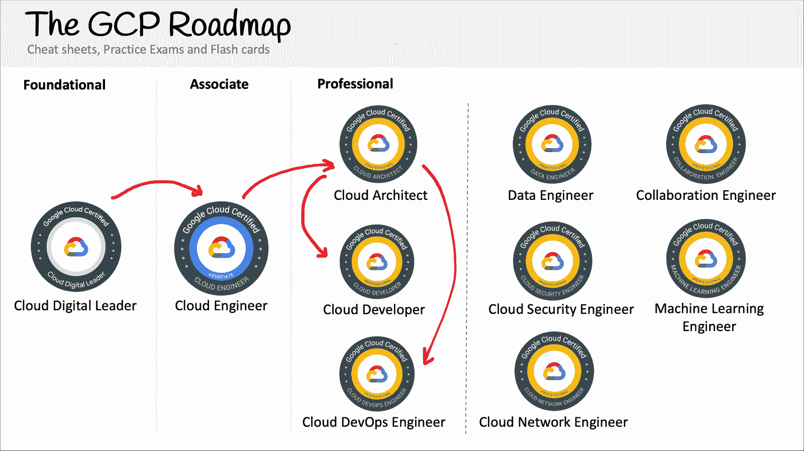

# 谷歌云助理云工程师认证学习课程–通过 20 小时的免费课程考试

> 原文：<https://www.freecodecamp.org/news/google-cloud-digital-leader-certification-study-course-pass-the-exam-with-this-free-20-hour-course/>

## 什么是 Google Cloud 协理云工程师？

云工程师助理通常也称为 ACE，是 Google Cloud 的助理级认证。

云工程师助理和谷歌云数字云领导者之间的关键区别在于，云工程师助理是一种实践认证，要求您拥有谷歌云核心服务的实践经验。

谷歌云只有一个协理级认证。这与 AWS 有三个不同，Azure 有六个以上的助理级别认证。

只有一个助理级别的认证意味着你要比 AWS 解决方案架构师助理知道更多的信息。

然而，云工程师助理更好地反映了基于角色的头衔和更接近云行业入门级工作的知识。

## 什么是云工程师？

云工程师是云行业中最受欢迎的 IT/开发人员角色。云工程师是一个入门级角色，您的任务是设计、实施和维护云基础架构。

这种云角色让您可以做一些力所能及的事情，然后您可以通过专门从事高级角色(如解决方案架构师、开发运维工程师、数据工程师等)来发展您的云职业生涯。

要获得云角色，建议持有 Google Cloud 等云服务提供商(CSP)的助理级别认证，并构建您的云项目以在您的产品组合中展示。

## 谷歌云助理云工程师概述

考试指南把考题分为以下五个部分。

*   第一节。设置云解决方案环境
*   第二节。规划和配置云解决方案
*   第三节。部署和实施云解决方案
*   第四节。确保云解决方案的成功运行
*   第五节。配置访问和安全性

## ******如何获得认证？******

谷歌使用 [Kryterion](https://www.freecodecamp.org/news/p/bc0cbbc3-1a26-43ac-a07c-e158c256003e/Kryterion) 作为其测试中心。你可以亲自参加考试，也可以在网上参加。

有 5 个 ****0 个选择题**** 和选择题，你必须得分 ****70%才能通过****

您有 2 个小时的时间来完成本课程。

谷歌云协理云工程师是****125**美元。******

## ********我可以简单的看视频通过考试吗？********

建议您完成 Google Cloud 帐户中的实验，以确保您完全理解每个概念。云服务提供商经常改变他们的用户界面，用户体验会因你希望推出服务的地区而异。

在自己的帐户内进行实验的学生更有可能回忆起信息。

强烈建议在学习课程结束后进行练习考试。ExamPro 有[全免费练习](https://www.exampro.co/gcp-ace)帮你复习准备期末考试。

前往 freeCodeCamp 的 YouTube 频道开始学习 6.0 小时的课程。

[https://www.youtube.com/embed/jpno8FSqpc8?feature=oembed](https://www.youtube.com/embed/jpno8FSqpc8?feature=oembed)