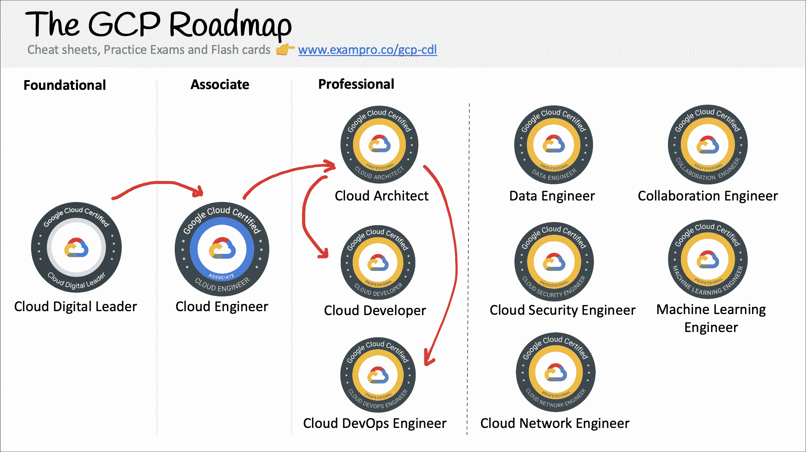
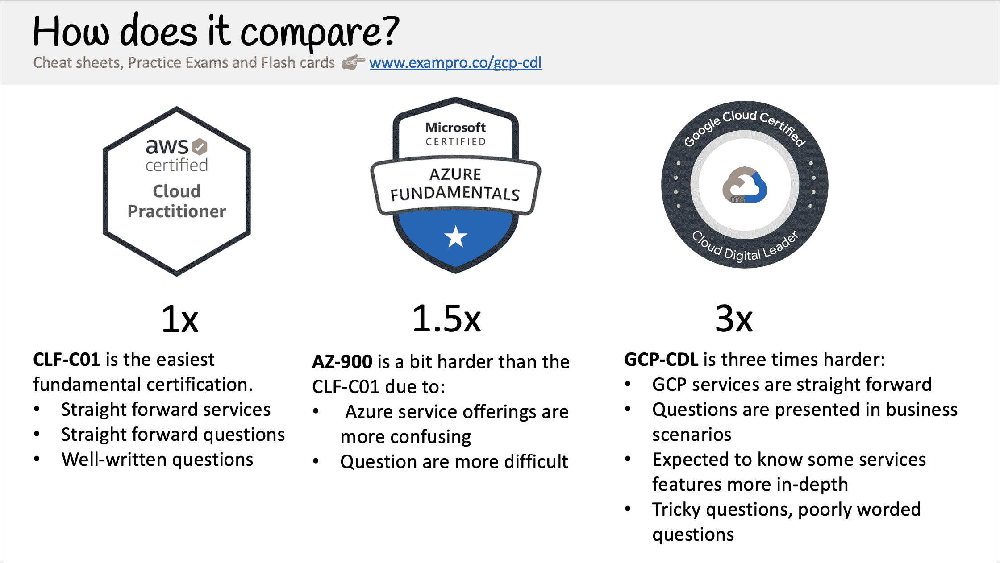

# 谷歌云数字领导者认证学习课程–通过这个 6 小时的免费课程考试

> 原文：<https://www.freecodecamp.org/news/google-cloud-digital-leader-course/>

通过这个 6 小时的免费课程，了解如何通过谷歌云数字领导者认证！

这是免费云认证课程的一个重要里程碑，因为我们现在在 freeCodeCamp 上有所有三个主要的云服务提供商(AWS、Azure 和 GCP)。

## 什么是 Google Cloud 认证的云数字领导者？

数字领导者是谷歌云的基础认证，它涵盖了云计算和 GCP 云服务的核心概念。

多年来，云社区一直在要求和等待类似于 AWS 认证云从业者(CLF-C01)或微软 Azure 基础(AZ-900)的 GCP 基础认证，这种等待最终因谷歌发布云数字领导者而结束。

然而，谷歌决定做一些不同的事情，这增加了通过该认证所需的整体难度和范围，与 AWS 认证的云从业者相比，难度增加了 3 倍。

谷歌云认证(即使在专业水平上)一直被批评为容易与 AWS 和 Azure 相比，基础认证也被认为太容易了，所以这可能是谷歌对这两种情绪的反应。

## ******概述**谷歌云数字领袖****

Google Cloud Digital Leader 由以下领域组成:

1.  设置云解决方案环境
2.  规划和配置云解决方案
3.  部署和实施云解决方案
4.  确保云解决方案的成功运行
5.  配置访问和安全性

## 如何获得认证？

谷歌使用 [Kryterion](https://www.freecodecamp.org/news/p/bc0cbbc3-1a26-43ac-a07c-e158c256003e/Kryterion) 作为其测试中心。你可以亲自参加考试，也可以在网上参加。

有 **60 道选择题**和选择题，你必须将**得分 70%才能通过**

谷歌云数字领导者是 99 美元。

## 我能简单地看视频并通过考试吗？

与 CLF-C01 或 AZ-900 不同，这一基本认证困难是由于问题的复杂措辞。如果你是谷歌的新手，或者这是你第一次获得云认证，强烈建议使用付费练习考试。

ExamPro 有多个[付费模拟考试](https://exampro.co/gcp-cdl)以及其他学习材料，以增加您通过考试的机会。

前往 freeCodeCamp 的 YouTube 频道开始学习 6.0 小时的课程。

[https://www.youtube.com/embed/UGRDM86MBIQ?feature=oembed](https://www.youtube.com/embed/UGRDM86MBIQ?feature=oembed)